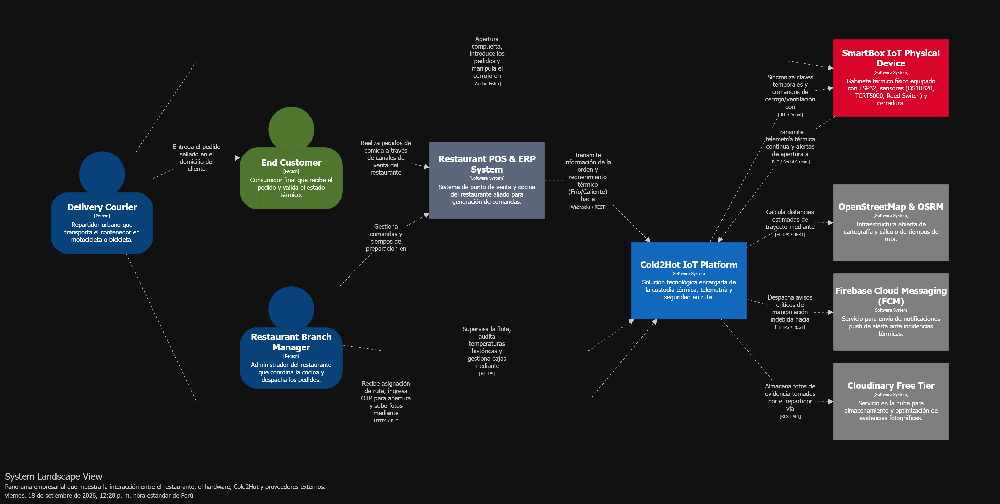
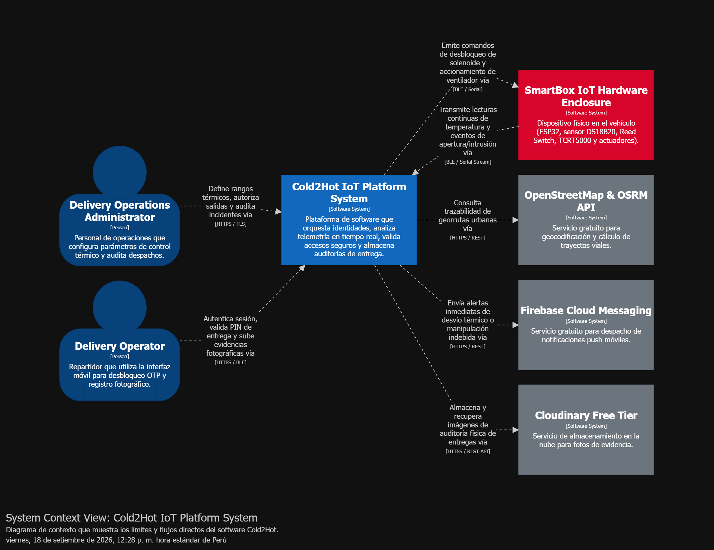
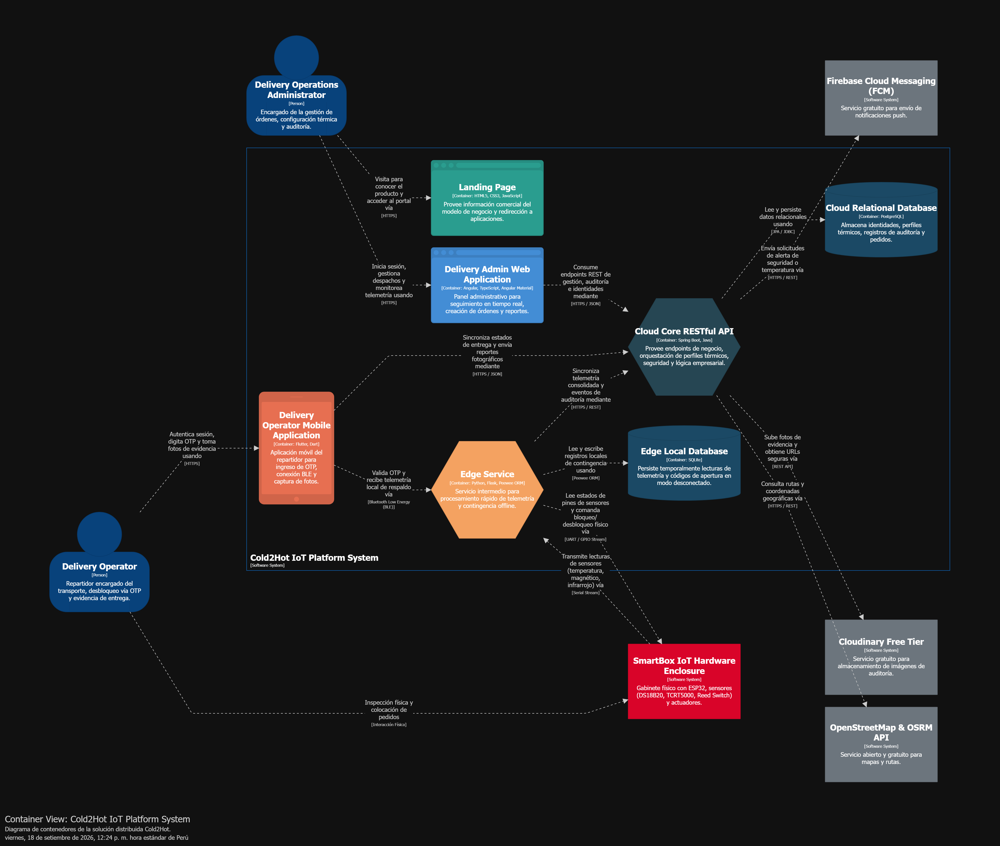
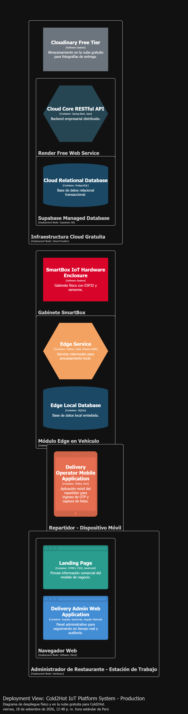
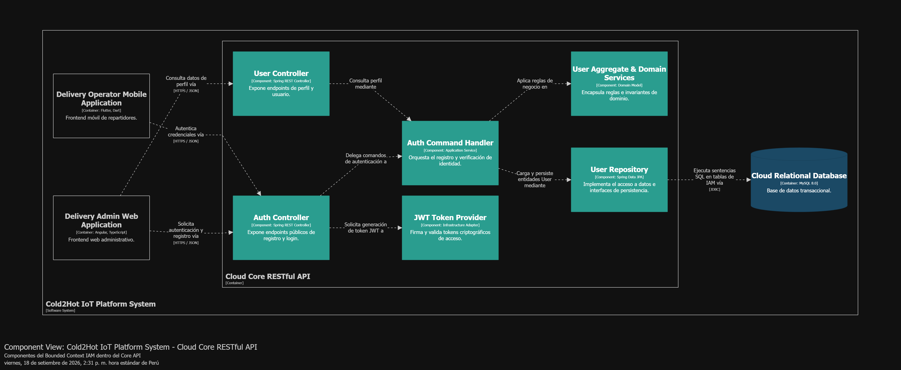
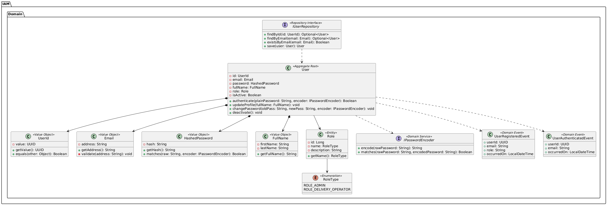
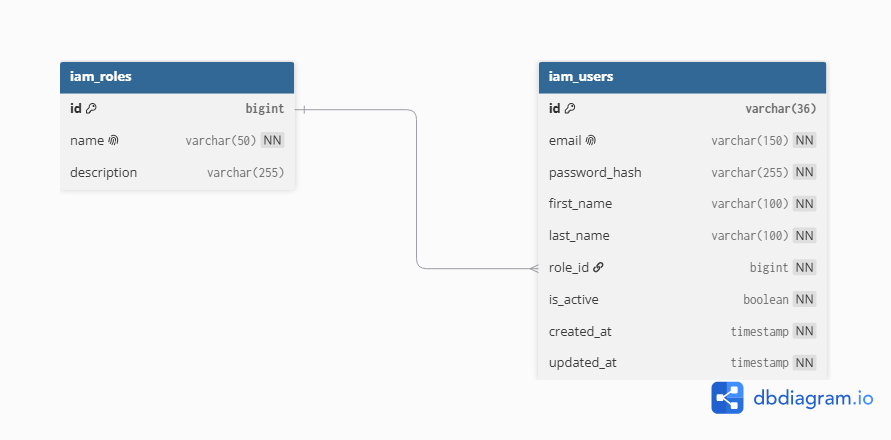
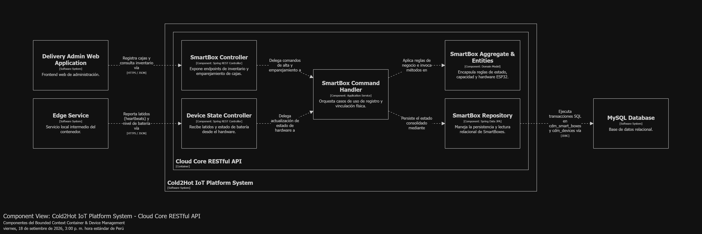
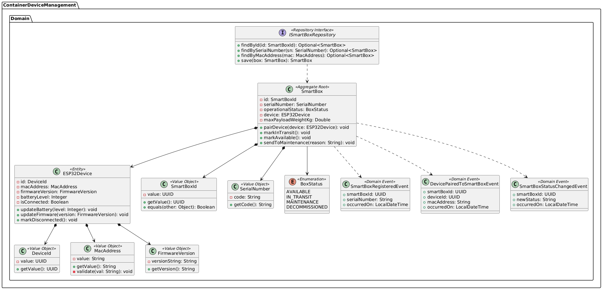
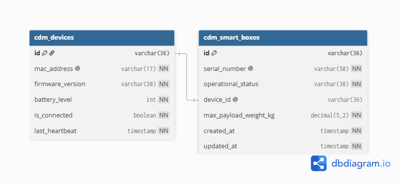

  

<h3 align="center">
Universidad Peruana de Ciencias Aplicadas
</h3>

<h3 align="center">
Ingeniería de Software
  
Ciclo: 2026-20
  
1ASI0572 - Desarrollo de Soluciones IOT
  
NRC: 8735
  
Docente: Leon Bacca, Marco Antonio
  
<strong>Informe de Trabajo Final</strong>  
  
Startup: IoTeam
  
Producto: Cold2Hot  
  
  
<strong>Integrantes</strong>  
  
Alvarado De La Cruz , Juan Carlos (U202216150) 
  
Carhuancote Dominguez, Gonzalo Alonso (U202210720) 
  
Diestra Zambrano, Adriana Maria (U202218110)
  
Duran Diaz, Antonio Rodrigo (U202215721)
  
Nakasone Gomes, Marco Antonio (U202210790)
  
Shimabukuro Uku, Carlos Joel (U201912407)
  
Teves Samaniego, Joan Fernando (U202117303)
  
 

**Septiembre - 2026**

</h3>

# Contenido

## Tabla de contenidos

# Student Outcome

# Capítulo I: Introducción

## 1.1. Startup Profile

### 1.1.1. Descripción de la Startup

### 1.1.2. Perfiles de integrantes del equipo

## 1.2. Solution Profile

### 1.2.1 Antecedentes y problemática

### 1.2.2 Lean UX Process.

#### 1.2.2.1. Lean UX Problem Statements.

#### 1.2.2.2. Lean UX Assumptions.

#### 1.2.2.3. Lean UX Hypothesis Statements.

#### 1.2.2.4. Lean UX Canvas.

## 1.3. Segmentos objetivo.

# Capítulo II: Requirements Elicitation & Analysis

## 2.1. Competidores.

### 2.1.1. Análisis competitivo.

### 2.1.2. Estrategias y tácticas frente a competidores.

## 2.2. Entrevistas.

### 2.2.1. Diseño de entrevistas.

### 2.2.2. Registro de entrevistas.

### 2.2.3. Análisis de entrevistas.

## 2.3. Needfinding.

### 2.3.1. User Personas.

### 2.3.2. User Task Matrix.

### 2.3.3. User Journey Mapping.

### 2.3.4. Empathy Mapping.

## 2.4. Big Picture EventStorming.

## 2.5. Ubiquitous Language.

# Capítulo III: Requirements Specification

## 3.1. User Stories.

## 3.2. Impact Mapping.

## 3.3. Product Backlog.

# Capítulo IV: Solution Software Design

## 4.1. Strategic-Level Domain-Driven Design.

El diseño de nivel estratégico nos permite descomponer el dominio del negocio de logística y custodia térmica de delivery en subdominios delimitados (Bounded Contexts), asegurando una separación clara de responsabilidades y un lenguaje ubicuo consistente.

### 4.1.1. Design-Level EventStorming.
#### 4.1.1.1. Candidate Context Discovery.

A partir del análisis del dominio y de los eventos, comandos y agregados identificados en el Design-Level EventStorming, se identificaron cinco Bounded Contexts candidatos para el ecosistema Cold2Hot: **IAM**, **Container & Device Management**, **Thermal Monitoring & Telemetry**, **Access & Security**, y **Orders & Audit**. 

Cada uno de estos contextos agrupa capacidades del negocio con lenguaje ubicuo, reglas y responsabilidades propias, lo que garantiza una alta cohesión interna y un bajo acoplamiento en la arquitectura del sistema.

| Candidate Bounded Context | Purpose |
| :--- | :--- |
| **IAM (Identity & Access Management)** | Gestiona la autenticación, autorización, perfiles de usuario (repartidores, administradores) y sesiones de acceso. |
| **Container & Device Management** | Gestiona el inventario, registro, estado operativo y vinculación de los contenedores térmicos inteligentes (*SmartBoxes*) y sus sensores IoT. |
| **Thermal Monitoring & Telemetry** | Gestiona la lectura en tiempo real de temperatura, generación de historiales térmicos y alertas de desviación de temperatura. |
| **Access & Security** | Gestiona la validación de contraseñas de un solo uso (OTP), el control físico de apertura del contenedor y la detección de riesgos de alteración o manipulaciones no autorizadas. |
| **Orders & Audit** | Gestiona el seguimiento de pedidos asignados al contenedor, el registro de evidencias fotográficas de entrega y la generación de reportes de auditoría para los restaurantes/clientes. |

    

#### 4.1.1.2. Domain Message Flows Modeling.

En esta sección se modelan los principales flujos de mensajes del dominio entre los Bounded Contexts identificados en Cold2Hot. El objetivo es representar cómo se coordinan las capacidades del negocio y los eventos de dominio sin entrar aún en detalles de implementación técnica.

Mediante la técnica **Domain Storytelling**, se definió el flujo de interacción principal para el proceso de *Despacho, Transporte Seguro y Entrega de Pedido*:

1. **Creación de Orden y Perfil Térmico:** El *Administrador de Restaurante* crea la orden e indica las condiciones térmicas requeridas (Frío o Caliente). El contexto **Ordering & Dispatch** registra la orden y emite el evento `OrderDispatched`.
2. **Generación de OTP y Sincronización:** **Ordering & Dispatch** solicita al contexto **Access & Security** la generación de un código único de entrega (OTP). Este PIN se sincroniza localmente con el dispositivo IoT (**Edge / ESP32 Device**).
3. **Validación y Apertura en Destino:** Al llegar a la ubicación del cliente, el *Repartidor* ingresa el OTP en la **Delivery Operator App**, la cual valida el PIN con **Access & Security** (vía Bluetooth o API REST) para autorizar el desbloqueo físico del contenedor.
4. **Telemetría y Monitoreo Continuo:** De forma paralela, el contexto **IoT Telemetry** recibe la lectura continua de sensores (temperatura, Reed Switch, TCRT5000). Si detecta aperturas no autorizadas o desviaciones de temperatura, emite una alerta crítica hacia el sistema.
5. **Cierre de Entrega y Auditoría:** Una vez abierto el contenedor y entregado el pedido, el *Repartidor* captura la fotografía de evidencia desde la aplicación. El contexto **Auditing & Evidence** consolida las fotos, historiales térmicos y eventos de seguridad para dar por completada la orden

    

#### 4.1.1.3. Bounded Context Canvases.

A continuación se presentan los Bounded Context Canvases para cada uno de los cinco contextos delimitados identificados en el ecosistema Cold2Hot. Estos lienzos definen formalmente el propósito, el lenguaje ubicuo, las responsabilidades y los límites operacionales de cada módulo.

---

### 1. IAM (Identity & Access Management) Bounded Context

| Atributo | Descripción |
| :--- | :--- |
| **Name** | IAM (Identity & Access Management) |
| **Purpose** | Gestionar la autenticación, autorización, perfiles de usuarios (administradores, operadores/repartidores) y la emisión de tokens de acceso seguros. |
| **Domain Classification** | Supporting Subdomain |
| **Ubiquitous Language** | `User`, `Credentials`, `Role`, `JWT Token`, `Authentication`, `Permission`, `Operator Profile`. |
| **Inbound Messages / Commands** | `RegisterUser`, `AuthenticateUser`, `AssignRole`, `ValidateToken`. |
| **Outbound Messages / Events** | `UserRegistered`, `UserAuthenticated`, `RoleAssigned`. |
| **Aggregates & Entities** | **Aggregate Root:** `User`   **Entities:** `Role`, `Permission`   **Value Objects:** `UserId`, `Email`, `HashedPassword`, `RoleType`. |

---

### 2. Container & Device Management Bounded Context

| Atributo | Descripción |
| :--- | :--- |
| **Name** | Container & Device Management |
| **Purpose** | Administrar el ciclo de vida, registro, emparejamiento de sensores/actuadores y estado operativo de las cajas térmicas (*SmartBoxes*) y dispositivos ESP32. |
| **Domain Classification** | Supporting Subdomain |
| **Ubiquitous Language** | `SmartBox`, `ESP32 Device`, `Sensor Pairing`, `Actuator Calibration`, `Device State`, `Lock Mechanism`. |
| **Inbound Messages / Commands** | `RegisterSmartBox`, `PairSensor`, `UpdateDeviceStatus`, `CalibrateActuator`. |
| **Outbound Messages / Events** | `SmartBoxRegistered`, `SensorPaired`, `DeviceStatusUpdated`. |
| **Aggregates & Entities** | **Aggregate Root:** `SmartBox`   **Entities:** `DeviceSensor`, `Actuator`   **Value Objects:** `BoxId`, `MACAddress`, `FirmwareVersion`, `BoxStatus` (*Available, InTransit, Maintenance*). |

---

### 3. Thermal Monitoring & Telemetry Bounded Context

| Atributo | Descripción |
| :--- | :--- |
| **Name** | Thermal Monitoring & Telemetry |
| **Purpose** | Procesar en tiempo real la telemetría de temperatura transmitida por el hardware IoT, verificar rangos térmicos configurados y gatillar alertas de desviación. |
| **Domain Classification** | Core Subdomain |
| **Ubiquitous Language** | `Telemetry Stream`, `Thermal Profile`, `Temperature Reading`, `Threshold`, `Thermal Breach Alert`, `Historical Log`. |
| **Inbound Messages / Commands** | `IngestTelemetryData`, `SetThermalProfile`, `ProcessTemperatureReading`. |
| **Outbound Messages / Events** | `TelemetryIngested`, `ThermalProfileConfigured`, `ThermalBreachDetected`. |
| **Aggregates & Entities** | **Aggregate Root:** `ThermalProfile`   **Entities:** `TelemetryLog`   **Value Objects:** `TemperatureValue`, `CelsiusUnit`, `Timestamp`, `ThresholdRange`. |

---

### 4. Access & Security Bounded Context

| Atributo | Descripción |
| :--- | :--- |
| **Name** | Access & Security |
| **Purpose** | Generar y validar las claves OTP de un solo uso para la apertura del contenedor en destino, evaluar riesgos de manipulación indebida (*Tampering*) y controlar el mecanismo físico de bloqueo. |
| **Domain Classification** | Core Subdomain |
| **Ubiquitous Language** | `OTP (One-Time Password)`, `PIN Generation`, `Unlock Request`, `Tamper Detection`, `Reed Switch Alert`, `Security Event`. |
| **Inbound Messages / Commands** | `GenerateOTP`, `ValidateOTP`, `EvaluateTamperRisk`, `UnlockContainer`. |
| **Outbound Messages / Events** | `OTPGenerated`, `ContainerUnlocked`, `SecurityBreachDetected`, `InvalidOTPAttempted`. |
| **Aggregates & Entities** | **Aggregate Root:** `SecurityPasscode`   **Entities:** `AccessAttempt`, `SecurityLog`   **Value Objects:** `OTPCode`, `ExpirationTime`, `TamperStatus`, `UnlockResult`. |

---

### 5. Orders & Audit Bounded Context

| Atributo | Descripción |
| :--- | :--- |
| **Name** | Orders & Audit |
| **Purpose** | Orquestar la vinculación de pedidos con contenedores térmicos, consolidar la evidencia fotográfica de entrega y estructurar los reportes de auditoría de custodia térmica. |
| **Domain Classification** | Core Subdomain |
| **Ubiquitous Language** | `Order`, `Thermal Custody`, `Delivery Evidence`, `Proof of Delivery`, `Audit Report`, `Dispatch`. |
| **Inbound Messages / Commands** | `AssignOrderToBox`, `CaptureDeliveryEvidence`, `UploadDeliveryPhoto`, `GenerateAuditReport`. |
| **Outbound Messages / Events** | `OrderDispatched`, `EvidenceUploaded`, `AuditReportGenerated`, `OrderCompleted`. |
| **Aggregates & Entities** | **Aggregate Root:** `Order`   **Entities:** `DeliveryEvidence`, `AuditReport`   **Value Objects:** `OrderId`, `PhotoUrl`, `CustodyStatus`, `CompletionTimestamp`. |

### 4.1.2. Context Mapping.

El Context Map de Cold2Hot representa la arquitectura y las interacciones entre los Bounded Contexts identificados en el dominio del sistema de monitoreo térmico y de dispositivos. Esta vista describe las responsabilidades específicas de cada contexto y las relaciones de dependencia (Upstream/Downstream) necesarias para la comunicación entre subsistemas.

En esta arquitectura, el contexto IAM (Identity & Access Management) actúa como proveedor principal de identidades y autenticación para todo el sistema. Por su parte, Thermal Monitoring & Telemetry consume información crítica de dispositivos y accesos para registrar datos biométricos o de temperatura en tiempo real.

    

### 4.1.3. Software Architecture.

#### 4.1.3.1. Software Architecture System Landscape Diagram.

El diagrama de panorama del sistema (System Landscape Diagram) ilustra el ecosistema tecnológico y operativo completo dentro del cual opera la startup IoTeam. Permite visualizar la interacción entre los diferentes actores humanos, el sistema central y las plataformas satélites que intervienen en la cadena logística de entrega de comida a domicilio.

En este nivel macro, el proceso inicia cuando el End Customer realiza una solicitud de pedido mediante los canales comerciales del restaurante aliado. El Restaurant Branch Manager registra y despacha la comanda a través del Restaurant POS & ERP System, el cual se comunica con Cold2Hot IoT Platform para transferir la orden y definir los requerimientos térmicos de conservación (modo frío o caliente).

A partir de ese instante, la plataforma coordina la operación con el Delivery Courier, quien recibe la ruta optimizada mediante el servicio de cartografía libre OpenStreetMap & OSRM API. El repartidor interactúa mecánicamente con el dispositivo físico SmartBox IoT Physical Device, introduciendo el pedido en el compartimento térmico. Durante el trayecto, la plataforma Cold2Hot mantiene comunicación constante con el hardware para recibir telemetría continua y detectar cualquier eventualidad. En caso de identificar una apertura no autorizada o un desvío de temperatura crítico, la plataforma dispara alertas en tiempo real al teléfono del repartidor y al panel del administrador mediante Firebase Cloud Messaging (FCM). Finalmente, la evidencia fotográfica capturada al concretar la entrega se comprime y almacena de forma segura en Cloudinary Free Tier.

    

#### 4.1.3.2. Software Architecture Context Level Diagrams.

El diagrama de contexto (Context Diagram) delimita formalmente la frontera perimetral del software de Cold2Hot IoT Platform System, representándolo como una caja negra central e identificando exclusivamente a sus usuarios directos y a los sistemas con los que establece enlaces de comunicación síncrona o asíncrona.

A diferencia del panorama global, en esta vista el foco se concentra en el sistema de software desarrollado por IoTeam:

- Delivery Operations Administrator: Interactúa con la plataforma a través de canales seguros HTTPS/TLS para configurar rangos térmicos admisibles, monitorear la ubicación de la flota y auditar incidentes o aperturas registradas durante los envíos.

- Delivery Operator: Se autentica en el sistema mediante su dispositivo móvil para sincronizar órdenes asignadas, validar códigos de apertura de un solo uso (OTP) y enviar las fotografías que acreditan la entrega exitosa del paquete.

- SmartBox IoT Hardware Enclosure: Representa el entorno ciberfísico en ruta (microcontrolador ESP32 NodeMCU, bus One-Wire con sensor DS18B20, entradas digitales para Reed Switch y TCRT5000, actuador de ventilación y cerrojo mecánico solenoide). Este dispositivo actúa como un sistema externo que transmite flujos continuos de telemetría y eventos de intrusión vía serial o Bluetooth Low Energy (BLE), y recibe órdenes de desbloqueo físico emitidas por el software.

- Sistemas Externos de Soporte: El sistema delega responsabilidades no troncales consumiendo las APIs REST gratuitas de OpenStreetMap & OSRM para la geolocalización, Firebase Cloud Messaging para la emisión de notificaciones push prioritarias, y Cloudinary para la persistencia y distribución de archivos multimedia de auditoría.

    

#### 4.1.3.2. Software Architecture Container Level Diagrams.

El diagrama de contenedores descompone el sistema Cold2Hot en sus unidades fundamentales de ejecución y despliegue desacopladas, definiendo las responsabilidades funcionales, las tecnologías seleccionadas y los protocolos de integración entre cada bloque:

- Landing Page: Sitio web estático desarrollado con HTML5, CSS3 y JavaScript vanilla. Su función principal es exponer la propuesta de valor comercial de IoTeam, planes de suscripción para restaurantes y enlaces de redirección hacia las aplicaciones operativas. 

- Delivery Admin Web Application: Aplicación web cliente desarrollada con Angular y TypeScript, estructurada bajo el sistema de diseño Material Design mediante la biblioteca Angular Material. Proporciona a los administradores un panel de control interactivo para la gestión de despachos, visualización de métricas térmicas y auditoría de incidentes.

- Delivery Operator Mobile Application: Aplicación móvil multiplataforma desarrollada con Flutter y Dart. Permite al conductor autenticarse, enlazarse vía Bluetooth Low Energy (BLE) con la SmartBox más cercana, digitar el PIN OTP de apertura y tomar la fotografía de comprobación física.

- Cloud Core RESTful API: Servicio backend empresarial desarrollado sobre el marco de trabajo Spring Boot en Java. Centraliza las reglas de negocio globales, gestiona la persistencia de datos, valida accesos e identidades (IAM) y orquesta la comunicación con los servicios externos gratuitos (FCM, Cloudinary, OSRM).

- Cloud Relational Database: Instancia de base de datos relacional PostgreSQL que almacena los registros de usuarios, configuraciones de cajas térmicas, historiales de pedidos y eventos de auditoría.

- Edge Service: Microservicio intermedio desarrollado en Python utilizando el microframework Flask y Peewee ORM. Se ejecuta en el hardware del contenedor para procesar señales analíticas locales, evaluar discrepancias inmediatas de seguridad y garantizar la operación de desbloqueo incluso en escenarios con pérdida total de conectividad a internet.

- Edge Local Database: Base de datos relacional ligera basada en SQLite que almacena en caché local las claves temporales activas y los últimos registros de telemetría pendientes de sincronización con la nube.

    

#### 4.1.3.3. Software Architecture Deployment Diagrams.

El diagrama de despliegue detalla la topología de infraestructura física y en la nube donde residen los contenedores de software en un entorno de producción, garantizando alta disponibilidad con costes controlados mediante esquemas Free Tier:

- Estación de Trabajo del Administrador (Hardware de Escritorio): Los administradores acceden a través de navegadores web estándar (Chrome, Firefox, Safari o Edge) a la Landing Page y a la Delivery Admin Web Application, las cuales son servidas de manera estática y con certificados SSL activos mediante la plataforma PaaS gratuita de Vercel o GitHub Pages.

- Dispositivo Móvil del Repartidor (Smartphone Android/iOS): Aloja localmente la Delivery Operator Mobile Application instalada. El teléfono se comunica simultáneamente con la nube mediante HTTPS/4G-5G y con la SmartBox a través de su antena Bluetooth Low Energy (BLE).

- Gabinete Físico SmartBox (Entorno Edge e IoT en Vehículo): Compuesto por un computador de placa reducida (SoC Linux) que hospeda el Edge Service y la base de datos SQLite, interconectado por comunicación serial UART/GPIO al microcontrolador ESP32 NodeMCU, el cual gestiona directamente los pines de los sensores DS18B20, TCRT5000, Reed Switch y el relé de apertura.

- Infraestructura Cloud Gratuita (PaaS / BaaS):

    - El Cloud Core RESTful API opera en un contenedor virtualizado dentro de los servicios gratuitos de Render Free Web Service.   

    - La persistencia transaccional reside en una base de datos gestionada PostgreSQL provista por el nivel gratuito de Supabase.

    - El repositorio multimedia de evidencias opera bajo la capa gratuita de Cloudinary, la cual almacena las capturas optimizadas sin consumo de disco en el servidor principal. 

    

## 4.2. Tactical-Level Domain-Driven Design

### 4.2.1. Bounded Context: Identity & Access (IAM)

El contexto delimitado IAM gestiona integralmente el registro, autenticación, autorización y emisión de credenciales criptográficas para todos los actores que interactúan con la plataforma Cold2Hot. Asegura la separación de privilegios entre los administradores de operaciones del restaurante y los operadores de entrega (repartidores), garantizando un acceso restringido y trazable a los recursos del sistema.

#### 4.2.1.1. Domain Layer.

La capa de dominio constituye el núcleo de la lógica del contexto IAM, implementada sin dependencias de frameworks ni bibliotecas de persistencia. Encapsula las reglas del negocio relacionadas con la validez de credenciales, la seguridad de contraseñas y el ciclo de vida de los perfiles de usuario.

- User (Aggregate Root)
  - Propósito: Modela la entidad principal del sistema, centralizando la comprobación de credenciales, el cambio de contraseña y las transiciones de estado operativo.
  - Atributos:
    - id: UserId
    - email: Email
    - password: HashedPassword
    - fullName: FullName
    - role: Role
    - isActive: Boolean
  - Métodos:
    - + authenticate(plainPassword: String, passwordEncoder: IPasswordEncoder): Boolean
      - Verifica si la contraseña proporcionada coincide con el hash almacenado mediante el servicio de dominio de cifrado.
    - + updateProfile(fullName: FullName): void
      - Actualiza los nombres y apellidos manteniendo la inmutabilidad de la identidad.
    - + changePassword(oldPass: String, newPass: String, encoder: IPasswordEncoder): void
      - Evalúa la contraseña anterior y asigna una nueva después de validar complejidad y cifrado.
    - + deactivate(): void
      - Inhabilita la cuenta para impedir futuros inicios de sesión.

- UserId (Value Object)
  - Propósito: Representa de forma unívoca e inmutable el identificador universal del usuario (UUID v4).
  - Atributos:
    - value: UUID
  - Métodos:
    - + getValue(): UUID
    - + equals(other: Object): Boolean

- Email (Value Object)
  - Propósito: Modela la dirección electrónica y garantiza el cumplimiento del formato estándar RFC 5322.
  - Atributos:
    - address: String
  - Métodos:
    - + getAddress(): String
    - - validate(address: String): void

- HashedPassword (Value Object)
  - Propósito: Encapsula la cadena cifrada resultante del proceso de hashing de contraseña mediante un algoritmo seguro, evitando que valores en texto plano residan en el modelo de dominio.
  - Atributos:
    - hash: String
  - Métodos:
    - + getHash(): String
    - + matches(raw: String, encoder: IPasswordEncoder): Boolean

- FullName (Value Object)
  - Propósito: Representa la composición inmutable del nombre y apellido de la persona titular de la cuenta.
  - Atributos:
    - firstName: String
    - lastName: String
  - Métodos:
    - + getFullName(): String

- Role (Entity)
  - Propósito: Define el esquema de privilegios asignados al usuario para el control de acceso basado en roles (RBAC).
  - Atributos:
    - id: Long
    - name: RoleType
    - description: String
  - Métodos:
    - + getName(): RoleType

- RoleType (Enumeration)
  - Propósito: Lista los roles autorizados en la plataforma.
  - Valores: ROLE_ADMIN, ROLE_DELIVERY_OPERATOR.

- IPasswordEncoder (Domain Service Interface)
  - Propósito: Contrato de abstracción que delega el hashing criptográfico sin acoplar el dominio a librerías de seguridad externas.
  - Métodos:
    - + encode(rawPassword: String): String
    - + matches(rawPassword: String, encodedPassword: String): Boolean

- IUserRepository (Repository Interface)
  - Propósito: Define los métodos de acceso y consulta a la persistencia del agregado User.
  - Métodos:
    - + findById(id: UserId): Optional<User>
    - + findByEmail(email: Email): Optional<User>
    - + existsByEmail(email: Email): Boolean
    - + save(user: User): User

- Domain Events
  - UserRegisteredEvent: Se emite cuando se crea una nueva cuenta en el sistema. Incluye userId, email, role y occurredOn.
  - UserAuthenticatedEvent: Notifica un inicio de sesión exitoso para fines de auditoría.

#### 4.2.1.2. Interface Layer.

Actúa como el perímetro de entrada de solicitudes externas hacia el contexto, exponiendo controladores HTTP bajo el estilo arquitectónico RESTful y documentados mediante la especificación OpenAPI.

- AuthController (REST Controller)
  - Propósito: Expone endpoints públicos para el ingreso a la plataforma y el alta inicial de usuarios.
  - Métodos:
    - + register(request: RegisterUserRequestDto): ResponseEntity<ApiResponse<UserDto>>
      - Gestiona la petición POST /api/v1/auth/register.
    - + login(request: LoginRequestDto): ResponseEntity<ApiResponse<AuthTokenDto>>
      - Gestiona la petición POST /api/v1/auth/login.

- UserController (REST Controller)
  - Propósito: Expone endpoints protegidos para la consulta de información del perfil y la actualización de datos de cuenta.
  - Métodos:
    - + getProfile(principal: UserPrincipal): ResponseEntity<ApiResponse<UserDto>>
      - Procesa la petición GET /api/v1/users/me.
    - + updateProfile(principal: UserPrincipal, request: UpdateProfileRequestDto): ResponseEntity<ApiResponse<Void>>
      - Procesa la petición PUT /api/v1/users/me.

- Data Transfer Objects (DTOs)
  - RegisterUserRequestDto: Objeto con los datos de entrada para registro (email, password, firstName, lastName, role).
  - LoginRequestDto: Objeto de entrada con las credenciales de acceso (email, password).
  - AuthTokenDto: Respuesta con el token generado (token, tokenType, expiresIn).
  - UserDto: Proyección segura del usuario sin información sensible (id, email, firstName, lastName, role, isActive).

#### 4.2.1.3. Application Layer.

Coordina los flujos de trabajo de los casos de uso implementando el patrón CQRS para desacoplar las operaciones de escritura (comandos) de las lecturas (consultas).

- RegisterUserCommand & RegisterUserCommandHandler
  - Propósito: Traslada la intención de crear un usuario en el sistema.
  - El manejador valida que el correo electrónico no esté en uso, codifica la contraseña mediante IPasswordEncoder, construye el agregado User, lo almacena mediante el repositorio y publica el evento UserRegisteredEvent.
  - Métodos del handler:
    - + handle(command: RegisterUserCommand): UserId

- AuthenticateUserCommand & AuthenticateUserCommandHandler
  - Propósito: Traslada las credenciales para la autenticación.
  - El manejador busca al usuario por correo, invoca el método authenticate del agregado y, si la validación es correcta, solicita al adaptador de seguridad la generación de un token JWT firmado.
  - Métodos del handler:
    - + handle(command: AuthenticateUserCommand): AuthTokenDto

- GetUserByIdQuery & GetUserByIdQueryHandler
  - Propósito: Recupera el estado actual del perfil solicitado y lo transforma en un DTO de solo lectura.
  - Métodos del handler:
    - + handle(query: GetUserByIdQuery): UserDto

#### 4.2.1.4. Infrastructure Layer.

Proporciona las implementaciones tecnológicas concretas para las interfaces definidas por las capas internas de la arquitectura.

- UserRepositoryImpl
  - Propósito: Implementa el contrato IUserRepository utilizando Spring Data JPA para comunicarse con la base de datos relacional MySQL.
  - Componentes: Inyecta SpringDataJpaUserRepository y utiliza UserPersistenceMapper para convertir entre la entidad de persistencia (UserEntity) y el agregado de dominio puro (User).

- BCryptPasswordEncoderAdapter
  - Propósito: Implementa la interfaz IPasswordEncoder utilizando Spring Security Crypto para generar hashes BCrypt con un factor de costo configurable.

- JwtTokenProvider
  - Propósito: Gestiona la creación, firma criptográfica (algoritmo HMAC-SHA256) y validación de tokens de acceso web JWT mediante la biblioteca JJWT.
  - Métodos:
    - + generateToken(userId: UUID, email: String, role: String): String
    - + validateToken(token: String): Boolean
    - + getEmailFromToken(token: String): String

- UserEntity & RoleEntity
  - Propósito: Clases anotadas con JPA (@Entity, @Table) que definen el mapeo objeto-relacional directo contra las tablas iam_users e iam_roles en MySQL.   

#### 4.2.1.5. Bounded Context Software Architecture Component Level Diagrams.

El diagrama de componentes (C4 Nivel 3) ilustra la organización estructural interna del contenedor backend Cloud Core RESTful API para dar soporte al contexto IAM. Refleja el flujo de llamadas desde las aplicaciones cliente hacia los controladores REST, la delegación hacia los manejadores de comandos de la capa de aplicación, la invocación de las entidades del modelo de dominio y la resolución técnica de persistencia ejecutada por los repositorios hacia la base de datos relacional MySQL.

    

#### 4.2.1.6. Bounded Context Software Architecture Code Level Diagrams.

##### 4.2.1.6.1. Bounded Context Domain Layer Class Diagrams.

El diagrama de clases UML modela las entidades, objetos de valor, interfaces y enumeraciones que conforman exclusivamente la capa de dominio de IAM, especificando la visibilidad de atributos (+, -), las firmas de métodos y las relaciones de asociación, dependencia y composición.

    

##### 4.2.1.6.2. Bounded Context Database Design Diagram.

El diseño de persistencia para el contexto IAM se implementa en el motor relacional MySQL 8.0. Está compuesto por dos tablas normalizadas: iam_roles, que actúa como catálogo de tipos de privilegios del sistema, e iam_users, que almacena las identidades y credenciales de los usuarios. La integridad referencial se preserva mediante una clave foránea que restringe la eliminación de roles asignados a usuarios activos, y se incluye un índice sobre la columna email para agilizar las operaciones de búsqueda durante la autenticación.

    

### 4.2.X. Bounded Context: Container & Device Management

El contexto delimitado Container & Device Management se encarga de administrar el ciclo de vida, la disponibilidad operativa y la vinculación del hardware de los contenedores térmicos inteligentes (SmartBoxes) con sus respectivos microcontroladores ESP32 y sensores IoT.

#### 4.2.2.1. Domain Layer.

Encapsula las reglas del negocio asociadas al inventario de cajas de reparto, la compatibilidad física de carga, la calibración de sensores y las transiciones de estado operativo.

- SmartBox (Aggregate Root)
  - Propósito: Entidad raíz que controla el estado operativo del contenedor físico, sus especificaciones mecánicas y el hardware embebido asociado.
  - Atributos:
    - id: SmartBoxId
    - serialNumber: SerialNumber
    - operationalStatus: BoxStatus
    - device: ESP32Device
    - maxPayloadWeightKg: Double
  - Métodos:
    - + pairDevice(device: ESP32Device): void
      - Asocia un microcontrolador verificado garantizando que no esté vinculado a otra unidad activa.
    - + markInTransit(): void
      - Modifica el estado a IN_TRANSIT cuando la caja es asignada a un despacho en ruta.
    - + markAvailable(): void
      - Restablece el estado a AVAILABLE tras la conclusión exitosa de una entrega.
    - + sendToMaintenance(reason: String): void
      - Inhabilita la caja para operaciones de reparto ante fallas de hardware o calibración.

- ESP32Device (Entity)
  - Propósito: Modela el microcontrolador físico y los módulos de telemetría instalados en el contenedor.
  - Atributos:
    - id: DeviceId
    - macAddress: MacAddress
    - firmwareVersion: FirmwareVersion
    - batteryLevel: Integer
    - isConnected: Boolean
  - Métodos:
    - + updateBattery(level: Integer): void
      - Registra el nivel porcentual remanente de energía de la batería.
    - + updateFirmware(version: FirmwareVersion): void
      - Actualiza la versión de software embebido tras un proceso de flasheo u OTA.
    - + markDisconnected(): void
      - Registra la pérdida de comunicación con la unidad de procesamiento.

- SmartBoxId (Value Object)
  - Propósito: Identificador unívoco e inmutable de la caja térmica (UUID v4).
  - Atributos:
    - value: UUID
  - Métodos:
    - + getValue(): UUID
    - + equals(other: Object): Boolean

- DeviceId (Value Object)
  - Propósito: Identificador universal inmutable del microcontrolador (UUID v4).
  - Atributos:
    - value: UUID
  - Métodos:
    - + getValue(): UUID

- MacAddress (Value Object)
  - Propósito: Dirección física de red del chip ESP32 (formato XX:XX:XX:XX:XX:XX).
  - Atributos:
    - value: String
  - Métodos:
    - + getValue(): String
    - - validate(value: String): void

- SerialNumber (Value Object)
  - Propósito: Código alfanumérico grabado en el chasis físico del contenedor para identificación visual.
  - Atributos:
    - code: String
  - Métodos:
    - + getCode(): String

- FirmwareVersion (Value Object)
  - Propósito: Representación formal del versionado semántico del firmware embebido (vX.Y.Z).
  - Atributos:
    - versionString: String
  - Métodos:
    - + getVersion(): String

- BoxStatus (Enumeration)
  - Propósito: Estados válidos para el flujo operativo de los contenedores.
  - Valores: AVAILABLE, IN_TRANSIT, MAINTENANCE, DECOMMISSIONED.

- ISmartBoxRepository (Repository Interface)
  - Propósito: Contrato abstracto para la persistencia transaccional del agregado SmartBox.
  - Métodos:
    - + findById(id: SmartBoxId): Optional<SmartBox>
    - + findBySerialNumber(sn: SerialNumber): Optional<SmartBox>
    - + findByMacAddress(mac: MacAddress): Optional<SmartBox>
    - + save(box: SmartBox): SmartBox

- Domain Events
  - SmartBoxRegisteredEvent: Emite la incorporación de un nuevo contenedor con smartBoxId, serialNumber y occurredOn.
  - DevicePairedToSmartBoxEvent: Notifica la asociación exitosa de hardware con smartBoxId, deviceId, macAddress y occurredOn.
  - SmartBoxStatusChangedEvent: Notifica las transiciones de estado operativo con smartBoxId, newStatus y occurredOn.

#### 4.2.2.2. Interface Layer.

Punto perimetral de recepción de peticiones desde el panel de control web y desde el servicio Edge.

- SmartBoxController (REST Controller)
  - Propósito: Expone endpoints administrativos para la gestión del inventario y la vinculación de hardware.
  - Métodos:
    - + registerBox(request: RegisterBoxRequestDto): ResponseEntity<ApiResponse<SmartBoxDto>>
      - Maneja POST /api/v1/smartboxes.
    - + pairDevice(boxId: UUID, request: PairDeviceRequestDto): ResponseEntity<ApiResponse<Void>>
      - Maneja POST /api/v1/smartboxes/{boxId}/pair-device.
    - + getAvailableBoxes(): ResponseEntity<ApiResponse<List<SmartBoxDto>>>
      - Maneja GET /api/v1/smartboxes/available.

- DeviceStateController (REST Controller)
  - Propósito: Endpoint técnico consumido por el contenedor Edge Service para reportar latidos operativos (heartbeats) y telemetría de batería.
  - Métodos:
    - + reportHeartbeat(request: HeartbeatRequestDto): ResponseEntity<Void>
      - Maneja POST /api/v1/devices/heartbeat.

- Data Transfer Objects (DTOs)
  - RegisterBoxRequestDto: serialNumber, maxPayloadWeightKg.
  - PairDeviceRequestDto: macAddress, initialFirmware.
  - HeartbeatRequestDto: macAddress, batteryLevel, isConnected.
  - SmartBoxDto: id, serialNumber, operationalStatus, deviceMacAddress, maxPayloadWeightKg.

#### 4.2.2.3. Application Layer.

Orquesta los casos de uso implementando CQRS, coordinando repositorios de persistencia y publicadores de eventos.

- RegisterSmartBoxCommand & RegisterSmartBoxCommandHandler
  - Propósito: Coordina la verificación de duplicados por número de serie, instancia el agregado SmartBox, invoca la persistencia y emite el evento de creación.
  - Métodos del handler:
    - + handle(command: RegisterSmartBoxCommand): SmartBoxId

- PairDeviceCommand & PairDeviceCommandHandler
  - Propósito: Valida la existencia del contenedor, crea la entidad ESP32Device tras validar su MacAddress, ejecuta SmartBox.pairDevice(...) y guarda los cambios.
  - Métodos del handler:
    - + handle(command: PairDeviceCommand): void

- UpdateBoxStatusCommand & UpdateBoxStatusCommandHandler
  - Propósito: Ejecuta las transiciones controladas de disponibilidad según eventos de despacho o retorno.
  - Métodos del handler:
    - + handle(command: UpdateBoxStatusCommand): void

- GetAvailableSmartBoxesQuery & GetAvailableSmartBoxesQueryHandler
  - Propósito: Consulta los contenedores aptos para ser asignados a nuevos despachos y los transforma a DTOs.
  - Métodos del handler:
    - + handle(query: GetAvailableSmartBoxesQuery): List<SmartBoxDto>

#### 4.2.2.4. Infrastructure Layer.

Implementa la persistencia concreta sobre el motor relacional MySQL mediante adaptadores transaccionales.

- SmartBoxRepositoryImpl
  - Propósito: Implementa el contrato ISmartBoxRepository mediante Spring Data JPA.
  - Componentes: Inyecta SpringDataJpaSmartBoxRepository y utiliza SmartBoxPersistenceMapper para la conversión bidireccional entre las entidades de persistencia y los agregados de dominio.

- SmartBoxEntity & ESP32DeviceEntity
  - Propósito: Mapeo relacional JPA para las tablas cdm_smart_boxes y cdm_devices.
  - Atributos clave: Anotaciones @Entity, @Table, @OneToOne y @JoinColumn para garantizar la integridad referencial. 

#### 4.2.2.5. Bounded Context Software Architecture Component Level Diagrams.

El diagrama de componentes (C4 Nivel 3) descompone la estructura interna del contenedor backend Cloud Core RESTful API para aislar las responsabilidades operativas asociadas al inventario de cajas inteligentes y al monitoreo del hardware embebido.

- Controladores REST y perímetro de entrada: la interacción externa se canaliza a través de dos componentes especializados. Por un lado, SmartBoxController atiende las peticiones HTTP del administrador desde la aplicación web, procesando solicitudes de alta física de contenedores (POST /api/v1/smartboxes), vinculación de microcontroladores y consultas de disponibilidad de unidades. Por otro lado, DeviceStateController actúa como receptor de telemetría operativa, habilitando un canal ligero para que el contenedor Edge Service reporte periódicamente latidos de conectividad (heartbeats) y niveles de carga de la batería mediante transferencias JSON.

- Orquestación en la capa de aplicación: el componente SmartBoxCommandHandler desacopla la recepción HTTP de la lógica interna de negocio. Este servicio de aplicación implementa transaccionalidad declarativa, valida restricciones de unicidad sobre las direcciones MAC y números de serie, invoca los métodos de mutación sobre la raíz de agregado y coordina la persistencia delegando el resultado al publicador de eventos del dominio.

- Aislamiento del modelo de dominio: el componente SmartBox Aggregate & Entities encapsula las invariantes de negocio puras. Garantiza que una caja no pueda asociarse a más de un dispositivo ESP32 en simultáneo, previene transiciones de estado inválidas, como impedir que una unidad en mantenimiento pase a tránsito sin previa verificación técnica, y asegura que las dimensiones de carga no excedan la capacidad estructural establecida.

- Persistencia y acceso a datos: la persistencia se resuelve mediante el componente SmartBox Repository, el cual implementa el contrato ISmartBoxRepository mediante abstracciones de Spring Data JPA. Este componente traduce el agregado de dominio en esquemas relacionales a través de mapeadores especializados (SmartBoxPersistenceMapper), interactuando mediante conexiones transaccionales JDBC hacia el motor relacional MySQL.

    

#### 4.2.2.6. Bounded Context Software Architecture Code Level Diagrams.

##### 4.2.2.6.1. Bounded Context Domain Layer Class Diagrams.

El diagrama de clases UML modela las entidades, objetos de valor e interfaces que definen el núcleo del bounded context Container & Device Management, estructurado según los patrones tácticos de Domain-Driven Design sin dependencias de infraestructura.

- Raíz de agregado (SmartBox): centraliza el ciclo de vida del contenedor. Mantiene visibilidad privada en todos sus atributos (-) para forzar la encapsulación estricta. La modificación de su estado operativo se rige por métodos públicos de negocio como markInTransit(), markAvailable() y sendToMaintenance(reason: String), garantizando que cualquier cambio de disponibilidad esté respaldado por un motivo auditable.

- Entidad interna (ESP32Device): modela el microcontrolador físicamente montado en el chasis térmico. Posee identidad propia mediante el objeto de valor DeviceId y contiene la lógica para registrar variaciones en el porcentaje de batería mediante updateBattery(level: Integer), así como la actualización de su firmware tras despliegues inalámbricos mediante updateFirmware(version: FirmwareVersion).

- Objetos de valor inmutables (Value Objects): proveen semántica al dominio. MacAddress valida internamente el formato hexadecimal físico estándar del chip Wi‑Fi/Bluetooth del ESP32; SerialNumber asegura la trazabilidad alfanumérica grabada en el chasis; y FirmwareVersion encapsula el control de versiones semántico (vX.Y.Z). La inmutabilidad de estos elementos garantiza que dos instancias con idéntico valor representen el mismo concepto en memoria sin efectos colaterales.

- Relaciones y multiplicidades del modelo:
  - Composición fuerte (1 a 0..1): SmartBox contiene a ESP32Device, lo que implica que el dispositivo físico forma parte estructural del ciclo de vida del contenedor dentro del contexto operativo.
  - Asociaciones de composición (1 a 1): los objetos de valor SmartBoxId, SerialNumber, DeviceId, MacAddress y FirmwareVersion componen indivisiblemente a sus entidades correspondientes.
  - Realización de interfaces: la interface abstracta ISmartBoxRepository declara las operaciones de guardado y búsqueda por dirección MAC o número de serie, sirviendo de contrato para que la capa de infraestructura provea su implementación sin acoplar el núcleo de dominio.

    

##### 4.2.2.6.2. Bounded Context Database Design Diagram.

El diseño relacional para el bounded context Container & Device Management se implementa en MySQL 8.0, garantizando normalización formal en tercera forma normal (3FN) y atomicidad transaccional (ACID).

- Tabla cdm_devices:
  - Almacena las características técnicas y el estado de enlace del hardware.
  - id: clave primaria de longitud fija (VARCHAR(36)) para alojar identificadores UUID v4 generados en el dominio.
  - mac_address: cadena de longitud fija (VARCHAR(17)) con restricción de unicidad (UNIQUE) e índice dedicado (idx_cdm_devices_mac) para acelerar las validaciones durante el emparejamiento.
  - battery_level: entero validado entre 0 y 100 con valor por defecto de 100.
  - last_heartbeat: marca de tiempo configurada con actualización automática (ON UPDATE CURRENT_TIMESTAMP), permitiendo detectar desbalances de conectividad si transcurre un período prolongado sin reportes.

- Tabla cdm_smart_boxes:
  - Gestiona las unidades de transporte asignables a los despachos.
  - id: clave primaria de tipo UUID (VARCHAR(36)).
  - serial_number: identificador físico con restricción única (UNIQUE) indexado para consultas operativas rápidas.
  - operational_status: almacena el valor textual del enum (AVAILABLE, IN_TRANSIT, MAINTENANCE, DECOMMISSIONED), respaldado por el índice idx_cdm_smart_boxes_status para optimizar las consultas de cajas disponibles al momento del despacho.
  - max_payload_weight_kg: valor decimal de precisión fija (DECIMAL(5,2)) para evitar errores de redondeo en cálculos de capacidad de carga.

- Integridad referencial y relaciones:
  - La vinculación entre el contenedor y el dispositivo se establece mediante la clave foránea device_id en cdm_smart_boxes, la cual apunta a cdm_devices.id.
  - Cuenta con restricción de unicidad (UNIQUE), forzando una relación estricta de uno a uno (1:1) entre una caja y un módulo ESP32.
  - La regla de eliminación está definida como ON DELETE SET NULL, garantizando que si un dispositivo ESP32 es dado de baja por avería o reemplazo en laboratorio, el registro histórico del contenedor SmartBox se preserve sin generar inconsistencias de integridad referencial. 

    

### 4.2.3. Bounded Context: Thermal Monitoring & Telemetry

El contexto delimitado Thermal Monitoring & Telemetry concentra la lógica relacionada con la recepción, validación, procesamiento y trazabilidad de la telemetría térmica generada por las SmartBoxes durante el transporte de los pedidos. Su responsabilidad principal es transformar las lecturas provenientes del hardware IoT en información de dominio que permita determinar si las condiciones térmicas del envío se mantienen dentro de los límites configurados.

#### 4.2.3.1. Domain Layer.

La capa de dominio constituye el núcleo de las reglas de negocio del contexto Thermal Monitoring & Telemetry, manteniéndose independiente de frameworks, mecanismos de persistencia y servicios externos. Su función es representar el concepto de perfil térmico y establecer las reglas necesarias para interpretar cada lectura de temperatura.

- ThermalProfile (Aggregate Root)
  - Propósito: Representa la configuración térmica asociada a un envío monitoreado, centralizando los límites de temperatura que determinan las condiciones aceptables durante el transporte.
  - Atributos:
    - id: ThermalProfileId
    - orderId: OrderId
    - temperatureMode: TemperatureMode
    - thresholdRange: ThresholdRange
    - isActive: Boolean
  - Métodos:
    - + configureRange(range: ThresholdRange): void
      - Establece los límites mínimo y máximo permitidos para el transporte.
    - + evaluateTemperature(temperature: TemperatureValue): ThermalStatus
      - Determina si una lectura se encuentra dentro o fuera del rango configurado.
    - + deactivate(): void
      - Inhabilita el perfil térmico cuando finaliza el monitoreo del envío.

- TelemetryLog (Entity)
  - Propósito: Representa una lectura individual de telemetría térmica obtenida desde una SmartBox.
  - Atributos:
    - id: TelemetryLogId
    - smartBoxId: SmartBoxId
    - temperature: TemperatureValue
    - timestamp: Timestamp
    - status: ThermalStatus
  - Métodos:
    - + markAsNormal(): void
    - + markAsBreach(): void
    - + isWithinRange(profile: ThermalProfile): Boolean

- ThermalProfileId (Value Object)
  - Propósito: Representa de manera única e inmutable el identificador del perfil térmico.
  - Atributos:
    - value: UUID
  - Métodos:
    - + getValue(): UUID
    - + equals(other: Object): Boolean
- TelemetryLogId (Value Object)
  - Propósito: Identifica de forma única cada registro histórico de telemetría.
  - Atributos:
    - value: UUID
  - Métodos:
    - + getValue(): UUID

- TemperatureValue (Value Object)
  - Propósito: Encapsula el valor numérico de temperatura y evita que el dominio trabaje con valores sin validación.
  - Atributos:
    - value: Decimal
    - unit: CelsiusUnit
  - Métodos:
    - + getValue(): Decimal
    - + isValid(): Boolean

- CelsiusUnit (Value Object)
  - Propósito: Representa la unidad de temperatura utilizada por el sistema.
  - Atributos:
    - symbol: String
  - Métodos:
    - + getSymbol(): String

- Timestamp (Value Object)
  - Propósito: Representa el instante exacto en el que fue obtenida una lectura.
  - Atributos:
    - value: DateTime
  - Métodos:
    - + getValue(): DateTime

- ThresholdRange (Value Object)
  - Propósito: Encapsula los límites mínimo y máximo que determinan el rango térmico permitido.
  - Atributos:
    - minTemperature: TemperatureValue
    - maxTemperature: TemperatureValue
  - Métodos:
    - + contains(temperature: TemperatureValue): Boolean
    - + isExceeded(temperature: TemperatureValue): Boolean

- TemperatureMode (Enumeration)
  - Propósito: Define el tipo de conservación térmica requerido por el pedido.
  - Valores: COLD, HOT.

- ThermalStatus (Enumeration)
  - Propósito: Define el resultado de la evaluación de una lectura.
  - Valores: WITHIN_RANGE, THERMAL_BREACH.

- IThermalProfileRepository (Repository Interface)
  - Propósito: Define el contrato abstracto para la persistencia del agregado ThermalProfile.
  - Métodos:
    - + findById(id: ThermalProfileId): Optional
    - + findByOrderId(orderId: OrderId): Optional
    - + save(profile: ThermalProfile): ThermalProfile

- ITelemetryRepository (Repository Interface)
  - Propósito: Define las operaciones necesarias para persistir y consultar los registros históricos de telemetría.
  - Métodos:
    - + save(log: TelemetryLog): TelemetryLog
    - + findLatestBySmartBoxId(boxId: SmartBoxId): Optional
    - + findBySmartBoxIdAndPeriod(boxId: SmartBoxId, period: TimeRange): List

- Domain Events
  - TelemetryIngestedEvent: Se emite cuando una lectura de temperatura ha sido recibida y registrada correctamente.
  - ThermalProfileConfiguredEvent: Notifica la creación o actualización de un perfil térmico.
  - ThermalBreachDetectedEvent: Se emite cuando una lectura supera los límites establecidos para el envío.

#### 4.2.3.2. Interface Layer.

La capa de interfaz constituye el perímetro de comunicación del contexto, recibiendo las lecturas procedentes del Edge Service y exponiendo operaciones protegidas para la configuración y consulta del monitoreo térmico..

- TelemetryController (REST Controller)
  - Propósito: Recibe los registros de temperatura generados por las SmartBoxes.
  - Métodos:
    - + ingestTelemetry(request: IngestTelemetryRequestDto): ResponseEntity<ApiResponse>
      - Maneja POST /api/v1/telemetry.
    - + getCurrentTemperature(boxId: UUID): ResponseEntity<ApiResponse>
      - Maneja GET /api/v1/telemetry/boxes/{boxId}/current.
    - + getHistory(boxId: UUID, request: HistoryRequestDto): ResponseEntity<ApiResponse>
      - Maneja GET /api/v1/telemetry/boxes/{boxId}/history.

- ThermalProfileController (REST Controller)
  - Propósito: Permite al administrador configurar las condiciones térmicas de un envío.
  - Métodos:
    - + configureProfile(request: ConfigureThermalProfileRequestDto): ResponseEntity<ApiResponse>
      - Maneja POST /api/v1/thermal-profiles.
    - + getProfile(orderId: UUID): ResponseEntity<ApiResponse>
      - Maneja GET /api/v1/thermal-profiles/orders/{orderId}.

- Data Transfer Objects (DTOs)
  - IngestTelemetryRequestDto: smartBoxId, temperature, timestamp.
  - ConfigureThermalProfileRequestDto: orderId, temperatureMode, minTemperature, maxTemperature.
  - TelemetryResponseDto: smartBoxId, temperature, timestamp, thermalStatus.
  - ThermalProfileDto: id, orderId, temperatureMode, minTemperature, maxTemperature, isActive.

#### 4.2.3.3. Application Layer.

La capa de aplicación coordina los casos de uso del contexto mediante comandos y consultas, siguiendo el patrón CQRS utilizado en los demás Bounded Contexts del documento de referencia. Los handlers coordinan repositorios, entidades de dominio y publicación de eventos, evitando trasladar la lógica de negocio hacia los controladores.

- IngestTelemetryDataCommand & IngestTelemetryDataCommandHandler
  - Propósito: Procesa una lectura recibida desde el Edge Service.
  - El handler valida la información recibida, recupera el perfil térmico correspondiente, crea TelemetryLog, ejecuta la evaluación de temperatura, persiste el registro y publica TelemetryIngestedEvent.
  - Si la temperatura se encuentra fuera del rango, publica ThermalBreachDetectedEvent..
  - Métodos:
    - + handle(command: IngestTelemetryDataCommand): TelemetryLogId

- SetThermalProfileCommand & SetThermalProfileCommandHandler
  - Propósito: Crea o actualiza los límites térmicos asociados a un envío.
  - Métodos del handler:
    - + handle(command: SetThermalProfileCommand): ThermalProfileId

- ProcessTemperatureReadingCommand & ProcessTemperatureReadingCommandHandler
  - Propósito: Evalúa una lectura contra el perfil térmico activo y determina su estado.
  - Métodos:
    - + handle(command: ProcessTemperatureReadingCommand): ThermalStatus

- GetCurrentTemperatureQuery & GetCurrentTemperatureQueryHandler
  - Propósito: Recupera la última lectura registrada de una SmartBox.
  - Métodos:
    - + handle(query: GetCurrentTemperatureQuery): TelemetryResponseDto

- GetThermalHistoryQuery & GetThermalHistoryQueryHandler
  - Propósito: Recupera el historial de lecturas térmicas para permitir el monitoreo y posterior auditoría.
  - Métodos:
    - + handle(query: GetThermalHistoryQuery): List<TelemetryResponseDto>

#### 4.2.3.4. Infrastructure Layer.

La infraestructura implementa los contratos definidos por las capas internas y conecta el modelo de dominio con los servicios tecnológicos de Cold2Hot.

- ThermalProfileRepositoryImpl
  - Propósito: Implementa IThermalProfileRepository mediante Spring Data JPA y MySQL.

  - Utiliza ThermalProfilePersistenceMapper para convertir entre objetos persistentes y objetos de dominio.

- TelemetryRepositoryImpl
  - Propósito: Implementa ITelemetryRepository para almacenar y consultar el historial térmico.
  - Utiliza TelemetryPersistenceMapper para separar el modelo relacional del modelo de dominio.

- TelemetryEntity & ThermalProfileEntity
  - Propósito: Representan el mapeo JPA de las tablas tmt_telemetry_logs y tmt_thermal_profiles.

- EdgeTelemetryAdapter
  - Propósito: Abstrae la recepción de datos provenientes del Edge Service instalado en la SmartBox.

- DomainEventPublisher
  - Propósito: Publica eventos de dominio como ThermalBreachDetectedEvent para que otros componentes puedan generar alertas o registrar auditoría.

- TelemetrySyncAdapter
  - Propósito: Coordina la recepción de lecturas almacenadas temporalmente en SQLite cuando el Edge Service recupera la conectividad.

#### 4.2.3.5. Bounded Context Software Architecture Component Level Diagrams.

El diagrama de componentes C4 Nivel 3 debe representar la estructura interna del Cloud Core RESTful API encargada del procesamiento de la telemetría térmica.
La interacción externa comienza en TelemetryController, que recibe los datos procedentes del Edge Service. La solicitud es transferida al IngestTelemetryDataCommandHandler, encargado de coordinar la evaluación mediante el agregado ThermalProfile, registrar TelemetryLog y publicar los eventos correspondientes.
El componente Thermal Monitoring Domain encapsula las reglas de evaluación térmica mediante ThermalProfile, ThresholdRange y TemperatureValue, evitando que los límites de temperatura sean determinados directamente desde la API.
Finalmente, TelemetryRepository implementa la persistencia mediante Spring Data JPA y MySQL. Cuando se detecta una desviación térmica, DomainEventPublisher publica ThermalBreachDetectedEvent, que puede ser consumido por el mecanismo de notificaciones del sistema.

    

#### 4.2.3.6. Bounded Context Software Architecture Code Level Diagrams.

##### 4.2.3.6.1. Bounded Context Domain Layer Class Diagrams.

El diagrama de clases UML representa exclusivamente los elementos pertenecientes al dominio de Thermal Monitoring & Telemetry. La raíz de agregado ThermalProfile encapsula los límites térmicos y utiliza ThresholdRange para determinar si una temperatura es válida para las condiciones de transporte.
TelemetryLog representa cada medición individual y se relaciona con TemperatureValue y Timestamp. La interfaz IThermalProfileRepository establece el contrato de persistencia sin introducir dependencias de MySQL 8.0. o Spring Data en el núcleo del dominio.

    

##### 4.2.3.6.2. Bounded Context Database Design Diagram.

El diseño para el bounded context Thermal Monitoring & Telemetry se implementa en MySQL 8.0. Está compuesto por las tablas normalizadas:

- Tabla tmt_thermal_profiles
  - id: UUID, clave primaria.
  - order_id: UUID del envío asociado.
  - temperature_mode: COLD o HOT.
  - min_temperature: valor decimal.
  - max_temperature: valor decimal.
  - is_active: indicador de vigencia.
  - created_at.
  - updated_at.

- Tabla tmt_telemetry_logs
  - id: UUID, clave primaria.
  - thermal_profile_id: clave foránea.
  - smart_box_id: identificador de la SmartBox.
  - temperature: valor decimal.
  - unit: unidad de medición.
  - thermal_status: resultado de evaluación.
  - recorded_at: timestamp de la lectura.
  - received_at: timestamp de recepción en la nube.

    

### 4.2.4. Bounded Context: Access & Security

El contexto delimitado Access & Security administra los mecanismos de seguridad asociados a la apertura física de las SmartBoxes durante la entrega. Su responsabilidad comprende la generación y validación de códigos OTP de un solo uso, el control de las solicitudes de desbloqueo y el análisis de eventos provenientes de los sensores de seguridad.

#### 4.2.4.1. Domain Layer.

La capa de dominio concentra las reglas relacionadas con la generación, expiración y validación del código de acceso, así como con la evaluación de eventos de seguridad.

- SecurityPasscode (Aggregate Root)
  - Propósito: Representa el código temporal de acceso generado para autorizar la apertura de una SmartBox en destino.
  - Atributos:
    - id: SecurityPasscodeId
    - orderId: OrderId
    - smartBoxId: SmartBoxId
    - code: OTPCode
    - expirationTime: ExpirationTime
    - status: PasscodeStatus
  - Métodos:
    - + validate(code: OTPCode, currentTime: Timestamp): UnlockResult
    - + expire(): void
    - + markAsUsed(): void

- AccessAttempt (Entity)
  - Propósito: Registra cada intento realizado para utilizar un código de apertura.
  - Atributos:
    - id: AccessAttemptId
    - attemptedCode: OTPCode
    - timestamp: Timestamp
    - result: UnlockResult
  - Métodos:
    - + registerResult(result: UnlockResult): void

- SecurityLog (Entity)
  - Propósito: Registra eventos relevantes relacionados con la seguridad física del contenedor.
  - Atributos:
    - id: SecurityLogId
    - smartBoxId: SmartBoxId
    - eventType: SecurityEventType
    - timestamp: Timestamp
    - tamperStatus: TamperStatus
  - Métodos:
    - + registerEvent(): void

- OTPCode (Value Object)
  - Propósito: Representa el código numérico temporal utilizado para la apertura.
  - Atributos:
    - value: String
  - Métodos:
    - + getValue(): String
    - + validateFormat(): Boolean

- ExpirationTime (Value Object)
  - Propósito: Representa el momento límite de validez del OTP.
  - Atributos:
    - value: DateTime
  - Métodos:
    - + isExpired(currentTime: DateTime): Boolean

- TamperStatus (Value Object)
  - Propósito: Representa el resultado de la evaluación de los sensores de seguridad.
  - Atributos:
    - lidOpen: Boolean
    - packagePresent: Boolean
  - Métodos:
    - + isUnauthorizedOpening(): Boolean
- UnlockResult (Value Object)
  - Propósito: Representa el resultado de una solicitud de desbloqueo.
  - Valores: AUTHORIZED, INVALID_CODE, EXPIRED_CODE, ALREADY_USED, DENIED.

- PasscodeStatus (Enumeration)
  - Valores: ACTIVE, USED, EXPIRED, REVOKED.

- SecurityEventType (Enumeration)
  - Valores: OTP_GENERATED, CONTAINER_UNLOCKED, INVALID_OTP, TAMPERING_DETECTED.

- ISecurityPasscodeRepository (Repository Interface)
  - Métodos:
    - + findById(id: SecurityPasscodeId): Optional
    - + findActiveByOrderId(orderId: OrderId): Optional
    - + save(passcode: SecurityPasscode): SecurityPasscode

- Domain Events
  - OTPGeneratedEvent
  - ContainerUnlockedEvent
  - SecurityBreachDetectedEvent
  - InvalidOTPAttemptedEvent.

#### 4.2.4.2. Interface Layer.

La capa de interfaz recibe solicitudes desde la Delivery Operator Mobile Application, el Edge Service y el panel administrativo.

- SecurityController (REST Controller)
  - Propósito: Gestiona la generación y validación de códigos OTP.
Métodos:
    - + generateOTP(request: GenerateOTPRequestDto): ResponseEntity<ApiResponse>
      - POST /api/v1/security/otp
    - + validateOTP(request: ValidateOTPRequestDto): ResponseEntity<ApiResponse>
      - POST /api/v1/security/otp/validate

- UnlockController (REST Controller)
  - Propósito: Coordina las solicitudes de apertura física.
  - Métodos:
    - + unlockContainer(request: UnlockContainerRequestDto): ResponseEntity<ApiResponse>
POST /api/v1/security/unlock

- SecurityEventController (REST Controller)
  - Propósito: Recibe eventos de sensores de seguridad generados por la SmartBox.
  - Métodos:
    - + reportTamperEvent(request: TamperEventRequestDto): ResponseEntity<ApiResponse>
      - POST /api/v1/security/tamper-events

- Data Transfer Objects (DTOs)
  - GenerateOTPRequestDto: orderId, smartBoxId.
  - ValidateOTPRequestDto: orderId, smartBoxId, otp.
  - UnlockContainerRequestDto: smartBoxId, otp.
  - TamperEventRequestDto: smartBoxId, lidOpen, packagePresent, timestamp.
  - SecurityEventDto: eventType, smartBoxId, timestamp, status.

#### 4.2.4.3. Application Layer.

La capa de aplicación coordina los casos de uso relacionados con la seguridad utilizando Commands y Handlers.

- GenerateOTPCommand & GenerateOTPCommandHandler
  - Propósito: Genera un nuevo código OTP para el pedido y SmartBox correspondientes.
  - Método:
    - + handle(command: GenerateOTPCommand): OTPCode

- ValidateOTPCommand & ValidateOTPCommandHandler
  - Propósito: Recupera el código activo, verifica su validez y registra el resultado del intento.
  - Método:
    - + handle(command: ValidateOTPCommand): UnlockResult

- EvaluateTamperRiskCommand & EvaluateTamperRiskCommandHandler
  - Propósito: Interpreta la combinación de estados del Reed Switch y TCRT5000 para determinar si existe un riesgo de manipulación.
  - Método:
    - + handle(command: EvaluateTamperRiskCommand): TamperStatus

- UnlockContainerCommand & UnlockContainerCommandHandler
  - Propósito: Coordina la validación del OTP y la solicitud de apertura física del mecanismo de bloqueo.
  - Método:
    - + handle(command: UnlockContainerCommand): UnlockResult

- GetSecurityHistoryQuery & GetSecurityHistoryQueryHandler
  - Propósito: Recupera los eventos e intentos de acceso asociados a una SmartBox.
  - Método:
    - + handle(query: GetSecurityHistoryQuery): List<SecurityEventDto>

#### 4.2.4.4. Infrastructure Layer.

La infraestructura implementa los mecanismos tecnológicos requeridos para conectar el dominio de seguridad con el Cloud Core y el hardware físico.

- SecurityPasscodeRepositoryImpl
  - Propósito: Implementa ISecurityPasscodeRepository utilizando Spring Data JPA y MySQL.

- SecurityLogRepositoryImpl
  - Propósito: Persiste los eventos e intentos relacionados con la seguridad física.

- OTPGeneratorAdapter
  - Propósito: Genera códigos numéricos temporales utilizando un generador seguro y configurable.

- EdgeUnlockAdapter
  - Propósito: Abstrae la comunicación con el Edge Service para transmitir la orden de apertura del mecanismo físico.

- TamperEventAdapter
  - Propósito: Recibe los estados enviados por el Reed Switch y TCRT5000.

- SecurityPersistenceMapper
  - Propósito: Convierte entre entidades JPA y objetos de dominio.

- SecurityAuditLogger
  - Propósito: Registra los intentos de acceso, desbloqueos autorizados y eventos de manipulación.

#### 4.2.4.5. Bounded Context Software Architecture Component Level Diagrams.

El diagrama de componentes debe mostrar el flujo desde la Delivery Operator Mobile Application hacia SecurityController, pasando posteriormente por ValidateOTPCommandHandler y SecurityPasscode.
Cuando la validación es satisfactoria, UnlockContainerCommandHandler utiliza EdgeUnlockAdapter para enviar la orden de desbloqueo al Edge Service y posteriormente al actuador físico.

    

#### 4.2.4.6. Bounded Context Software Architecture Code Level Diagrams.

##### 4.2.4.6.1. Bounded Context Domain Layer Class Diagrams.

El diagrama UML debe representar SecurityPasscode como Aggregate Root y AccessAttempt y SecurityLog como entidades relacionadas con la trazabilidad de las operaciones de seguridad.
Los Value Objects OTPCode, ExpirationTime, TamperStatus y UnlockResult permiten mantener las reglas de validación y significado de los datos dentro del dominio.

La raíz SecurityPasscode debe controlar la transición de un código entre los estados ACTIVE, USED, EXPIRED y REVOKED, evitando que un OTP pueda reutilizarse después de una apertura exitosa.

    

##### 4.2.4.6.2. Bounded Context Database Design Diagram.

El diseño relacional se implementa en MySQL 8.0. del bounded context Access & Security. Está compuesto por las tablas normalizadas:

- Tabla acs_security_passcodes
  - id: UUID, clave primaria.
  - order_id: UUID.
  - smart_box_id: UUID.
  - otp_hash: representación protegida del código.
  - expiration_time.
  - status.
  - created_at.
  - used_at.

- Tabla acs_access_attempts
  - id: UUID, clave primaria.
  - security_passcode_id: clave foránea.
  - security_passcode_id: FK.
  - attempted_at.
  - result.
  - operator_id.

- Tabla acs_security_logs
  - id: UUID, clave primaria.
  - smart_box_id.
  - event_type.
  - tamper_status.
  - occurred_at.

    

### 4.2.5. Bounded Context: Orders & Audit

El contexto delimitado Orders & Audit concentra la gestión del ciclo de vida de los envíos y la construcción de la evidencia asociada a su entrega. Su responsabilidad comprende la asignación de pedidos a SmartBoxes, el seguimiento del estado del despacho, el registro de evidencia fotográfica y la consolidación de información necesaria para generar reportes de auditoría.

#### 4.2.5.1. Domain Layer.

La capa de dominio representa el pedido, su estado de despacho y la evidencia generada durante la entrega.

- Order (Aggregate Root)
  - Propósito: Representa el pedido que será transportado y controla su ciclo de vida dentro de Cold2Hot.
  - Atributos:
    - id: OrderId
    - smartBoxId: SmartBoxId
    - operatorId: UserId
    - temperatureProfileId: ThermalProfileId
    - status: OrderStatus
    - dispatchedAt: Timestamp
    - completedAt: CompletionTimestamp
  - Métodos:
    - + assignToBox(boxId: SmartBoxId): void
    - + assignOperator(operatorId: UserId): void
    - + dispatch(): void
    - + complete(): void
    - + cancel(): void

- DeliveryEvidence (Entity)
  - Propósito: Representa la evidencia fotográfica registrada por el operador al finalizar la entrega.
  - Atributos:
    - id: EvidenceId
    - photoUrl: PhotoUrl
    - capturedAt: Timestamp
    - operatorId: UserId
  - Métodos:
    - + register(): void
    - + isValid(): Boolean

- AuditReport (Entity)
  - Propósito: Representa la consolidación de evidencias y eventos de un pedido finalizado.
  - Atributos:
    - id: AuditReportId
    - orderId: OrderId
    - custodyStatus: CustodyStatus
    - generatedAt: Timestamp
    - reportUrl: String
  - Métodos:
    - + generate(): void
    - + markComplete(): void

- OrderId (Value Object)
  - Propósito: Identifica unívocamente un pedido.

- PhotoUrl (Value Object)
  - Propósito: Representa la ubicación de una evidencia fotográfica almacenada externamente.

- CustodyStatus (Value Object)
  - Propósito: Representa el resultado de la consolidación de los eventos de custodia.
  - Valores: COMPLIANT, INCIDENT_DETECTED, INCOMPLETE.

- CompletionTimestamp (Value Object)
  - Propósito: Representa el momento en el cual se considera finalizada la entrega.

- OrderStatus (Enumeration)
  - Valores: CREATED, ASSIGNED, IN_TRANSIT, DELIVERED, COMPLETED, CANCELLED.

- IOrderRepository (Repository Interface)
  - Métodos:
    - + findById(id: OrderId): Optional
    - + findByStatus(status: OrderStatus): List
    - + save(order: Order): Order

- IAuditReportRepository (Repository Interface)
  - Métodos:
    - + findByOrderId(orderId: OrderId): Optional
    - + save(report: AuditReport): AuditReport

- Domain Events
  - OrderDispatchedEvent
  - EvidenceUploadedEvent
  - AuditReportGeneratedEvent
  - OrderCompletedEvent

#### 4.2.5.2. Interface Layer.

La capa de interfaz recibe solicitudes desde la aplicación web administrativa y la aplicación móvil del repartidor.

- OrderController (REST Controller)
  - Propósito: Gestiona las operaciones de creación, asignación y seguimiento de pedidos.
  - Métodos:
    - + createOrder(request: CreateOrderRequestDto): ResponseEntity<ApiResponse>
      - POST /api/v1/orders
    - + assignOrder(request: AssignOrderRequestDto): ResponseEntity<ApiResponse>
      - POST /api/v1/orders/{orderId}/assign
    - + getOrder(orderId: UUID): ResponseEntity<ApiResponse>
      - GET /api/v1/orders/{orderId}
    - + getActiveOrders(): ResponseEntity<ApiResponse>
      - GET /api/v1/orders/active

DeliveryEvidenceController (REST Controller)
  - Propósito: Recibe la evidencia fotográfica tomada por el operador.
  - Métodos:
    - + uploadEvidence(request: UploadEvidenceRequestDto): ResponseEntity<ApiResponse>
      - POST /api/v1/orders/{orderId}/evidence

- AuditController (REST Controller)
  - Propósito: Permite consultar y generar reportes de auditoría.
  - Métodos:
    - + generateReport(orderId: UUID): ResponseEntity<ApiResponse>
      - POST /api/v1/audits/orders/{orderId}
    - + getAuditReport(orderId: UUID): ResponseEntity<ApiResponse>
      - GET /api/v1/audits/orders/{orderId}

- Data Transfer Objects (DTOs)
  - CreateOrderRequestDto: información básica del pedido y requerimiento térmico.
  - AssignOrderRequestDto: orderId, smartBoxId, operatorId.
  - OrderDto: información actual del pedido y estado de despacho.
  - UploadEvidenceRequestDto: orderId, photo.
  - AuditReportDto: estado de custodia, timestamps, evidencia y resultado de auditoría.

#### 4.2.5.3. Application Layer.

La Application Layer coordina el ciclo de vida de los pedidos y la generación de evidencias.

- CreateOrderCommand & CreateOrderCommandHandler
  - Propósito: Registra un nuevo pedido y solicita/configura las condiciones térmicas correspondientes.
  - Método:
    - + handle(command: CreateOrderCommand): OrderId

- AssignOrderToBoxCommand & AssignOrderToBoxCommandHandler
  - Propósito: Vincula un pedido con una SmartBox disponible y un operador.
  - Método:
    - + handle(command: AssignOrderToBoxCommand): void

- DispatchOrderCommand & DispatchOrderCommandHandler
  - Propósito: Cambia el pedido a estado IN_TRANSIT y publica OrderDispatchedEvent.
  - Método:
    - + handle(command: DispatchOrderCommand): void

- CaptureDeliveryEvidenceCommand & CaptureDeliveryEvidenceCommandHandler
  - Propósito: Registra la fotografía de entrega y la asocia al pedido.
  - Método:
    - + handle(command: CaptureDeliveryEvidenceCommand): EvidenceId

- GenerateAuditReportCommand & GenerateAuditReportCommandHandler
  - Propósito: Consolida la evidencia fotográfica y los eventos asociados al pedido para generar el reporte de auditoría.
  - Método:
    - + handle(command: GenerateAuditReportCommand): AuditReportId

- GetOrderHistoryQuery & GetOrderHistoryQueryHandler
  - Propósito: Recupera el historial del pedido y su estado de custodia.
  - Método:
    - + handle(query: GetOrderHistoryQuery): OrderHistoryDto

#### 4.2.5.4. Infrastructure Layer.

La infraestructura implementa los mecanismos necesarios para persistir los pedidos y conectarse con los servicios que proporcionan evidencia y datos complementarios.

- OrderRepositoryImpl
Implementa IOrderRepository mediante Spring Data JPA y MySQL.

- AuditReportRepositoryImpl
Persiste los reportes generados y sus metadatos.

- CloudinaryEvidenceAdapter
  - Propósito: Gestiona el almacenamiento de las fotografías tomadas por el repartidor.
  -  Se establece explícitamente el uso de Cloudinary para la persistencia y distribución de archivos multimedia de auditoría.

- ThermalDataAdapter
  - Propósito: Consulta o consume eventos provenientes del contexto Thermal Monitoring & Telemetry.

- SecurityEventAdapter
  - Propósito: Consume eventos generados por Access & Security.

- AuditReportGenerator
  - Propósito: Consolida la información del pedido, evidencia fotográfica, historial térmico y eventos de seguridad.

- OrderPersistenceMapper
  - Propósito: Convierte entre entidades JPA y objetos del dominio.

#### 4.2.5.5. Bounded Context Software Architecture Component Level Diagrams.

El diagrama C4 Nivel 3 representa la estructura interna del contexto Orders & Audit dentro del Cloud Core RESTful API.
Las solicitudes de administración ingresan mediante OrderController, mientras que la evidencia fotográfica proveniente de la Delivery Operator Mobile Application es recibida por DeliveryEvidenceController.
Los Command Handlers coordinan las operaciones sobre el agregado Order. Cuando el pedido es despachado se publica OrderDispatchedEvent. Al finalizar la entrega, CaptureDeliveryEvidenceCommandHandler registra la evidencia mediante CloudinaryEvidenceAdapter.
El AuditReportGenerator consolida información del pedido junto con los eventos térmicos y de seguridad para construir el reporte final. De esta forma, el contexto funciona como consumidor de información proveniente de Thermal Monitoring & Telemetry y Access & Security, sin asumir sus responsabilidades internas.

    

#### 4.2.5.6. Bounded Context Software Architecture Code Level Diagrams.

##### 4.2.5.6.1. Bounded Context Domain Layer Class Diagrams.

El diagrama UML debe representar a Order como raíz del agregado y mostrar las entidades relacionadas con la evidencia de entrega y auditoría.
Order controla las transiciones de estado del despacho, mientras que DeliveryEvidence representa la evidencia física registrada por el repartidor. AuditReport representa la consolidación de información utilizada para verificar la custodia.
Los Value Objects OrderId, PhotoUrl, CustodyStatus y CompletionTimestamp proporcionan semántica e inmutabilidad a los datos fundamentales del contexto.

    

##### 4.2.5.6.2. Bounded Context Database Design Diagram.

El diseño relacional se implementa en MySQL 8.0. del bounded context Orders & Audit. Está compuesto por las tablas normalizadas:

- Tabla ord_orders
  - id: UUID, clave primaria.
  - operator_id: UUID.
  - thermal_profile_id: UUID.
  - status.
  - created_at.
  - dispatched_at.
  - completed_at.

- Tabla ord_delivery_evidence
  - id: UUID, clave primaria.
  - order_id: FK.
  - operator_id.
  - photo_url.
  - captured_at

- Tabla ord_audit_reports
  - id: UUID, clave primaria.
  - order_id: FK.
  - custody_status.
  - generated_at.
  - report_url.

    

# Capítulo V: Solution UI/UX Design

## 5.1. Style Guidelines.

### 5.1.1. General Style Guidelines.

### 5.1.2. Web, Mobile and IoT Style Guidelines.

## 5.2. Information Architecture.

### 5.2.1. Organization Systems.

### 5.2.2. Labeling Systems.

### 5.2.3. SEO Tags and Meta Tags

### 5.2.4. Searching Systems.

### 5.2.5. Navigation Systems.

## 5.3. Landing Page UI Design.

### 5.3.1. Landing Page Wireframe.

### 5.3.2. Landing Page Mock-up.

## 5.4. Applications UX/UI Design.

### 5.4.1. Applications Wireframes.

### 5.4.2. Applications Wireflow Diagrams.

### 5.4.2. Applications Mock-ups.

### 5.4.3. Applications User Flow Diagrams.

## 5.5. Applications Prototyping.

## 5.6. IoT Device Design.

# Capítulo VI: Product Implementation, Validation & Deployment

## 6.1. Software Configuration Management.

### 6.1.1. Software Development Environment Configuration.

### 6.1.2. Source Code Management.

### 6.1.3. Source Code Style Guide & Conventions.

### 6.1.4. Software Deployment Configuration.

## 6.2. Landing Page, Services & Applications Implementation.

### 6.2.X. Sprint n

#### 6.2.X.1. Sprint Planning n.

#### 6.2.X.2. Aspect Leaders and Collaborators.

#### 6.2.X.3. Sprint Backlog n.

#### 6.2.X.4. Development Evidence for Sprint Review.

#### 6.2.X.5. Testing Suite Evidence for Sprint Review.

#### 6.2.X.6. Execution Evidence for Sprint Review.

#### 6.2.X.7. Services Documentation Evidence for Sprint Review.

#### 6.2.X.8. Software Deployment Evidence for Sprint Review.

#### 6.2.X.9. Team Collaboration Insights during Sprint.

## 6.3. Validation Interviews.

### 6.3.1. Diseño de Entrevistas.

### 6.3.2. Registro de Entrevistas.

### 6.3.3. Evaluaciones según heurísticas.

## 6.4. Video About-the-Product.

# Conclusiones

## Conclusiones y recomendaciones.

# Video About-the-Team.

# Bibliografía

# Anexos
