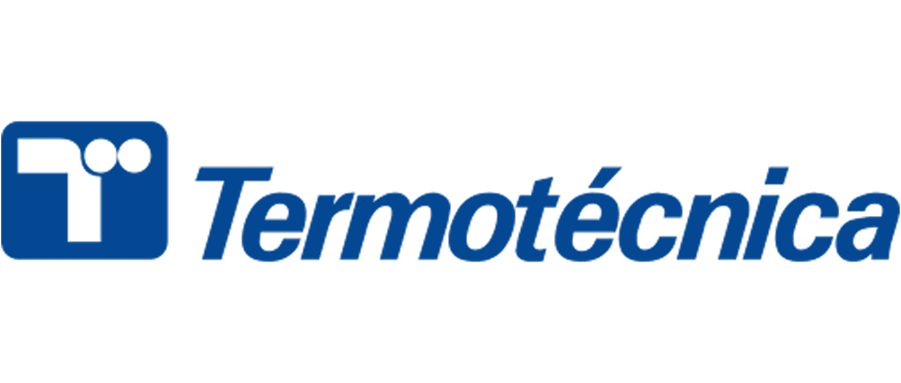
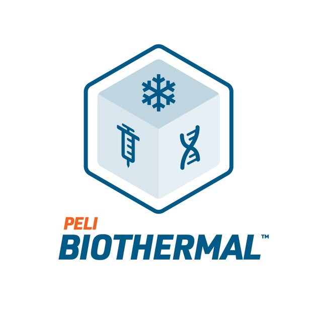
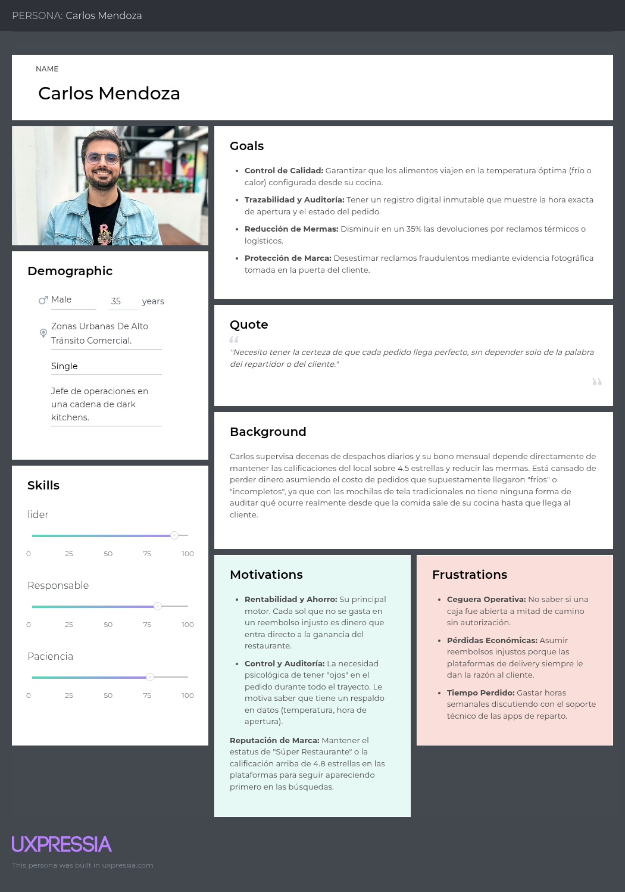
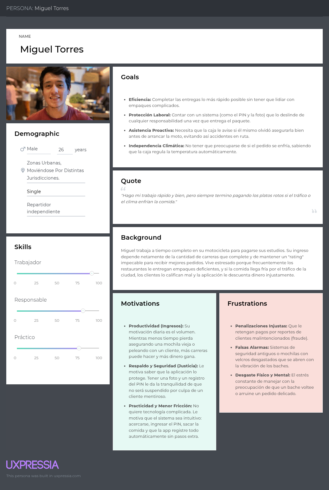
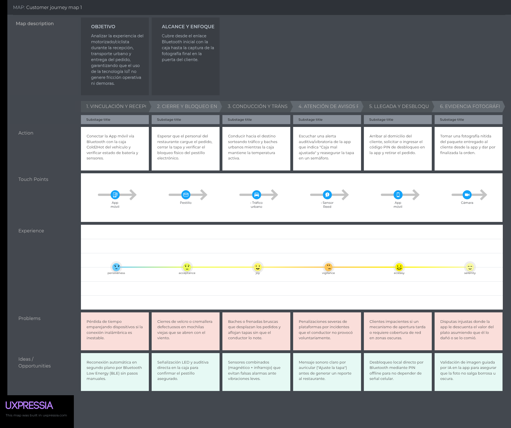
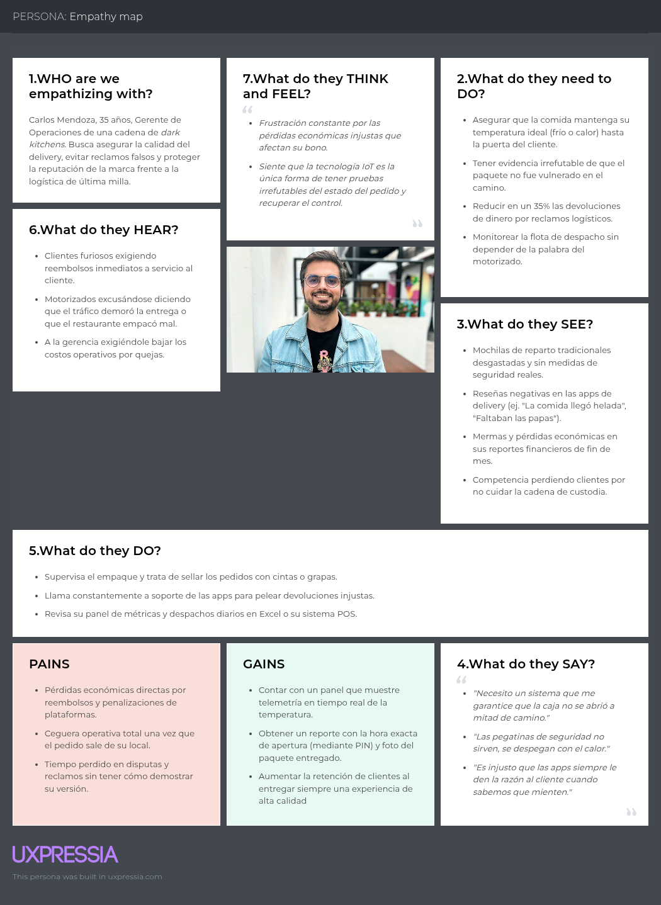
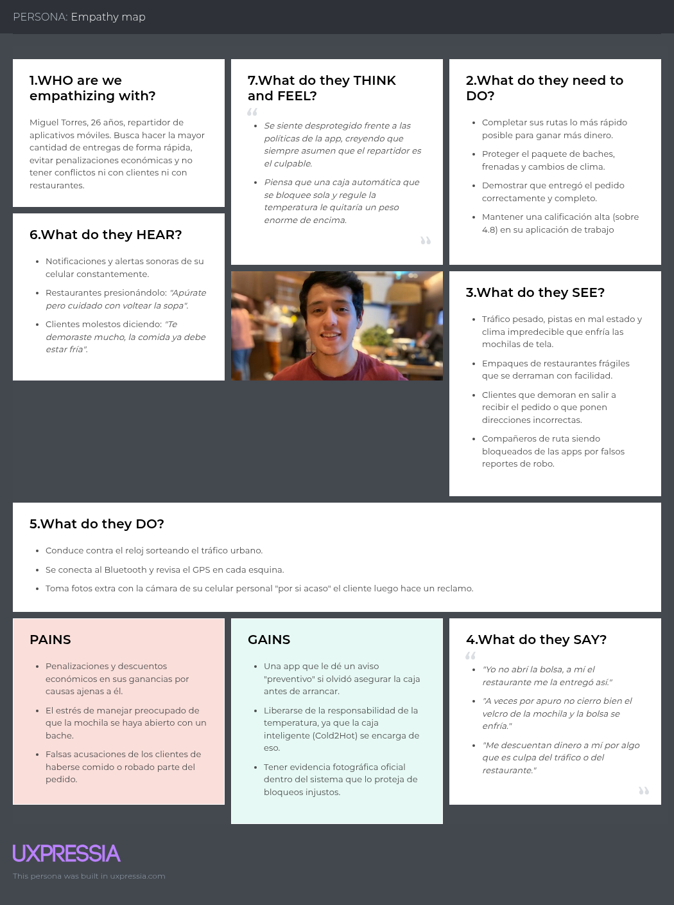
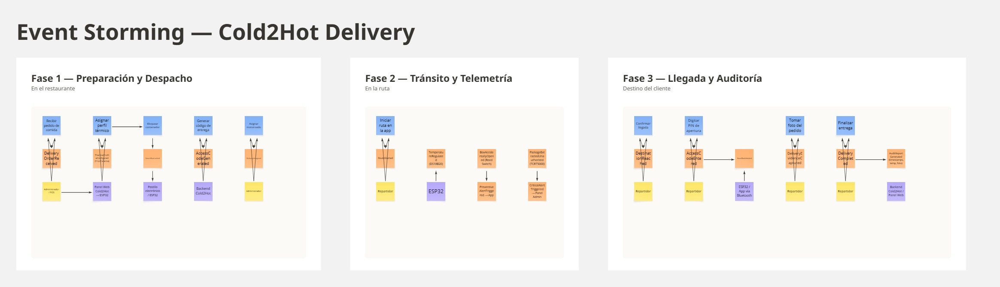

  

<h3 align="center">
Universidad Peruana de Ciencias Aplicadas
</h3>

<h3 align="center">
Ingeniería de Software
  
Ciclo: 2026-20
  
1ASI0572 - Desarrollo de Soluciones IOT
  
NRC: 8735
  
Docente: Leon Bacca, Marco Antonio
  
<strong>Informe de Trabajo Final</strong>  
  
Startup: IoTeam
  
Producto: Cold2Hot  
  
  
<strong>Integrantes</strong>  
  
Alvarado De La Cruz , Juan Carlos (U202216150) 
  
Carhuancote Dominguez, Gonzalo Alonso (U202210720) 
  
Diestra Zambrano, Adriana Maria (U202218110)
  
Duran Diaz, Antonio Rodrigo (U202215721)
  
Nakasone Gomes, Marco Antonio (U202210790)
  
Shimabukuro Uku, Carlos Joel (U201912407)
  
Teves Samaniego, Joan Fernando (U202117303)
  
 

**Septiembre - 2026**

</h3>

# Contenido

## Tabla de contenidos

# Student Outcome

# Capítulo I: Introducción

## 1.1. Startup Profile

### 1.1.1. Descripción de la Startup

### 1.1.2. Perfiles de integrantes del equipo

## 1.2. Solution Profile

### 1.2.1 Antecedentes y problemática

### 1.2.2 Lean UX Process.

#### 1.2.2.1. Lean UX Problem Statements.

#### 1.2.2.2. Lean UX Assumptions.

#### 1.2.2.3. Lean UX Hypothesis Statements.

#### 1.2.2.4. Lean UX Canvas.

## 1.3. Segmentos objetivo.

# Capítulo II: Requirements Elicitation & Analysis

## 2.1. Competidores.
En el mercado actual de logística urbana y reparto de última milla, la entrega de alimentos y productos sensibles a la temperatura enfrenta constantes desafíos vinculados con la pérdida de calidad térmica y la vulnerabilidad física de los paquetes en ruta. Para comprender a cabalidad el entorno competitivo de **Cold2Hot** (desarrollado por la startup **IoTeam**), se identificaron tres competidores clave con ofertas directas e indirectas en el rubro de logística y transporte de temperatura controlada:

1. **Thermotecnica (Mochilas y Cajas Térmicas Pasivas):** Principal referente en la provisión de mochilas térmicas tradicionales para repartidores independientes y operadores de última milla (Rappi, PedidosYa). Su enfoque es enteramente analógico y pasivo, recurriendo a aislamiento con poliestireno expandido o mantas térmicas convencionales.
2. **Controlant:** Empresa global especializada en soluciones de cadena de frío y trazabilidad en tiempo real basadas en IoT. Aunque su público objetivo primario es el sector farmacéutico y la macro-logística de distribución médica o perecibles a gran escala, representa el estándar de monitoreo telemático y telemetría de temperatura en la nube.
3. **Peli BioThermal (Smart Packaging & Credo ProEnvision):** Líder en soluciones térmicas avanzadas y embalajes reutilizables para el transporte especializado de productos de alto valor con control de temperatura, combinando materiales de cambio de fase (PCM) e indicadores de seguridad, enfocado en logística corporativa y distribución B2B.

---

### 2.1.1. Análisis competitivo.

A continuación, se desarrolla el **Competitive Analysis Landscape** para contrastar la propuesta de valor integral de **Cold2Hot** frente a las alternativas del mercado:

### Competitive Analysis Landscape

| ¿Por qué llevar a cabo este análisis? | El objetivo de este análisis competitivo es identificar las brechas existentes en el mercado de entrega urbana de última milla de alimentos, evaluando las carencias telemáticas y de seguridad física en las soluciones convencionales frente a las herramientas corporativas de cadena de frío, con el fin de consolidar la diferenciación y viabilidad operativa de **Cold2Hot**. |
| :--- | :--- |

| Dimensiones | Nuestra Startup: **Cold2Hot (IoTeam)** | Competidor 1: **Thermotecnica** | Competidor 2: **Controlant** | Competidor 3: **Peli BioThermal** |
| :--- | :--- | :--- | :--- | :--- |
| **Logotipo / Identidad** |  |  |  |  |
| **Perfil (Overview)** | Solución integral IoT para delivery urbano que combina una caja inteligente con regulación térmica activa (ESP32, DS18B20), seguridad física con desbloqueo por código OTP (Reed Switch + TCRT5000), telemetría continua y captura de evidencias fotográficas. | Fabricante y comercializador de mochilas, bolsas y cajas térmicas pasivas con aislamiento estándar, diseñadas para mensajería y entrega tradicional de comida rápida en bicicletas y motocicletas. | Empresa de monitoreo digital de cadena de frío que ofrece registradores de datos IoT celulares/cloud en tiempo real y software de análisis de visibilidad logística a gran escala. | Fabricante de soluciones avanzadas de embalaje pasivo y semi-activo con aislamiento de alta densidad y monitoreo de temperatura para transporte de insumos biológicos y perecibles de alta exigencia. |
| **Ventaja competitiva** | Trazabilidad integral en última milla: regulación térmica activa, bloqueo físico desarmable únicamente mediante OTP en destino, prevención de manipulaciones mediante seguridad de dos niveles y generación automática de reportes de auditoría con evidencia fotográfica. | Muy bajo costo de adquisición inicial, ligereza de transporte, amplia disponibilidad comercial y nulo requerimiento de mantenimiento tecnológico o energético. | Plataforma en la nube de alta confiabilidad con cobertura telemática global continua (redes celulares IoT/GPS) y cumplimiento de estándares internacionales de auditoría (FDA, GMP). | Embalajes térmicos reutilizables con materiales de cambio de fase (PCM) de altísima eficiencia pasiva (hasta 120 horas de estabilidad térmica) sin consumo de batería. |
| **Perfil de Marketing: Mercado objetivo** | Restaurantes medianos y pequeños, cadenas de comida rápida con flota propia o tercerizada, y repartidores urbanos que requieren certificar la entrega higiénica y la temperatura del alimento. | Repartidores independientes de aplicaciones móviles de delivery (Rappi, PedidosYa, Uber Eats) y pequeños negocios gastronómicos locales. | Corporaciones farmacéuticas multinacionales, distribuidores de vacunas y grandes empresas de logística de perecibles a gran escala (B2B industrial). | Laboratorios clínicos, sector biotecnológico, farmacias hospitalarias y servicios de catering gourmet/médico corporativo de alto presupuesto. |
| **Perfil de Marketing: Estrategias de marketing** | Venta directa B2B a cadenas de restaurantes, planes de suscripción SaaS mensual para el uso del software de gestión y auditoría, alianzas con asociaciones gastronómicas locales y demos funcionales. | Venta por catálogo físico, presencia en distribuidores de accesorios para motos/bicicletas, marketplaces de comercio electrónico y compras corporativas directas por volumen. | Venta consultiva corporativa B2B de ciclo largo, presencia en ferias internacionales de supply chain/farma, marketing de contenidos sobre regulaciones y modelos PaaS (Product as a Service). | Venta técnica B2B mediante representantes comerciales autorizados, certificaciones internacionales de calidad y contratos corporativos de leasing/retorno de contenedores. |
| **Perfil de Producto: Productos & Servicios** | - Caja inteligente *SmartBox* con microcontrolador ESP32. - Panel web centralizado de despacho y auditoría para restaurantes. - Aplicación móvil para repartidores (control BLE, desbloqueo OTP, captura de fotos). - Reportes inmutables de cadena de custodia térmica. | - Mochilas térmicas de lona oxford con aislante de espuma. - Bolsas de mano térmicas. - Cajas rígidas de fibra de vidrio sin componentes electrónicos ni sensores. | - Dispositivos registradores IoT (Saga Card / Pods) con conectividad celular/IoT. - Plataforma en la nube *Controlant Cloud* para trazabilidad en tiempo real. - Servicios de alertas automáticas 24/7 y analítica de datos. | - Cajas y contenedores rígidos con tecnología de cambio de fase (Credo Cube). - Sensores pasivos/registradores de temperatura USB/RF. - Software de seguimiento de inventario térmico y calibración. |
| **Precios & Costos** | Hardware accesible de costo moderado (orientado a ensamble ágil y componentes estandarizados) complementado con una suscripción de software SaaS mensual accesible para pymes gastronómicas. | Costo único muy bajo por mochila/caja (aprox. $25 - $60 USD), sin costos recurrentes ni tarifas de software. | Alto costo operativo; modelo de suscripción por viaje o por dispositivo anual de alto valor (centenas o miles de dólares por contrato corporativo). | Costo unitario elevado por contenedor térmico ($150 - $500+ USD) sumado a costos de recertificación y reposición de geles/placas PCM. |
| **Canales de distribución** | Plataforma Web oficial (Landing Page institucional), venta corporativa directa y distribución de aplicaciones móviles vía Google Play Store y Apple App Store. | Puntos de venta retail especializados, tiendas de motociclismo, plataformas de e-commerce (MercadoLibre, Amazon) y convenios directos con apps de delivery. | Canal corporativo directo B2B a través de oficinas regionales y red global de socios tecnológicos y logísticos. | Red de distribuidores técnicos certificados, representantes comerciales B2B y despacho logístico programado. |
| **Análisis SWOT: Fortalezas** | - Solución diseñada a la medida del dolor de la última milla gastronómica. - Seguridad física inviolable por OTP que erradica la apertura no autorizada. - Seguridad de dos niveles (Reed Switch + TCRT5000) para descartar falsas alarmas. - Plataforma de software integral (Web + Móvil + Edge IoT). | - Marca reconocida y posicionada en el sector de repartidores independientes. - Precios altamente competitivos y sin barreras tecnológicas de entrada. - Alta durabilidad mecánica y facilidad de reemplazo inmediato. | - Plataforma de software madura, escalable y con alta reputación internacional. - Conectividad global y acuerdos con operadores de telecomunicaciones. - Infraestructura en la nube con soporte 24/7 y analítica predictiva. | - Aislamiento térmico pasivo de ingeniería avanzada y de larga duración. - Estructuras sólidas y de máxima durabilidad reutilizable. - Amplio cumplimiento normativo para transporte sensible. |
| **Análisis SWOT: Debilidades** | - Startup en etapa de introducción y validación inicial. - Dependencia de la recarga de batería del dispositivo IoT en la jornada diaria. - Necesidad de capacitar al repartidor en el uso de la aplicación móvil y el flujo de entrega. | - Nula tecnología: carece de telemetría, sensores, alertas y controles de acceso. - Imposibilidad de acreditar la cadena de custodia o demostrar adulteraciones. - La temperatura decae progresivamente sin aviso ni control activo. | - Modelo de precios inviable para el sector de restaurantes y entrega de comida rápida. - Dispositivos no integrados a mecanismos físicos de apertura o cerradura de cajas. - No contempla la captura de evidencias fotográficas de entrega ni apps operativas para couriers de comida. | - No cuenta con conectividad nativa en tiempo real para última milla urbana. - Operación pesada que requiere acondicionamiento previo de placas PCM. - Costo unitario prohibitivo para la gran mayoría de restaurantes y repartidores independientes. |
| **Análisis SWOT: Oportunidades** | - Crecimiento sostenido del delivery de comida gourmet y productos frescos que exigen control térmico. - Alta tasa de reclamos por comida fría o paquetes vulnerados en plataformas de delivery. - Demanda de soluciones que reduzcan las pérdidas por devoluciones injustas en restaurantes. | - Posibilidad de añadir cierres de combinación mecánicos económicos. - Creciente número de trabajadores de delivery en las principales ciudades de la región. | - Expansión de sus servicios hacia la logística urbana de última milla para farmacias o alimentos ultra frescos. - Alianzas con flotas de transporte terrestre. | - Adaptación de modelos más compactos y económicos orientados a catering corporativo o delivery prémium. |
| **Análisis SWOT: Amenazas** | - Resistencia de algunos repartidores a adoptar controles más estrictos de apertura y fotografía. - Competidores tradicionales que incorporen precintos de seguridad mecánicos económicos. - Subida en los costos de adquisición de microcontroladores y sensores electrónicos. | - Penetración de cajas inteligentes que vuelvan obsoletas las mochilas térmicas convencionales. - Mayores regulaciones municipales y sanitarias sobre el transporte de alimentos preparados. | - Nuevos competidores de telemetría IoT low-cost que ingresen al mercado con tarifas agresivas. | - Entrada de fabricantes asiáticos que comercialicen contenedores con materiales aislantes avanzados a bajo costo. |

---

### 2.1.2. Estrategias y tácticas frente a competidores.

A partir del análisis del panorama competitivo y la matriz FODA, **IoTeam** define un conjunto de estrategias y tácticas comerciales, de producto y operativas para consolidar la entrada y el posicionamiento de **Cold2Hot**:

#### 1. Estrategia de Enfoque en el Nicho de Última Milla Gastronómica (Frente a Thermotecnica y competidores pasivos)
* **Objetivo:** Demostrar que el costo de una caja pasiva convencional es en realidad más alto a largo plazo debido a los reembolsos por comida fría y las disputas por manipulación del paquete.
* **Tácticas:**
  * **Cálculo de Retorno de Inversión (ROI):** Proveer a los administradores de restaurantes una calculadora de pérdidas operativas en el Landing Page de Cold2Hot, evidenciando cómo una reducción del 35% en reclamos amortiza rápidamente el costo de la tecnología.
  * **Diferenciación por Seguridad Activa:** Posicionar el mecanismo de bloqueo por código OTP como una garantía de higiene e inviolabilidad del pedido ante el comensal final, convirtiendo la caja en un argumento de marketing para el propio restaurante.
  * **Adopción Simple y Guiada:** Diseñar la aplicación móvil del repartidor con una curva de aprendizaje mínima (diseño UX intuitivo y compatible con Bluetooth de bajo consumo), facilitando que los repartidores la perciban como un escudo contra penalizaciones injustas y no como una carga de trabajo.

#### 2. Estrategia de Liderazgo en Costos Tecnológicos y Modelo SaaS Accesible (Frente a Controlant)
* **Objetivo:** Ofrecer las ventajas de la telemetría en tiempo real y la trazabilidad en la nube sin los precios corporativos prohibitivos del sector farmacéutico.
* **Tácticas:**
  * **Arquitectura IoT Eficiente:** Basar el hardware en componentes de código abierto y alta confiabilidad (microcontrolador ESP32 NodeMCU, sensor DS18B20, sensores TCRT5000 y Reed Switch), optimizando los costos de manufactura del prototipo.
  * **Esquema de Suscripción Modular (SaaS):** Estructurar planes mensuales adaptados al tamaño de la flota del restaurante (p. ej., cobro por caja activa monitoreada al mes), evitando pagos iniciales millonarios por licenciamiento.
  * **Integración de Flujos de Cierre de Entrega:** Incluir dentro de la misma solución el registro fotográfico obligatorio (Proof of Delivery), funcionalidad que los proveedores globales de trazabilidad industrial no ofrecen al estar desligados de la interacción directa con el consumidor final.

#### 3. Estrategia de Conectividad y Automatización Activa (Frente a Peli BioThermal)
* **Objetivo:** Superar la rigidez de los sistemas pasivos avanzados que requieren acondicionamientos químicos previos y carecen de comunicación telemática en ruta.
* **Tácticas:**
  * **Ajuste Dinámico de Perfiles Térmicos:** Permitir al administrador configurar perfiles de frío o calor desde el panel web de despacho en segundos, activando automáticamente la regulación del contenedor inteligente sin necesidad de cambiar placas físicas de enfriamiento.
  * **Seguridad de Dos Niveles contra Manipulaciones:** Implementar la lógica de discriminación entre una apertura accidental (alerta preventiva al operador para que ajuste la tapa) y una extracción real del paquete (alerta crítica inmediata al restaurante), protegiendo la carga en todo momento mediante telemetría continua.
  * **Generación Inmutable de Reportes de Auditoría:** Consolidar en un único reporte digital la gráfica térmica de todo el viaje, los tiempos exactos de desbloqueo y la fotografía tomada en destino, permitiendo deslindar responsabilidades de inmediato ante cualquier queja del cliente.

## 2.2. Entrevistas.

### 2.2.1. Diseño de entrevistas.

### 2.2.2. Registro de entrevistas.

### 2.2.3. Análisis de entrevistas.

## 2.3. Needfinding.

### 2.3.1. User Personas.

Con el propósito de garantizar una comprensión profunda y precisa de los segmentos identificados como clave para nuestro proyecto, hemos llevado a cabo un proceso estructurado y cuidadoso de creación de User Personas. Este procedimiento nos permitió definir un perfil específico y representativo para cada segmento objetivo, lo que nos brinda una perspectiva más clara y detallada de nuestros usuarios. De esta manera, podemos diseñar y ofrecer soluciones que respondan de manera efectiva a sus necesidades, expectativas y contextos particulares.

UserPersona 1

UserPersona 2

### 2.3.2. User Task Matrix

El User Task Matrix concentra las tareas que los User Persona, que representan a los segmentos principales de Cold2Hot, realizan para cumplir sus objetivos dentro de la cadena logística de entregas de última milla. En este caso, se consideran dos segmentos de usuarios:

* **Administradores de operaciones de delivery**, encargados de la gestión del local, control de despachos y auditoría de incidencias.
* **Operadores de entrega (repartidores)**, responsables del transporte urbano, cumplimiento de rutas y entrega final al cliente.

Es importante destacar que las tareas (tasks) reflejan actividades que los usuarios realizan independientemente de la existencia del software, es decir, forman parte natural de su día a día y no representan características o funciones del sistema.

**Indicadores de Importancia y Frecuencia**

*Indicadores de Importancia:*
* **ALTA →** La tarea es crítica para el cumplimiento de los objetivos del usuario.
* **MEDIA →** La tarea es importante pero no afecta directamente el resultado global.
* **BAJA →** La tarea aporta valor complementario o se realiza ocasionalmente.

*Indicadores de Frecuencia:*
* **ALTA →** Se realiza de manera constante o diaria.
* **MEDIA →** Se realiza semanal o mensualmente.
* **BAJA →** Se realiza esporádicamente o en circunstancias específicas.

**Tabla de Matriz de Tareas de Usuario**

| Tareas | Administradores de Delivery | Operadores de Entrega | Frecuencia | Importancia | Frecuencia | Importancia |
| :--- | :--- | :--- | :--- | :--- | :--- | :--- |
| Empacar y preparar el pedido | Alta | Baja | Alta | Alta | Baja | Baja |
| Asegurar / bloquear el contenedor de transporte | Alta | Alta | Alta | Alta | Alta | Alta |
| Transportar pedidos en entorno urbano | Nunca | Alta | - | - | Alta | Alta |
| Revisar estado físico del paquete en ruta | Nunca | Alta | - | - | Alta | Alta |
| Verificar la temperatura del alimento | Media | Baja | Media | Alta | Baja | Media |
| Resolver incidentes de aperturas accidentales | Media | Alta | Media | Alta | Alta | Alta |
| Desbloquear contenedor en el destino | Nunca | Alta | - | - | Alta | Alta |
| Registrar foto de evidencia de la entrega | Baja | Alta | Baja | Media | Alta | Alta |
| Monitorear flota de despachos en tiempo real | Alta | Nunca | Alta | Alta | - | - |
| Auditar tiempos de entrega e incidencias | Media | Baja | Media | Alta | Baja | Baja |
| Conciliar pagos y penalizaciones de plataformas | Media | Media | Media | Alta | Media | Alta |

**Análisis de Tareas**

*Tareas con mayor frecuencia e importancia*
Tanto administradores como repartidores presentan alta frecuencia e importancia en tareas como: **Asegurar/bloquear el contenedor de transporte** y la **resolución de incidentes de aperturas accidentales**. Estas tareas reflejan la necesidad crítica de mantener la cadena de custodia y proteger la carga ante las condiciones del tránsito urbano.

*Principales diferencias entre segmentos de usuarios*
* **Monitoreo y Auditoría:** Tiene alta frecuencia e importancia para los administradores, ya que su rentabilidad depende de verificar el estado de los despachos; para los repartidores, el monitoreo propio es nulo.
* **Transporte y evidencia:** Es una tarea de importancia alta y exclusiva para los repartidores (manejar y tomar la foto de entrega), mientras que el administrador solo consume esa información a posteriori.
* **Empaque y preparación:** Es esencial y frecuente para los administradores de restaurantes, mientras que los repartidores reciben el producto ya finalizado.

*Principales similitudes*
Ambos segmentos coinciden en la alta importancia de **evitar penalizaciones**. El administrador busca evitar devoluciones por comida fría, y el repartidor busca evitar descuentos salariales por quejas injustas. Esto demuestra la necesidad compartida de un sistema (como Cold2Hot) que garantice la trazabilidad térmica y ofrezca evidencia auditable del cierre del pedido.

*Enfoque de los segmentos*
Los **administradores** se enfocan en el control centralizado, la reducción de mermas y la visibilidad remota de sus envíos. Los **repartidores**, en cambio, priorizan la agilidad en la conducción, la reducción de fricciones al abrir/cerrar la mochila y contar con pruebas digitales para deslindar responsabilidades frente a los clientes. Aunque abordan la logística desde distintas veredas, ambos buscan el mismo objetivo final: una entrega exitosa, rápida y sin disputas posteriores.

### 2.3.3. User Journey Mapping.

User Journey Mapping - Segmento Administrador de operaciones de delivery

User Journey Mapping - Segmento Operador de entrega

### 2.3.4. Empathy Mapping.

Segmento 1: Administradores de operaciones de delivery preocupados por la rentabilidad y la trazabilidad de los pedidos

Segmento 2: Operadores de entrega (motorizados) enfocados en la agilidad y en proteger sus ingresos de penalizaciones injustas

## 2.4. Big Picture EventStorming.

## 2.5. Ubiquitous Language.

| Term (English) | Término (Español) | Definition (Definición en español) |
| :--- | :--- | :--- |
| Smart Box | Caja Inteligente | Contenedor físico para delivery equipado con hardware IoT (ESP32, sensores y regulador) que mantiene la cadena de custodia. |
| Thermal Profile | Perfil Térmico | Configuración específica (modo Frío o Calor) asignada remotamente al ESP32 para regular la temperatura del interior. |
| Access Code / PIN | Código de Acceso | Clave numérica única generada por el sistema que el repartidor utiliza en su App para desbloquear la caja en el destino. |
| Dispatch Hub | Panel de Despacho | Interfaz web utilizada por el administrador para asignar pedidos, configurar la temperatura y monitorear la flota en tiempo real. |
| Telemetry | Telemetría | Datos de temperatura y estado de la batería enviados continuamente por el ESP32 hacia el servidor durante el trayecto. |
| Magnetic Sensor | Sensor Magnético | Componente de hardware (Reed Switch) que detecta el estado físico de la tapa de la caja (abierta/cerrada). |
| Infrared Sensor | Sensor Infrarrojo | Componente de hardware (TCRT5000) utilizado para detectar la presencia o ausencia del paquete dentro del contenedor. |
| Two-Level Security | Seguridad de Dos Niveles | Lógica del sistema que cruza los datos magnéticos e infrarrojos para distinguir entre una caja mal cerrada y una extracción real. |
| Preventive Alert | Alerta Preventiva | Notificación enviada al repartidor para que ajuste la tapa si la caja se desajusta accidentalmente sin extraerse el pedido. |
| Critical Alert | Alerta Crítica | Notificación enviada al administrador indicando que el pedido fue extraído de la caja en pleno tránsito, sugiriendo manipulación. |
| Delivery Evidence | Evidencia de Entrega | Fotografía obligatoria tomada por el repartidor desde la App tras abrir la caja, que certifica el estado del paquete al entregarlo. |
| Audit Report | Reporte de Auditoría | Registro inmutable de una entrega finalizada que incluye marcas de tiempo, gráfica térmica y evidencia fotográfica para resolver disputas. |
| Route Monitoring | Monitoreo en Ruta | Seguimiento GPS combinado con la telemetría térmica visible desde el panel de administración. |
| Delivery Courier | Operador de Entrega | Persona (motorizado o ciclista) encargada del transporte físico del contenedor desde el restaurante hasta el cliente. |

# Capítulo III: Requirements Specification

## 3.1. User Stories.

## 3.2. Impact Mapping.

## 3.3. Product Backlog.

# Capítulo IV: Solution Software Design

## 4.1. Strategic-Level Domain-Driven Design.

### 4.1.1. Design-Level EventStorming.

#### 4.1.1.1 Candidate Context Discovery.

#### 4.1.1.2 Domain Message Flows Modeling.

#### 4.1.1.3 Bounded Context Canvases.

### 4.1.2. Context Mapping.

### 4.1.3. Software Architecture.

#### 4.1.3.1. Software Architecture System Landscape Diagram.

#### 4.1.3.2. Software Architecture Context Level Diagrams.

#### 4.1.3.2. Software Architecture Container Level Diagrams.

#### 4.1.3.3. Software Architecture Deployment Diagrams.

## 4.2. Tactical-Level Domain-Driven Design

### 4.2.X. Bounded Context: <Bounded Context Name>

#### 4.2.X.1. Domain Layer.

#### 4.2.X.2. Interface Layer.

#### 4.2.X.3. Application Layer.

#### 4.2.X.4. Infrastructure Layer.

#### 4.2.X.5. Bounded Context Software Architecture Component Level Diagrams.

#### 4.2.X.6. Bounded Context Software Architecture Code Level Diagrams.

##### 4.2.X.6.1. Bounded Context Domain Layer Class Diagrams.

##### 4.2.X.6.2. Bounded Context Database Design Diagram.

# Capítulo V: Solution UI/UX Design

## 5.1. Style Guidelines.

### 5.1.1. General Style Guidelines.

### 5.1.2. Web, Mobile and IoT Style Guidelines.

## 5.2. Information Architecture.

### 5.2.1. Organization Systems.

### 5.2.2. Labeling Systems.

### 5.2.3. SEO Tags and Meta Tags

### 5.2.4. Searching Systems.

### 5.2.5. Navigation Systems.

## 5.3. Landing Page UI Design.

### 5.3.1. Landing Page Wireframe.

### 5.3.2. Landing Page Mock-up.

## 5.4. Applications UX/UI Design.

### 5.4.1. Applications Wireframes.

### 5.4.2. Applications Wireflow Diagrams.

### 5.4.2. Applications Mock-ups.

### 5.4.3. Applications User Flow Diagrams.

## 5.5. Applications Prototyping.

## 5.6. IoT Device Design.

# Capítulo VI: Product Implementation, Validation & Deployment

## 6.1. Software Configuration Management.

### 6.1.1. Software Development Environment Configuration.

### 6.1.2. Source Code Management.

### 6.1.3. Source Code Style Guide & Conventions.

### 6.1.4. Software Deployment Configuration.

## 6.2. Landing Page, Services & Applications Implementation.

### 6.2.X. Sprint n

#### 6.2.X.1. Sprint Planning n.

#### 6.2.X.2. Aspect Leaders and Collaborators.

#### 6.2.X.3. Sprint Backlog n.

#### 6.2.X.4. Development Evidence for Sprint Review.

#### 6.2.X.5. Testing Suite Evidence for Sprint Review.

#### 6.2.X.6. Execution Evidence for Sprint Review.

#### 6.2.X.7. Services Documentation Evidence for Sprint Review.

#### 6.2.X.8. Software Deployment Evidence for Sprint Review.

#### 6.2.X.9. Team Collaboration Insights during Sprint.

## 6.3. Validation Interviews.

### 6.3.1. Diseño de Entrevistas.

### 6.3.2. Registro de Entrevistas.

### 6.3.3. Evaluaciones según heurísticas.

## 6.4. Video About-the-Product.

# Conclusiones

## Conclusiones y recomendaciones.

# Video About-the-Team.

# Bibliografía

# Anexos
