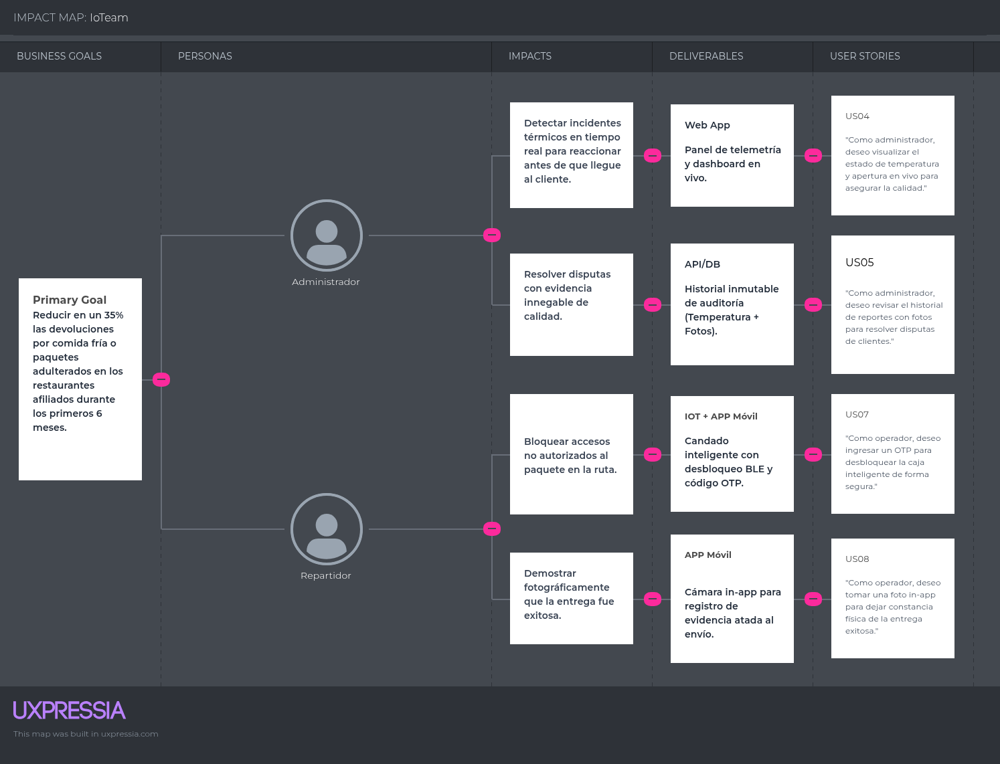
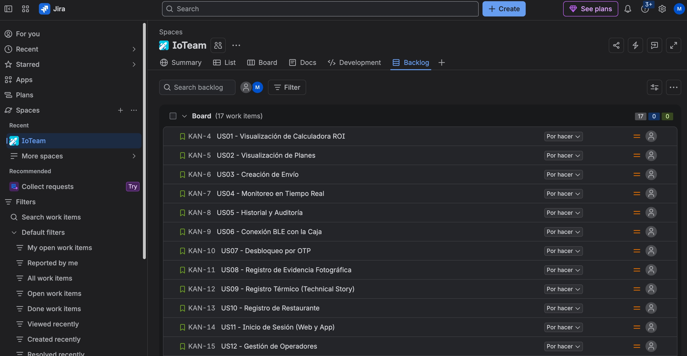

# Contenido

## Tabla de contenidos

# Student Outcome

# Capítulo I: Introducción

## 1.1. Startup Profile

### 1.1.1. Descripción de la Startup

### 1.1.2. Perfiles de integrantes del equipo

## 1.2. Solution Profile

### 1.2.1 Antecedentes y problemática

### 1.2.2 Lean UX Process.

#### 1.2.2.1. Lean UX Problem Statements.

#### 1.2.2.2. Lean UX Assumptions.

#### 1.2.2.3. Lean UX Hypothesis Statements.

#### 1.2.2.4. Lean UX Canvas.

## 1.3. Segmentos objetivo.

# Capítulo II: Requirements Elicitation & Analysis

## 2.1. Competidores.

### 2.1.1. Análisis competitivo.

### 2.1.2. Estrategias y tácticas frente a competidores.

## 2.2. Entrevistas.

### 2.2.1. Diseño de entrevistas.

### 2.2.2. Registro de entrevistas.

### 2.2.3. Análisis de entrevistas.

## 2.3. Needfinding.

### 2.3.1. User Personas.

### 2.3.2. User Task Matrix.

### 2.3.3. User Journey Mapping.

### 2.3.4. Empathy Mapping.

## 2.4. Big Picture EventStorming.

## 2.5. Ubiquitous Language.

# Capítulo III: Requirements Specification

Esta sección permite especificar los requisitos de los productos digitales que conforman nuestra solución Cold2Hot a partir del análisis de la información obtenida en las investigaciones previas. En este capítulo se detallan los User Stories con sus criterios de aceptación, el Impact Mapping para alinear nuestros esfuerzos técnicos con los objetivos de negocio y el Product Backlog donde se priorizan y estiman dichos requerimientos.

## 3.1. User Stories.

A continuación, se presentan los requisitos definidos para la solución Cold2Hot, agrupados en Epics. Estos requisitos abarcan las interacciones de los distintos segmentos de usuarios (Administradores de operaciones, Operadores de entrega y Visitantes) con los diferentes productos de software (Landing Page, Web Application, Mobile App y el dispositivo IoT).

| Epic / Story ID | Título                             | Descripción                                                                                                                                                                    | Criterios de Aceptación                                                                                                                                                                                                                                             | Relacionado con (Epic ID) |
| --------------- | ----------------------------------- | ------------------------------------------------------------------------------------------------------------------------------------------------------------------------------- | -------------------------------------------------------------------------------------------------------------------------------------------------------------------------------------------------------------------------------------------------------------------- | ------------------------- |
| EP01            | Gestión y Trazabilidad Térmica    | Como administrador de operaciones, quiero gestionar y monitorear los envíos desde un panel centralizado para asegurar la cadena de custodia térmica.                          | - El panel web permite crear, ver y auditar envíos.- Muestra gráficos de temperatura y alertas en tiempo real.                                                                                                                                                     | -                         |
| EP02            | Seguridad y Entrega                 | Como operador de entrega, quiero interactuar con la caja inteligente mediante una app móvil para realizar entregas seguras y evidenciar mi trabajo.                            | - La app se conecta por BLE a la caja.- Permite desbloqueo por OTP y captura de fotos como evidencia.                                                                                                                                                                | -                         |
| EP03            | Landing Page                        | Como visitante, quiero informarme sobre el producto y sus beneficios para decidir adquirirlo.                                                                                   | - La web es responsiva y explica el ROI, características técnicas y planes.                                                                                                                                                                                        | -                         |
| US01            | Visualización de Calculadora ROI   | Como visitante, quiero visualizar la calculadora de ROI en el Landing Page para entender el ahorro operativo que genera la solución.                                           | **Given** que me encuentro en la sección de beneficios del Landing Page,**When** ingreso la cantidad de pedidos y reclamos actuales,**Then** el sistema calcula y muestra el dinero que ahorraré anualmente.                                     | EP03                      |
| US02            | Visualización de Planes            | Como visitante, quiero ver los planes de suscripción de software SaaS para elegir el más adecuado para mi restaurante.                                                        | **Given** que accedo a la sección de precios,**When** hago scroll hacia la tabla de planes,**Then** veo los costos mensuales, características incluidas y un botón para contactar ventas.                                                       | EP03                      |
| US03            | Creación de Envío                 | Como administrador de operaciones, quiero crear un nuevo envío en la plataforma especificando la temperatura requerida (caliente/fría) para iniciar el monitoreo.             | **Given** que me encuentro en el panel de despachos,**When** ingreso los datos del pedido y selecciono el perfil térmico, y presiono "Crear",**Then** se genera el envío en estado "Pendiente" y se emite un código OTP de apertura.            | EP01                      |
| US04            | Monitoreo en Tiempo Real            | Como administrador de operaciones, quiero visualizar el estado en tiempo real (temperatura y estado de apertura) de los envíos en tránsito para asegurar la calidad.          | **Given** que tengo envíos en curso,**When** accedo al dashboard de monitoreo en la web,**Then** visualizo una lista de cajas activas mostrando su temperatura actual, nivel de batería y estado del cerrojo.                                    | EP01                      |
| US05            | Historial y Auditoría              | Como administrador de operaciones, quiero revisar el historial de reportes de entrega (con evidencias fotográficas) para resolver disputas de clientes por alimentos dañados. | **Given** que un cliente reporta un problema,**When** busco el ID del pedido en el historial,**Then** puedo visualizar la gráfica de temperatura del trayecto, los horarios de apertura de la caja y las fotos tomadas en la entrega.             | EP01                      |
| US06            | Conexión BLE con la Caja           | Como operador de entrega, quiero conectar mi app móvil por Bluetooth a la caja inteligente para poder gestionar el candado de forma inalámbrica.                              | **Given** que estoy cerca de la caja asignada,**When** abro la app móvil y selecciono "Conectar a SmartBox",**Then** la app establece conexión por BLE y el LED de la caja confirma la vinculación.                                             | EP02                      |
| US07            | Desbloqueo por OTP                  | Como operador de entrega, quiero ingresar el código OTP en la app para desbloquear la caja y entregar el pedido al cliente.                                                    | **Given** que la app está conectada a la caja,**When** ingreso el OTP provisto por el administrador y presiono "Desbloquear",**Then** la caja inteligente libera su cerrojo y registra el evento de apertura exitosa.                             | EP02                      |
| US08            | Registro de Evidencia Fotográfica  | Como operador de entrega, quiero tomar una foto del pedido entregado usando la app para dejar constancia física y evitar penalizaciones injustas.                              | **Given** que he entregado el producto,**When** uso la cámara dentro de la app para fotografiar el paquete entregado y presiono "Enviar",**Then** la imagen se sube a la plataforma asociándose al ID del envío y cerrando el ciclo logístico. | EP02                      |
| US09            | Registro Térmico (Technical Story) | Como Developer, quiero que el dispositivo IoT envíe registros de temperatura cada minuto a la API para mantener el rastro inmutable.                                           | **Given** que la caja inteligente está encendida y en ruta,**When** transcurre un minuto,**Then** el ESP32 envía un payload JSON con la temperatura actual, timestamp y estado de sensores hacia el endpoint correspondiente.                    | EP01                      |

## 3.2. Impact Mapping.

A continuación, se presenta el Impact Mapping de Cold2Hot, una representación visual que alinea nuestros objetivos de negocio (Business Goals) con los usuarios clave (Personas), los cambios de comportamiento que esperamos (Impacts) y las características del producto que construiremos (Deliverables). Esto nos ayuda a asegurar que cada funcionalidad aporta valor estratégico.

*(Nota: En la herramienta MURAL / Miro se ha construido el diagrama completo en donde se observa:*

* **Business Goal:** Reducir en un 35% las devoluciones por comida fría o paquetes adulterados en los restaurantes afiliados durante los primeros 6 meses.
* **Personas:** Administrador de operaciones, Operador de entrega.
* **Impacts:** "Detectar incidentes en tiempo real", "Entregar evidencia innegable de calidad", "Bloquear accesos no autorizados".
* **Deliverables:** Panel de telemetría web, OTP Lock feature, App móvil para registro fotográfico).

## 3.3. Product Backlog.

Se ha elaborado y priorizado el Product Backlog en nuestra herramienta de gestión de proyectos (por ejemplo, Trello o Jira). Los User Stories han sido estimados utilizando puntos de historia (Story Points), siguiendo la sucesión de Fibonacci (1, 2, 3, 5, 8). Se ha priorizado los User Stories relacionados con el acceso, la información del Landing Page y las funcionalidades core de seguridad e IoT en las primeras posiciones.

**Enlace público al Product Backlog:** [marcoanakasone-1789698062967.atlassian.net/jira/software/projects/KAN/boards/1/backlog?atlOrigin=eyJpIjoiNTk0N2Q4MGJiNjQ0NGQzZDk5MzFkZWZiZDdmNTBkMjUiLCJwIjoiaiJ9](https://marcoanakasone-1789698062967.atlassian.net/jira/software/projects/KAN/boards/1/backlog?atlOrigin=eyJpIjoiNTk0N2Q4MGJiNjQ0NGQzZDk5MzFkZWZiZDdmNTBkMjUiLCJwIjoiaiJ9)

| # Orden | User Story Id | Título                             | Descripción                                                                                                                                                                    | Story Points (1 / 2 / 3 / 5 / 8) |
| ------- | ------------- | ----------------------------------- | ------------------------------------------------------------------------------------------------------------------------------------------------------------------------------- | -------------------------------- |
| 1       | US01          | Visualización de Calculadora ROI   | Como visitante, quiero visualizar la calculadora de ROI en el Landing Page para entender el ahorro operativo que genera la solución.                                           | 3                                |
| 2       | US02          | Visualización de Planes            | Como visitante, quiero ver los planes de suscripción de software SaaS para elegir el más adecuado para mi restaurante.                                                        | 2                                |
| 3       | US09          | Registro Térmico (Technical Story) | Como Developer, quiero que el dispositivo IoT envíe registros de temperatura cada minuto a la API para mantener el rastro inmutable.                                           | 8                                |
| 4       | US06          | Conexión BLE con la Caja           | Como operador de entrega, quiero conectar mi app móvil por Bluetooth a la caja inteligente para poder gestionar el candado de forma inalámbrica.                              | 5                                |
| 5       | US07          | Desbloqueo por OTP                  | Como operador de entrega, quiero ingresar el código OTP en la app para desbloquear la caja y entregar el pedido al cliente.                                                    | 5                                |
| 6       | US03          | Creación de Envío                 | Como administrador de operaciones, quiero crear un nuevo envío en la plataforma especificando la temperatura requerida (caliente/fría) para iniciar el monitoreo.             | 3                                |
| 7       | US04          | Monitoreo en Tiempo Real            | Como administrador de operaciones, quiero visualizar el estado en tiempo real (temperatura y estado de apertura) de los envíos en tránsito para asegurar la calidad.          | 5                                |
| 8       | US08          | Registro de Evidencia Fotográfica  | Como operador de entrega, quiero tomar una foto del pedido entregado usando la app para dejar constancia física y evitar penalizaciones injustas.                              | 3                                |
| 9       | US05          | Historial y Auditoría              | Como administrador de operaciones, quiero revisar el historial de reportes de entrega (con evidencias fotográficas) para resolver disputas de clientes por alimentos dañados. | 3                                |

# Capítulo IV: Solution Software Design

## 4.1. Strategic-Level Domain-Driven Design.

### 4.1.1. Design-Level EventStorming.

#### 4.1.1.1 Candidate Context Discovery.

#### 4.1.1.2 Domain Message Flows Modeling.

#### 4.1.1.3 Bounded Context Canvases.

### 4.1.2. Context Mapping.

### 4.1.3. Software Architecture.

#### 4.1.3.1. Software Architecture System Landscape Diagram.

#### 4.1.3.2. Software Architecture Context Level Diagrams.

#### 4.1.3.2. Software Architecture Container Level Diagrams.

#### 4.1.3.3. Software Architecture Deployment Diagrams.

## 4.2. Tactical-Level Domain-Driven Design

### 4.2.X. Bounded Context: <Bounded Context Name></bounded>

#### 4.2.X.1. Domain Layer.

#### 4.2.X.2. Interface Layer.

#### 4.2.X.3. Application Layer.

#### 4.2.X.4. Infrastructure Layer.

#### 4.2.X.5. Bounded Context Software Architecture Component Level Diagrams.

#### 4.2.X.6. Bounded Context Software Architecture Code Level Diagrams.

##### 4.2.X.6.1. Bounded Context Domain Layer Class Diagrams.

##### 4.2.X.6.2. Bounded Context Database Design Diagram.

# Capítulo V: Solution UI/UX Design

## 5.1. Style Guidelines.

### 5.1.1. General Style Guidelines.

### 5.1.2. Web, Mobile and IoT Style Guidelines.

## 5.2. Information Architecture.

### 5.2.1. Organization Systems.

### 5.2.2. Labeling Systems.

### 5.2.3. SEO Tags and Meta Tags

### 5.2.4. Searching Systems.

### 5.2.5. Navigation Systems.

## 5.3. Landing Page UI Design.

### 5.3.1. Landing Page Wireframe.

### 5.3.2. Landing Page Mock-up.

## 5.4. Applications UX/UI Design.

### 5.4.1. Applications Wireframes.

### 5.4.2. Applications Wireflow Diagrams.

### 5.4.2. Applications Mock-ups.

### 5.4.3. Applications User Flow Diagrams.

## 5.5. Applications Prototyping.

## 5.6. IoT Device Design.

# Capítulo VI: Product Implementation, Validation & Deployment

## 6.1. Software Configuration Management.

### 6.1.1. Software Development Environment Configuration.

### 6.1.2. Source Code Management.

### 6.1.3. Source Code Style Guide & Conventions.

### 6.1.4. Software Deployment Configuration.

## 6.2. Landing Page, Services & Applications Implementation.

### 6.2.X. Sprint n

#### 6.2.X.1. Sprint Planning n.

#### 6.2.X.2. Aspect Leaders and Collaborators.

#### 6.2.X.3. Sprint Backlog n.

#### 6.2.X.4. Development Evidence for Sprint Review.

#### 6.2.X.5. Testing Suite Evidence for Sprint Review.

#### 6.2.X.6. Execution Evidence for Sprint Review.

#### 6.2.X.7. Services Documentation Evidence for Sprint Review.

#### 6.2.X.8. Software Deployment Evidence for Sprint Review.

#### 6.2.X.9. Team Collaboration Insights during Sprint.

## 6.3. Validation Interviews.

### 6.3.1. Diseño de Entrevistas.

### 6.3.2. Registro de Entrevistas.

### 6.3.3. Evaluaciones según heurísticas.

## 6.4. Video About-the-Product.

# Conclusiones

## Conclusiones y recomendaciones.

# Video About-the-Team.

# Bibliografía

# Anexos
