<div align="center">

<p align="center">
  
</p>

<h3 align="center">
Universidad Peruana de Ciencias Aplicadas
</h3>

<h3 align="center">
Ingeniería de Software
<br><br>
Ciclo: 2026-20
<br><br>
1ASI0572 - Desarrollo de Soluciones IOT
<br><br>
NRC: 8735
<br><br>
Docente: Leon Bacca, Marco Antonio
<br><br>
<strong>Informe de Trabajo Final</strong>  
<br><br>
Startup: IoTeam
<br><br>
Producto: Cold2Hot  
<br><br>
<br><br>
<strong>Integrantes</strong>  
<br><br>
Alvarado De La Cruz , Juan Carlos (U202216150) 
<br><br>
Carhuancote Dominguez, Gonzalo Alonso (U202210720) 
<br><br>
Diestra Zambrano, Adriana Maria (U202218110)
<br><br>
Duran Diaz, Antonio Rodrigo (U202215721)
<br><br>
Nakasone Gomes, Marco Antonio (U202210790)
<br><br>
Shimabukuro Uku, Carlos Joel (U201912407)
<br><br>
Teves Samaniego, Joan Fernando (U202117303)
<br><br>
<br>

**Septiembre - 2026**

</h3>
</div>

# Registro de versiones del informe

| Versión | Fecha | Autor | Descripción de modificación |
| :---: | :---: | :--- | :--- |
| **1.0.0** | 14/09/2026 | Carhuancote Dominguez, Gonzalo Alonso | Estructuración inicial del informe, configuración del repositorio GitFlow y diseño de carátula. |
| **1.1.0** | 15/09/2026 | Duran Diaz, Antonio Rodrigo | Redacción del Capítulo I: Startup Profile, 5W2H, Lean UX Process y Segmentos Objetivo. |
| **1.2.0** | 16/09/2026 | Alvarado De La Cruz, Juan Carlos | Elaboración del análisis competitivo, matriz comparativa de competidores y estrategias de mercado en el Capítulo II. |
| **1.3.0** | 16/09/2026 | Teves Samaniego, Joan Fernando | Redacción del diseño de entrevistas, transcripción y análisis de hallazgos para los segmentos objetivo. |
| **1.4.0** | 17/09/2026 | Diestra Zambrano, Adriana Maria | Elaboración del EventStorming (Big Picture y Design-Level), Context Mapping y modelos C4 en los Capítulos II y IV. |
| **1.5.0** | 17/09/2026 | Nakasone Gomes, Marco Antonio | Redacción completa del Capítulo III: especificación de 20 User Stories, Impact Mapping y Product Backlog en Jira. |
| **1.6.0** | 18/09/2026 | Shimabukuro Uku, Carlos Joel | Modelado del Tactical DDD para Thermal Monitoring & Telemetry, Access & Security y Orders & Audit. |
| **1.7.0** | 18/09/2026 | Carhuancote Dominguez, Gonzalo Alonso | Modelado del Tactical DDD para IAM y Container & Device Management, diagramas C4 y bases de datos. |
| **1.8.0** | 18/09/2026 | Nakasone Gomes, Marco Antonio | Consolidación del informe, integración de ramas por capítulo, resolución de conflictos y redacción de conclusiones de AV1. |
| **1.9.0** | 30/09/2026 | Nakasone Gomes, Marco Antonio | Normalización integral de formato, corrección de enlaces de imágenes, generación de diagramas arquitectónicos y adición de anexos. |

# Project Report Collaboration Insights

El desarrollo del informe de trabajo final para el proyecto **Cold2Hot** ha sido ejecutado de forma colaborativa por los siete miembros de la startup **IoTeam**, aplicando rigurosamente el modelo de ramificación **GitFlow**, las convenciones de **Conventional Commits** y el seguimiento ágil en la organización oficial de GitHub.

* **Repositorio oficial del informe:** [https://github.com/1ASI0572-2620-8735-IoTeam/cold2hot-report](https://github.com/1ASI0572-2620-8735-IoTeam/cold2hot-report)
* **Organización en GitHub:** `1ASI0572-2620-8735-IoTeam`
* **Tablero de gestión ágil (Jira Software):** [Tablero Kanban - Cold2Hot Backlog](https://marcoanakasone-1789698062967.atlassian.net/jira/software/projects/KAN/boards/1/backlog?atlOrigin=eyJpIjoiNTk0N2Q4MGJiNjQ0NGQzZDk5MzFkZWZiZDdmNTBkMjUiLCJwIjoiaiJ9)

### Metodología de Colaboración y Control de Versiones
1. **Flujo de Ramas por Capítulo (GitFlow):** Se estructuró el trabajo en ramas aisladas (`feature/chapter-1`, `feature/chapter-2`, `feature/chapter-3`, `feature/chapter-4`), evitando colisiones y garantizando la autonomía de redacción de cada sección técnica.
2. **Integración Mediante Pull Requests y Code Review:** Ningún cambio se incorporó directamente a la rama `develop`; cada entrega fue revisada mediante Pull Requests con validación cruzada entre pares para certificar la consistencia del Markdown y la validez técnica de los artefactos.
3. **Participación Equitativa y Trazabilidad:** La totalidad de integrantes registra commits con autoría individual y contribuciones significativas en el historial del repositorio, sustentando el cumplimiento del Student Outcome ABET 5.
4. **Sincronización con el Backlog:** Los requerimientos funcionales documentados en el Capítulo III mantienen una correlación directa e inmutable con las historias de usuario y épicas del tablero de Jira.

# Contenido

## Tabla de contenidos

- [Registro de versiones del informe](#registro-de-versiones-del-informe)
- [Project Report Collaboration Insights](#project-report-collaboration-insights)
- [Contenido](#contenido)
- [Student Outcome](#student-outcome)
- [Capítulo I: Introducción](#capítulo-i-introducción)
  - [1.1. Startup Profile](#11-startup-profile)
    - [1.1.1. Descripción de la Startup](#111-descripción-de-la-startup)
    - [1.1.2. Perfiles de integrantes del equipo](#112-perfiles-de-integrantes-del-equipo)
  - [1.2. Solution Profile](#12-solution-profile)
    - [1.2.1 Antecedentes y problemática](#121-antecedentes-y-problemática)
    - [1.2.2. Lean UX Process](#122-lean-ux-process)
      - [1.2.2.1. Lean UX Problem Statements](#1221-lean-ux-problem-statements)
      - [1.2.2.2. Lean UX Assumptions](#1222-lean-ux-assumptions)
      - [1.2.2.3. Lean UX Hypothesis Statements](#1223-lean-ux-hypothesis-statements)
      - [1.2.2.4. Lean UX Canvas](#1224-lean-ux-canvas)
  - [1.3. Segmentos objetivo](#13-segmentos-objetivo)
- [Capítulo II: Requirements Elicitation & Analysis](#capítulo-ii-requirements-elicitation-analysis)
  - [2.1. Competidores](#21-competidores)
    - [2.1.1. Análisis competitivo](#211-análisis-competitivo)
    - [2.1.2. Estrategias y tácticas frente a competidores](#212-estrategias-y-tácticas-frente-a-competidores)
  - [2.2. Entrevistas](#22-entrevistas)
    - [2.2.1. Diseño de entrevistas](#221-diseño-de-entrevistas)
    - [2.2.2. Registro de entrevistas](#222-registro-de-entrevistas)
    - [2.2.3. Análisis de entrevistas](#223-análisis-de-entrevistas)
  - [2.3. Needfinding](#23-needfinding)
    - [2.3.1. User Personas](#231-user-personas)
    - [2.3.2. User Task Matrix](#232-user-task-matrix)
    - [2.3.3. User Journey Mapping](#233-user-journey-mapping)
    - [2.3.4. Empathy Mapping](#234-empathy-mapping)
  - [2.4. Big Picture EventStorming](#24-big-picture-eventstorming)
  - [2.5. Ubiquitous Language](#25-ubiquitous-language)
- [Capítulo III: Requirements Specification](#capítulo-iii-requirements-specification)
  - [3.1. User Stories](#31-user-stories)
  - [3.2. Impact Mapping](#32-impact-mapping)
  - [3.3. Product Backlog](#33-product-backlog)
- [Capítulo IV: Solution Software Design](#capítulo-iv-solution-software-design)
  - [4.1. Strategic-Level Domain-Driven Design](#41-strategic-level-domain-driven-design)
    - [4.1.1. Design-Level EventStorming](#411-design-level-eventstorming)
      - [4.1.1.1. Candidate Context Discovery](#4111-candidate-context-discovery)
      - [4.1.1.2. Domain Message Flows Modeling](#4112-domain-message-flows-modeling)
      - [4.1.1.3. Bounded Context Canvases](#4113-bounded-context-canvases)
    - [4.1.2. Context Mapping](#412-context-mapping)
    - [4.1.3. Software Architecture](#413-software-architecture)
      - [4.1.3.1. Software Architecture System Landscape Diagram](#4131-software-architecture-system-landscape-diagram)
      - [4.1.3.2. Software Architecture Context Level Diagrams](#4132-software-architecture-context-level-diagrams)
      - [4.1.3.3. Software Architecture Container Level Diagrams](#4133-software-architecture-container-level-diagrams)
      - [4.1.3.4. Software Architecture Deployment Diagrams](#4134-software-architecture-deployment-diagrams)
  - [4.2. Tactical-Level Domain-Driven Design](#42-tactical-level-domain-driven-design)
    - [4.2.1. Bounded Context: Identity & Access (IAM)](#421-bounded-context-identity-access-iam)
      - [4.2.1.1. Domain Layer](#4211-domain-layer)
      - [4.2.1.2. Interface Layer](#4212-interface-layer)
      - [4.2.1.3. Application Layer](#4213-application-layer)
      - [4.2.1.4. Infrastructure Layer](#4214-infrastructure-layer)
      - [4.2.1.5. Bounded Context Software Architecture Component Level Diagrams](#4215-bounded-context-software-architecture-component-level-diagrams)
      - [4.2.1.6. Bounded Context Software Architecture Code Level Diagrams](#4216-bounded-context-software-architecture-code-level-diagrams)
    - [4.2.2. Bounded Context: Container & Device Management](#422-bounded-context-container-device-management)
      - [4.2.2.1. Domain Layer](#4221-domain-layer)
      - [4.2.2.2. Interface Layer](#4222-interface-layer)
      - [4.2.2.3. Application Layer](#4223-application-layer)
      - [4.2.2.4. Infrastructure Layer](#4224-infrastructure-layer)
      - [4.2.2.5. Bounded Context Software Architecture Component Level Diagrams](#4225-bounded-context-software-architecture-component-level-diagrams)
      - [4.2.2.6. Bounded Context Software Architecture Code Level Diagrams](#4226-bounded-context-software-architecture-code-level-diagrams)
    - [4.2.3. Bounded Context: Thermal Monitoring & Telemetry](#423-bounded-context-thermal-monitoring-telemetry)
      - [4.2.3.1. Domain Layer](#4231-domain-layer)
      - [4.2.3.2. Interface Layer](#4232-interface-layer)
      - [4.2.3.3. Application Layer](#4233-application-layer)
      - [4.2.3.4. Infrastructure Layer](#4234-infrastructure-layer)
      - [4.2.3.5. Bounded Context Software Architecture Component Level Diagrams](#4235-bounded-context-software-architecture-component-level-diagrams)
      - [4.2.3.6. Bounded Context Software Architecture Code Level Diagrams](#4236-bounded-context-software-architecture-code-level-diagrams)
    - [4.2.4. Bounded Context: Access & Security](#424-bounded-context-access-security)
      - [4.2.4.1. Domain Layer](#4241-domain-layer)
      - [4.2.4.2. Interface Layer](#4242-interface-layer)
      - [4.2.4.3. Application Layer](#4243-application-layer)
      - [4.2.4.4. Infrastructure Layer](#4244-infrastructure-layer)
      - [4.2.4.5. Bounded Context Software Architecture Component Level Diagrams](#4245-bounded-context-software-architecture-component-level-diagrams)
      - [4.2.4.6. Bounded Context Software Architecture Code Level Diagrams](#4246-bounded-context-software-architecture-code-level-diagrams)
    - [4.2.5. Bounded Context: Orders & Audit](#425-bounded-context-orders-audit)
      - [4.2.5.1. Domain Layer](#4251-domain-layer)
      - [4.2.5.2. Interface Layer](#4252-interface-layer)
      - [4.2.5.3. Application Layer](#4253-application-layer)
      - [4.2.5.4. Infrastructure Layer](#4254-infrastructure-layer)
      - [4.2.5.5. Bounded Context Software Architecture Component Level Diagrams](#4255-bounded-context-software-architecture-component-level-diagrams)
      - [4.2.5.6. Bounded Context Software Architecture Code Level Diagrams](#4256-bounded-context-software-architecture-code-level-diagrams)
- [Capítulo V: Solution UI/UX Design](#capítulo-v-solution-uiux-design)
  - [5.1. Style Guidelines](#51-style-guidelines)
    - [5.1.1. General Style Guidelines](#511-general-style-guidelines)
    - [5.1.2. Web, Mobile and IoT Style Guidelines](#512-web-mobile-and-iot-style-guidelines)
  - [5.2. Information Architecture](#52-information-architecture)
    - [5.2.1. Organization Systems](#521-organization-systems)
    - [5.2.2. Labeling Systems](#522-labeling-systems)
    - [5.2.3. SEO Tags and Meta Tags](#523-seo-tags-and-meta-tags)
    - [5.2.4. Searching Systems](#524-searching-systems)
    - [5.2.5. Navigation Systems](#525-navigation-systems)
  - [5.3. Landing Page UI Design](#53-landing-page-ui-design)
    - [5.3.1. Landing Page Wireframe](#531-landing-page-wireframe)
    - [5.3.2. Landing Page Mock-up](#532-landing-page-mock-up)
  - [5.4. Applications UX/UI Design](#54-applications-uxui-design)
    - [5.4.1. Applications Wireframes](#541-applications-wireframes)
    - [5.4.2. Applications Wireflow Diagrams](#542-applications-wireflow-diagrams)
    - [5.4.3. Applications Mock-ups](#543-applications-mock-ups)
    - [5.4.4. Applications User Flow Diagrams](#544-applications-user-flow-diagrams)
  - [5.5. Applications Prototyping](#55-applications-prototyping)
  - [5.6. IoT Device Design](#56-iot-device-design)
- [Conclusiones](#conclusiones)
  - [Conclusiones y recomendaciones](#conclusiones-y-recomendaciones)
- [Video About-the-Team](#video-about-the-team)
- [Bibliografía](#bibliografía)
- [Anexos](#anexos)
# Student Outcome

El curso contribuye al cumplimiento del Student Outcome ABET:

**ABET – EAC - Student Outcome 5**

**Criterio:** La capacidad de funcionar efectivamente en un equipo cuyos miembros juntos proporcionan liderazgo, crean un entorno de colaboración e inclusivo, establecen objetivos, planifican tareas y cumplen objetivos.

En el siguiente cuadro se describe las acciones realizadas y enunciados de conclusiones por parte del grupo, que permiten sustentar el haber alcanzado el logro del ABET – EAC - Student Outcome 5.

| Criterio específico | Acciones realizadas | Conclusiones |
| ------------------- | ------------------- | ------------ |
| Trabaja en equipo para proporcionar liderazgo en forma conjunta | **Alvarado De La Cruz, Juan Carlos**<br>*AV1*<br>- Lideré la elaboración del análisis competitivo del Capítulo II, definiendo la matriz de competidores y el perfil de marketing de cada uno.<br>- Conduje la definición de las estrategias y tácticas frente a competidores, y las sometí a revisión del equipo antes de integrarlas al informe.<br><br>**Carhuancote Dominguez, Gonzalo Alonso**<br>*AV1*<br>- Tomé la iniciativa de definir la estructura base del informe y la carátula del documento, estableciendo el estándar de trabajo que siguió todo el equipo.<br>- Lideré el diseño del Containers Diagram y del Component Diagram del Cloud Core RESTful API, orientando las decisiones de arquitectura de la solución.<br><br>**Diestra Zambrano, Adriana Maria**<br>*AV1*<br>- Lideré la sesión de EventStorming y la definición del Domain-Driven Design estratégico, guiando al equipo en la identificación de los bounded contexts.<br>- Conduje la elaboración del Context Mapping y de las relaciones upstream/downstream entre contextos.<br><br>**Duran Diaz, Antonio Rodrigo**<br>*AV1*<br>- Lideré la redacción del Capítulo I, articulando el Startup Profile, el planteamiento del problema con 5W2H y el Lean UX Process.<br>- Asumí la construcción y el mantenimiento de la tabla de contenidos del informe, asegurando la navegabilidad del documento para todo el equipo.<br><br>**Nakasone Gomes, Marco Antonio**<br>*AV1*<br>- Lideré la integración del trabajo de todas las ramas de capítulos hacia la rama principal, revisando y aprobando los Pull Requests del equipo.<br>- Conduje la elaboración completa del Capítulo III, definiendo las User Stories, el Impact Mapping y el Product Backlog del producto.<br><br>**Shimabukuro Uku, Carlos Joel**<br>*AV1*<br>- Lideré el diseño del bounded context de Thermal Monitoring & Telemetry, núcleo funcional de la solución IoT.<br>- Conduje el modelado del bounded context de Access & Security, elaborando sus diagramas de clases, de componentes y de base de datos.<br><br>**Teves Samaniego, Joan Fernando**<br>*AV1*<br>- Lideré el proceso de entrevistas, elaborando el diseño de preguntas dirigidas a los segmentos objetivo.<br>- Conduje la construcción de los User Personas y de la Task Matrix a partir de los hallazgos del needfinding.<br> | Como equipo distribuimos el liderazgo por capítulos en lugar de concentrarlo en una sola persona: cada integrante asumió la conducción de una sección del informe y respondió por ella ante el grupo.<br><br>Esta rotación nos permitió que todos ejerciéramos un rol de liderazgo técnico en el ámbito de nuestra especialidad, y que las decisiones de arquitectura y de producto las tomáramos de forma conjunta y no impuesta.<br><br>Consideramos que el trabajo sobre ramas independientes por capítulo, con revisión mediante Pull Requests, evidencia que ejercimos el liderazgo de manera colegiada y verificable. |
| Crea un entorno colaborativo e inclusivo, establece metas, planifica tareas y cumple objetivos. | **Alvarado De La Cruz, Juan Carlos**<br>*AV1*<br>- Cumplí con la entrega de la sección de competidores dentro del plazo acordado por el equipo, trabajando sobre mi propia rama de capítulo.<br>- Incorporé las observaciones de mis compañeros sobre el formato de los logos y perfiles de competidores.<br><br>**Carhuancote Dominguez, Gonzalo Alonso**<br>*AV1*<br>- Establecí junto con el equipo la convención de ramas por capítulo y de mensajes de commit, lo que nos permitió trabajar en paralelo sin bloqueos.<br>- Cumplí con la documentación de los bounded contexts de Container & Device Management e Identity & Access Management en los plazos previstos.<br><br>**Diestra Zambrano, Adriana Maria**<br>*AV1*<br>- Colaboré activamente en la integración de los artefactos de DDD al Capítulo IV, coordinando con mis compañeros para evitar conflictos en el documento.<br>- Completé los bounded context canvases que me fueron asignados y actualicé las imágenes faltantes del capítulo.<br><br>**Duran Diaz, Antonio Rodrigo**<br>*AV1*<br>- Consolidé en la tabla de perfiles del equipo la información de todos los integrantes, asegurando que ninguno quedara sin representación en el informe.<br>- Cumplí con la actualización del Lean UX Canvas y de los segmentos objetivo según lo planificado para la entrega.<br><br>**Nakasone Gomes, Marco Antonio**<br>*AV1*<br>- Coordiné la resolución de conflictos de integración entre las ramas de los distintos capítulos, preservando el trabajo de cada integrante.<br>- Mantuve la sincronización entre el Product Backlog documentado en el informe y el tablero del equipo, con 20 User Stories acordadas.<br><br>**Shimabukuro Uku, Carlos Joel**<br>*AV1*<br>- Trabajé de forma sostenida a lo largo de toda la entrega, siendo uno de los integrantes con mayor número de contribuciones al repositorio.<br>- Cumplí con la entrega de todos los diagramas de mis bounded contexts asignados dentro del cronograma del equipo.<br><br>**Teves Samaniego, Joan Fernando**<br>*AV1*<br>- Documenté los hallazgos de las entrevistas de manera que el resto del equipo pudiera reutilizarlos en el needfinding y en el Capítulo III.<br>- Cumplí con la expansión de las secciones de User Personas y Task Matrix acordadas en la planificación.<br> | Establecimos desde el inicio metas por entrega y una convención de trabajo común (ramas por capítulo, mensajes de commit descriptivos y revisión por Pull Request), lo que nos permitió que siete personas trabajáramos en paralelo sobre un mismo documento.<br><br>Reflejamos la planificación de tareas en la asignación explícita de capítulos y bounded contexts a cada integrante, y su cumplimiento quedó registrado en el historial del repositorio.<br><br>Mantuvimos un entorno de trabajo inclusivo: todos contamos con contribuciones registradas y con nuestro perfil incorporado al informe, y resolvimos los conflictos de integración preservando el aporte de cada autor en lugar de sobrescribirlo. |

# Capítulo I: Introducción

## 1.1. Startup Profile

### 1.1.1. Descripción de la Startup

IoTeam es una startup tecnológica que busca resolver un problema cotidiano y lograr que la comida a domicilio llegue en buenas condiciones. Para ello nos enfocamos en crear una solución basada en Internet de las Cosas (IoT) para cuidar los pedidos durante su trayecto hasta llegar a la puerta del cliente.

* Misión: Que cada pedido de comida llegue tan bueno como salió del restaurante, cuidando su temperatura y seguridad durante todo el camino.
* Visión: Convertirnos en un referente en Latinoamérica para la tecnología con enfoque en IoT aplicada al delivery de comida, ayudando a que restaurantes y repartidores trabajen con más confianza.
* Valores: Innovación, calidad de servicio, cuidado del medio ambiente, seguridad y, sobre todo, pensar siempre en la experiencia del cliente final

### 1.1.2. Perfiles de integrantes del equipo

| Integrante | Descripción de Carrera | Conocimientos y Habilidades a aportar |
| :--- | :--- | :--- |
| <div align="center"><br>**Alvarado De La Cruz, Juan Carlos**<br>*(U202216150)*</div> | Ingeniería de Software<br>Universidad Peruana de Ciencias Aplicadas | Estudiante de Ingeniería de Software con sólidos conocimientos en bases de datos relacionales, análisis competitivo y modelado de requerimientos para plataformas IoT. En este proyecto lidera el estudio de mercado, la definición táctica frente a competidores y el aseguramiento del cumplimiento de los plazos del equipo. |
| <div align="center"><br>**Carhuancote Dominguez, Gonzalo Alonso**<br>*(U202210720)*</div> | Ingeniería de Software<br>Universidad Peruana de Ciencias Aplicadas | Estudiante de Ingeniería de Software con amplia experiencia práctica en desarrollo backend y lógica de negocio. Posee dominio técnico en C++, Java, TypeScript y Python, liderando el diseño de la arquitectura de software C4, la implementación de servicios RESTful y el diseño táctico de los bounded contexts IAM y Container & Device Management. |
| <div align="center"><br>**Diestra Zambrano, Adriana Maria**<br>*(U202218110)*</div> | Ingeniería de Software<br>Universidad Peruana de Ciencias Aplicadas | Estudiante de Ingeniería de Software con enfoque full-stack. Cuenta con conocimientos en Vue 3, Node.js, Kotlin, Docker y Spring Boot, orientados a la creación de interfaces, estructuración de microservicios y conducción de sesiones de EventStorming y Context Mapping para el diseño estratégico de Domain-Driven Design. |
| <div align="center"><br>**Duran Diaz, Antonio Rodrigo**<br>*(U202215721)*</div> | Ingeniería de Software<br>Universidad Peruana de Ciencias Aplicadas | Estudiante de Ingeniería de Software especializado en metodologías ágiles de diseño de producto (Lean UX), análisis 5W2H y segmentación de clientes. Lidera la conceptualización del Startup Profile, la definición de problemáticas e hipótesis de valor y el mantenimiento de la coherencia estructural del proyecto. |
| <div align="center"><br>**Nakasone Gomes, Marco Antonio**<br>*(U202210790)*</div> | Ingeniería de Software<br>Universidad Peruana de Ciencias Aplicadas | Estudiante de 9no ciclo de Ingeniería de Software con experiencia en desarrollo backend con Spring Boot (Java), aplicaciones web y móviles con Flutter, integración de APIs RESTful y gestión de repositorios mediante GitFlow. Conduce la integración de ramas por capítulos, la gestión del Product Backlog en Jira y la redacción de User Stories bajo formato Gherkin. |
| <div align="center"><br>**Shimabukuro Uku, Carlos Joel**<br>*(U201912407)*</div> | Ingeniería de Software<br>Universidad Peruana de Ciencias Aplicadas | Estudiante de Ingeniería de Software con dominio de C++, JavaScript, TypeScript y bases de datos relacionales MySQL. Lidera el diseño táctico y diagramación de software de los bounded contexts de Thermal Monitoring & Telemetry, Access & Security y Orders & Audit, conectando la lógica de negocio con el hardware embebido. |
| <div align="center"><br>**Teves Samaniego, Joan Fernando**<br>*(U202117303)*</div> | Ingeniería de Software<br>Universidad Peruana de Ciencias Aplicadas | Estudiante de Ingeniería de Software con experiencia en integración ciberfísica de microcontroladores (ESP32) y sensores electrónicos. Lidera la fase de needfinding, diseño y conducción de entrevistas de validación con administradores y repartidores, así como la elaboración de User Personas y matrices de tareas. |

## 1.2. Solution Profile

Nuestra solución se denomina Cold2Hot, un sistema inteligente para cajas de delivery diseñado para proteger la calidad térmica y la seguridad de los pedidos en trayecto.

### 1.2.1 Antecedentes y problemática

### Antecedentes
<div style="text-align: justify">

En los últimos años, el mercado de entrega de comida a domicilio (*food delivery*) ha experimentado una expansión sin precedentes en las principales zonas urbanas, consolidándose como un canal de venta indispensable tanto para grandes cadenas gastronómicas como para medianos y pequeños restaurantes. Sin embargo, este crecimiento exponencial ha expuesto serias limitaciones en la etapa logística más crítica del servicio: **la última milla**. Los métodos de transporte predominantes continúan empleando mochilas térmicas y cajas pasivas de lona o plástico convencional que dependen de un aislamiento térmico estático incapaz de responder ante retrasos por congestión vehicular, distancias prolongadas o condiciones climáticas desfavorables. En consecuencia, una porción alarmante de los pedidos llega a manos del comensal fuera del rango térmico óptimo (comida caliente tibia o fría, o alimentos refrigerados descongelados), lo cual no solo degrada la experiencia organoléptica del cliente y deteriora la reputación del restaurante, sino que plantea riesgos sanitarios por proliferación bacteriana en alimentos perecibles.

A esta situación se suma el riesgo de manipulación de los alimentos durante el trayecto. La falta de mecanismos de seguridad automatizados y de controles de acceso en los contenedores de reparto impide que los negocios o los clientes finales tengan la certeza de que el pedido no ha sido abierto sin autorización. La carencia de telemetría, evidencias fotográficas al momento de la entrega y sistemas de monitoreo en tiempo real crea un vacío de información operativo, donde el estado de la entrega es una incógnita hasta que llega a la puerta del cliente. Frente a esto, surge la necesidad de implementar soluciones de Internet de las Cosas (IoT) que permitan automatizar el control térmico y la seguridad, integrando sensores, actuadores y códigos de acceso conectados a plataformas digitales para asegurar una cadena de custodia transparente.

</div>

### Problemática

<div align="justify">
Para entender la necesidad del proyecto, se aplicó la técnica de las 5W's + 2H's:

### 5W's
### What (¿Cuál es el problema?):
La pérdida intempestiva de la temperatura ideal (caliente o fría) de los alimentos durante la ruta de reparto, sumada al riesgo de aperturas no autorizadas del contenedor, la falta de controles de acceso físico y la ausencia de un sistema de monitoreo y evidencia en tiempo real que garantice la cadena de custodia.

### When (¿Cuándo ocurre el problema?):
Durante el trayecto de envío urbano, especialmente en desplazamientos que superan los 15 minutos, en horas de alto tráfico o bajo condiciones climáticas adversas que aceleran la transferencia térmica.

### Where (¿Dónde ocurre el problema?):
En el espacio de transporte urbano (usualmente motocicletas o bicicletas) durante el tránsito desde el punto de despacho del restaurante hasta el domicilio del consumidor final.

### Who (¿A quién o quiénes afecta el problema?):
- A los administradores de operaciones de delivery, quienes asumen las pérdidas por reembolsos y el impacto negativo en la reputación de la marca al no contar con pruebas irrefutables de la entrega.

- A los repartidores, que se exponen a penalizaciones operativas o conflictos con los clientes debido a factores logísticos que escapan de su control.

- Al consumidor final, quien recibe un producto con calidad mermada o riesgos de salubridad.

### Why (¿Por qué sucede el problema?):
Porque el sector logístico tradicional de alimentos emplea mochilas y cajas pasivas que carecen de sistemas de regulación térmica activa, sensores de seguridad y conectividad. No existe un ecosistema tecnológico integrado que gestione permisos de apertura, alerte sobre desviaciones térmicas o manipulaciones, y registre el momento exacto de entrega con evidencias.

### 2H's
### How (¿Cómo aparece el problema?):
El problema se manifiesta a través de la disipación natural del calor o frío en contenedores sin aislamiento inteligente, a través de cierres mecánicos simples (como cremalleras o velcros) que pueden ser abiertos por cualquier persona en la ruta, y por la ausencia de registros de auditoría y fotografías al concretar la entrega.Inclusive las medidas de seguridad de los restaurantes al tratar de evitar aperturas no autorizadas usando cierres o etiquetas adhesivas se ven comprometidas porque estas pueden ser replicadas o rotas.

### How Much (¿Cuánto afecta el problema?):
Los reclamos por entregas frías o paquetes vulnerados representan una de las principales causas de pérdida de ventas recurrentes y clientes fidelizados para los restaurantes, impactando directamente en su rentabilidad mensual y generando altos costos operativos por la reposición y reembolso de pedidos dañados.

</div>

### 1.2.2 Lean UX Process.

#### 1.2.2.1. Lean UX Problem Statements.

<div style="text-align: justify">

Nuestro producto, Cold2Hot, abordará esta brecha mediante la implementación de una caja inteligente de delivery equipada con un microcontrolador ESP32 NodeMCU. Este sistema se integrará con un sensor de temperatura DS18B20, un actuador de ventilación, y un sistema de seguridad de dos niveles procesado mediante la lectura conjunta de un sensor magnético Reed Switch y un sensor infrarrojo TCRT5000. Los datos emitidos se sincronizarán con un panel de administración para empresas y una aplicación móvil para repartidores, habilitando la gestión de perfiles térmicos, bloqueos por código, y reportes de auditoría en tiempo real. Nuestro enfoque inicial será cadenas de restaurantes de tamaño pequeño y mediano, así como repartidores independientes en zonas urbanas.

Sabremos que hemos tenido éxito cuando observemos una reducción del 35% en quejas de clientes por alimentos en estado térmico deficiente, alcancemos una tasa del 90% de entregas sin alertas críticas de manipulación y logremos un aumento de al menos el 20% en la retención de clientes para los establecimientos afiliados mediante el uso de reportes de evidencia.

</div>

#### 1.2.2.2. Lean UX Assumptions.

**Business Assumptions:**

1. Creemos que los restaurantes están dispuestos a invertir en la adopción de cajas inteligentes IoT si el costo unitario de hardware se mantiene accesible y justifica el retorno de inversión.

2. Creemos que la oferta de una plataforma SaaS de monitoreo centralizado permitirá la monetización a través de suscripciones mensuales viables para los restaurantes o plataformas de delivery que quieran invertir y equipar a sus motorizados.

3. Creemos que la validación de entregas mediante códigos y fotografías reducirá drásticamente las devoluciones fraudulentas por parte de malos clientes.

4. Captaremos clientes mediante alianzas, referidos y estrategias digitales.

**User Assumptions:**
1. Creemos que los administradores de restaurantes necesitan un panel web centralizado para supervisar el despacho, configurar el tipo de temperatura de cada envío, y auditar los tiempos exactos de apertura de las cajas.

2. Creemos que los repartidores requieren una aplicación que los asista proactivamente, exigiéndoles mantener la conectividad (Bluetooth) y guiándolos en el proceso de entrega mediante códigos de apertura y toma de evidencias.

3. Creemos que los repartidores necesitan un sistema que diferencie entre un descuido (caja mal cerrada pero con el pedido dentro) y una manipulación real, emitiendo notificaciones proporcionales a la gravedad del evento.

**Business Outcome Assumptions:**
- Lograremos una reducción del 35% en reclamos y devoluciones por alimentos entregados fuera del rango térmico óptimo.
- Alcanzaremos un 90% de entregas monitoreadas sin incidencias de aperturas no autorizadas.
- Reduciremos en un 70% las disputas logísticas entre restaurantes, clientes y repartidores al contar con un historial auditable de tiempos de apertura y evidencias fotográficas.

**User Outcome Assumptions:**
- Los administradores de restaurante obtendrán visibilidad total, capacidad de definir perfiles térmicos antes del despacho, y evidencia digital irrefutable sobre el estado físico de los pedidos entregados.

- Los repartidores minimizarán penalizaciones injustas trabajando con mayor seguridad, recibiendo avisos preventivos para corregir cierres accidentales y demostrando la correcta entrega de los paquetes.

- Los clientes finales disfrutarán de una experiencia superior, recibiendo alimentos en temperatura ideal y con higiene garantizada.

**Features:**
- Regulador térmico automatizado operado por un ESP32 y un sensor DS18B20 cuya configuración modo frío o caliente es asignada remotamente desde el panel de la empresa al iniciar el despacho.

- Sistema de seguridad de dos niveles que cruza datos del sensor magnético y el infrarrojo para diferenciar entre aperturas accidentales con el paquete dentro emitiendo un aviso preventivo y extracciones reales del pedido emitiendo una alerta crítica.

- Sistema de control de acceso físico que mantiene el contenedor bloqueado hasta que el repartidor digite en su aplicación el código único de entrega generado por el restaurante.

- Aplicación móvil para repartidores que incluye recordatorio inicial de conexión Bluetooth, lectura de métricas de temperatura, recepción de alertas, y un flujo de cierre de entrega con captura de fotografía como evidencia.

- Panel de administración web/móvil para la empresa que permite generar códigos de acceso, configurar la temperatura, y visualizar reportes en tiempo real, tiempos exactos de apertura, estado de permanencia ocupado/desocupado, métricas térmicas y registro fotográfico.


#### 1.2.2.3. Lean UX Hypothesis Statements.

Para la elaboración de los Hypothesis Statements, se empleó la plantilla recomendada Lean UX:
We believe that [business outcome] will be achieved if [user] attains [benefit] with [feature].

#### Hipótesis 1
**Creemos que** la reducción del 35% en reclamos por alimentos en mal estado térmico **se logrará si** los administradores de restaurantes **obtienen** la capacidad de adaptar el entorno de la caja a cada pedido **con** una funcionalidad de configuración térmica remota (frío/caliente) integrada al ESP32 y al sensor DS18B20.

#### Hipótesis 2
**Creemos que** la reducción de fricción operativa y estrés en la conducción **se logrará si** los repartidores **obtienen** notificaciones precisas que eviten falsas alarmas **con** un sistema de seguridad de dos niveles que distingue entre una caja mal cerrada y una extracción real del pedido.

#### Hipótesis 3
**Creemos que** la erradicación de aperturas no autorizadas en ruta **se logrará si** los restaurantes y clientes **obtienen** garantía de inviolabilidad **con** un sistema de control de acceso físico que requiere la digitación de un código único para abrir el contenedor.

#### Hipótesis 4
**Creemos que** la disminución de penalizaciones injustas hacia los conductores **se logrará si** los repartidores **obtienen** una herramienta para registrar su desempeño **con** entregas seguras y confiables.

#### Hipótesis 5
**Creemos que** la reducción del 70% en disputas logísticas por reembolsos **se logrará si** los administradores de restaurantes **obtienen** visibilidad gerencial y auditoría total **con** un panel de administración que consolida reportes en tiempo real de temperatura, tiempos exactos de apertura, estado de ocupación del paquete y registro fotográfico.

#### 1.2.2.4. Lean UX Canvas

| Business Problem | Solutions | Business Outcomes |
|---|---|---|
| Los restaurantes sufren pérdidas económicas y de reputación por entregas frías, vulneradas o reportadas falsamente como no recibidas. Existe una nula visibilidad del estado de la caja de transporte, falta de controles de acceso en ruta y carencia de evidencias al momento de la entrega, lo que impide garantizar la calidad del servicio logístico. | Implementación de una caja de delivery inteligente (ESP32) con regulación térmica configurable, seguridad de dos niveles, control de apertura por código, y aplicaciones web/móviles para reportes en tiempo real, alertas preventivas y captura fotográfica de entrega | - Disminución del 35% en reclamos por temperatura inadecuada.<br>- Reducción del 90% en incidencias de manipulación.<br>- Mejora en la rentabilidad y fidelización del cliente. |

| Users and Customer | | User Outcomes & Benefits |
|---|---|---|
| Administradores de restaurantes: Requieren asegurar la cadena de custodia, controlar la temperatura remotamente y tener evidencia digital auditable.<br>Repartidores: Necesitan herramientas que avisen si la caja quedó mal cerrada sin emitir falsas alarmas, y poder demostrar que entregaron el pedido correctamente.<br>Consumidores: Buscan garantías de higiene y temperatura ideal. | | - Los restaurantes logran trazabilidad total del despacho en tiempo real, con marcas de tiempo precisas de apertura y fotos de entrega.<br>- Los repartidores reciben avisos preventivos para corregir descuidos, cuentan con recordatorios de conectividad y evitan sanciones mediante la evidencia fotográfica.<br>- Los consumidores disfrutan de alimentos protegidos. |

| Hypotheses | What is the most important thing we need to learn first? | What is the least amount of work we need to do to learn the next most important thing? |
|---|---|---|
| Creemos que dotar a los contenedores de telemetría activa, bloqueos por código, seguridad de dos niveles y un panel web de auditoría fotográfica reducirá las devoluciones un 35% y evitará manipulaciones en un 90%, blindando operativamente al restaurante y al repartidor. | Necesitamos validar si la interacción entre la generación del código en el restaurante y la digitación en la aplicación del repartidor para abrir la caja ocurre sin latencias que retrasen el proceso de entrega. | Desarrollar un flujo de interfaz y un prototipo físico del mecanismo de bloqueo, ejecutando pruebas de usabilidad cronometradas con repartidores ficticios ingresando códigos de apertura y tomando fotografías. |

## 1.3. Segmentos objetivo.

El modelo de negocio de Cold2Hot impacta en el ecosistema logístico urbano de última milla, dividiendo su enfoque en dos segmentos principales de usuarios directos:

### Segmento 1: Administradores de operaciones de delivery  
- **Descripcion:** Encargados de la operación y gerencia de establecimientos con alto volumen de despachos. Supervisan el proceso a través de un panel de administración web o móvil para asignar perfiles térmicos (frío/caliente), verificar el estado de la caja (abierta/cerrada), y visualizar los reportes en tiempo real. 
- **Sexo:** Masculino y femenino.
- **Edades:** Adultos jóvenes (25-40 años) y adultos de mediana edad (41-55 años).
- **Nivel socioeconómico**: Sectores B y A (media-alta y alta).
- **Necesidades**: Reducir drásticamente la tasa de pedidos reembolsados por quejas de calidad o reportes falsos de no entrega. Requieren un registro inmutable y auditable (incluyendo métricas, tiempos exactos de apertura y evidencias fotográficas) para deslindar responsabilidades frente a los servicios de entrega de terceros y proteger el prestigio de la marca.

### Segmento 2: Operadores de entrega
- **Descripcion:** Conductores de motocicletas o bicicletas, ya sean independientes (asociados a aplicativos) o en planilla fija del restaurante. Interactúan con la caja inteligente mediante una aplicación móvil que les exige mantener conectividad Bluetooth, les permite ingresar códigos de apertura y registrar fotografías del pedido entregado.
- **Sexo:** Masculino y femenino.
- **Edades:** Jóvenes y adultos (18-45 años).
- **Nivel socioeconómico**: Sectores C y D.
- **Necesidades**: Evitar mermas en sus ingresos provocadas por penalizaciones injustas. Buscan soluciones tecnológicas que les avisen de forma inteligente si olvidaron cerrar la caja y que les permitan resguardar su trabajo mediante pruebas irrefutables de entrega exitosa.

<div style="page-break-after: always;"></div>

# Capítulo II: Requirements Elicitation & Analysis


## 2.1. Competidores.
En el mercado actual de logística urbana y reparto de última milla, la entrega de alimentos y productos sensibles a la temperatura enfrenta constantes desafíos vinculados con la pérdida de calidad térmica y la vulnerabilidad física de los paquetes en ruta. Para comprender a cabalidad el entorno competitivo de **Cold2Hot** (desarrollado por la startup **IoTeam**), se identificaron tres competidores clave con ofertas directas e indirectas en el rubro de logística y transporte de temperatura controlada:

1. **Thermotecnica (Mochilas y Cajas Térmicas Pasivas):** Principal referente en la provisión de mochilas térmicas tradicionales para repartidores independientes y operadores de última milla (Rappi, PedidosYa). Su enfoque es enteramente analógico y pasivo, recurriendo a aislamiento con poliestireno expandido o mantas térmicas convencionales.
2. **Controlant:** Empresa global especializada en soluciones de cadena de frío y trazabilidad en tiempo real basadas en IoT. Aunque su público objetivo primario es el sector farmacéutico y la macro-logística de distribución médica o perecibles a gran escala, representa el estándar de monitoreo telemático y telemetría de temperatura en la nube.
3. **Peli BioThermal (Smart Packaging & Credo ProEnvision):** Líder en soluciones térmicas avanzadas y embalajes reutilizables para el transporte especializado de productos de alto valor con control de temperatura, combinando materiales de cambio de fase (PCM) e indicadores de seguridad, enfocado en logística corporativa y distribución B2B.

---

### 2.1.1. Análisis competitivo.

A continuación, se desarrolla el **Competitive Analysis Landscape** para contrastar la propuesta de valor integral de **Cold2Hot** frente a las alternativas del mercado:

### Competitive Analysis Landscape

| ¿Por qué llevar a cabo este análisis? | El objetivo de este análisis competitivo es identificar las brechas existentes en el mercado de entrega urbana de última milla de alimentos, evaluando las carencias telemáticas y de seguridad física en las soluciones convencionales frente a las herramientas corporativas de cadena de frío, con el fin de consolidar la diferenciación y viabilidad operativa de **Cold2Hot**. |
| :--- | :--- |

| Dimensiones | Nuestra Startup: **Cold2Hot (IoTeam)** | Competidor 1: **Thermotecnica** | Competidor 2: **Controlant** | Competidor 3: **Peli BioThermal** |
| :--- | :--- | :--- | :--- | :--- |
| **Logotipo / Identidad** | | <div align="center"></div> | <div align="center"></div> | <div align="center">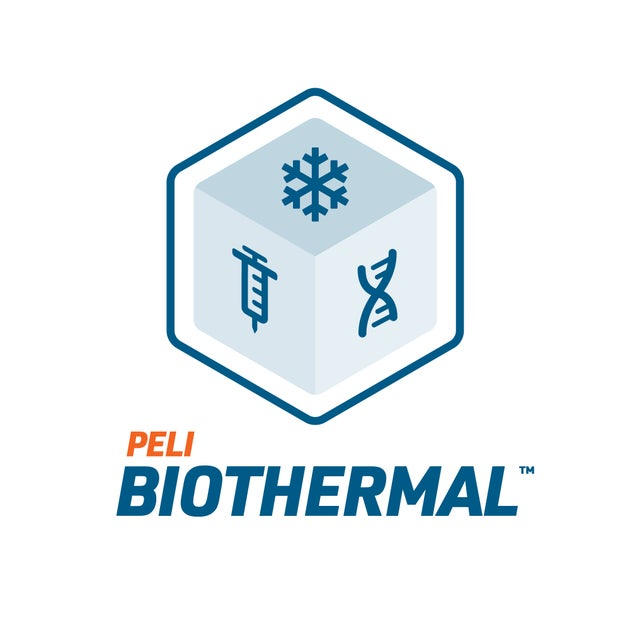</div> |
| **Perfil (Overview)** | Solución integral IoT para delivery urbano que combina una caja inteligente con regulación térmica activa (ESP32, DS18B20), seguridad física con desbloqueo por código OTP (Reed Switch + TCRT5000), telemetría continua y captura de evidencias fotográficas. | Fabricante y comercializador de mochilas, bolsas y cajas térmicas pasivas con aislamiento estándar, diseñadas para mensajería y entrega tradicional de comida rápida en bicicletas y motocicletas. | Empresa de monitoreo digital de cadena de frío que ofrece registradores de datos IoT celulares/cloud en tiempo real y software de análisis de visibilidad logística a gran escala. | Fabricante de soluciones avanzadas de embalaje pasivo y semi-activo con aislamiento de alta densidad y monitoreo de temperatura para transporte de insumos biológicos y perecibles de alta exigencia. |
| **Ventaja competitiva** | Trazabilidad integral en última milla: regulación térmica activa, bloqueo físico desarmable únicamente mediante OTP en destino, prevención de manipulaciones mediante seguridad de dos niveles y generación automática de reportes de auditoría con evidencia fotográfica. | Muy bajo costo de adquisición inicial, ligereza de transporte, amplia disponibilidad comercial y nulo requerimiento de mantenimiento tecnológico o energético. | Plataforma en la nube de alta confiabilidad con cobertura telemática global continua (redes celulares IoT/GPS) y cumplimiento de estándares internacionales de auditoría (FDA, GMP). | Embalajes térmicos reutilizables con materiales de cambio de fase (PCM) de altísima eficiencia pasiva (hasta 120 horas de estabilidad térmica) sin consumo de batería. |
| **Perfil de Marketing: Mercado objetivo** | Restaurantes medianos y pequeños, cadenas de comida rápida con flota propia o tercerizada, y repartidores urbanos que requieren certificar la entrega higiénica y la temperatura del alimento. | Repartidores independientes de aplicaciones móviles de delivery (Rappi, PedidosYa, Uber Eats) y pequeños negocios gastronómicos locales. | Corporaciones farmacéuticas multinacionales, distribuidores de vacunas y grandes empresas de logística de perecibles a gran escala (B2B industrial). | Laboratorios clínicos, sector biotecnológico, farmacias hospitalarias y servicios de catering gourmet/médico corporativo de alto presupuesto. |
| **Perfil de Marketing: Estrategias de marketing** | Venta directa B2B a cadenas de restaurantes, planes de suscripción SaaS mensual para el uso del software de gestión y auditoría, alianzas con asociaciones gastronómicas locales y demos funcionales. | Venta por catálogo físico, presencia en distribuidores de accesorios para motos/bicicletas, marketplaces de comercio electrónico y compras corporativas directas por volumen. | Venta consultiva corporativa B2B de ciclo largo, presencia en ferias internacionales de supply chain/farma, marketing de contenidos sobre regulaciones y modelos PaaS (Product as a Service). | Venta técnica B2B mediante representantes comerciales autorizados, certificaciones internacionales de calidad y contratos corporativos de leasing/retorno de contenedores. |
| **Perfil de Producto: Productos & Servicios** | - Caja inteligente *SmartBox* con microcontrolador ESP32.<br>- Panel web centralizado de despacho y auditoría para restaurantes.<br>- Aplicación móvil para repartidores (control BLE, desbloqueo OTP, captura de fotos).<br>- Reportes inmutables de cadena de custodia térmica. | - Mochilas térmicas de lona oxford con aislante de espuma.<br>- Bolsas de mano térmicas.<br>- Cajas rígidas de fibra de vidrio sin componentes electrónicos ni sensores. | - Dispositivos registradores IoT (Saga Card / Pods) con conectividad celular/IoT.<br>- Plataforma en la nube *Controlant Cloud* para trazabilidad en tiempo real.<br>- Servicios de alertas automáticas 24/7 y analítica de datos. | - Cajas y contenedores rígidos con tecnología de cambio de fase (Credo Cube).<br>- Sensores pasivos/registradores de temperatura USB/RF.<br>- Software de seguimiento de inventario térmico y calibración. |
| **Precios & Costos** | Hardware accesible de costo moderado (orientado a ensamble ágil y componentes estandarizados) complementado con una suscripción de software SaaS mensual accesible para pymes gastronómicas. | Costo único muy bajo por mochila/caja (aprox. $25 - $60 USD), sin costos recurrentes ni tarifas de software. | Alto costo operativo; modelo de suscripción por viaje o por dispositivo anual de alto valor (centenas o miles de dólares por contrato corporativo). | Costo unitario elevado por contenedor térmico ($150 - $500+ USD) sumado a costos de recertificación y reposición de geles/placas PCM. |
| **Canales de distribución** | Plataforma Web oficial (Landing Page institucional), venta corporativa directa y distribución de aplicaciones móviles vía Google Play Store y Apple App Store. | Puntos de venta retail especializados, tiendas de motociclismo, plataformas de e-commerce (MercadoLibre, Amazon) y convenios directos con apps de delivery. | Canal corporativo directo B2B a través de oficinas regionales y red global de socios tecnológicos y logísticos. | Red de distribuidores técnicos certificados, representantes comerciales B2B y despacho logístico programado. |
| **Análisis SWOT: Fortalezas** | - Solución diseñada a la medida del dolor de la última milla gastronómica.<br>- Seguridad física inviolable por OTP que erradica la apertura no autorizada.<br>- Seguridad de dos niveles (Reed Switch + TCRT5000) para descartar falsas alarmas.<br>- Plataforma de software integral (Web + Móvil + Edge IoT). | - Marca reconocida y posicionada en el sector de repartidores independientes.<br>- Precios altamente competitivos y sin barreras tecnológicas de entrada.<br>- Alta durabilidad mecánica y facilidad de reemplazo inmediato. | - Plataforma de software madura, escalable y con alta reputación internacional.<br>- Conectividad global y acuerdos con operadores de telecomunicaciones.<br>- Infraestructura en la nube con soporte 24/7 y analítica predictiva. | - Aislamiento térmico pasivo de ingeniería avanzada y de larga duración.<br>- Estructuras sólidas y de máxima durabilidad reutilizable.<br>- Amplio cumplimiento normativo para transporte sensible. |
| **Análisis SWOT: Debilidades** | - Startup en etapa de introducción y validación inicial.<br>- Dependencia de la recarga de batería del dispositivo IoT en la jornada diaria.<br>- Necesidad de capacitar al repartidor en el uso de la aplicación móvil y el flujo de entrega. | - Nula tecnología: carece de telemetría, sensores, alertas y controles de acceso.<br>- Imposibilidad de acreditar la cadena de custodia o demostrar adulteraciones.<br>- La temperatura decae progresivamente sin aviso ni control activo. | - Modelo de precios inviable para el sector de restaurantes y entrega de comida rápida.<br>- Dispositivos no integrados a mecanismos físicos de apertura o cerradura de cajas.<br>- No contempla la captura de evidencias fotográficas de entrega ni apps operativas para couriers de comida. | - No cuenta con conectividad nativa en tiempo real para última milla urbana.<br>- Operación pesada que requiere acondicionamiento previo de placas PCM.<br>- Costo unitario prohibitivo para la gran mayoría de restaurantes y repartidores independientes. |
| **Análisis SWOT: Oportunidades** | - Crecimiento sostenido del delivery de comida gourmet y productos frescos que exigen control térmico.<br>- Alta tasa de reclamos por comida fría o paquetes vulnerados en plataformas de delivery.<br>- Demanda de soluciones que reduzcan las pérdidas por devoluciones injustas en restaurantes. | - Posibilidad de añadir cierres de combinación mecánicos económicos.<br>- Creciente número de trabajadores de delivery en las principales ciudades de la región. | - Expansión de sus servicios hacia la logística urbana de última milla para farmacias o alimentos ultra frescos.<br>- Alianzas con flotas de transporte terrestre. | - Adaptación de modelos más compactos y económicos orientados a catering corporativo o delivery prémium. |
| **Análisis SWOT: Amenazas** | - Resistencia de algunos repartidores a adoptar controles más estrictos de apertura y fotografía.<br>- Competidores tradicionales que incorporen precintos de seguridad mecánicos económicos.<br>- Subida en los costos de adquisición de microcontroladores y sensores electrónicos. | - Penetración de cajas inteligentes que vuelvan obsoletas las mochilas térmicas convencionales.<br>- Mayores regulaciones municipales y sanitarias sobre el transporte de alimentos preparados. | - Nuevos competidores de telemetría IoT low-cost que ingresen al mercado con tarifas agresivas. | - Entrada de fabricantes asiáticos que comercialicen contenedores con materiales aislantes avanzados a bajo costo. |

---

### 2.1.2. Estrategias y tácticas frente a competidores.

A partir del análisis del panorama competitivo y la matriz FODA, **IoTeam** define un conjunto de estrategias y tácticas comerciales, de producto y operativas para consolidar la entrada y el posicionamiento de **Cold2Hot**:

#### 1. Estrategia de Enfoque en el Nicho de Última Milla Gastronómica (Frente a Thermotecnica y competidores pasivos)
* **Objetivo:** Demostrar que el costo de una caja pasiva convencional es en realidad más alto a largo plazo debido a los reembolsos por comida fría y las disputas por manipulación del paquete.
* **Tácticas:**
  * **Cálculo de Retorno de Inversión (ROI):** Proveer a los administradores de restaurantes una calculadora de pérdidas operativas en el Landing Page de Cold2Hot, evidenciando cómo una reducción del 35% en reclamos amortiza rápidamente el costo de la tecnología.
  * **Diferenciación por Seguridad Activa:** Posicionar el mecanismo de bloqueo por código OTP como una garantía de higiene e inviolabilidad del pedido ante el comensal final, convirtiendo la caja en un argumento de marketing para el propio restaurante.
  * **Adopción Simple y Guiada:** Diseñar la aplicación móvil del repartidor con una curva de aprendizaje mínima (diseño UX intuitivo y compatible con Bluetooth de bajo consumo), facilitando que los repartidores la perciban como un escudo contra penalizaciones injustas y no como una carga de trabajo.

#### 2. Estrategia de Liderazgo en Costos Tecnológicos y Modelo SaaS Accesible (Frente a Controlant)
* **Objetivo:** Ofrecer las ventajas de la telemetría en tiempo real y la trazabilidad en la nube sin los precios corporativos prohibitivos del sector farmacéutico.
* **Tácticas:**
  * **Arquitectura IoT Eficiente:** Basar el hardware en componentes de código abierto y alta confiabilidad (microcontrolador ESP32 NodeMCU, sensor DS18B20, sensores TCRT5000 y Reed Switch), optimizando los costos de manufactura del prototipo.
  * **Esquema de Suscripción Modular (SaaS):** Estructurar planes mensuales adaptados al tamaño de la flota del restaurante (p. ej., cobro por caja activa monitoreada al mes), evitando pagos iniciales millonarios por licenciamiento.
  * **Integración de Flujos de Cierre de Entrega:** Incluir dentro de la misma solución el registro fotográfico obligatorio (Proof of Delivery), funcionalidad que los proveedores globales de trazabilidad industrial no ofrecen al estar desligados de la interacción directa con el consumidor final.

#### 3. Estrategia de Conectividad y Automatización Activa (Frente a Peli BioThermal)
* **Objetivo:** Superar la rigidez de los sistemas pasivos avanzados que requieren acondicionamientos químicos previos y carecen de comunicación telemática en ruta.
* **Tácticas:**
  * **Ajuste Dinámico de Perfiles Térmicos:** Permitir al administrador configurar perfiles de frío o calor desde el panel web de despacho en segundos, activando automáticamente la regulación del contenedor inteligente sin necesidad de cambiar placas físicas de enfriamiento.
  * **Seguridad de Dos Niveles contra Manipulaciones:** Implementar la lógica de discriminación entre una apertura accidental (alerta preventiva al operador para que ajuste la tapa) y una extracción real del paquete (alerta crítica inmediata al restaurante), protegiendo la carga en todo momento mediante telemetría continua.
  * **Generación Inmutable de Reportes de Auditoría:** Consolidar en un único reporte digital la gráfica térmica de todo el viaje, los tiempos exactos de desbloqueo y la fotografía tomada en destino, permitiendo deslindar responsabilidades de inmediato ante cualquier queja del cliente.

## 2.2. Entrevistas.

### 2.2.1. Diseño de entrevistas.

**Segmento 1: Administradores de operaciones de delivery**

1. ¿Cuál es tu rol y cuánto tiempo llevas gestionando las operaciones de delivery en este local?
2. ¿Cuáles son los principales problemas logísticos que enfrentan desde que el pedido sale de la cocina hasta que llega al cliente?
3. ¿Con qué frecuencia reciben reclamos por pedidos fríos, derramados o manipulados, y cómo impactan económicamente a fin de mes?
4. Ante el reporte de un paquete abierto, ¿cómo determinan actualmente si fue culpa del motorizado o si es un reclamo falso del cliente?
5. ¿Qué medidas de seguridad (cintas, sellos, etc.) utilizan actualmente en sus empaques y qué tan efectivas resultan en la ruta?
6. ¿Qué valor le aportaría a su gestión diaria poder monitorear la temperatura exacta de la caja de reparto en tiempo real?
7. ¿Qué opina de un sistema donde la caja de transporte se bloquee físicamente en el local y solo se abra con un PIN único en el destino?
8. ¿Qué tan útil le resultaría recibir un reporte automático con la foto de entrega y la hora exacta de apertura para resolver disputas con las apps de delivery?

**Segmento 2: Operadores de entrega (repartidores)**

1. ¿Cuánto tiempo llevas trabajando como repartidor y con qué aplicaciones trabajas con mayor frecuencia?
2. ¿Qué problemas de temperatura, cierres o seguridad presentan las mochilas que usas actualmente para transportar los alimentos?
3. ¿Alguna vez te han penalizado o descontado dinero injustamente por un pedido que llegó frío o maltratado por el tráfico?
4. ¿Has tenido experiencias con clientes que reportan falsamente entregas incompletas? ¿Cómo te defiendes ante la aplicación?
5. ¿Cómo te ayudaría en tu trabajo si tu caja regulara la temperatura (frío/calor) automáticamente durante el trayecto sin que te preocupes?
6. ¿Qué te parece la idea de recibir una alerta preventiva en tu celular si olvidas asegurar bien la tapa antes de arrancar la moto?
7. Si la caja se mantiene bloqueada hasta que ingresas un PIN en el destino, ¿crees que te ayudaría a demostrar que no manipulaste el paquete?
8. ¿Estarías dispuesto a tomar una foto obligatoria del paquete entregado usando nuestra app si eso te garantiza que no te pondrán multas injustas?

### 2.2.2. Registro de entrevistas.

A continuación, se presenta el registro de las entrevistas realizadas a los representantes de nuestros dos segmentos objetivo. Estas sesiones se llevaron a cabo de forma virtual/presencial con el fin de validar nuestras hipótesis de negocio y entender a profundidad sus necesidades.

**Entrevista 1**
* **Nombres y Apellidos:** Roberto Fernández
* **Segmento Objetivo:** Segmento 1 - Administrador de operaciones de delivery
* **Edad:** 35 años
* **Fecha de Entrevista:** 15/09/2026
* **Duración:** 18 minutos

**Entrevista 2**
* **Nombres y Apellidos:** Katia Torres
* **Segmento Objetivo:** Segmento 2 - Operador de entrega (Repartidor)
* **Edad:** 26 años
* **Fecha de Entrevista:** 16/09/2026
* **Duración:** 15 minutos


https://upcedupe-my.sharepoint.com/:v:/g/personal/u202117303_upc_edu_pe/IQCw2iS8WZqYSpyTqV73I-zyAV2gmtetVbyAsgyOkBEmwIM
---

### 2.2.3. Análisis de entrevistas.

Tras procesar las respuestas obtenidas en las entrevistas, se identificaron patrones de comportamiento, dolores recurrentes (pains) y expectativas (gains) que validan directamente la necesidad de la solución **Cold2Hot**. A continuación, se detallan los hallazgos principales por segmento:

**Hallazgos del Segmento 1 (Administradores de operaciones de delivery):**
1. **La ceguera operativa es el mayor dolor financiero:** Los administradores confirmaron que, una vez que el pedido sale del local, pierden el control total sobre la cadena de frío y la manipulación. Esto se traduce en pérdidas económicas constantes debido a que las plataformas de delivery suelen priorizar el reclamo del cliente y aplicar reembolsos automáticos descontados al restaurante.
2. **Las medidas de seguridad actuales son insuficientes:** El uso de cintas adhesivas o grapas en las bolsas es visto como una medida paliativa que no evita aperturas no autorizadas y no ofrece ninguna prueba técnica en caso de disputas.
3. **Alta disposición a la adopción tecnológica:** La funcionalidad de un registro de auditoría (timestamp de apertura por PIN + evidencia fotográfica) fue identificada como la característica de mayor valor. Los administradores ven este panel no solo como una herramienta de calidad, sino como un mecanismo de defensa contra el fraude de clientes malintencionados.

**Hallazgos del Segmento 2 (Operadores de entrega / Repartidores):**
1. **Fricción física y deterioro de herramientas:** Las mochilas térmicas tradicionales se desgastan rápidamente (velcros y cierres), lo que propicia aperturas accidentales por el viento, baches o la prisa, derivando en pedidos fríos.
2. **Vulnerabilidad ante penalizaciones injustas:** Los repartidores (como Katia) sienten una profunda frustración al recibir descuentos económicos y bajas calificaciones por factores que escapan de su control (mal empaque desde el restaurante, tráfico, clima o clientes que reportan entregas incompletas falsamente). 
3. **Recepción positiva de la automatización:** La idea de una caja inteligente que regule la temperatura de manera autónoma fue percibida como un gran alivio que reduce el estrés al conducir.
4. **La seguridad como "seguro laboral":** Contrario a lo que se podría asumir (que un PIN o tomar una foto genera pérdida de tiempo), los motorizados ven el mecanismo de bloqueo y la captura fotográfica obligatoria como un beneficio. Lo consideran una herramienta que los deslinda de responsabilidad y los protege frente al soporte técnico de las aplicaciones.

**Conclusión General y Validación de Hipótesis:**
Las entrevistas validan rotundamente las hipótesis planteadas en nuestro *Lean UX Canvas*. Ambos segmentos sufren las consecuencias de la falta de trazabilidad y seguridad en la última milla, pero desde perspectivas distintas (el administrador pierde dinero por mermas; el repartidor pierde dinero por penalizaciones). La implementación de la caja inteligente **Cold2Hot** con bi-direccionalidad de datos (PIN de apertura y registro fotográfico) resuelve el dolor principal de ambos actores: **elimina las disputas logísticas al proveer una fuente de verdad única, automatizada e inmutable.**
## 2.3. Needfinding.

### 2.3.1. User Personas.

Con el propósito de garantizar una comprensión profunda y precisa de los segmentos identificados como clave para nuestro proyecto, hemos llevado a cabo un proceso estructurado y cuidadoso de creación de User Personas. Este procedimiento nos permitió definir un perfil específico y representativo para cada segmento objetivo, lo que nos brinda una perspectiva más clara y detallada de nuestros usuarios. De esta manera, podemos diseñar y ofrecer soluciones que respondan de manera efectiva a sus necesidades, expectativas y contextos particulares.

UserPersona 1
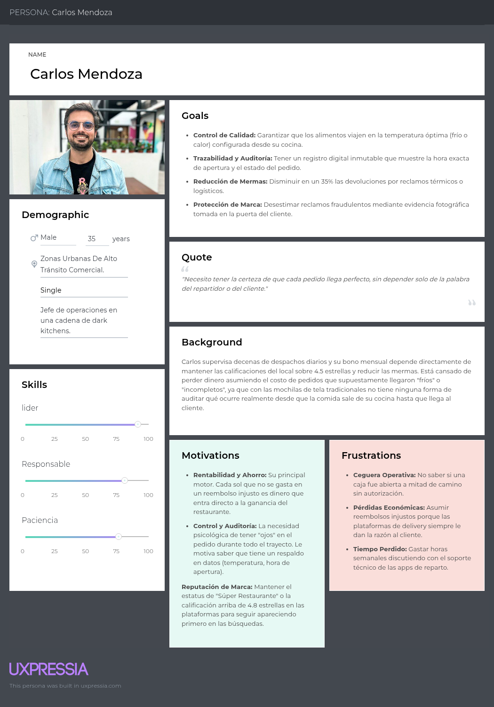

UserPersona 2
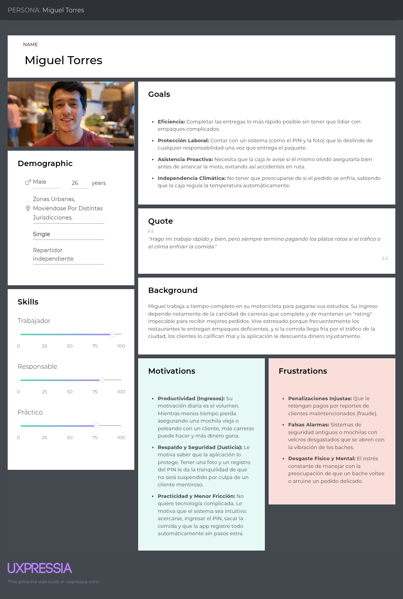

### 2.3.2. User Task Matrix

El User Task Matrix concentra las tareas que los User Persona, que representan a los segmentos principales de Cold2Hot, realizan para cumplir sus objetivos dentro de la cadena logística de entregas de última milla. En este caso, se consideran dos segmentos de usuarios:

* **Administradores de operaciones de delivery**, encargados de la gestión del local, control de despachos y auditoría de incidencias.
* **Operadores de entrega (repartidores)**, responsables del transporte urbano, cumplimiento de rutas y entrega final al cliente.

Es importante destacar que las tareas (tasks) reflejan actividades que los usuarios realizan independientemente de la existencia del software, es decir, forman parte natural de su día a día y no representan características o funciones del sistema.

**Indicadores de Importancia y Frecuencia**

*Indicadores de Importancia:*
* **ALTA →** La tarea es crítica para el cumplimiento de los objetivos del usuario.
* **MEDIA →** La tarea es importante pero no afecta directamente el resultado global.
* **BAJA →** La tarea aporta valor complementario o se realiza ocasionalmente.

*Indicadores de Frecuencia:*
* **ALTA →** Se realiza de manera constante o diaria.
* **MEDIA →** Se realiza semanal o mensualmente.
* **BAJA →** Se realiza esporádicamente o en circunstancias específicas.

**Tabla de Matriz de Tareas de Usuario**

| Tareas | Administradores de Delivery | Operadores de Entrega | Frecuencia | Importancia | Frecuencia | Importancia |
| :--- | :--- | :--- | :--- | :--- | :--- | :--- |
| Empacar y preparar el pedido | Alta | Baja | Alta | Alta | Baja | Baja |
| Asegurar / bloquear el contenedor de transporte | Alta | Alta | Alta | Alta | Alta | Alta |
| Transportar pedidos en entorno urbano | Nunca | Alta | - | - | Alta | Alta |
| Revisar estado físico del paquete en ruta | Nunca | Alta | - | - | Alta | Alta |
| Verificar la temperatura del alimento | Media | Baja | Media | Alta | Baja | Media |
| Resolver incidentes de aperturas accidentales | Media | Alta | Media | Alta | Alta | Alta |
| Desbloquear contenedor en el destino | Nunca | Alta | - | - | Alta | Alta |
| Registrar foto de evidencia de la entrega | Baja | Alta | Baja | Media | Alta | Alta |
| Monitorear flota de despachos en tiempo real | Alta | Nunca | Alta | Alta | - | - |
| Auditar tiempos de entrega e incidencias | Media | Baja | Media | Alta | Baja | Baja |
| Conciliar pagos y penalizaciones de plataformas | Media | Media | Media | Alta | Media | Alta |

**Análisis de Tareas**

*Tareas con mayor frecuencia e importancia*
Tanto administradores como repartidores presentan alta frecuencia e importancia en tareas como: **Asegurar/bloquear el contenedor de transporte** y la **resolución de incidentes de aperturas accidentales**. Estas tareas reflejan la necesidad crítica de mantener la cadena de custodia y proteger la carga ante las condiciones del tránsito urbano.

*Principales diferencias entre segmentos de usuarios*
* **Monitoreo y Auditoría:** Tiene alta frecuencia e importancia para los administradores, ya que su rentabilidad depende de verificar el estado de los despachos; para los repartidores, el monitoreo propio es nulo.
* **Transporte y evidencia:** Es una tarea de importancia alta y exclusiva para los repartidores (manejar y tomar la foto de entrega), mientras que el administrador solo consume esa información a posteriori.
* **Empaque y preparación:** Es esencial y frecuente para los administradores de restaurantes, mientras que los repartidores reciben el producto ya finalizado.

*Principales similitudes*
Ambos segmentos coinciden en la alta importancia de **evitar penalizaciones**. El administrador busca evitar devoluciones por comida fría, y el repartidor busca evitar descuentos salariales por quejas injustas. Esto demuestra la necesidad compartida de un sistema (como Cold2Hot) que garantice la trazabilidad térmica y ofrezca evidencia auditable del cierre del pedido.

*Enfoque de los segmentos*
Los **administradores** se enfocan en el control centralizado, la reducción de mermas y la visibilidad remota de sus envíos. Los **repartidores**, en cambio, priorizan la agilidad en la conducción, la reducción de fricciones al abrir/cerrar la mochila y contar con pruebas digitales para deslindar responsabilidades frente a los clientes. Aunque abordan la logística desde distintas veredas, ambos buscan el mismo objetivo final: una entrega exitosa, rápida y sin disputas posteriores.

### 2.3.3. User Journey Mapping.

User Journey Mapping - Segmento Administrador de operaciones de delivery


User Journey Mapping - Segmento Operador de entrega
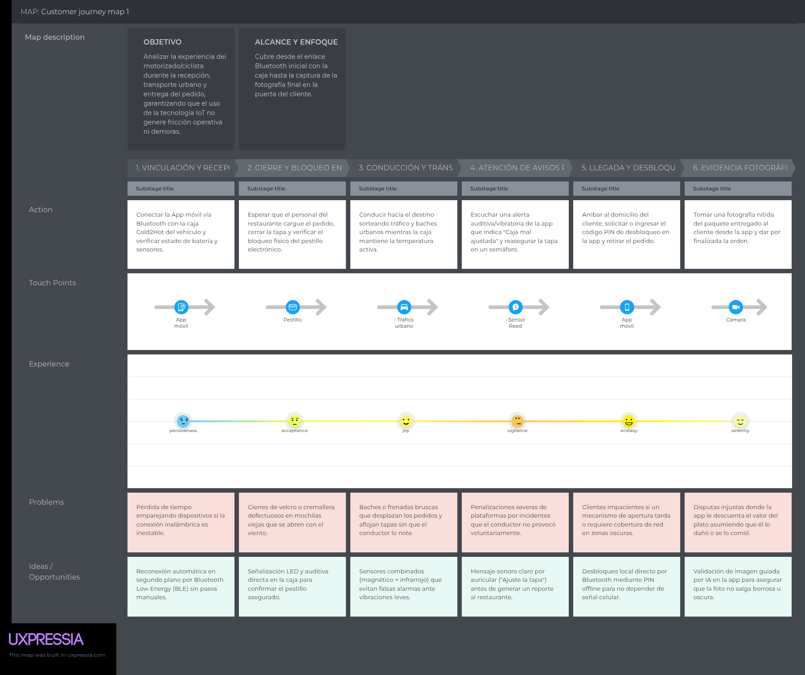

### 2.3.4. Empathy Mapping.

Segmento 1: Administradores de operaciones de delivery preocupados por la rentabilidad y la trazabilidad de los pedidos
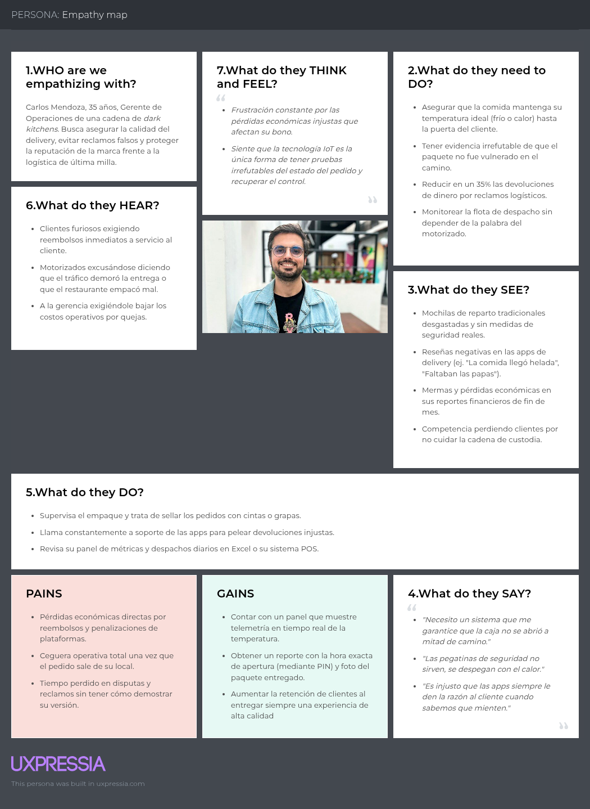

Segmento 2: Operadores de entrega (motorizados) enfocados en la agilidad y en proteger sus ingresos de penalizaciones injustas
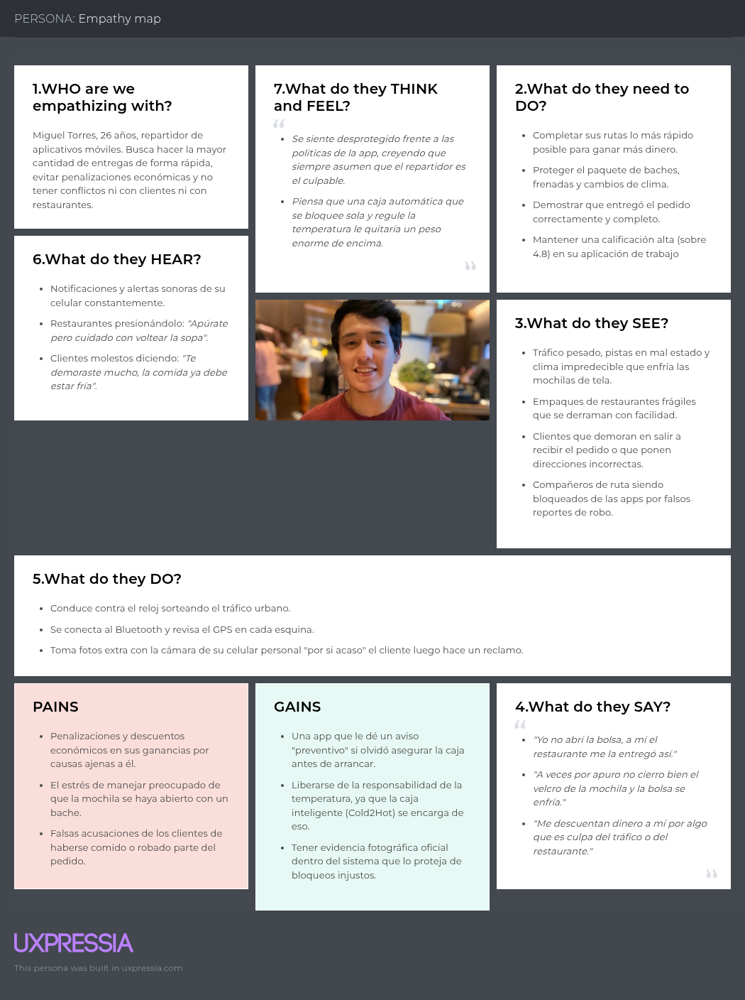
## 2.4. Big Picture EventStorming.

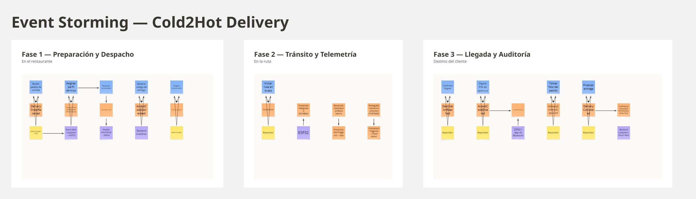

## 2.5. Ubiquitous Language.

| Term (English) | Término (Español) | Definition (Definición en español) |
| :--- | :--- | :--- |
| Smart Box | Caja Inteligente | Contenedor físico para delivery equipado con hardware IoT (ESP32, sensores y regulador) que mantiene la cadena de custodia. |
| Thermal Profile | Perfil Térmico | Configuración específica (modo Frío o Calor) asignada remotamente al ESP32 para regular la temperatura del interior. |
| Access Code / PIN | Código de Acceso | Clave numérica única generada por el sistema que el repartidor utiliza en su App para desbloquear la caja en el destino. |
| Dispatch Hub | Panel de Despacho | Interfaz web utilizada por el administrador para asignar pedidos, configurar la temperatura y monitorear la flota en tiempo real. |
| Telemetry | Telemetría | Datos de temperatura y estado de la batería enviados continuamente por el ESP32 hacia el servidor durante el trayecto. |
| Magnetic Sensor | Sensor Magnético | Componente de hardware (Reed Switch) que detecta el estado físico de la tapa de la caja (abierta/cerrada). |
| Infrared Sensor | Sensor Infrarrojo | Componente de hardware (TCRT5000) utilizado para detectar la presencia o ausencia del paquete dentro del contenedor. |
| Two-Level Security | Seguridad de Dos Niveles | Lógica del sistema que cruza los datos magnéticos e infrarrojos para distinguir entre una caja mal cerrada y una extracción real. |
| Preventive Alert | Alerta Preventiva | Notificación enviada al repartidor para que ajuste la tapa si la caja se desajusta accidentalmente sin extraerse el pedido. |
| Critical Alert | Alerta Crítica | Notificación enviada al administrador indicando que el pedido fue extraído de la caja en pleno tránsito, sugiriendo manipulación. |
| Delivery Evidence | Evidencia de Entrega | Fotografía obligatoria tomada por el repartidor desde la App tras abrir la caja, que certifica el estado del paquete al entregarlo. |
| Audit Report | Reporte de Auditoría | Registro inmutable de una entrega finalizada que incluye marcas de tiempo, gráfica térmica y evidencia fotográfica para resolver disputas. |
| Route Monitoring | Monitoreo en Ruta | Seguimiento GPS combinado con la telemetría térmica visible desde el panel de administración. |
| Delivery Courier | Operador de Entrega | Persona (motorizado o ciclista) encargada del transporte físico del contenedor desde el restaurante hasta el cliente. |

# Capítulo III: Requirements Specification

Esta sección permite especificar los requisitos de los productos digitales que conforman nuestra solución Cold2Hot a partir del análisis de la información obtenida en las investigaciones previas. En este capítulo se detallan los User Stories con sus criterios de aceptación, el Impact Mapping para alinear nuestros esfuerzos técnicos con los objetivos de negocio y el Product Backlog donde se priorizan y estiman dichos requerimientos.

## 3.1. User Stories.

A continuación, se presentan los requisitos definidos para la solución Cold2Hot, agrupados en Epics. Estos requisitos abarcan las interacciones de los distintos segmentos de usuarios (Administradores de operaciones, Operadores de entrega y Visitantes) con los diferentes productos de software (Landing Page, Web Application, Mobile App y el dispositivo IoT).

| Epic / Story ID | Título                             | Descripción                                                                                                                                                                    | Criterios de Aceptación                                                                                                                                                                                                                                             | Relacionado con (Epic ID) |
| --------------- | ----------------------------------- | ------------------------------------------------------------------------------------------------------------------------------------------------------------------------------- | -------------------------------------------------------------------------------------------------------------------------------------------------------------------------------------------------------------------------------------------------------------------- | ------------------------- |
| EP01            | Gestión y Trazabilidad Térmica    | Como administrador de operaciones, quiero gestionar y monitorear los envíos desde un panel centralizado para asegurar la cadena de custodia térmica.                          | - El panel web permite crear, ver y auditar envíos.- Muestra gráficos de temperatura y alertas en tiempo real.                                                                                                                                                     | -                         |
| EP02            | Seguridad y Entrega                 | Como operador de entrega, quiero interactuar con la caja inteligente mediante una app móvil para realizar entregas seguras y evidenciar mi trabajo.                            | - La app se conecta por BLE a la caja.- Permite desbloqueo por OTP y captura de fotos como evidencia.                                                                                                                                                                | -                         |
| EP03            | Landing Page                        | Como visitante, quiero informarme sobre el producto y sus beneficios para decidir adquirirlo.                                                                                   | - La web es responsiva y explica el ROI, características técnicas y planes.                                                                                                                                                                                        | -                         |
| US01            | Visualización de Calculadora ROI   | Como visitante, quiero visualizar la calculadora de ROI en el Landing Page para entender el ahorro operativo que genera la solución.                                           | **Given** que me encuentro en la sección de beneficios del Landing Page,**When** ingreso la cantidad de pedidos y reclamos actuales,**Then** el sistema calcula y muestra el dinero que ahorraré anualmente.                                     | EP03                      |
| US02            | Visualización de Planes            | Como visitante, quiero ver los planes de suscripción de software SaaS para elegir el más adecuado para mi restaurante.                                                        | **Given** que accedo a la sección de precios,**When** hago scroll hacia la tabla de planes,**Then** veo los costos mensuales, características incluidas y un botón para contactar ventas.                                                       | EP03                      |
| US03            | Creación de Envío                 | Como administrador de operaciones, quiero crear un nuevo envío en la plataforma especificando la temperatura requerida (caliente/fría) para iniciar el monitoreo.             | **Given** que me encuentro en el panel de despachos,**When** ingreso los datos del pedido y selecciono el perfil térmico, y presiono "Crear",**Then** se genera el envío en estado "Pendiente" y se emite un código OTP de apertura.            | EP01                      |
| US04            | Monitoreo en Tiempo Real            | Como administrador de operaciones, quiero visualizar el estado en tiempo real (temperatura y estado de apertura) de los envíos en tránsito para asegurar la calidad.          | **Given** que tengo envíos en curso,**When** accedo al dashboard de monitoreo en la web,**Then** visualizo una lista de cajas activas mostrando su temperatura actual, nivel de batería y estado del cerrojo.                                    | EP01                      |
| US05            | Historial y Auditoría              | Como administrador de operaciones, quiero revisar el historial de reportes de entrega (con evidencias fotográficas) para resolver disputas de clientes por alimentos dañados. | **Given** que un cliente reporta un problema,**When** busco el ID del pedido en el historial,**Then** puedo visualizar la gráfica de temperatura del trayecto, los horarios de apertura de la caja y las fotos tomadas en la entrega.             | EP01                      |
| US06            | Conexión BLE con la Caja           | Como operador de entrega, quiero conectar mi app móvil por Bluetooth a la caja inteligente para poder gestionar el candado de forma inalámbrica.                              | **Given** que estoy cerca de la caja asignada,**When** abro la app móvil y selecciono "Conectar a SmartBox",**Then** la app establece conexión por BLE y el LED de la caja confirma la vinculación.                                             | EP02                      |
| US07            | Desbloqueo por OTP                  | Como operador de entrega, quiero ingresar el código OTP en la app para desbloquear la caja y entregar el pedido al cliente.                                                    | **Given** que la app está conectada a la caja,**When** ingreso el OTP provisto por el administrador y presiono "Desbloquear",**Then** la caja inteligente libera su cerrojo y registra el evento de apertura exitosa.                             | EP02                      |
| US08            | Registro de Evidencia Fotográfica  | Como operador de entrega, quiero tomar una foto del pedido entregado usando la app para dejar constancia física y evitar penalizaciones injustas.                              | **Given** que he entregado el producto,**When** uso la cámara dentro de la app para fotografiar el paquete entregado y presiono "Enviar",**Then** la imagen se sube a la plataforma asociándose al ID del envío y cerrando el ciclo logístico. | EP02                      |
| US09            | Registro Térmico (Technical Story) | Como Developer, quiero que el dispositivo IoT envíe registros de temperatura cada minuto a la API para mantener el rastro inmutable.                                           | **Given** que la caja inteligente está encendida y en ruta,**When** transcurre un minuto,**Then** el ESP32 envía un payload JSON con la temperatura actual, timestamp y estado de sensores hacia el endpoint correspondiente.                    | EP01                      |
| EP04            | Authentication & Authorization     | Como administrador de operaciones, quiero gestionar el acceso seguro a la plataforma para mi equipo.                                                                                            | - Permite registro, login y gestión de usuarios.                                                                                                                                                                                                   | -                         |
| EP05            | Device Management                  | Como administrador, quiero gestionar los dispositivos IoT asociados a mi restaurante para mantener su operatividad.                                                                             | - Permite registrar cajas y ver su estado de batería.                                                                                                                                                                                              | -                         |
| EP06            | Subscriptions & Payments           | Como administrador, quiero gestionar el plan de suscripción de la plataforma.                                                                                                                  | - Pasarela de pago y selección de plan.                                                                                                                                                                                                            | -                         |
| EP07            | Alertas y Notificaciones           | Como administrador, quiero recibir alertas sobre el estado de los envíos para tomar acción inmediata.                                                                                           | - Notificaciones push/web de temperatura y apertura.                                                                                                                                                                                               | -                         |
| US10            | Registro de Restaurante            | Como administrador de operaciones, quiero registrar mi cuenta y mi restaurante para acceder a la plataforma.                                                                                    | **Given** que estoy en el formulario de registro,<br>**When** ingreso mis datos y los del negocio,<br>**Then** se crea la cuenta y puedo acceder al panel.                                                                                       | EP04                      |
| US11            | Inicio de Sesión (Web y App)       | Como usuario, quiero iniciar sesión con mis credenciales para acceder a mi perfil de forma segura.                                                                                              | **Given** que estoy en la pantalla de login,<br>**When** ingreso usuario y contraseña válidos,<br>**Then** accedo al dashboard o vista principal.                                                                                              | EP04                      |
| US12            | Gestión de Operadores              | Como administrador, quiero registrar las cuentas de mis operadores de entrega para que puedan acceder a la App Móvil.                                                                           | **Given** que estoy en la sección de equipo,<br>**When** agrego el nombre y correo de un operador,<br>**Then** se le envía una invitación para acceder a la app.                                                                                | EP04                      |
| US13            | Registro de Caja (SmartBox)        | Como administrador, quiero registrar una nueva caja inteligente mediante su MAC address para asignarla a mi restaurante.                                                                        | **Given** que recibí una nueva SmartBox,<br>**When** ingreso su MAC Address en el panel,<br>**Then** el dispositivo queda vinculado a mi inventario.                                                                                             | EP05                      |
| US14            | Estado de Batería y Mantenimiento  | Como administrador, quiero recibir alertas si la batería de una caja es baja o el sensor de temperatura falla.                                                                                  | **Given** que una caja tiene batería menor al 15%,<br>**When** el dispositivo reporta su estado,<br>**Then** aparece una alerta visual en el dashboard.                                                                                        | EP05                      |
| US15            | Suscripción a un plan              | Como administrador, quiero seleccionar un plan y registrar mi método de pago para comenzar a utilizar el servicio.                                                                              | **Given** que estoy en la sección de facturación,<br>**When** selecciono un plan mensual e ingreso mi tarjeta,<br>**Then** mi cuenta se actualiza al nivel correspondiente.                                                                      | EP06                      |
| US16            | Alertas de Incumplimiento Térmico  | Como administrador, quiero recibir una notificación si un envío sale de los rangos de temperatura aceptables.                                                                                   | **Given** que un envío activo sale de su rango térmico,<br>**When** el sistema detecta la desviación,<br>**Then** se genera una alerta inmediata en la vista del administrador.                                                                | EP07                      |
| US17            | Alertas de Apertura No Autorizada  | Como administrador, quiero ser notificado inmediatamente si el sensor detecta una apertura forzada sin el uso del OTP.                                                                          | **Given** que una caja es abierta forzadamente,<br>**When** el sensor detecta la apertura sin código válido,<br>**Then** se emite una alerta crítica indicando una posible adulteración.                                                        | EP07                      |
| EP08            | Internacionalización & Analítica   | Como administrador, quiero opciones globales y reportes para mejorar la gestión y experiencia.                                                                                                  | - Soporte i18n y dashboards gráficos de rendimiento.                                                                                                                                                                                               | -                         |
| US18            | Internacionalización (i18n)        | Como usuario, quiero cambiar el idioma de la plataforma (Inglés/Español) para navegar en mi idioma nativo.                                                                                      | **Given** que accedo a la web,<br>**When** selecciono "English" en el menú,<br>**Then** la interfaz cambia inmediatamente de idioma a inglés.                                                                                                    | EP08                      |
| US19            | Dashboard Analítica de Repartidores| Como administrador, quiero ver un gráfico con el rendimiento de mis repartidores para identificar quién tiene más entregas perfectas.                                                           | **Given** que entro al panel de analítica,<br>**When** selecciono un mes,<br>**Then** veo un gráfico comparativo de entregas exitosas por operador.                                                                                             | EP08                      |
| US20            | Recuperación de Contraseña         | Como usuario, quiero poder recuperar mi contraseña mediante mi correo electrónico por si la olvido.                                                                                             | **Given** que olvidé mi clave,<br>**When** ingreso mi email en "Olvidé mi contraseña",<br>**Then** recibo un enlace seguro para restablecerla.                                                                                                   | EP04                      |

## 3.2. Impact Mapping.

A continuación, se presenta el Impact Mapping de Cold2Hot, una representación visual que alinea nuestros objetivos de negocio (Business Goals) con los usuarios clave (Personas), los cambios de comportamiento que esperamos (Impacts) y las características del producto que construiremos (Deliverables). Esto nos ayuda a asegurar que cada funcionalidad aporta valor estratégico.

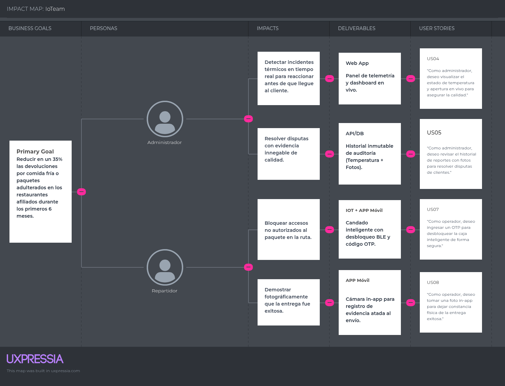

*(Nota: En la herramienta UXPressia se ha construido el diagrama completo en donde se observa:*

* **Business Goal:** Reducir en un 35% las devoluciones por comida fría o paquetes adulterados en los restaurantes afiliados durante los primeros 6 meses.
* **Personas:** Administrador de operaciones, Operador de entrega.
* **Impacts:** "Detectar incidentes en tiempo real", "Entregar evidencia innegable de calidad", "Bloquear accesos no autorizados".
* **Deliverables:** Panel de telemetría web, OTP Lock feature, App móvil para registro fotográfico).

## 3.3. Product Backlog.

Se ha elaborado y priorizado el Product Backlog en nuestra herramienta de gestión de proyectos (por ejemplo, Trello o Jira). Los User Stories han sido estimados utilizando puntos de historia (Story Points), siguiendo la sucesión de Fibonacci (1, 2, 3, 5, 8). Se ha priorizado los User Stories relacionados con el acceso, la información del Landing Page y las funcionalidades core de seguridad e IoT en las primeras posiciones.

**Enlace público al Product Backlog:** [Tablero de Jira Software - Cold2Hot Backlog](https://marcoanakasone-1789698062967.atlassian.net/jira/software/projects/KAN/boards/1/backlog?atlOrigin=eyJpIjoiNTk0N2Q4MGJiNjQ0NGQzZDk5MzFkZWZiZDdmNTBkMjUiLCJwIjoiaiJ9)

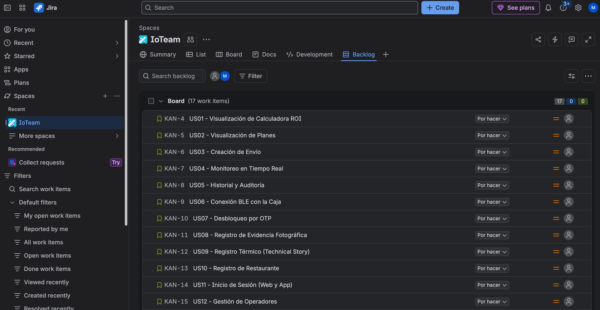

| # Orden | User Story Id | Título                             | Descripción                                                                                                                                                                    | Story Points (1 / 2 / 3 / 5 / 8) |
| ------- | ------------- | ----------------------------------- | ------------------------------------------------------------------------------------------------------------------------------------------------------------------------------- | -------------------------------- |
| 1       | US01          | Visualización de Calculadora ROI   | Como visitante, quiero visualizar la calculadora de ROI en el Landing Page para entender el ahorro operativo que genera la solución.                                           | 3                                |
| 2       | US02          | Visualización de Planes            | Como visitante, quiero ver los planes de suscripción de software SaaS para elegir el más adecuado para mi restaurante.                                                        | 2                                |
| 3       | US10          | Registro de Restaurante            | Como administrador de operaciones, quiero registrar mi cuenta y mi restaurante para acceder a la plataforma.                                                                    | 3                                |
| 4       | US11          | Inicio de Sesión (Web y App)       | Como usuario, quiero iniciar sesión con mis credenciales para acceder a mi perfil de forma segura.                                                                              | 3                                |
| 5       | US15          | Suscripción a un plan              | Como administrador, quiero seleccionar un plan y registrar mi método de pago para comenzar a utilizar el servicio.                                                              | 5                                |
| 6       | US09          | Registro Térmico (Technical Story) | Como Developer, quiero que el dispositivo IoT envíe registros de temperatura cada minuto a la API para mantener el rastro inmutable.                                           | 8                                |
| 7       | US13          | Registro de Caja (SmartBox)        | Como administrador, quiero registrar una nueva caja inteligente mediante su MAC address para asignarla a mi restaurante.                                                        | 3                                |
| 8       | US06          | Conexión BLE con la Caja           | Como operador de entrega, quiero conectar mi app móvil por Bluetooth a la caja inteligente para poder gestionar el candado de forma inalámbrica.                              | 5                                |
| 9       | US07          | Desbloqueo por OTP                 | Como operador de entrega, quiero ingresar el código OTP en la app para desbloquear la caja y entregar el pedido al cliente.                                                    | 5                                |
| 10      | US03          | Creación de Envío                  | Como administrador de operaciones, quiero crear un nuevo envío en la plataforma especificando la temperatura requerida (caliente/fría) para iniciar el monitoreo.             | 3                                |
| 11      | US12          | Gestión de Operadores              | Como administrador, quiero registrar las cuentas de mis operadores de entrega para que puedan acceder a la App Móvil.                                                           | 3                                |
| 12      | US04          | Monitoreo en Tiempo Real           | Como administrador de operaciones, quiero visualizar el estado en tiempo real (temperatura y estado de apertura) de los envíos en tránsito para asegurar la calidad.          | 5                                |
| 13      | US16          | Alertas de Incumplimiento Térmico  | Como administrador, quiero recibir una notificación si un envío sale de los rangos de temperatura aceptables.                                                                   | 3                                |
| 14      | US17          | Alertas de Apertura No Autorizada  | Como administrador, quiero ser notificado inmediatamente si el sensor detecta una apertura forzada sin el uso del OTP.                                                          | 3                                |
| 15      | US14          | Estado de Batería y Mantenimiento  | Como administrador, quiero recibir alertas si la batería de una caja es baja o el sensor de temperatura falla.                                                                  | 2                                |
| 16      | US08          | Registro de Evidencia Fotográfica  | Como operador de entrega, quiero tomar una foto del pedido entregado usando la app para dejar constancia física y evitar penalizaciones injustas.                              | 3                                |
| 17      | US05          | Historial y Auditoría              | Como administrador de operaciones, quiero revisar el historial de reportes de entrega (con evidencias fotográficas) para resolver disputas de clientes por alimentos dañados. | 3                                |
| 18      | US18          | Internacionalización (i18n)        | Como visitante/usuario, quiero cambiar el idioma de la plataforma (Inglés/Español) para navegar en mi idioma nativo.                                                          | 3                                |
| 19      | US19          | Dashboard Analítica de Repartidores| Como administrador, quiero ver un gráfico con el rendimiento de mis repartidores para identificar quién tiene más entregas perfectas.                                         | 5                                |
| 20      | US20          | Recuperación de Contraseña         | Como usuario, quiero poder recuperar mi contraseña mediante mi correo electrónico por si la olvido.                                                                           | 2                                |

# Capítulo IV: Solution Software Design

## 4.1. Strategic-Level Domain-Driven Design.

El diseño de nivel estratégico nos permite descomponer el dominio del negocio de logística y custodia térmica de delivery en subdominios delimitados (Bounded Contexts), asegurando una separación clara de responsabilidades y un lenguaje ubicuo consistente.

### 4.1.1. Design-Level EventStorming.
#### 4.1.1.1. Candidate Context Discovery.

A partir del análisis del dominio y de los eventos, comandos y agregados identificados en el Design-Level EventStorming, se identificaron cinco Bounded Contexts candidatos para el ecosistema Cold2Hot: **IAM**, **Container & Device Management**, **Thermal Monitoring & Telemetry**, **Access & Security**, y **Orders & Audit**. 

Cada uno de estos contextos agrupa capacidades del negocio con lenguaje ubicuo, reglas y responsabilidades propias, lo que garantiza una alta cohesión interna y un bajo acoplamiento en la arquitectura del sistema.

| Candidate Bounded Context | Purpose |
| :--- | :--- |
| **IAM (Identity & Access Management)** | Gestiona la autenticación, autorización, perfiles de usuario (repartidores, administradores) y sesiones de acceso. |
| **Container & Device Management** | Gestiona el inventario, registro, estado operativo y vinculación de los contenedores térmicos inteligentes (*SmartBoxes*) y sus sensores IoT. |
| **Thermal Monitoring & Telemetry** | Gestiona la lectura en tiempo real de temperatura, generación de historiales térmicos y alertas de desviación de temperatura. |
| **Access & Security** | Gestiona la validación de contraseñas de un solo uso (OTP), el control físico de apertura del contenedor y la detección de riesgos de alteración o manipulaciones no autorizadas. |
| **Orders & Audit** | Gestiona el seguimiento de pedidos asignados al contenedor, el registro de evidencias fotográficas de entrega y la generación de reportes de auditoría para los restaurantes/clientes. |

<div align="center">
    
</div>

#### 4.1.1.2. Domain Message Flows Modeling.

En esta sección se modelan los principales flujos de mensajes del dominio entre los Bounded Contexts identificados en Cold2Hot. El objetivo es representar cómo se coordinan las capacidades del negocio y los eventos de dominio sin entrar aún en detalles de implementación técnica.

Mediante la técnica **Domain Storytelling**, se definió el flujo de interacción principal para el proceso de *Despacho, Transporte Seguro y Entrega de Pedido*:

1. **Creación de Orden y Perfil Térmico:** El *Administrador de Restaurante* crea la orden e indica las condiciones térmicas requeridas (Frío o Caliente). El contexto **Ordering & Dispatch** registra la orden y emite el evento `OrderDispatched`.
2. **Generación de OTP y Sincronización:** **Ordering & Dispatch** solicita al contexto **Access & Security** la generación de un código único de entrega (OTP). Este PIN se sincroniza localmente con el dispositivo IoT (**Edge / ESP32 Device**).
3. **Validación y Apertura en Destino:** Al llegar a la ubicación del cliente, el *Repartidor* ingresa el OTP en la **Delivery Operator App**, la cual valida el PIN con **Access & Security** (vía Bluetooth o API REST) para autorizar el desbloqueo físico del contenedor.
4. **Telemetría y Monitoreo Continuo:** De forma paralela, el contexto **IoT Telemetry** recibe la lectura continua de sensores (temperatura, Reed Switch, TCRT5000). Si detecta aperturas no autorizadas o desviaciones de temperatura, emite una alerta crítica hacia el sistema.
5. **Cierre de Entrega y Auditoría:** Una vez abierto el contenedor y entregado el pedido, el *Repartidor* captura la fotografía de evidencia desde la aplicación. El contexto **Auditing & Evidence** consolida las fotos, historiales térmicos y eventos de seguridad para dar por completada la orden

<div align="center">
    
</div>

#### 4.1.1.3. Bounded Context Canvases.

A continuación se presentan los Bounded Context Canvases para cada uno de los cinco contextos delimitados identificados en el ecosistema Cold2Hot. Estos lienzos definen formalmente el propósito, el lenguaje ubicuo, las responsabilidades y los límites operacionales de cada módulo.

---

### 1. IAM (Identity & Access Management) Bounded Context

| Atributo | Descripción |
| :--- | :--- |
| **Name** | IAM (Identity & Access Management) |
| **Purpose** | Gestionar la autenticación, autorización, perfiles de usuarios (administradores, operadores/repartidores) y la emisión de tokens de acceso seguros. |
| **Domain Classification** | Supporting Subdomain |
| **Ubiquitous Language** | `User`, `Credentials`, `Role`, `JWT Token`, `Authentication`, `Permission`, `Operator Profile`. |
| **Inbound Messages / Commands** | `RegisterUser`, `AuthenticateUser`, `AssignRole`, `ValidateToken`. |
| **Outbound Messages / Events** | `UserRegistered`, `UserAuthenticated`, `RoleAssigned`. |
| **Aggregates & Entities** | **Aggregate Root:** `User` <br> **Entities:** `Role`, `Permission` <br> **Value Objects:** `UserId`, `Email`, `HashedPassword`, `RoleType`. |

---

### 2. Container & Device Management Bounded Context

| Atributo | Descripción |
| :--- | :--- |
| **Name** | Container & Device Management |
| **Purpose** | Administrar el ciclo de vida, registro, emparejamiento de sensores/actuadores y estado operativo de las cajas térmicas (*SmartBoxes*) y dispositivos ESP32. |
| **Domain Classification** | Supporting Subdomain |
| **Ubiquitous Language** | `SmartBox`, `ESP32 Device`, `Sensor Pairing`, `Actuator Calibration`, `Device State`, `Lock Mechanism`. |
| **Inbound Messages / Commands** | `RegisterSmartBox`, `PairSensor`, `UpdateDeviceStatus`, `CalibrateActuator`. |
| **Outbound Messages / Events** | `SmartBoxRegistered`, `SensorPaired`, `DeviceStatusUpdated`. |
| **Aggregates & Entities** | **Aggregate Root:** `SmartBox` <br> **Entities:** `DeviceSensor`, `Actuator` <br> **Value Objects:** `BoxId`, `MACAddress`, `FirmwareVersion`, `BoxStatus` (*Available, InTransit, Maintenance*). |

---

### 3. Thermal Monitoring & Telemetry Bounded Context

| Atributo | Descripción |
| :--- | :--- |
| **Name** | Thermal Monitoring & Telemetry |
| **Purpose** | Procesar en tiempo real la telemetría de temperatura transmitida por el hardware IoT, verificar rangos térmicos configurados y gatillar alertas de desviación. |
| **Domain Classification** | Core Subdomain |
| **Ubiquitous Language** | `Telemetry Stream`, `Thermal Profile`, `Temperature Reading`, `Threshold`, `Thermal Breach Alert`, `Historical Log`. |
| **Inbound Messages / Commands** | `IngestTelemetryData`, `SetThermalProfile`, `ProcessTemperatureReading`. |
| **Outbound Messages / Events** | `TelemetryIngested`, `ThermalProfileConfigured`, `ThermalBreachDetected`. |
| **Aggregates & Entities** | **Aggregate Root:** `ThermalProfile` <br> **Entities:** `TelemetryLog` <br> **Value Objects:** `TemperatureValue`, `CelsiusUnit`, `Timestamp`, `ThresholdRange`. |

---

### 4. Access & Security Bounded Context

| Atributo | Descripción |
| :--- | :--- |
| **Name** | Access & Security |
| **Purpose** | Generar y validar las claves OTP de un solo uso para la apertura del contenedor en destino, evaluar riesgos de manipulación indebida (*Tampering*) y controlar el mecanismo físico de bloqueo. |
| **Domain Classification** | Core Subdomain |
| **Ubiquitous Language** | `OTP (One-Time Password)`, `PIN Generation`, `Unlock Request`, `Tamper Detection`, `Reed Switch Alert`, `Security Event`. |
| **Inbound Messages / Commands** | `GenerateOTP`, `ValidateOTP`, `EvaluateTamperRisk`, `UnlockContainer`. |
| **Outbound Messages / Events** | `OTPGenerated`, `ContainerUnlocked`, `SecurityBreachDetected`, `InvalidOTPAttempted`. |
| **Aggregates & Entities** | **Aggregate Root:** `SecurityPasscode` <br> **Entities:** `AccessAttempt`, `SecurityLog` <br> **Value Objects:** `OTPCode`, `ExpirationTime`, `TamperStatus`, `UnlockResult`. |

---

### 5. Orders & Audit Bounded Context

| Atributo | Descripción |
| :--- | :--- |
| **Name** | Orders & Audit |
| **Purpose** | Orquestar la vinculación de pedidos con contenedores térmicos, consolidar la evidencia fotográfica de entrega y estructurar los reportes de auditoría de custodia térmica. |
| **Domain Classification** | Core Subdomain |
| **Ubiquitous Language** | `Order`, `Thermal Custody`, `Delivery Evidence`, `Proof of Delivery`, `Audit Report`, `Dispatch`. |
| **Inbound Messages / Commands** | `AssignOrderToBox`, `CaptureDeliveryEvidence`, `UploadDeliveryPhoto`, `GenerateAuditReport`. |
| **Outbound Messages / Events** | `OrderDispatched`, `EvidenceUploaded`, `AuditReportGenerated`, `OrderCompleted`. |
| **Aggregates & Entities** | **Aggregate Root:** `Order` <br> **Entities:** `DeliveryEvidence`, `AuditReport` <br> **Value Objects:** `OrderId`, `PhotoUrl`, `CustodyStatus`, `CompletionTimestamp`. |

### 4.1.2. Context Mapping.

El Context Map de Cold2Hot representa la arquitectura y las interacciones entre los Bounded Contexts identificados en el dominio del sistema de monitoreo térmico y de dispositivos. Esta vista describe las responsabilidades específicas de cada contexto y las relaciones de dependencia (Upstream/Downstream) necesarias para la comunicación entre subsistemas.

En esta arquitectura, el contexto IAM (Identity & Access Management) actúa como proveedor principal de identidades y autenticación para todo el sistema. Por su parte, Thermal Monitoring & Telemetry consume información crítica de dispositivos y accesos para registrar datos biométricos o de temperatura en tiempo real.

<div align="center">
    
</div>

### 4.1.3. Software Architecture.

#### 4.1.3.1. Software Architecture System Landscape Diagram.

El diagrama de panorama del sistema (System Landscape Diagram) ilustra el ecosistema tecnológico y operativo completo dentro del cual opera la startup IoTeam. Permite visualizar la interacción entre los diferentes actores humanos, el sistema central y las plataformas satélites que intervienen en la cadena logística de entrega de comida a domicilio.

En este nivel macro, el proceso inicia cuando el End Customer realiza una solicitud de pedido mediante los canales comerciales del restaurante aliado. El Restaurant Branch Manager registra y despacha la comanda a través del Restaurant POS & ERP System, el cual se comunica con Cold2Hot IoT Platform para transferir la orden y definir los requerimientos térmicos de conservación (modo frío o caliente).

A partir de ese instante, la plataforma coordina la operación con el Delivery Courier, quien recibe la ruta optimizada mediante el servicio de cartografía libre OpenStreetMap & OSRM API. El repartidor interactúa mecánicamente con el dispositivo físico SmartBox IoT Physical Device, introduciendo el pedido en el compartimento térmico. Durante el trayecto, la plataforma Cold2Hot mantiene comunicación constante con el hardware para recibir telemetría continua y detectar cualquier eventualidad. En caso de identificar una apertura no autorizada o un desvío de temperatura crítico, la plataforma dispara alertas en tiempo real al teléfono del repartidor y al panel del administrador mediante Firebase Cloud Messaging (FCM). Finalmente, la evidencia fotográfica capturada al concretar la entrega se comprime y almacena de forma segura en Cloudinary Free Tier.

<div align="center">
    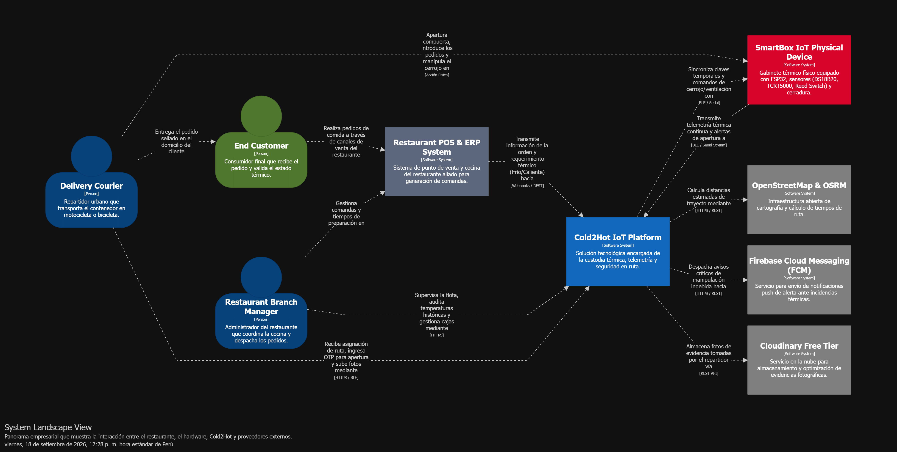
</div>

#### 4.1.3.2. Software Architecture Context Level Diagrams.

El diagrama de contexto (Context Diagram) delimita formalmente la frontera perimetral del software de Cold2Hot IoT Platform System, representándolo como una caja negra central e identificando exclusivamente a sus usuarios directos y a los sistemas con los que establece enlaces de comunicación síncrona o asíncrona.

A diferencia del panorama global, en esta vista el foco se concentra en el sistema de software desarrollado por IoTeam:

- Delivery Operations Administrator: Interactúa con la plataforma a través de canales seguros HTTPS/TLS para configurar rangos térmicos admisibles, monitorear la ubicación de la flota y auditar incidentes o aperturas registradas durante los envíos.

- Delivery Operator: Se autentica en el sistema mediante su dispositivo móvil para sincronizar órdenes asignadas, validar códigos de apertura de un solo uso (OTP) y enviar las fotografías que acreditan la entrega exitosa del paquete.

- SmartBox IoT Hardware Enclosure: Representa el entorno ciberfísico en ruta (microcontrolador ESP32 NodeMCU, bus One-Wire con sensor DS18B20, entradas digitales para Reed Switch y TCRT5000, actuador de ventilación y cerrojo mecánico solenoide). Este dispositivo actúa como un sistema externo que transmite flujos continuos de telemetría y eventos de intrusión vía serial o Bluetooth Low Energy (BLE), y recibe órdenes de desbloqueo físico emitidas por el software.

- Sistemas Externos de Soporte: El sistema delega responsabilidades no troncales consumiendo las APIs REST gratuitas de OpenStreetMap & OSRM para la geolocalización, Firebase Cloud Messaging para la emisión de notificaciones push prioritarias, y Cloudinary para la persistencia y distribución de archivos multimedia de auditoría.

<div align="center">
    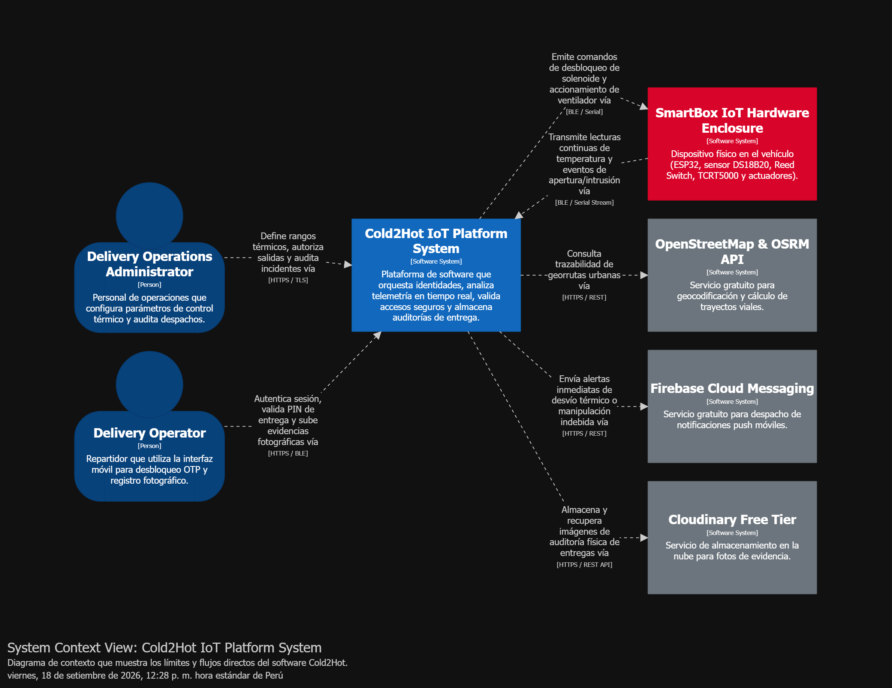
</div>

#### 4.1.3.3. Software Architecture Container Level Diagrams.

El diagrama de contenedores descompone el sistema Cold2Hot en sus unidades fundamentales de ejecución y despliegue desacopladas, definiendo las responsabilidades funcionales, las tecnologías seleccionadas y los protocolos de integración entre cada bloque:

- Landing Page: Sitio web estático desarrollado con HTML5, CSS3 y JavaScript vanilla. Su función principal es exponer la propuesta de valor comercial de IoTeam, planes de suscripción para restaurantes y enlaces de redirección hacia las aplicaciones operativas. 

- Delivery Admin Web Application: Aplicación web cliente desarrollada con Angular y TypeScript, estructurada bajo el sistema de diseño Material Design mediante la biblioteca Angular Material. Proporciona a los administradores un panel de control interactivo para la gestión de despachos, visualización de métricas térmicas y auditoría de incidentes.

- Delivery Operator Mobile Application: Aplicación móvil multiplataforma desarrollada con Flutter y Dart. Permite al conductor autenticarse, enlazarse vía Bluetooth Low Energy (BLE) con la SmartBox más cercana, digitar el PIN OTP de apertura y tomar la fotografía de comprobación física.

- Cloud Core RESTful API: Servicio backend empresarial desarrollado sobre el marco de trabajo Spring Boot en Java. Centraliza las reglas de negocio globales, gestiona la persistencia de datos, valida accesos e identidades (IAM) y orquesta la comunicación con los servicios externos gratuitos (FCM, Cloudinary, OSRM).

- Cloud Relational Database: Instancia de base de datos relacional PostgreSQL que almacena los registros de usuarios, configuraciones de cajas térmicas, historiales de pedidos y eventos de auditoría.

- Edge Service: Microservicio intermedio desarrollado en Python utilizando el microframework Flask y Peewee ORM. Se ejecuta en el hardware del contenedor para procesar señales analíticas locales, evaluar discrepancias inmediatas de seguridad y garantizar la operación de desbloqueo incluso en escenarios con pérdida total de conectividad a internet.

- Edge Local Database: Base de datos relacional ligera basada en SQLite que almacena en caché local las claves temporales activas y los últimos registros de telemetría pendientes de sincronización con la nube.

<div align="center">
    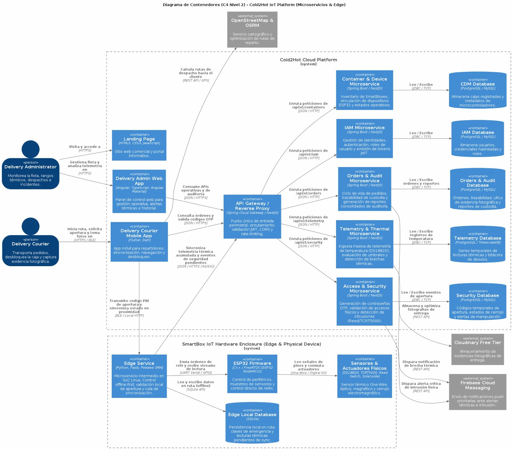
</div>

#### 4.1.3.4. Software Architecture Deployment Diagrams.

El diagrama de despliegue detalla la topología de infraestructura física y en la nube donde residen los contenedores de software en un entorno de producción, garantizando alta disponibilidad con costes controlados mediante esquemas Free Tier:

- Estación de Trabajo del Administrador (Hardware de Escritorio): Los administradores acceden a través de navegadores web estándar (Chrome, Firefox, Safari o Edge) a la Landing Page y a la Delivery Admin Web Application, las cuales son servidas de manera estática y con certificados SSL activos mediante la plataforma PaaS gratuita de Vercel o GitHub Pages.

- Dispositivo Móvil del Repartidor (Smartphone Android/iOS): Aloja localmente la Delivery Operator Mobile Application instalada. El teléfono se comunica simultáneamente con la nube mediante HTTPS/4G-5G y con la SmartBox a través de su antena Bluetooth Low Energy (BLE).

- Gabinete Físico SmartBox (Entorno Edge e IoT en Vehículo): Compuesto por un computador de placa reducida (SoC Linux) que hospeda el Edge Service y la base de datos SQLite, interconectado por comunicación serial UART/GPIO al microcontrolador ESP32 NodeMCU, el cual gestiona directamente los pines de los sensores DS18B20, TCRT5000, Reed Switch y el relé de apertura.

- Infraestructura Cloud Gratuita (PaaS / BaaS):

    - El Cloud Core RESTful API opera en un contenedor virtualizado dentro de los servicios gratuitos de Render Free Web Service.   

    - La persistencia transaccional reside en una base de datos gestionada PostgreSQL provista por el nivel gratuito de Supabase.

    - El repositorio multimedia de evidencias opera bajo la capa gratuita de Cloudinary, la cual almacena las capturas optimizadas sin consumo de disco en el servidor principal. 

<div align="center">
    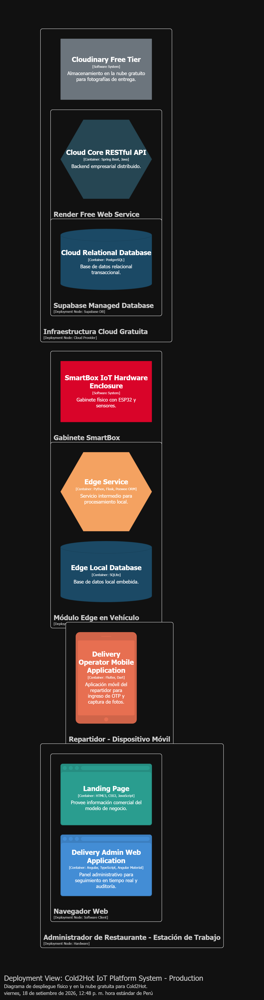
</div>

## 4.2. Tactical-Level Domain-Driven Design

### 4.2.1. Bounded Context: Identity & Access (IAM)

El contexto delimitado IAM gestiona integralmente el registro, autenticación, autorización y emisión de credenciales criptográficas para todos los actores que interactúan con la plataforma Cold2Hot. Asegura la separación de privilegios entre los administradores de operaciones del restaurante y los operadores de entrega (repartidores), garantizando un acceso restringido y trazable a los recursos del sistema.

#### 4.2.1.1. Domain Layer.

La capa de dominio constituye el núcleo de la lógica del contexto IAM, implementada sin dependencias de frameworks ni bibliotecas de persistencia. Encapsula las reglas del negocio relacionadas con la validez de credenciales, la seguridad de contraseñas y el ciclo de vida de los perfiles de usuario.

- User (Aggregate Root)
  - Propósito: Modela la entidad principal del sistema, centralizando la comprobación de credenciales, el cambio de contraseña y las transiciones de estado operativo.
  - Atributos:
    - id: UserId
    - email: Email
    - password: HashedPassword
    - fullName: FullName
    - role: Role
    - isActive: Boolean
  - Métodos:
    - + authenticate(plainPassword: String, passwordEncoder: IPasswordEncoder): Boolean
      - Verifica si la contraseña proporcionada coincide con el hash almacenado mediante el servicio de dominio de cifrado.
    - + updateProfile(fullName: FullName): void
      - Actualiza los nombres y apellidos manteniendo la inmutabilidad de la identidad.
    - + changePassword(oldPass: String, newPass: String, encoder: IPasswordEncoder): void
      - Evalúa la contraseña anterior y asigna una nueva después de validar complejidad y cifrado.
    - + deactivate(): void
      - Inhabilita la cuenta para impedir futuros inicios de sesión.

- UserId (Value Object)
  - Propósito: Representa de forma unívoca e inmutable el identificador universal del usuario (UUID v4).
  - Atributos:
    - value: UUID
  - Métodos:
    - + getValue(): UUID
    - + equals(other: Object): Boolean

- Email (Value Object)
  - Propósito: Modela la dirección electrónica y garantiza el cumplimiento del formato estándar RFC 5322.
  - Atributos:
    - address: String
  - Métodos:
    - + getAddress(): String
    - - validate(address: String): void

- HashedPassword (Value Object)
  - Propósito: Encapsula la cadena cifrada resultante del proceso de hashing de contraseña mediante un algoritmo seguro, evitando que valores en texto plano residan en el modelo de dominio.
  - Atributos:
    - hash: String
  - Métodos:
    - + getHash(): String
    - + matches(raw: String, encoder: IPasswordEncoder): Boolean

- FullName (Value Object)
  - Propósito: Representa la composición inmutable del nombre y apellido de la persona titular de la cuenta.
  - Atributos:
    - firstName: String
    - lastName: String
  - Métodos:
    - + getFullName(): String

- Role (Entity)
  - Propósito: Define el esquema de privilegios asignados al usuario para el control de acceso basado en roles (RBAC).
  - Atributos:
    - id: Long
    - name: RoleType
    - description: String
  - Métodos:
    - + getName(): RoleType

- RoleType (Enumeration)
  - Propósito: Lista los roles autorizados en la plataforma.
  - Valores: ROLE_ADMIN, ROLE_DELIVERY_OPERATOR.

- IPasswordEncoder (Domain Service Interface)
  - Propósito: Contrato de abstracción que delega el hashing criptográfico sin acoplar el dominio a librerías de seguridad externas.
  - Métodos:
    - + encode(rawPassword: String): String
    - + matches(rawPassword: String, encodedPassword: String): Boolean

- IUserRepository (Repository Interface)
  - Propósito: Define los métodos de acceso y consulta a la persistencia del agregado User.
  - Métodos:
    - + findById(id: UserId): Optional<User>
    - + findByEmail(email: Email): Optional<User>
    - + existsByEmail(email: Email): Boolean
    - + save(user: User): User

- Domain Events
  - UserRegisteredEvent: Se emite cuando se crea una nueva cuenta en el sistema. Incluye userId, email, role y occurredOn.
  - UserAuthenticatedEvent: Notifica un inicio de sesión exitoso para fines de auditoría.

#### 4.2.1.2. Interface Layer.

Actúa como el perímetro de entrada de solicitudes externas hacia el contexto, exponiendo controladores HTTP bajo el estilo arquitectónico RESTful y documentados mediante la especificación OpenAPI.

- AuthController (REST Controller)
  - Propósito: Expone endpoints públicos para el ingreso a la plataforma y el alta inicial de usuarios.
  - Métodos:
    - + register(request: RegisterUserRequestDto): ResponseEntity<ApiResponse`<UserDto>`>
      - Gestiona la petición POST /api/v1/auth/register.
    - + login(request: LoginRequestDto): ResponseEntity<ApiResponse`<AuthTokenDto>`>
      - Gestiona la petición POST /api/v1/auth/login.

- UserController (REST Controller)
  - Propósito: Expone endpoints protegidos para la consulta de información del perfil y la actualización de datos de cuenta.
  - Métodos:
    - + getProfile(principal: UserPrincipal): ResponseEntity<ApiResponse`<UserDto>`>
      - Procesa la petición GET /api/v1/users/me.
    - + updateProfile(principal: UserPrincipal, request: UpdateProfileRequestDto): ResponseEntity<ApiResponse<Void>>
      - Procesa la petición PUT /api/v1/users/me.

- Data Transfer Objects (DTOs)
  - RegisterUserRequestDto: Objeto con los datos de entrada para registro (email, password, firstName, lastName, role).
  - LoginRequestDto: Objeto de entrada con las credenciales de acceso (email, password).
  - AuthTokenDto: Respuesta con el token generado (token, tokenType, expiresIn).
  - UserDto: Proyección segura del usuario sin información sensible (id, email, firstName, lastName, role, isActive).

#### 4.2.1.3. Application Layer.

Coordina los flujos de trabajo de los casos de uso implementando el patrón CQRS para desacoplar las operaciones de escritura (comandos) de las lecturas (consultas).

- RegisterUserCommand & RegisterUserCommandHandler
  - Propósito: Traslada la intención de crear un usuario en el sistema.
  - El manejador valida que el correo electrónico no esté en uso, codifica la contraseña mediante IPasswordEncoder, construye el agregado User, lo almacena mediante el repositorio y publica el evento UserRegisteredEvent.
  - Métodos del handler:
    - + handle(command: RegisterUserCommand): UserId

- AuthenticateUserCommand & AuthenticateUserCommandHandler
  - Propósito: Traslada las credenciales para la autenticación.
  - El manejador busca al usuario por correo, invoca el método authenticate del agregado y, si la validación es correcta, solicita al adaptador de seguridad la generación de un token JWT firmado.
  - Métodos del handler:
    - + handle(command: AuthenticateUserCommand): AuthTokenDto

- GetUserByIdQuery & GetUserByIdQueryHandler
  - Propósito: Recupera el estado actual del perfil solicitado y lo transforma en un DTO de solo lectura.
  - Métodos del handler:
    - + handle(query: GetUserByIdQuery): UserDto

#### 4.2.1.4. Infrastructure Layer.

Proporciona las implementaciones tecnológicas concretas para las interfaces definidas por las capas internas de la arquitectura.

- UserRepositoryImpl
  - Propósito: Implementa el contrato IUserRepository utilizando Spring Data JPA para comunicarse con la base de datos relacional MySQL.
  - Componentes: Inyecta SpringDataJpaUserRepository y utiliza UserPersistenceMapper para convertir entre la entidad de persistencia (UserEntity) y el agregado de dominio puro (User).

- BCryptPasswordEncoderAdapter
  - Propósito: Implementa la interfaz IPasswordEncoder utilizando Spring Security Crypto para generar hashes BCrypt con un factor de costo configurable.

- JwtTokenProvider
  - Propósito: Gestiona la creación, firma criptográfica (algoritmo HMAC-SHA256) y validación de tokens de acceso web JWT mediante la biblioteca JJWT.
  - Métodos:
    - + generateToken(userId: UUID, email: String, role: String): String
    - + validateToken(token: String): Boolean
    - + getEmailFromToken(token: String): String

- UserEntity & RoleEntity
  - Propósito: Clases anotadas con JPA (@Entity, @Table) que definen el mapeo objeto-relacional directo contra las tablas iam_users e iam_roles en MySQL.   

#### 4.2.1.5. Bounded Context Software Architecture Component Level Diagrams.

El diagrama de componentes (C4 Nivel 3) ilustra la organización estructural interna del contenedor backend Cloud Core RESTful API para dar soporte al contexto IAM. Refleja el flujo de llamadas desde las aplicaciones cliente hacia los controladores REST, la delegación hacia los manejadores de comandos de la capa de aplicación, la invocación de las entidades del modelo de dominio y la resolución técnica de persistencia ejecutada por los repositorios hacia la base de datos relacional MySQL.

<div align="center">
    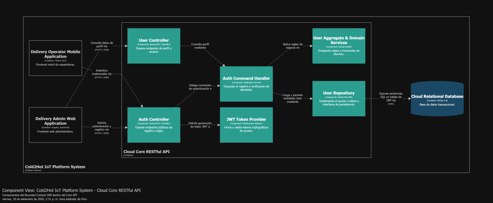
</div>

#### 4.2.1.6. Bounded Context Software Architecture Code Level Diagrams.

##### 4.2.1.6.1. Bounded Context Domain Layer Class Diagrams.

El diagrama de clases UML modela las entidades, objetos de valor, interfaces y enumeraciones que conforman exclusivamente la capa de dominio de IAM, especificando la visibilidad de atributos (+, -), las firmas de métodos y las relaciones de asociación, dependencia y composición.

<div align="center">
    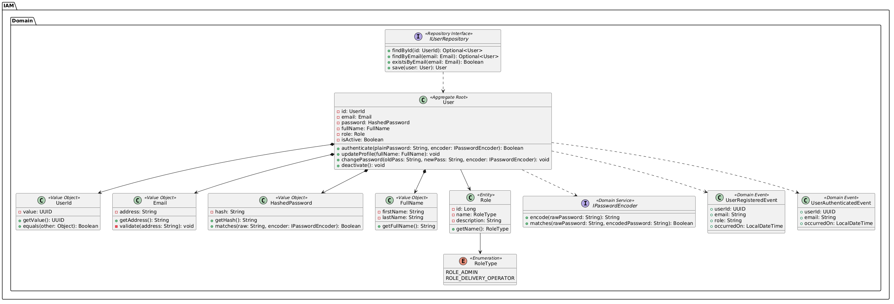
</div>

##### 4.2.1.6.2. Bounded Context Database Design Diagram.

El diseño de persistencia para el contexto IAM se implementa en el motor relacional MySQL 8.0. Está compuesto por dos tablas normalizadas: iam_roles, que actúa como catálogo de tipos de privilegios del sistema, e iam_users, que almacena las identidades y credenciales de los usuarios. La integridad referencial se preserva mediante una clave foránea que restringe la eliminación de roles asignados a usuarios activos, y se incluye un índice sobre la columna email para agilizar las operaciones de búsqueda durante la autenticación.

<div align="center">
    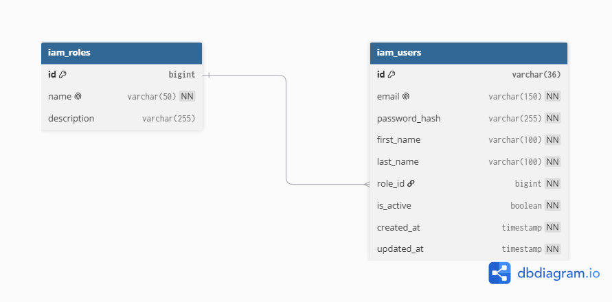
</div>

### 4.2.2. Bounded Context: Container & Device Management

El contexto delimitado Container & Device Management se encarga de administrar el ciclo de vida, la disponibilidad operativa y la vinculación del hardware de los contenedores térmicos inteligentes (SmartBoxes) con sus respectivos microcontroladores ESP32 y sensores IoT.

#### 4.2.2.1. Domain Layer.

Encapsula las reglas del negocio asociadas al inventario de cajas de reparto, la compatibilidad física de carga, la calibración de sensores y las transiciones de estado operativo.

- SmartBox (Aggregate Root)
  - Propósito: Entidad raíz que controla el estado operativo del contenedor físico, sus especificaciones mecánicas y el hardware embebido asociado.
  - Atributos:
    - id: SmartBoxId
    - serialNumber: SerialNumber
    - operationalStatus: BoxStatus
    - device: ESP32Device
    - maxPayloadWeightKg: Double
  - Métodos:
    - + pairDevice(device: ESP32Device): void
      - Asocia un microcontrolador verificado garantizando que no esté vinculado a otra unidad activa.
    - + markInTransit(): void
      - Modifica el estado a IN_TRANSIT cuando la caja es asignada a un despacho en ruta.
    - + markAvailable(): void
      - Restablece el estado a AVAILABLE tras la conclusión exitosa de una entrega.
    - + sendToMaintenance(reason: String): void
      - Inhabilita la caja para operaciones de reparto ante fallas de hardware o calibración.

- ESP32Device (Entity)
  - Propósito: Modela el microcontrolador físico y los módulos de telemetría instalados en el contenedor.
  - Atributos:
    - id: DeviceId
    - macAddress: MacAddress
    - firmwareVersion: FirmwareVersion
    - batteryLevel: Integer
    - isConnected: Boolean
  - Métodos:
    - + updateBattery(level: Integer): void
      - Registra el nivel porcentual remanente de energía de la batería.
    - + updateFirmware(version: FirmwareVersion): void
      - Actualiza la versión de software embebido tras un proceso de flasheo u OTA.
    - + markDisconnected(): void
      - Registra la pérdida de comunicación con la unidad de procesamiento.

- SmartBoxId (Value Object)
  - Propósito: Identificador unívoco e inmutable de la caja térmica (UUID v4).
  - Atributos:
    - value: UUID
  - Métodos:
    - + getValue(): UUID
    - + equals(other: Object): Boolean

- DeviceId (Value Object)
  - Propósito: Identificador universal inmutable del microcontrolador (UUID v4).
  - Atributos:
    - value: UUID
  - Métodos:
    - + getValue(): UUID

- MacAddress (Value Object)
  - Propósito: Dirección física de red del chip ESP32 (formato XX:XX:XX:XX:XX:XX).
  - Atributos:
    - value: String
  - Métodos:
    - + getValue(): String
    - - validate(value: String): void

- SerialNumber (Value Object)
  - Propósito: Código alfanumérico grabado en el chasis físico del contenedor para identificación visual.
  - Atributos:
    - code: String
  - Métodos:
    - + getCode(): String

- FirmwareVersion (Value Object)
  - Propósito: Representación formal del versionado semántico del firmware embebido (vX.Y.Z).
  - Atributos:
    - versionString: String
  - Métodos:
    - + getVersion(): String

- BoxStatus (Enumeration)
  - Propósito: Estados válidos para el flujo operativo de los contenedores.
  - Valores: AVAILABLE, IN_TRANSIT, MAINTENANCE, DECOMMISSIONED.

- ISmartBoxRepository (Repository Interface)
  - Propósito: Contrato abstracto para la persistencia transaccional del agregado SmartBox.
  - Métodos:
    - + findById(id: SmartBoxId): Optional<SmartBox>
    - + findBySerialNumber(sn: SerialNumber): Optional<SmartBox>
    - + findByMacAddress(mac: MacAddress): Optional<SmartBox>
    - + save(box: SmartBox): SmartBox

- Domain Events
  - SmartBoxRegisteredEvent: Emite la incorporación de un nuevo contenedor con smartBoxId, serialNumber y occurredOn.
  - DevicePairedToSmartBoxEvent: Notifica la asociación exitosa de hardware con smartBoxId, deviceId, macAddress y occurredOn.
  - SmartBoxStatusChangedEvent: Notifica las transiciones de estado operativo con smartBoxId, newStatus y occurredOn.

#### 4.2.2.2. Interface Layer.

Punto perimetral de recepción de peticiones desde el panel de control web y desde el servicio Edge.

- SmartBoxController (REST Controller)
  - Propósito: Expone endpoints administrativos para la gestión del inventario y la vinculación de hardware.
  - Métodos:
    - + registerBox(request: RegisterBoxRequestDto): ResponseEntity<ApiResponse`<SmartBoxDto>`>
      - Maneja POST /api/v1/smartboxes.
    - + pairDevice(boxId: UUID, request: PairDeviceRequestDto): ResponseEntity<ApiResponse<Void>>
      - Maneja POST /api/v1/smartboxes/{boxId}/pair-device.
    - + getAvailableBoxes(): ResponseEntity<ApiResponse<List`<SmartBoxDto>`>>
      - Maneja GET /api/v1/smartboxes/available.

- DeviceStateController (REST Controller)
  - Propósito: Endpoint técnico consumido por el contenedor Edge Service para reportar latidos operativos (heartbeats) y telemetría de batería.
  - Métodos:
    - + reportHeartbeat(request: HeartbeatRequestDto): ResponseEntity<Void>
      - Maneja POST /api/v1/devices/heartbeat.

- Data Transfer Objects (DTOs)
  - RegisterBoxRequestDto: serialNumber, maxPayloadWeightKg.
  - PairDeviceRequestDto: macAddress, initialFirmware.
  - HeartbeatRequestDto: macAddress, batteryLevel, isConnected.
  - SmartBoxDto: id, serialNumber, operationalStatus, deviceMacAddress, maxPayloadWeightKg.

#### 4.2.2.3. Application Layer.

Orquesta los casos de uso implementando CQRS, coordinando repositorios de persistencia y publicadores de eventos.

- RegisterSmartBoxCommand & RegisterSmartBoxCommandHandler
  - Propósito: Coordina la verificación de duplicados por número de serie, instancia el agregado SmartBox, invoca la persistencia y emite el evento de creación.
  - Métodos del handler:
    - + handle(command: RegisterSmartBoxCommand): SmartBoxId

- PairDeviceCommand & PairDeviceCommandHandler
  - Propósito: Valida la existencia del contenedor, crea la entidad ESP32Device tras validar su MacAddress, ejecuta SmartBox.pairDevice(...) y guarda los cambios.
  - Métodos del handler:
    - + handle(command: PairDeviceCommand): void

- UpdateBoxStatusCommand & UpdateBoxStatusCommandHandler
  - Propósito: Ejecuta las transiciones controladas de disponibilidad según eventos de despacho o retorno.
  - Métodos del handler:
    - + handle(command: UpdateBoxStatusCommand): void

- GetAvailableSmartBoxesQuery & GetAvailableSmartBoxesQueryHandler
  - Propósito: Consulta los contenedores aptos para ser asignados a nuevos despachos y los transforma a DTOs.
  - Métodos del handler:
    - + handle(query: GetAvailableSmartBoxesQuery): List`<SmartBoxDto>`

#### 4.2.2.4. Infrastructure Layer.

Implementa la persistencia concreta sobre el motor relacional MySQL mediante adaptadores transaccionales.

- SmartBoxRepositoryImpl
  - Propósito: Implementa el contrato ISmartBoxRepository mediante Spring Data JPA.
  - Componentes: Inyecta SpringDataJpaSmartBoxRepository y utiliza SmartBoxPersistenceMapper para la conversión bidireccional entre las entidades de persistencia y los agregados de dominio.

- SmartBoxEntity & ESP32DeviceEntity
  - Propósito: Mapeo relacional JPA para las tablas cdm_smart_boxes y cdm_devices.
  - Atributos clave: Anotaciones @Entity, @Table, @OneToOne y @JoinColumn para garantizar la integridad referencial. 

#### 4.2.2.5. Bounded Context Software Architecture Component Level Diagrams.

El diagrama de componentes (C4 Nivel 3) descompone la estructura interna del contenedor backend Cloud Core RESTful API para aislar las responsabilidades operativas asociadas al inventario de cajas inteligentes y al monitoreo del hardware embebido.

- Controladores REST y perímetro de entrada: la interacción externa se canaliza a través de dos componentes especializados. Por un lado, SmartBoxController atiende las peticiones HTTP del administrador desde la aplicación web, procesando solicitudes de alta física de contenedores (POST /api/v1/smartboxes), vinculación de microcontroladores y consultas de disponibilidad de unidades. Por otro lado, DeviceStateController actúa como receptor de telemetría operativa, habilitando un canal ligero para que el contenedor Edge Service reporte periódicamente latidos de conectividad (heartbeats) y niveles de carga de la batería mediante transferencias JSON.

- Orquestación en la capa de aplicación: el componente SmartBoxCommandHandler desacopla la recepción HTTP de la lógica interna de negocio. Este servicio de aplicación implementa transaccionalidad declarativa, valida restricciones de unicidad sobre las direcciones MAC y números de serie, invoca los métodos de mutación sobre la raíz de agregado y coordina la persistencia delegando el resultado al publicador de eventos del dominio.

- Aislamiento del modelo de dominio: el componente SmartBox Aggregate & Entities encapsula las invariantes de negocio puras. Garantiza que una caja no pueda asociarse a más de un dispositivo ESP32 en simultáneo, previene transiciones de estado inválidas, como impedir que una unidad en mantenimiento pase a tránsito sin previa verificación técnica, y asegura que las dimensiones de carga no excedan la capacidad estructural establecida.

- Persistencia y acceso a datos: la persistencia se resuelve mediante el componente SmartBox Repository, el cual implementa el contrato ISmartBoxRepository mediante abstracciones de Spring Data JPA. Este componente traduce el agregado de dominio en esquemas relacionales a través de mapeadores especializados (SmartBoxPersistenceMapper), interactuando mediante conexiones transaccionales JDBC hacia el motor relacional MySQL.

<div align="center">
    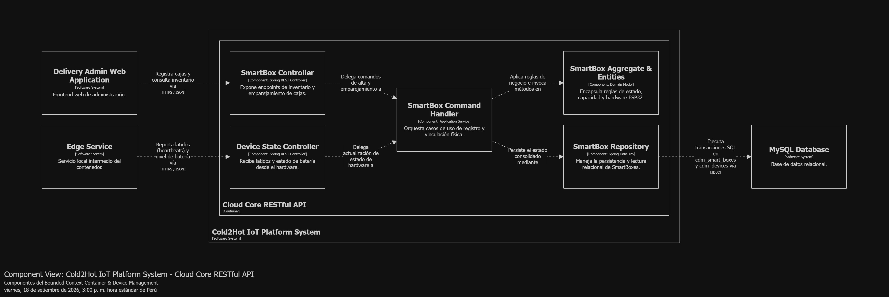
</div>

#### 4.2.2.6. Bounded Context Software Architecture Code Level Diagrams.

##### 4.2.2.6.1. Bounded Context Domain Layer Class Diagrams.

El diagrama de clases UML modela las entidades, objetos de valor e interfaces que definen el núcleo del bounded context Container & Device Management, estructurado según los patrones tácticos de Domain-Driven Design sin dependencias de infraestructura.

- Raíz de agregado (SmartBox): centraliza el ciclo de vida del contenedor. Mantiene visibilidad privada en todos sus atributos (-) para forzar la encapsulación estricta. La modificación de su estado operativo se rige por métodos públicos de negocio como markInTransit(), markAvailable() y sendToMaintenance(reason: String), garantizando que cualquier cambio de disponibilidad esté respaldado por un motivo auditable.

- Entidad interna (ESP32Device): modela el microcontrolador físicamente montado en el chasis térmico. Posee identidad propia mediante el objeto de valor DeviceId y contiene la lógica para registrar variaciones en el porcentaje de batería mediante updateBattery(level: Integer), así como la actualización de su firmware tras despliegues inalámbricos mediante updateFirmware(version: FirmwareVersion).

- Objetos de valor inmutables (Value Objects): proveen semántica al dominio. MacAddress valida internamente el formato hexadecimal físico estándar del chip Wi‑Fi/Bluetooth del ESP32; SerialNumber asegura la trazabilidad alfanumérica grabada en el chasis; y FirmwareVersion encapsula el control de versiones semántico (vX.Y.Z). La inmutabilidad de estos elementos garantiza que dos instancias con idéntico valor representen el mismo concepto en memoria sin efectos colaterales.

- Relaciones y multiplicidades del modelo:
  - Composición fuerte (1 a 0..1): SmartBox contiene a ESP32Device, lo que implica que el dispositivo físico forma parte estructural del ciclo de vida del contenedor dentro del contexto operativo.
  - Asociaciones de composición (1 a 1): los objetos de valor SmartBoxId, SerialNumber, DeviceId, MacAddress y FirmwareVersion componen indivisiblemente a sus entidades correspondientes.
  - Realización de interfaces: la interface abstracta ISmartBoxRepository declara las operaciones de guardado y búsqueda por dirección MAC o número de serie, sirviendo de contrato para que la capa de infraestructura provea su implementación sin acoplar el núcleo de dominio.

<div align="center">
    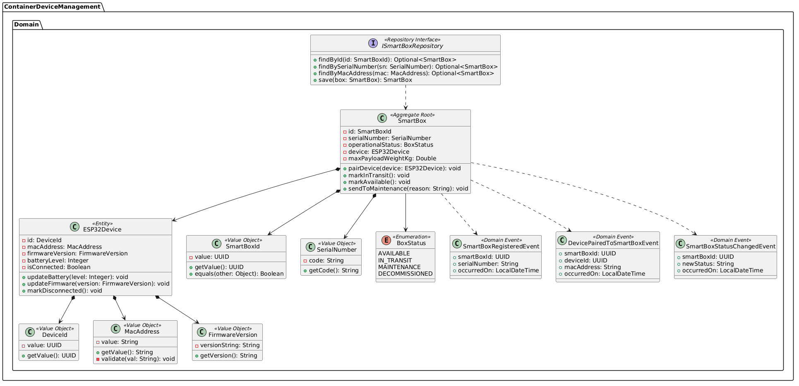
</div>

##### 4.2.2.6.2. Bounded Context Database Design Diagram.

El diseño relacional para el bounded context Container & Device Management se implementa en MySQL 8.0, garantizando normalización formal en tercera forma normal (3FN) y atomicidad transaccional (ACID).

- Tabla cdm_devices:
  - Almacena las características técnicas y el estado de enlace del hardware.
  - id: clave primaria de longitud fija (VARCHAR(36)) para alojar identificadores UUID v4 generados en el dominio.
  - mac_address: cadena de longitud fija (VARCHAR(17)) con restricción de unicidad (UNIQUE) e índice dedicado (idx_cdm_devices_mac) para acelerar las validaciones durante el emparejamiento.
  - battery_level: entero validado entre 0 y 100 con valor por defecto de 100.
  - last_heartbeat: marca de tiempo configurada con actualización automática (ON UPDATE CURRENT_TIMESTAMP), permitiendo detectar desbalances de conectividad si transcurre un período prolongado sin reportes.

- Tabla cdm_smart_boxes:
  - Gestiona las unidades de transporte asignables a los despachos.
  - id: clave primaria de tipo UUID (VARCHAR(36)).
  - serial_number: identificador físico con restricción única (UNIQUE) indexado para consultas operativas rápidas.
  - operational_status: almacena el valor textual del enum (AVAILABLE, IN_TRANSIT, MAINTENANCE, DECOMMISSIONED), respaldado por el índice idx_cdm_smart_boxes_status para optimizar las consultas de cajas disponibles al momento del despacho.
  - max_payload_weight_kg: valor decimal de precisión fija (DECIMAL(5,2)) para evitar errores de redondeo en cálculos de capacidad de carga.

- Integridad referencial y relaciones:
  - La vinculación entre el contenedor y el dispositivo se establece mediante la clave foránea device_id en cdm_smart_boxes, la cual apunta a cdm_devices.id.
  - Cuenta con restricción de unicidad (UNIQUE), forzando una relación estricta de uno a uno (1:1) entre una caja y un módulo ESP32.
  - La regla de eliminación está definida como ON DELETE SET NULL, garantizando que si un dispositivo ESP32 es dado de baja por avería o reemplazo en laboratorio, el registro histórico del contenedor SmartBox se preserve sin generar inconsistencias de integridad referencial. 

<div align="center">
    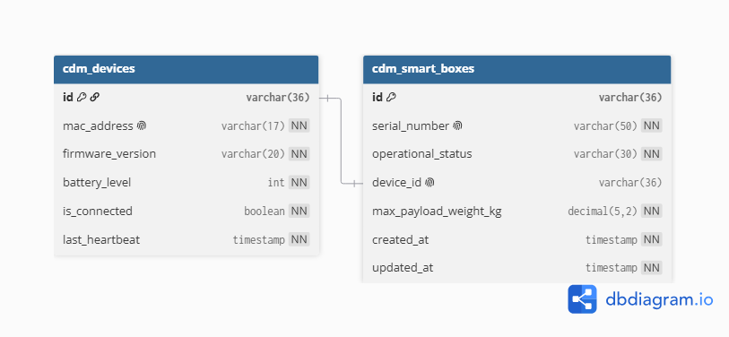
</div>

### 4.2.3. Bounded Context: Thermal Monitoring & Telemetry

El contexto delimitado Thermal Monitoring & Telemetry concentra la lógica relacionada con la recepción, validación, procesamiento y trazabilidad de la telemetría térmica generada por las SmartBoxes durante el transporte de los pedidos. Su responsabilidad principal es transformar las lecturas provenientes del hardware IoT en información de dominio que permita determinar si las condiciones térmicas del envío se mantienen dentro de los límites configurados.

#### 4.2.3.1. Domain Layer.

La capa de dominio constituye el núcleo de las reglas de negocio del contexto Thermal Monitoring & Telemetry, manteniéndose independiente de frameworks, mecanismos de persistencia y servicios externos. Su función es representar el concepto de perfil térmico y establecer las reglas necesarias para interpretar cada lectura de temperatura.

- ThermalProfile (Aggregate Root)
  - Propósito: Representa la configuración térmica asociada a un envío monitoreado, centralizando los límites de temperatura que determinan las condiciones aceptables durante el transporte.
  - Atributos:
    - id: ThermalProfileId
    - orderId: OrderId
    - temperatureMode: TemperatureMode
    - thresholdRange: ThresholdRange
    - isActive: Boolean
  - Métodos:
    - + configureRange(range: ThresholdRange): void
      - Establece los límites mínimo y máximo permitidos para el transporte.
    - + evaluateTemperature(temperature: TemperatureValue): ThermalStatus
      - Determina si una lectura se encuentra dentro o fuera del rango configurado.
    - + deactivate(): void
      - Inhabilita el perfil térmico cuando finaliza el monitoreo del envío.

- TelemetryLog (Entity)
  - Propósito: Representa una lectura individual de telemetría térmica obtenida desde una SmartBox.
  - Atributos:
    - id: TelemetryLogId
    - smartBoxId: SmartBoxId
    - temperature: TemperatureValue
    - timestamp: Timestamp
    - status: ThermalStatus
  - Métodos:
    - + markAsNormal(): void
    - + markAsBreach(): void
    - + isWithinRange(profile: ThermalProfile): Boolean

- ThermalProfileId (Value Object)
  - Propósito: Representa de manera única e inmutable el identificador del perfil térmico.
  - Atributos:
    - value: UUID
  - Métodos:
    - + getValue(): UUID
    - + equals(other: Object): Boolean
- TelemetryLogId (Value Object)
  - Propósito: Identifica de forma única cada registro histórico de telemetría.
  - Atributos:
    - value: UUID
  - Métodos:
    - + getValue(): UUID

- TemperatureValue (Value Object)
  - Propósito: Encapsula el valor numérico de temperatura y evita que el dominio trabaje con valores sin validación.
  - Atributos:
    - value: Decimal
    - unit: CelsiusUnit
  - Métodos:
    - + getValue(): Decimal
    - + isValid(): Boolean

- CelsiusUnit (Value Object)
  - Propósito: Representa la unidad de temperatura utilizada por el sistema.
  - Atributos:
    - symbol: String
  - Métodos:
    - + getSymbol(): String

- Timestamp (Value Object)
  - Propósito: Representa el instante exacto en el que fue obtenida una lectura.
  - Atributos:
    - value: DateTime
  - Métodos:
    - + getValue(): DateTime

- ThresholdRange (Value Object)
  - Propósito: Encapsula los límites mínimo y máximo que determinan el rango térmico permitido.
  - Atributos:
    - minTemperature: TemperatureValue
    - maxTemperature: TemperatureValue
  - Métodos:
    - + contains(temperature: TemperatureValue): Boolean
    - + isExceeded(temperature: TemperatureValue): Boolean

- TemperatureMode (Enumeration)
  - Propósito: Define el tipo de conservación térmica requerido por el pedido.
  - Valores: COLD, HOT.

- ThermalStatus (Enumeration)
  - Propósito: Define el resultado de la evaluación de una lectura.
  - Valores: WITHIN_RANGE, THERMAL_BREACH.

- IThermalProfileRepository (Repository Interface)
  - Propósito: Define el contrato abstracto para la persistencia del agregado ThermalProfile.
  - Métodos:
    - + findById(id: ThermalProfileId): Optional
    - + findByOrderId(orderId: OrderId): Optional
    - + save(profile: ThermalProfile): ThermalProfile

- ITelemetryRepository (Repository Interface)
  - Propósito: Define las operaciones necesarias para persistir y consultar los registros históricos de telemetría.
  - Métodos:
    - + save(log: TelemetryLog): TelemetryLog
    - + findLatestBySmartBoxId(boxId: SmartBoxId): Optional
    - + findBySmartBoxIdAndPeriod(boxId: SmartBoxId, period: TimeRange): List

- Domain Events
  - TelemetryIngestedEvent: Se emite cuando una lectura de temperatura ha sido recibida y registrada correctamente.
  - ThermalProfileConfiguredEvent: Notifica la creación o actualización de un perfil térmico.
  - ThermalBreachDetectedEvent: Se emite cuando una lectura supera los límites establecidos para el envío.

#### 4.2.3.2. Interface Layer.

La capa de interfaz constituye el perímetro de comunicación del contexto, recibiendo las lecturas procedentes del Edge Service y exponiendo operaciones protegidas para la configuración y consulta del monitoreo térmico..

- TelemetryController (REST Controller)
  - Propósito: Recibe los registros de temperatura generados por las SmartBoxes.
  - Métodos:
    - + ingestTelemetry(request: IngestTelemetryRequestDto): ResponseEntity`<ApiResponse>`
      - Maneja POST /api/v1/telemetry.
    - + getCurrentTemperature(boxId: UUID): ResponseEntity`<ApiResponse>`
      - Maneja GET /api/v1/telemetry/boxes/{boxId}/current.
    - + getHistory(boxId: UUID, request: HistoryRequestDto): ResponseEntity`<ApiResponse>`
      - Maneja GET /api/v1/telemetry/boxes/{boxId}/history.

- ThermalProfileController (REST Controller)
  - Propósito: Permite al administrador configurar las condiciones térmicas de un envío.
  - Métodos:
    - + configureProfile(request: ConfigureThermalProfileRequestDto): ResponseEntity`<ApiResponse>`
      - Maneja POST /api/v1/thermal-profiles.
    - + getProfile(orderId: UUID): ResponseEntity`<ApiResponse>`
      - Maneja GET /api/v1/thermal-profiles/orders/{orderId}.

- Data Transfer Objects (DTOs)
  - IngestTelemetryRequestDto: smartBoxId, temperature, timestamp.
  - ConfigureThermalProfileRequestDto: orderId, temperatureMode, minTemperature, maxTemperature.
  - TelemetryResponseDto: smartBoxId, temperature, timestamp, thermalStatus.
  - ThermalProfileDto: id, orderId, temperatureMode, minTemperature, maxTemperature, isActive.

#### 4.2.3.3. Application Layer.

La capa de aplicación coordina los casos de uso del contexto mediante comandos y consultas, siguiendo el patrón CQRS utilizado en los demás Bounded Contexts del documento de referencia. Los handlers coordinan repositorios, entidades de dominio y publicación de eventos, evitando trasladar la lógica de negocio hacia los controladores.

- IngestTelemetryDataCommand & IngestTelemetryDataCommandHandler
  - Propósito: Procesa una lectura recibida desde el Edge Service.
  - El handler valida la información recibida, recupera el perfil térmico correspondiente, crea TelemetryLog, ejecuta la evaluación de temperatura, persiste el registro y publica TelemetryIngestedEvent.
  - Si la temperatura se encuentra fuera del rango, publica ThermalBreachDetectedEvent..
  - Métodos:
    - + handle(command: IngestTelemetryDataCommand): TelemetryLogId

- SetThermalProfileCommand & SetThermalProfileCommandHandler
  - Propósito: Crea o actualiza los límites térmicos asociados a un envío.
  - Métodos del handler:
    - + handle(command: SetThermalProfileCommand): ThermalProfileId

- ProcessTemperatureReadingCommand & ProcessTemperatureReadingCommandHandler
  - Propósito: Evalúa una lectura contra el perfil térmico activo y determina su estado.
  - Métodos:
    - + handle(command: ProcessTemperatureReadingCommand): ThermalStatus

- GetCurrentTemperatureQuery & GetCurrentTemperatureQueryHandler
  - Propósito: Recupera la última lectura registrada de una SmartBox.
  - Métodos:
    - + handle(query: GetCurrentTemperatureQuery): TelemetryResponseDto

- GetThermalHistoryQuery & GetThermalHistoryQueryHandler
  - Propósito: Recupera el historial de lecturas térmicas para permitir el monitoreo y posterior auditoría.
  - Métodos:
    - + handle(query: GetThermalHistoryQuery): List`<TelemetryResponseDto>`

#### 4.2.3.4. Infrastructure Layer.

La infraestructura implementa los contratos definidos por las capas internas y conecta el modelo de dominio con los servicios tecnológicos de Cold2Hot.

- ThermalProfileRepositoryImpl
  - Propósito: Implementa IThermalProfileRepository mediante Spring Data JPA y MySQL.

  - Utiliza ThermalProfilePersistenceMapper para convertir entre objetos persistentes y objetos de dominio.

- TelemetryRepositoryImpl
  - Propósito: Implementa ITelemetryRepository para almacenar y consultar el historial térmico.
  - Utiliza TelemetryPersistenceMapper para separar el modelo relacional del modelo de dominio.

- TelemetryEntity & ThermalProfileEntity
  - Propósito: Representan el mapeo JPA de las tablas tmt_telemetry_logs y tmt_thermal_profiles.

- EdgeTelemetryAdapter
  - Propósito: Abstrae la recepción de datos provenientes del Edge Service instalado en la SmartBox.

- DomainEventPublisher
  - Propósito: Publica eventos de dominio como ThermalBreachDetectedEvent para que otros componentes puedan generar alertas o registrar auditoría.

- TelemetrySyncAdapter
  - Propósito: Coordina la recepción de lecturas almacenadas temporalmente en SQLite cuando el Edge Service recupera la conectividad.

#### 4.2.3.5. Bounded Context Software Architecture Component Level Diagrams.

El diagrama de componentes C4 Nivel 3 debe representar la estructura interna del Cloud Core RESTful API encargada del procesamiento de la telemetría térmica.
La interacción externa comienza en TelemetryController, que recibe los datos procedentes del Edge Service. La solicitud es transferida al IngestTelemetryDataCommandHandler, encargado de coordinar la evaluación mediante el agregado ThermalProfile, registrar TelemetryLog y publicar los eventos correspondientes.
El componente Thermal Monitoring Domain encapsula las reglas de evaluación térmica mediante ThermalProfile, ThresholdRange y TemperatureValue, evitando que los límites de temperatura sean determinados directamente desde la API.
Finalmente, TelemetryRepository implementa la persistencia mediante Spring Data JPA y MySQL. Cuando se detecta una desviación térmica, DomainEventPublisher publica ThermalBreachDetectedEvent, que puede ser consumido por el mecanismo de notificaciones del sistema.

<div align="center">
    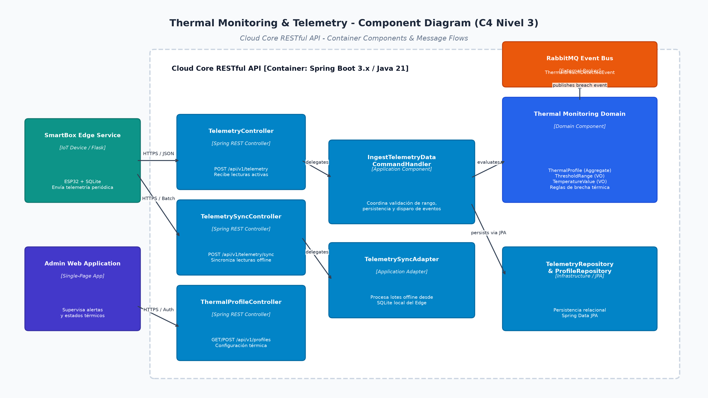
</div>

#### 4.2.3.6. Bounded Context Software Architecture Code Level Diagrams.

##### 4.2.3.6.1. Bounded Context Domain Layer Class Diagrams.

El diagrama de clases UML representa exclusivamente los elementos pertenecientes al dominio de Thermal Monitoring & Telemetry. La raíz de agregado ThermalProfile encapsula los límites térmicos y utiliza ThresholdRange para determinar si una temperatura es válida para las condiciones de transporte.
TelemetryLog representa cada medición individual y se relaciona con TemperatureValue y Timestamp. La interfaz IThermalProfileRepository establece el contrato de persistencia sin introducir dependencias de MySQL 8.0. o Spring Data en el núcleo del dominio.

<div align="center">
    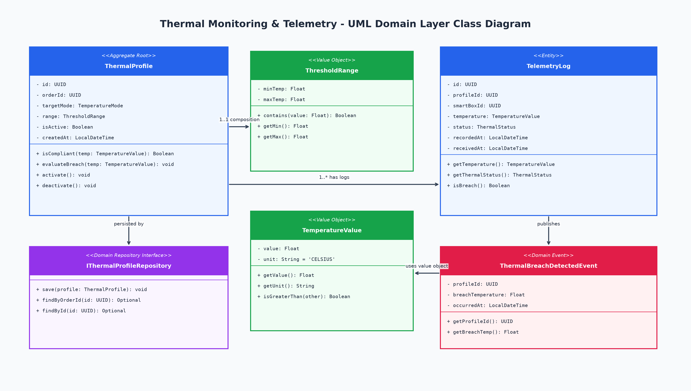
</div>

##### 4.2.3.6.2. Bounded Context Database Design Diagram.

El diseño para el bounded context Thermal Monitoring & Telemetry se implementa en MySQL 8.0. Está compuesto por las tablas normalizadas:

- Tabla tmt_thermal_profiles
  - id: UUID, clave primaria.
  - order_id: UUID del envío asociado.
  - temperature_mode: COLD o HOT.
  - min_temperature: valor decimal.
  - max_temperature: valor decimal.
  - is_active: indicador de vigencia.
  - created_at.
  - updated_at.

- Tabla tmt_telemetry_logs
  - id: UUID, clave primaria.
  - thermal_profile_id: clave foránea.
  - smart_box_id: identificador de la SmartBox.
  - temperature: valor decimal.
  - unit: unidad de medición.
  - thermal_status: resultado de evaluación.
  - recorded_at: timestamp de la lectura.
  - received_at: timestamp de recepción en la nube.

<div align="center">
    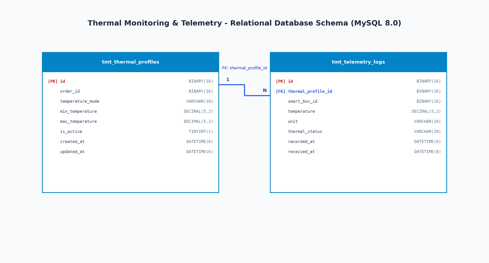
</div>

### 4.2.4. Bounded Context: Access & Security

El contexto delimitado Access & Security administra los mecanismos de seguridad asociados a la apertura física de las SmartBoxes durante la entrega. Su responsabilidad comprende la generación y validación de códigos OTP de un solo uso, el control de las solicitudes de desbloqueo y el análisis de eventos provenientes de los sensores de seguridad.

#### 4.2.4.1. Domain Layer.

La capa de dominio concentra las reglas relacionadas con la generación, expiración y validación del código de acceso, así como con la evaluación de eventos de seguridad.

- SecurityPasscode (Aggregate Root)
  - Propósito: Representa el código temporal de acceso generado para autorizar la apertura de una SmartBox en destino.
  - Atributos:
    - id: SecurityPasscodeId
    - orderId: OrderId
    - smartBoxId: SmartBoxId
    - code: OTPCode
    - expirationTime: ExpirationTime
    - status: PasscodeStatus
  - Métodos:
    - + validate(code: OTPCode, currentTime: Timestamp): UnlockResult
    - + expire(): void
    - + markAsUsed(): void

- AccessAttempt (Entity)
  - Propósito: Registra cada intento realizado para utilizar un código de apertura.
  - Atributos:
    - id: AccessAttemptId
    - attemptedCode: OTPCode
    - timestamp: Timestamp
    - result: UnlockResult
  - Métodos:
    - + registerResult(result: UnlockResult): void

- SecurityLog (Entity)
  - Propósito: Registra eventos relevantes relacionados con la seguridad física del contenedor.
  - Atributos:
    - id: SecurityLogId
    - smartBoxId: SmartBoxId
    - eventType: SecurityEventType
    - timestamp: Timestamp
    - tamperStatus: TamperStatus
  - Métodos:
    - + registerEvent(): void

- OTPCode (Value Object)
  - Propósito: Representa el código numérico temporal utilizado para la apertura.
  - Atributos:
    - value: String
  - Métodos:
    - + getValue(): String
    - + validateFormat(): Boolean

- ExpirationTime (Value Object)
  - Propósito: Representa el momento límite de validez del OTP.
  - Atributos:
    - value: DateTime
  - Métodos:
    - + isExpired(currentTime: DateTime): Boolean

- TamperStatus (Value Object)
  - Propósito: Representa el resultado de la evaluación de los sensores de seguridad.
  - Atributos:
    - lidOpen: Boolean
    - packagePresent: Boolean
  - Métodos:
    - + isUnauthorizedOpening(): Boolean
- UnlockResult (Value Object)
  - Propósito: Representa el resultado de una solicitud de desbloqueo.
  - Valores: AUTHORIZED, INVALID_CODE, EXPIRED_CODE, ALREADY_USED, DENIED.

- PasscodeStatus (Enumeration)
  - Valores: ACTIVE, USED, EXPIRED, REVOKED.

- SecurityEventType (Enumeration)
  - Valores: OTP_GENERATED, CONTAINER_UNLOCKED, INVALID_OTP, TAMPERING_DETECTED.

- ISecurityPasscodeRepository (Repository Interface)
  - Métodos:
    - + findById(id: SecurityPasscodeId): Optional
    - + findActiveByOrderId(orderId: OrderId): Optional
    - + save(passcode: SecurityPasscode): SecurityPasscode

- Domain Events
  - OTPGeneratedEvent
  - ContainerUnlockedEvent
  - SecurityBreachDetectedEvent
  - InvalidOTPAttemptedEvent.

#### 4.2.4.2. Interface Layer.

La capa de interfaz recibe solicitudes desde la Delivery Operator Mobile Application, el Edge Service y el panel administrativo.

- SecurityController (REST Controller)
  - Propósito: Gestiona la generación y validación de códigos OTP.
Métodos:
    - + generateOTP(request: GenerateOTPRequestDto): ResponseEntity`<ApiResponse>`
      - POST /api/v1/security/otp
    - + validateOTP(request: ValidateOTPRequestDto): ResponseEntity`<ApiResponse>`
      - POST /api/v1/security/otp/validate

- UnlockController (REST Controller)
  - Propósito: Coordina las solicitudes de apertura física.
  - Métodos:
    - + unlockContainer(request: UnlockContainerRequestDto): ResponseEntity`<ApiResponse>`
POST /api/v1/security/unlock

- SecurityEventController (REST Controller)
  - Propósito: Recibe eventos de sensores de seguridad generados por la SmartBox.
  - Métodos:
    - + reportTamperEvent(request: TamperEventRequestDto): ResponseEntity`<ApiResponse>`
      - POST /api/v1/security/tamper-events

- Data Transfer Objects (DTOs)
  - GenerateOTPRequestDto: orderId, smartBoxId.
  - ValidateOTPRequestDto: orderId, smartBoxId, otp.
  - UnlockContainerRequestDto: smartBoxId, otp.
  - TamperEventRequestDto: smartBoxId, lidOpen, packagePresent, timestamp.
  - SecurityEventDto: eventType, smartBoxId, timestamp, status.

#### 4.2.4.3. Application Layer.

La capa de aplicación coordina los casos de uso relacionados con la seguridad utilizando Commands y Handlers.

- GenerateOTPCommand & GenerateOTPCommandHandler
  - Propósito: Genera un nuevo código OTP para el pedido y SmartBox correspondientes.
  - Método:
    - + handle(command: GenerateOTPCommand): OTPCode

- ValidateOTPCommand & ValidateOTPCommandHandler
  - Propósito: Recupera el código activo, verifica su validez y registra el resultado del intento.
  - Método:
    - + handle(command: ValidateOTPCommand): UnlockResult

- EvaluateTamperRiskCommand & EvaluateTamperRiskCommandHandler
  - Propósito: Interpreta la combinación de estados del Reed Switch y TCRT5000 para determinar si existe un riesgo de manipulación.
  - Método:
    - + handle(command: EvaluateTamperRiskCommand): TamperStatus

- UnlockContainerCommand & UnlockContainerCommandHandler
  - Propósito: Coordina la validación del OTP y la solicitud de apertura física del mecanismo de bloqueo.
  - Método:
    - + handle(command: UnlockContainerCommand): UnlockResult

- GetSecurityHistoryQuery & GetSecurityHistoryQueryHandler
  - Propósito: Recupera los eventos e intentos de acceso asociados a una SmartBox.
  - Método:
    - + handle(query: GetSecurityHistoryQuery): List`<SecurityEventDto>`

#### 4.2.4.4. Infrastructure Layer.

La infraestructura implementa los mecanismos tecnológicos requeridos para conectar el dominio de seguridad con el Cloud Core y el hardware físico.

- SecurityPasscodeRepositoryImpl
  - Propósito: Implementa ISecurityPasscodeRepository utilizando Spring Data JPA y MySQL.

- SecurityLogRepositoryImpl
  - Propósito: Persiste los eventos e intentos relacionados con la seguridad física.

- OTPGeneratorAdapter
  - Propósito: Genera códigos numéricos temporales utilizando un generador seguro y configurable.

- EdgeUnlockAdapter
  - Propósito: Abstrae la comunicación con el Edge Service para transmitir la orden de apertura del mecanismo físico.

- TamperEventAdapter
  - Propósito: Recibe los estados enviados por el Reed Switch y TCRT5000.

- SecurityPersistenceMapper
  - Propósito: Convierte entre entidades JPA y objetos de dominio.

- SecurityAuditLogger
  - Propósito: Registra los intentos de acceso, desbloqueos autorizados y eventos de manipulación.

#### 4.2.4.5. Bounded Context Software Architecture Component Level Diagrams.

El diagrama de componentes debe mostrar el flujo desde la Delivery Operator Mobile Application hacia SecurityController, pasando posteriormente por ValidateOTPCommandHandler y SecurityPasscode.
Cuando la validación es satisfactoria, UnlockContainerCommandHandler utiliza EdgeUnlockAdapter para enviar la orden de desbloqueo al Edge Service y posteriormente al actuador físico.

<div align="center">
    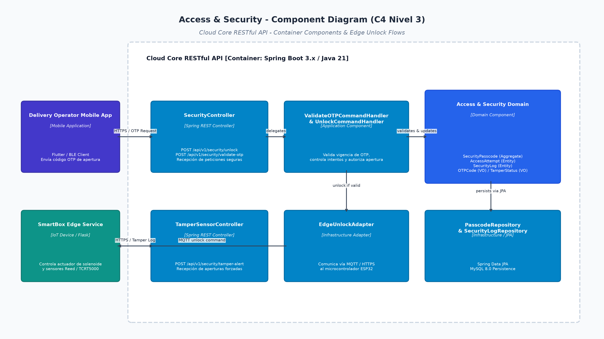
</div>

#### 4.2.4.6. Bounded Context Software Architecture Code Level Diagrams.

##### 4.2.4.6.1. Bounded Context Domain Layer Class Diagrams.

El diagrama UML debe representar SecurityPasscode como Aggregate Root y AccessAttempt y SecurityLog como entidades relacionadas con la trazabilidad de las operaciones de seguridad.
Los Value Objects OTPCode, ExpirationTime, TamperStatus y UnlockResult permiten mantener las reglas de validación y significado de los datos dentro del dominio.

La raíz SecurityPasscode debe controlar la transición de un código entre los estados ACTIVE, USED, EXPIRED y REVOKED, evitando que un OTP pueda reutilizarse después de una apertura exitosa.

<div align="center">
    
</div>

##### 4.2.4.6.2. Bounded Context Database Design Diagram.

El diseño relacional se implementa en MySQL 8.0. del bounded context Access & Security. Está compuesto por las tablas normalizadas:

- Tabla acs_security_passcodes
  - id: UUID, clave primaria.
  - order_id: UUID.
  - smart_box_id: UUID.
  - otp_hash: representación protegida del código.
  - expiration_time.
  - status.
  - created_at.
  - used_at.

- Tabla acs_access_attempts
  - id: UUID, clave primaria.
  - security_passcode_id: clave foránea.
  - security_passcode_id: FK.
  - attempted_at.
  - result.
  - operator_id.

- Tabla acs_security_logs
  - id: UUID, clave primaria.
  - smart_box_id.
  - event_type.
  - tamper_status.
  - occurred_at.

<div align="center">
    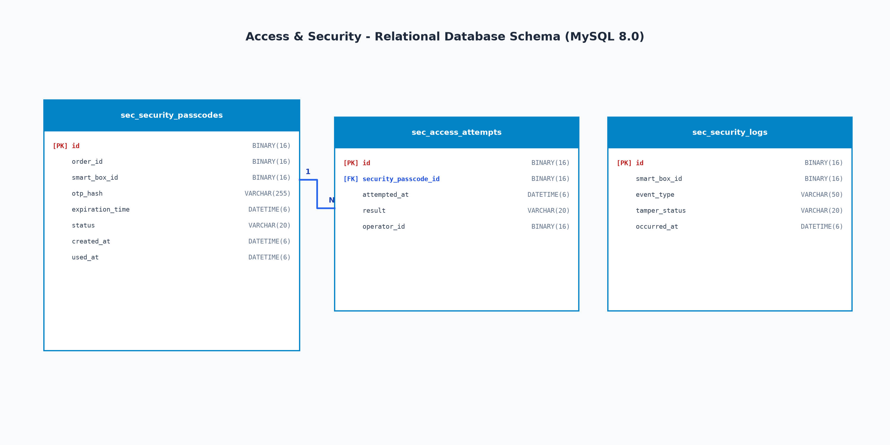
</div>

### 4.2.5. Bounded Context: Orders & Audit

El contexto delimitado Orders & Audit concentra la gestión del ciclo de vida de los envíos y la construcción de la evidencia asociada a su entrega. Su responsabilidad comprende la asignación de pedidos a SmartBoxes, el seguimiento del estado del despacho, el registro de evidencia fotográfica y la consolidación de información necesaria para generar reportes de auditoría.

#### 4.2.5.1. Domain Layer.

La capa de dominio representa el pedido, su estado de despacho y la evidencia generada durante la entrega.

- Order (Aggregate Root)
  - Propósito: Representa el pedido que será transportado y controla su ciclo de vida dentro de Cold2Hot.
  - Atributos:
    - id: OrderId
    - smartBoxId: SmartBoxId
    - operatorId: UserId
    - temperatureProfileId: ThermalProfileId
    - status: OrderStatus
    - dispatchedAt: Timestamp
    - completedAt: CompletionTimestamp
  - Métodos:
    - + assignToBox(boxId: SmartBoxId): void
    - + assignOperator(operatorId: UserId): void
    - + dispatch(): void
    - + complete(): void
    - + cancel(): void

- DeliveryEvidence (Entity)
  - Propósito: Representa la evidencia fotográfica registrada por el operador al finalizar la entrega.
  - Atributos:
    - id: EvidenceId
    - photoUrl: PhotoUrl
    - capturedAt: Timestamp
    - operatorId: UserId
  - Métodos:
    - + register(): void
    - + isValid(): Boolean

- AuditReport (Entity)
  - Propósito: Representa la consolidación de evidencias y eventos de un pedido finalizado.
  - Atributos:
    - id: AuditReportId
    - orderId: OrderId
    - custodyStatus: CustodyStatus
    - generatedAt: Timestamp
    - reportUrl: String
  - Métodos:
    - + generate(): void
    - + markComplete(): void

- OrderId (Value Object)
  - Propósito: Identifica unívocamente un pedido.

- PhotoUrl (Value Object)
  - Propósito: Representa la ubicación de una evidencia fotográfica almacenada externamente.

- CustodyStatus (Value Object)
  - Propósito: Representa el resultado de la consolidación de los eventos de custodia.
  - Valores: COMPLIANT, INCIDENT_DETECTED, INCOMPLETE.

- CompletionTimestamp (Value Object)
  - Propósito: Representa el momento en el cual se considera finalizada la entrega.

- OrderStatus (Enumeration)
  - Valores: CREATED, ASSIGNED, IN_TRANSIT, DELIVERED, COMPLETED, CANCELLED.

- IOrderRepository (Repository Interface)
  - Métodos:
    - + findById(id: OrderId): Optional
    - + findByStatus(status: OrderStatus): List
    - + save(order: Order): Order

- IAuditReportRepository (Repository Interface)
  - Métodos:
    - + findByOrderId(orderId: OrderId): Optional
    - + save(report: AuditReport): AuditReport

- Domain Events
  - OrderDispatchedEvent
  - EvidenceUploadedEvent
  - AuditReportGeneratedEvent
  - OrderCompletedEvent

#### 4.2.5.2. Interface Layer.

La capa de interfaz recibe solicitudes desde la aplicación web administrativa y la aplicación móvil del repartidor.

- OrderController (REST Controller)
  - Propósito: Gestiona las operaciones de creación, asignación y seguimiento de pedidos.
  - Métodos:
    - + createOrder(request: CreateOrderRequestDto): ResponseEntity`<ApiResponse>`
      - POST /api/v1/orders
    - + assignOrder(request: AssignOrderRequestDto): ResponseEntity`<ApiResponse>`
      - POST /api/v1/orders/{orderId}/assign
    - + getOrder(orderId: UUID): ResponseEntity`<ApiResponse>`
      - GET /api/v1/orders/{orderId}
    - + getActiveOrders(): ResponseEntity`<ApiResponse>`
      - GET /api/v1/orders/active

DeliveryEvidenceController (REST Controller)
  - Propósito: Recibe la evidencia fotográfica tomada por el operador.
  - Métodos:
    - + uploadEvidence(request: UploadEvidenceRequestDto): ResponseEntity`<ApiResponse>`
      - POST /api/v1/orders/{orderId}/evidence

- AuditController (REST Controller)
  - Propósito: Permite consultar y generar reportes de auditoría.
  - Métodos:
    - + generateReport(orderId: UUID): ResponseEntity`<ApiResponse>`
      - POST /api/v1/audits/orders/{orderId}
    - + getAuditReport(orderId: UUID): ResponseEntity`<ApiResponse>`
      - GET /api/v1/audits/orders/{orderId}

- Data Transfer Objects (DTOs)
  - CreateOrderRequestDto: información básica del pedido y requerimiento térmico.
  - AssignOrderRequestDto: orderId, smartBoxId, operatorId.
  - OrderDto: información actual del pedido y estado de despacho.
  - UploadEvidenceRequestDto: orderId, photo.
  - AuditReportDto: estado de custodia, timestamps, evidencia y resultado de auditoría.

#### 4.2.5.3. Application Layer.

La Application Layer coordina el ciclo de vida de los pedidos y la generación de evidencias.

- CreateOrderCommand & CreateOrderCommandHandler
  - Propósito: Registra un nuevo pedido y solicita/configura las condiciones térmicas correspondientes.
  - Método:
    - + handle(command: CreateOrderCommand): OrderId

- AssignOrderToBoxCommand & AssignOrderToBoxCommandHandler
  - Propósito: Vincula un pedido con una SmartBox disponible y un operador.
  - Método:
    - + handle(command: AssignOrderToBoxCommand): void

- DispatchOrderCommand & DispatchOrderCommandHandler
  - Propósito: Cambia el pedido a estado IN_TRANSIT y publica OrderDispatchedEvent.
  - Método:
    - + handle(command: DispatchOrderCommand): void

- CaptureDeliveryEvidenceCommand & CaptureDeliveryEvidenceCommandHandler
  - Propósito: Registra la fotografía de entrega y la asocia al pedido.
  - Método:
    - + handle(command: CaptureDeliveryEvidenceCommand): EvidenceId

- GenerateAuditReportCommand & GenerateAuditReportCommandHandler
  - Propósito: Consolida la evidencia fotográfica y los eventos asociados al pedido para generar el reporte de auditoría.
  - Método:
    - + handle(command: GenerateAuditReportCommand): AuditReportId

- GetOrderHistoryQuery & GetOrderHistoryQueryHandler
  - Propósito: Recupera el historial del pedido y su estado de custodia.
  - Método:
    - + handle(query: GetOrderHistoryQuery): OrderHistoryDto

#### 4.2.5.4. Infrastructure Layer.

La infraestructura implementa los mecanismos necesarios para persistir los pedidos y conectarse con los servicios que proporcionan evidencia y datos complementarios.

- OrderRepositoryImpl
Implementa IOrderRepository mediante Spring Data JPA y MySQL.

- AuditReportRepositoryImpl
Persiste los reportes generados y sus metadatos.

- CloudinaryEvidenceAdapter
  - Propósito: Gestiona el almacenamiento de las fotografías tomadas por el repartidor.
  -  Se establece explícitamente el uso de Cloudinary para la persistencia y distribución de archivos multimedia de auditoría.

- ThermalDataAdapter
  - Propósito: Consulta o consume eventos provenientes del contexto Thermal Monitoring & Telemetry.

- SecurityEventAdapter
  - Propósito: Consume eventos generados por Access & Security.

- AuditReportGenerator
  - Propósito: Consolida la información del pedido, evidencia fotográfica, historial térmico y eventos de seguridad.

- OrderPersistenceMapper
  - Propósito: Convierte entre entidades JPA y objetos del dominio.


#### 4.2.5.5. Bounded Context Software Architecture Component Level Diagrams.

El diagrama C4 Nivel 3 representa la estructura interna del contexto Orders & Audit dentro del Cloud Core RESTful API.
Las solicitudes de administración ingresan mediante OrderController, mientras que la evidencia fotográfica proveniente de la Delivery Operator Mobile Application es recibida por DeliveryEvidenceController.
Los Command Handlers coordinan las operaciones sobre el agregado Order. Cuando el pedido es despachado se publica OrderDispatchedEvent. Al finalizar la entrega, CaptureDeliveryEvidenceCommandHandler registra la evidencia mediante CloudinaryEvidenceAdapter.
El AuditReportGenerator consolida información del pedido junto con los eventos térmicos y de seguridad para construir el reporte final. De esta forma, el contexto funciona como consumidor de información proveniente de Thermal Monitoring & Telemetry y Access & Security, sin asumir sus responsabilidades internas.

<div align="center">
    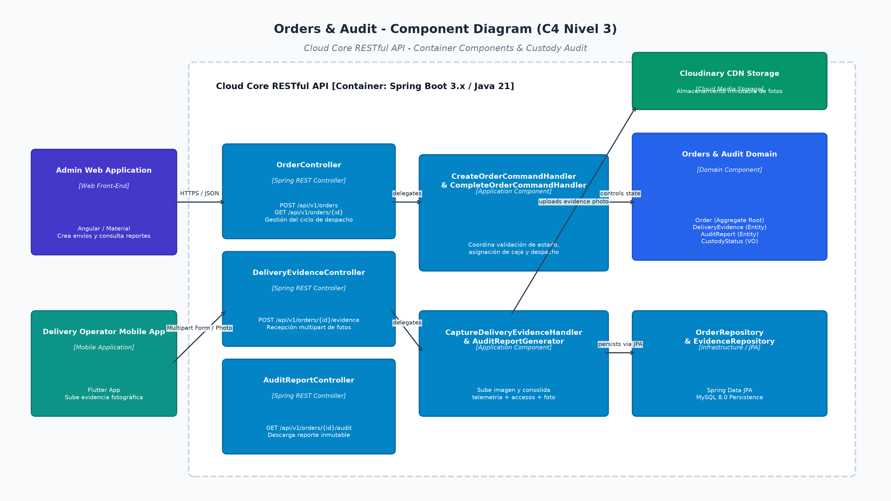
</div>

#### 4.2.5.6. Bounded Context Software Architecture Code Level Diagrams.

##### 4.2.5.6.1. Bounded Context Domain Layer Class Diagrams.

El diagrama UML debe representar a Order como raíz del agregado y mostrar las entidades relacionadas con la evidencia de entrega y auditoría.
Order controla las transiciones de estado del despacho, mientras que DeliveryEvidence representa la evidencia física registrada por el repartidor. AuditReport representa la consolidación de información utilizada para verificar la custodia.
Los Value Objects OrderId, PhotoUrl, CustodyStatus y CompletionTimestamp proporcionan semántica e inmutabilidad a los datos fundamentales del contexto.

<div align="center">
    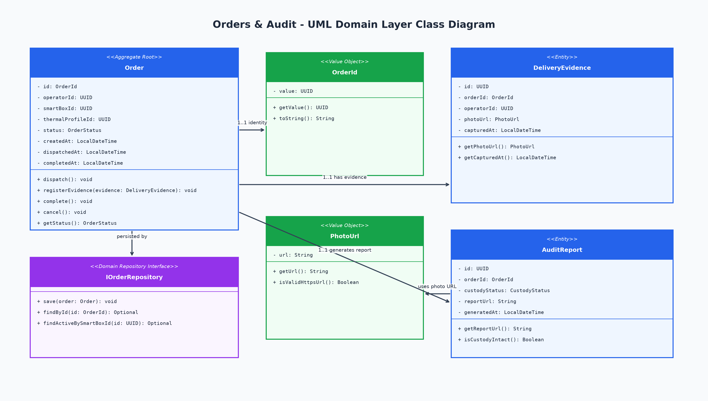
</div>

##### 4.2.5.6.2. Bounded Context Database Design Diagram.


El diseño relacional se implementa en MySQL 8.0. del bounded context Orders & Audit. Está compuesto por las tablas normalizadas:

- Tabla ord_orders
  - id: UUID, clave primaria.
  - operator_id: UUID.
  - thermal_profile_id: UUID.
  - status.
  - created_at.
  - dispatched_at.
  - completed_at.

- Tabla ord_delivery_evidence
  - id: UUID, clave primaria.
  - order_id: FK.
  - operator_id.
  - photo_url.
  - captured_at

- Tabla ord_audit_reports
  - id: UUID, clave primaria.
  - order_id: FK.
  - custody_status.
  - generated_at.
  - report_url.

<div align="center">
    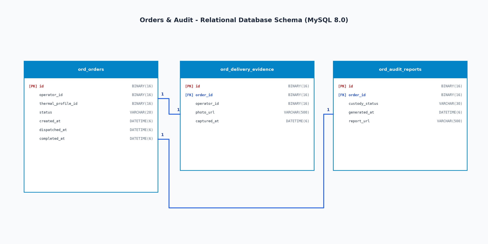
</div>

# Capítulo V: Solution UI/UX Design

## 5.1. Style Guidelines

### 5.1.1. General Style Guidelines

#### Branding e Identidad Visual

La identidad corporativa de Cold2Hot refleja la convergencia entre la tecnología de Internet de las Cosas (IoT), la seguridad en la cadena de custodia y el control térmico de precisión.

* **Isotipo:** Representa la dinámica térmica mediante dos ondas convergentes que transicionan desde el azul cian (frío) hacia el naranja cálido (calor), integradas en un candado geométrico central estilizado que simboliza inviolabilidad física y custodia digital.
* **Logotipo:** Tipografía sans-serif geométrica en caja alta/baja con peso semi-negrita (*Semi-Bold*), que proyecta modernidad, solidez técnica y confiabilidad logística.
* **Área de Reserva (Clear Space):** Se define un margen mínimo de exclusión alrededor del imagotipo equivalente a la altura de la letra inicial "C" (*1X*). Ningún elemento gráfico, textual o borde de pantalla debe invadir este perímetro.
* **Variantes de Aplicación:**
  * *Versión Principal (Full Color):* Aplicada sobre fondos claros (blanco puro o gris neutro superficial).
  * *Versión Dark / Invertida:* Isotipo a color con tipografía en blanco puro sobre fondos oscuros (`#0F172A`).
  * *Versión Monocromática:* Empleada para serigrafía sobre el chasis plástico del contenedor físico IoT o documentación técnica en escala de grises.
* **Usos No Permitidos:** Queda estrictamente prohibido rotar el isotipo, aplicar sombras paralelas difusas excesivas, alterar las proporciones dimensionales relativas entre el símbolo y la tipografía, o sustituir los colores corporativos por tonos fuera de la paleta oficial.

#### Tipografía (Typography)

La selección tipográfica responde a criterios de alta legibilidad en pantallas de diversas densidades de píxeles, soporte universal de caracteres y neutralidad visual para visualización analítica.

* **Familia Tipográfica Primaria (UI General):** **Inter** (Google Fonts). Elegida por su diseño de altura de x alta, apertura de glifos optimizada para pantallas digitales y excelente legibilidad en textos pequeños de tablas de telemetría y formularios.
* **Familia Tipográfica Monospaciada (Telemetría y Datos):** **JetBrains Mono**. Empleada exclusivamente para números de serie de dispositivos, direcciones físicas MAC, códigos de verificación de un solo uso (OTP), marcas de tiempo (timestamps ISO 8601) y valores numéricos de temperatura (°C). La uniformidad en el ancho de glifos evita saltos visuales al actualizar lecturas en tiempo real.

##### Escala Tipográfica Jerárquica

| Nivel / Token | Familia | Peso (Weight) | Tamaño (px / rem) | Altura de Línea (Line Height) | Uso Principal en la Solución |
| :--- | :--- | :--- | :--- | :--- | :--- |
| **Display 1** | Inter | Bold (700) | 48px / 3.00rem | 56px (1.16) | Título principal de impacto en Hero de Landing Page. |
| **Display 2** | Inter | Bold (700) | 36px / 2.25rem | 44px (1.22) | Títulos de secciones comerciales en Landing Page. |
| **Heading 1 (H1)** | Inter | SemiBold (600) | 28px / 1.75rem | 36px (1.28) | Encabezados de vista principal en Web Application (Dashboard, Flota). |
| **Heading 2 (H2)** | Inter | SemiBold (600) | 22px / 1.375rem | 28px (1.27) | Títulos de módulos, tarjetas de KPI y cabeceras de diálogo modal. |
| **Heading 3 (H3)** | Inter | Medium (500) | 18px / 1.125rem | 24px (1.33) | Subtítulos de bloques de datos y encabezados secundarios. |
| **Body 1 (Regular)** | Inter | Regular (400) | 16px / 1.00rem | 24px (1.50) | Texto de lectura estándar, párrafos de descripción y entradas de texto. |
| **Body 2 (Dense)** | Inter | Regular (400) | 14px / 0.875rem | 20px (1.43) | Contenido de tablas de auditoría, etiquetas de formularios y listas densas. |
| **Caption** | Inter | Medium (500) | 12px / 0.75rem | 16px (1.33) | Metadatos de telemetría, leyendas de gráficas y microcopy auxiliar. |
| **Data Monospace** | JetBrains Mono | Medium (500) | 15px / 0.937rem | 20px (1.33) | Códigos OTP de 6 dígitos, lecturas térmicas en vivo (ej. `+64.5 °C`) y MAC addresses. |

#### Paleta de Colores (Color Palette & Tokens)

La paleta cromática de Cold2Hot combina una base neutra técnica y elegante con colores semánticos funcionales que representan de manera unívoca los estados de temperatura y custodia física. Cumple rigurosamente el criterio de conformidad WCAG 2.1 Nivel AA en ratios de contraste (mínimo 4.5:1 para texto estándar y 3:1 para controles e interfaces gráficas).

##### Colores Primarios y de Identidad Corporativa

| Token de Color | Código HEX | RGB | Ratio de Contraste vs Blanco | Significado y Aplicación |
| :--- | :--- | :--- | :--- | :--- |
| **Brand Thermal Orange** | `#EA580C` | rgb(234, 88, 12) | 4.62:1 (Pasa AA) | Energía térmica activa, mantenimiento de calor, botones de acción principal (CTA). |
| **Brand Cold Blue** | `#0284C7` | rgb(2, 132, 199) | 4.54:1 (Pasa AA) | Preservación de frío, conectividad de red, telemetría y tecnología ciberfísica. |
| **Brand Navy Primary** | `#0F172A` | rgb(15, 23, 42) | 16.12:1 (Pasa AAA) | Fondo de barras de navegación principales, tipografía de alta jerarquía y estabilidad corporativa. |

##### Colores Semánticos y Estados del Sistema

| Estado / Token | Código HEX | RGB | Aplicación en Telemetría y Custodia |
| :--- | :--- | :--- | :--- |
| **Success / Safe** | `#16A34A` | rgb(22, 163, 74) | Temperatura dentro de rango permitido; candado electromagnético bloqueado; custodia verificada. |
| **Warning / Caution** | `#D97706` | rgb(217, 119, 6) | Temperatura aproximándose a límites de tolerancia; nivel de batería de caja inferior al 20%; señal BLE débil. |
| **Danger / Critical** | `#DC2626` | rgb(220, 38, 38) | Rotura de cadena de frío (>3°C fuera de umbral); apertura física no autorizada; precinto magnético vulnerado. |
| **Info / Connectivity** | `#2563EB` | rgb(37, 99, 235) | Enlace Bluetooth activo; sincronización de telemetría en curso; descarga de reporte iniciada. |

##### Colores Neutros y Superficies

| Token | Código HEX | RGB | Caso de Uso |
| :--- | :--- | :--- | :--- |
| **Neutral Background** | `#F8FAFC` | rgb(248, 250, 252) | Fondo general del lienzo de trabajo en Web Application y Landing Page. |
| **Neutral Surface** | `#FFFFFF` | rgb(255, 255, 255) | Tarjetas contenedoras (Cards), diálogos modales y paneles desplegables. |
| **Neutral Border** | `#E2E8F0` | rgb(226, 232, 240) | Delimitadores de tablas, divisores de sección y bordes de campos de formulario. |
| **Text Primary** | `#0F172A` | rgb(15, 23, 42) | Texto principal de lectura en títulos y cuerpos con máxima legibilidad. |
| **Text Secondary** | `#475569` | rgb(71, 85, 105) | Subtítulos, descripciones secundarias y encabezados de columnas de tablas. |
| **Text Muted / Disabled**| `#94A3B8` | rgb(148, 163, 184) | Textos de marcadores de posición (*placeholders*) y estados inhabilitados. |

#### Sistema de Espaciado y Grilla (Spacing & Layout Grid)

Para garantizar consistencia visual y ritmos armónicos entre los componentes de interfaz, se aplica una escala de espaciado basada en el sistema modular de **8 puntos (8-point Grid)**, complementada con incrementos de 4 puntos para componentes compactos de datos.

* **Escala de Espaciado:**
  * `4px` (xxs): Separación mínima entre icono y texto dentro de un badge de estado.
  * `8px` (xs): Espaciado interno (*padding*) en celdas de tabla densa o entre chips de filtrado.
  * `16px` (sm): Relleno estándar para campos de entrada de datos y botones de acción.
  * `24px` (md): Separación entre tarjetas de visualización en el panel de control.
  * `32px` (lg): Margen perimetral de módulos y cabeceras de página.
  * `48px` (xl): Separación entre bloques de información mayores en la Web Application.
  * `64px` (xxl): Separación vertical entre secciones temáticas del Landing Page.

* **Sistemas de Grilla de Disposición (Layout Grid):**
  * **Desktop (12 Columnas):** Ancho máximo de contenedor de 1280px centrado, márgenes laterales de 32px y medianil (*gutter*) de 24px. Permite estructuras simétricas (4x3, 3x4, 2x6) para paneles analíticos de telemetría.
  * **Tablet (8 Columnas):** Ancho fluido entre 768px y 1024px, márgenes de 24px y medianil de 16px. Adaptación de tarjetas de monitoreo a filas de 2 columnas.
  * **Mobile (4 Columnas):** Ancho fluido entre 320px y 480px, márgenes perimetrales de 16px y medianil de 12px. Disposición vertical apilada orientada al operador de ruta.

#### Dimensiones del Tono de Comunicación y Lenguaje Aplicado (Tone of Voice)

De acuerdo con el modelo de las Cuatro Dimensiones del Tono de Voz de Nielsen Norman Group, Cold2Hot define su personalidad de comunicación orientada a generar certidumbre operativa, rigor técnico y respeto profesional:

* **Divertido vs. Serio (85% Serio):** La solución gestiona la inocuidad alimentaria de consumidores y la protección económica de restaurantes contra reclamos fraudulentos. Por tanto, el lenguaje es riguroso, objetivo y profesional, evitando bromas, emojis informales o frases coloquiales en los paneles de control.
* **Casual vs. Formal (65% Formal):** Se mantiene un tono corporativo pero directo y claro. Para el administrador de restaurante, la terminología es ejecutiva y orientada a métricas operativas. Para el operador de entrega, las instrucciones son concisas e imperativas sin tecnicismos innecesarios (ej. *"Ingrese el código OTP de 6 dígitos"* en lugar de *"Efectúe la validación criptográfica de desbloqueo"*).
* **Irreverente vs. Respetuoso (95% Respetuoso):** Se respeta profundamente el esfuerzo de los repartidores en calle y la exigencia de los gerentes de operaciones. No se utilizan tonos acusatorios ante anomalías (se indica *"Apertura de contenedor detectada fuera de geocerca"* en vez de *"El repartidor abrió la caja indebidamente"*).
* **Entusiasta vs. Sereno (75% Sereno):** En situaciones críticas de alarma (rotura de temperatura o apertura no autorizada), las notificaciones transmiten calma y foco en la solución. Se guía al usuario a acciones correctivas inmediatas sin generar pánico.

##### Matriz de Ejemplos de Lenguaje Aplicado

| Contexto de Interacción | Expresión Inadecuada | Expresión Aplicada en Cold2Hot | Sustento |
| :--- | :--- | :--- | :--- |
| **Alerta crítica de temperatura** | *"¡Peligro! ¡La comida se enfrió y el cliente va a reclamar!"* | *"Desvío térmico detectado: 48.2 °C (Umbral mínimo: 60 °C). Notifique al operador de ruta."* | Precisión de datos, objetividad y foco en la acción correctiva. |
| **Apertura de caja en destino** | *"¡Listo, abre la caja y apúrate!"* | *"Caja #SB-104 vinculada por BLE. Ingrese el código OTP para liberar la cerradura."* | Instrucción clara, respetuosa y orientada al procedimiento de seguridad. |
| **Confirmación de entrega** | *"¡Misión cumplida socio!"* | *"Entrega completada exitosamente. Evidencia fotográfica y bitácora térmica registradas."* | Respaldo probatorio profesional y formal. |

#### Principios de Diseño y Accesibilidad

* **Principio de Doble Codificación (Accesibilidad para Daltonismo):** Ningún estado crítico se comunica únicamente mediante color. Todo indicador cromático (verde, ámbar, rojo) está acompañado de un icono representativo unívoco (candado cerrado, triángulo de advertencia, escudo tachado) y texto descriptivo explícito.
* **Soporte de Atributos ARIA:** La aplicación web implementa atributos semánticos para lectores de pantalla, incluyendo `aria-live="polite"` para actualizaciones dinámicas de lecturas de sensores de temperatura y `aria-expanded` para menús de navegación lateral.
* **Zonas de Toque Accesibles:** Todos los elementos interactivos cumplen con el estándar mínimo de WCAG 2.1 de 48x48 píxeles de área activa para evitar toques accidentales.

---

### 5.1.2. Web, Mobile and IoT Style Guidelines

#### Responsive Web Style Guidelines (Landing Page y Web Application)

Las interfaces web se construyen sobre la biblioteca de componentes **Angular Material**, personalizando estilos mediante variables CSS y tokens de diseño corporativos:

* **Puntos de Quiebre Responsivos (Breakpoints):**
  * `Handset / Mobile:` 0px – 599px (Layout linealizado de una columna, menús tipo Drawer lateral desplegable).
  * `Tablet Portrait:` 600px – 959px (Distribución en 2 columnas, reducción de tamaño de tipografías de visualización).
  * `Tablet Landscape / Laptop:` 960px – 1279px (Sidebar lateral visible en modo icono, tablas con scroll horizontal).
  * `Desktop Standard:` 1280px – 1919px (Sidebar expandido completo, dashboards en matriz de 3 a 4 tarjetas por fila).
  * `Wide Desktop:` >= 1920px (Contenedor centrado con ancho máximo de 1440px para preservar ergonomía visual).

* **Componentes de Interfaz Web Específicos:**
  * **Tablas de Monitoreo Térmico:** Filas con micro-gráficas de tendencia (Sparklines) que resumen las últimas 10 lecturas del sensor DS18B20 sin recargar la página.
  * **Tarjetas de Estado de SmartBox:** Indicadores visuales con micro-badges que exhiben simultáneamente el porcentaje de batería del dispositivo, el estado de conectividad (MQTT/HTTP) y la temperatura actual.
  * **Formularios de Creación de Envíos:** Diseñados con validación en tiempo real y retroalimentación inline, impidiendo el despacho si la SmartBox seleccionada presenta batería inferior al 15%.

#### Mobile Application Style Guidelines (App del Operador de Entrega)

La aplicación móvil está orientada a operadores que conducen motocicletas o bicicletas en entornos urbanos cambiantes (luz solar directa, vibración, uso de guantes de protección):

* **Zona del Pulgar (Thumb Zone Ergonomics):** Los controles primarios (botón de escaneo BLE, teclado numérico para código OTP y disparador de cámara para evidencia de entrega) están situados en el tercio inferior de la pantalla para permitir manipulación ergonómica con una sola mano.
* **Objetivos Táctiles Ampliados (Touch Targets):** Se incrementa el estándar a un mínimo de **56x56 dp** para todos los botones principales de operación en ruta.
* **Modo de Alto Contraste Solar:** La interfaz utiliza bordes sólidos contrastados de 2px en lugar de sombras sutiles, y fondos de alto valor tonal para permitir visibilidad plena bajo luz solar intensa al mediodía.
* **Retroalimentación Háptica y Acústica:**
  * Vibración corta (50 ms): Confirmación de detección de señal Bluetooth de la caja.
  * Doble pulsación háptica (100 ms cada una): Aceptación de código OTP y liberación del solenoide.
  * Vibración larga intermitente (500 ms): Alerta de tapa mal cerrada mientras el operador inicia marcha.

#### IoT Device Physical Interface Style Guidelines (Caja Inteligente Cold2Hot)

El contenedor físico no cuenta con pantalla gráfica para maximizar la autonomía energética y resistencia climática (norma IP65), por lo que su interfaz de usuario ciberfísica se basa en señalizadores luminosos de alta visibilidad y retroalimentación sonora piezoeléctrica:

##### Indicadores Luminosos LED en el Chasis del Contenedor

| Indicador LED | Estado Físico | Frecuencia de Parpadeo | Significado Operativo |
| :--- | :--- | :--- | :--- |
| **LED Verde** | Encendido Continuo | Fijo | Caja bloqueada magnéticamente, temperatura dentro de rango seguro, batería > 20%. |
| **LED Azul** | Parpadeo Lento | 1 Hz (1 ciclo/seg) | Modo anuncio BLE; esperando vinculación con la aplicación del repartidor. |
| **LED Azul** | Encendido Continuo | Fijo | Enlace Bluetooth establecido y autenticado activamente con el teléfono móvil. |
| **LED Ámbar** | Parpadeo Rápido | 4 Hz (4 ciclos/seg) | Código OTP verificado; solenoide desactivado temporalmente para permitir retiro de comida. |
| **LED Rojo** | Parpadeo Estroboscópico | 8 Hz (8 ciclos/seg) | Alarma crítica: Apertura forzada detectada por sensor óptico/magnético o temperatura fuera de rango. |

##### Señalización Acústica (Buzzer Piezoeléctrico a 80 dB)

* **1 Tono Corto (150 ms, 1.2 kHz):** Confirmación de encendido del dispositivo y enganche correcto del cierre magnético (Reed switch cerrado).
* **2 Tonos Ascendentes (100 ms, 2.0 kHz / 2.5 kHz):** Código OTP recibido válidamente vía BLE; cerradura destrabada.
* **3 Tonos Cortos (100 ms cada uno):** Confirmación de evidencia fotográfica sincronizada y cierre final de orden.
* **Tono Continuo Intermitente (500 ms encendido / 500 ms apagado):** Advertencia de contenedor abierto por más de 45 segundos en parada de entrega.

##### Rotulación Física y Ergonomía del Contenedor

* **Área de Proximidad BLE:** Serigrafía de alto relieve con icono normalizado de ondas de radio en la cara superior derecha del contenedor, indicando: *"Zona de enlace Bluetooth - Aproxime su dispositivo aquí"*.
* **Código QR Láser Inalterable:** Placa metálica remachada en el lateral con código QR que contiene el Identificador Único Universal (UUID) y la dirección MAC de la caja para vinculación manual de contingencia.
* **Mecanismo de Apertura:** Pestillo electromagnético tipo Solenoide de 12V con resorte de expulsión amortiguado de 6 mm que libera la tapa suavemente al ingresar el OTP, permitiendo al repartidor abrirla con un solo movimiento manual.

---

## 5.2. Information Architecture

### 5.2.1. Organization Systems

#### Estructuras de Organización Visual del Contenido

1. **Organización Jerárquica (Visual Hierarchy):**
   * *Landing Page:* Estructurada bajo un embudo de conversión descendente:
     Hero (Propuesta de Valor) $\rightarrow$ Problemática y Pérdidas $\rightarrow$ Solución Tecnológica $\rightarrow$ Calculadora ROI $\rightarrow$ Planes y Precios $\rightarrow$ Contacto y Registro.
   * *Web Application (Panel de Monitoreo):* Distribución en tres niveles de profundidad visual:
     * *Nivel Macro (KPIs de Flota):* Envíos activos, porcentaje de cumplimiento térmico global y alertas críticas en curso.
     * *Nivel Meso (Lista y Mapa de Despachos):* Tabla tabular ordenada cronológicamente y mapa georreferenciado con estado de cada vehículo.
     * *Nivel Micro (Ficha Detallada de Envío):* Gráfica de telemetría continua de temperatura segundo a segundo, historial de aperturas del contenedor y fotografías de evidencia de entrega.
   * *Mobile Application:* Jerarquía centrada en el estado de la tarea en curso: estado de la conexión BLE en la cabecera superior, temperatura actual y estado de cerradura en el cuerpo central, y botón de acción principal ("Ingresar OTP para Desbloquear") en el área inferior.

2. **Organización Secuencial (Step-by-Step / Flujos Lineales):**
   * *Flujo de Creación y Despacho de Pedido (Web Application):*
     Paso 1: Datos del Pedido $\rightarrow$ Paso 2: Selección de Perfil Térmico (Frío/Caliente) $\rightarrow$ Paso 3: Asignación de SmartBox y Repartidor $\rightarrow$ Paso 4: Generación de OTP e Inicio de Custodia.
   * *Flujo de Entrega y Custodia en Destino (Mobile Application):*
     Paso 1: Detección BLE en Destino $\rightarrow$ Paso 2: Ingreso de Código OTP de 6 dígitos $\rightarrow$ Paso 3: Retiro de Alimentos y Cierre Físico $\rightarrow$ Paso 4: Captura Obligatoria de Fotografía $\rightarrow$ Paso 5: Cierre de Entrega.

3. **Organización Matricial (Multi-dimensional):**
   * *Módulo de Auditoría y Reportes (Web Application):* Permite cruzar simultáneamente múltiples dimensiones analíticas sin imponer una jerarquía rígida. Un usuario puede filtrar pedidos cruzando variables de fecha, sucursal del restaurante, operador de entrega, contenedor SmartBox asignado y resultado de la custodia (sin incidencias térmicas vs. con rotura térmica).
   * *Inventario de Dispositivos SmartBox:* Matriz de gestión que relaciona el identificador físico del hardware con su estado operativo (Disponible, Asignado en ruta, En mantenimiento, Batería baja) y su sucursal de pertenencia.

#### Esquemas de Categorización de Contenido

* **Esquema Cronológico:** Utilizado en la bitácora de telemetría de temperatura en tiempo real (registros organizados de más reciente a más antiguo), en el historial de eventos de auditoría y en la bandeja de notificaciones operativas.
* **Esquema Alfabético:** Aplicado en el directorio de operadores de entrega registrados, en el listado de locales y restaurantes clientes, y en el catálogo de perfiles térmicos preconfigurados (ej. *"Carnes calientes (+65 °C)"*, *"Comida rápida (+55 °C)"*, *"Helados artesanales (-18 °C)"*, *"Sushi y pescados crudos (+4 °C)"*).
* **Esquema por Tópicos (Temático):** Empleado en el módulo de configuración general de la Web Application, agrupando las opciones en: *Dispositivos IoT*, *Gestión de Personal*, *Perfiles Térmicos de Alimentos*, *Facturación y Planes*, y *Seguridad y Accesos*.
* **Esquema por Audiencia (Audience-Specific):** Vistas y niveles de acceso adaptados estrictamente al rol del usuario en la plataforma:
  * *Audiencia 1 - Administrador de Operaciones (Restaurante):* Acceso integral a analítica de pérdidas evitadas, configuración de umbrales, auditoría de reclamos y gestión de personal.
  * *Audiencia 2 - Operador de Entrega (Repartidor):* Acceso restringido exclusivamente a las órdenes de su turno, visualización del estado de su caja enlazada por Bluetooth y captura de evidencias.
  * *Audiencia 3 - Visitante Comercial:* Acceso a información corporativa, casos de éxito, simulador interactivo de ahorro y cotizador de suscripciones en el Landing Page.

---

### 5.2.2. Labeling Systems

El sistema de rotulado de Cold2Hot define etiquetas unívocas, concisas y orientadas a los modelos mentales de los usuarios, evitando ambigüedades técnicas y alineándose rigurosamente con el lenguaje ubicuo establecido en el proyecto.

#### Tabla de Rotulado del Sistema por Canal Digital

| Canal / Módulo | Elemento de Interfaz | Etiqueta Utilizada | Asociación y Modelo Mental del Usuario |
| :--- | :--- | :--- | :--- |
| **Landing Page** | Barra de Navegación | **Inicio** | Retorno a la cabecera principal de la página promocional. |
| **Landing Page** | Barra de Navegación | **Solución** | Descripción tecnológica de la caja inteligente y sensores. |
| **Landing Page** | Barra de Navegación | **Calculadora ROI** | Herramienta interactiva para proyectar ahorro mensual en dinero. |
| **Landing Page** | Barra de Navegación | **Planes** | Precios y características de las suscripciones mensuales de software. |
| **Landing Page** | Botón de Acción (CTA) | **Solicitar Demostración** | Formulario para agendar una prueba física de la caja con el equipo. |
| **Landing Page** | Botón de Acción | **Iniciar Sesión** | Acceso directo a la plataforma web administrativa para clientes. |
| **Web Application** | Menú Lateral (Sidebar) | **Panel Principal** | Vista panorámica de KPIs de entregas en curso y métricas del día. |
| **Web Application** | Menú Lateral | **Monitoreo en Vivo** | Mapa y listado de pedidos en ruta con telemetría activa en tiempo real. |
| **Web Application** | Menú Lateral | **Cajas Inteligentes** | Gestión del parque de dispositivos IoT, estado de baterías y mantenimiento. |
| **Web Application** | Menú Lateral | **Historial y Auditoría** | Registro histórico inmutable de despachos con gráficas y fotos probatorias. |
| **Web Application** | Menú Lateral | **Repartidores** | Directorio y control de cuentas de operadores de entrega asignados. |
| **Web Application** | Menú Lateral | **Alertas** | Centro de notificaciones sobre desvíos térmicos o aperturas indebidas. |
| **Web Application** | Menú Lateral | **Configuración** | Parámetros del restaurante, umbrales de temperatura y facturación. |
| **Web Application** | Estado de Envío | **En Tránsito** | El pedido se encuentra en desplazamiento con el contenedor asegurado. |
| **Web Application** | Estado de Envío | **Custodia Verificada** | Entrega completada sin rotura térmica ni aperturas no autorizadas. |
| **Web Application** | Estado de Envío | **Incidencia Térmica** | Se superaron los umbrales de temperatura fijados para el alimento. |
| **Web Application** | Estado de Envío | **Apertura Forzada** | Se detectó apertura física sin validación de código OTP previo. |
| **Mobile Application** | Barra Inferior | **Mi Ruta** | Listado de pedidos que el repartidor debe entregar en su turno. |
| **Mobile Application** | Barra Inferior | **Caja IoT** | Estado de la caja inteligente enlazada por Bluetooth y nivel de batería. |
| **Mobile Application** | Botón de Acción | **Vincular por Bluetooth**| Inicia la búsqueda y conexión BLE con el contenedor asignado. |
| **Mobile Application** | Botón de Acción | **Ingresar Código OTP** | Despliega el teclado numérico para destrabar la cerradura electromagnética. |
| **Mobile Application** | Botón de Acción | **Tomar Foto de Entrega**| Abre la cámara para capturar la evidencia física del pedido entregado. |
| **Mobile Application** | Botón de Acción | **Finalizar Entrega** | Confirma la entrega y envía la evidencia criptográfica a la nube. |
| **Dispositivo IoT** | Chasis / Serigrafía | **Zona de Enlace BLE** | Punto exacto para aproximar el teléfono y optimizar la señal de radio. |
| **Dispositivo IoT** | Placa Metálica | **ID Dispositivo** | Dirección MAC y número de serie único remachado en el chasis. |

---

### 5.2.3. SEO Tags and Meta Tags

Para maximizar el posicionamiento orgánico en motores de búsqueda de la Landing Page y garantizar optimización en tiendas de aplicaciones móviles (App Store Optimization - ASO), se especifican las etiquetas y metadatos estándar a continuación.

#### Meta Tags para Páginas Clave (Web y Landing Page)

##### 1. Landing Page - Página de Inicio (`/index.html`)

```html
<!-- Metadatos Primarios -->
<title>Cold2Hot | Cajas Inteligentes IoT y Trazabilidad Térmica para Delivery</title>
<meta name="title" content="Cold2Hot | Cajas Inteligentes IoT y Trazabilidad Térmica para Delivery">
<meta name="description" content="Protege la calidad y seguridad de tus pedidos en ruta con Cold2Hot. Contenedores inteligentes con control térmico, cerradura electromagnética por OTP y auditoría de entregas.">
<meta name="keywords" content="cold2hot, cajas delivery inteligentes, trazabilidad termica, cadena de frio alimentos, seguridad delivery, cerradura iot, esp32 logistica">
<meta name="author" content="IoTeam - Cold2Hot Technologies">
<meta name="robots" content="index, follow">
<meta name="viewport" content="width=device-width, initial-scale=1.0">
<link rel="canonical" href="https://cold2hot.io/">

<!-- Open Graph / Facebook / LinkedIn -->
<meta property="og:type" content="website">
<meta property="og:url" content="https://cold2hot.io/">
<meta property="og:title" content="Cold2Hot | Cajas Inteligentes IoT y Trazabilidad Térmica">
<meta property="og:description" content="Elimina reclamos por comida fría o pedidos manipulados. Descubre el sistema IoT que revoluciona el delivery de última milla.">
<meta property="og:image" content="https://cold2hot.io/assets/og-cover-cold2hot.png">

<!-- Twitter Cards -->
<meta name="twitter:card" content="summary_large_image">
<meta name="twitter:url" content="https://cold2hot.io/">
<meta name="twitter:title" content="Cold2Hot | Cajas Inteligentes IoT para Delivery">
<meta name="twitter:description" content="Control térmico en tiempo real y cerradura segura por código OTP para reparto de comida.">
<meta name="twitter:image" content="https://cold2hot.io/assets/twitter-card-cold2hot.png">
```

##### 2. Landing Page - Calculadora de Retorno de Inversión (`/roi-calculator`)

```html
<title>Calculadora de Ahorro y ROI Logístico | Cold2Hot</title>
<meta name="description" content="Calcula cuánto dinero pierde tu restaurante al mes por quejas de temperatura o entregas disputadas y proyecta tu ahorro implementando Cold2Hot.">
<meta name="keywords" content="calculadora roi delivery, ahorro logistica alimentos, reduccion reclamos pedidos, rentabilidad delivery comida">
<meta name="robots" content="index, follow">
<link rel="canonical" href="https://cold2hot.io/roi-calculator">
<meta property="og:title" content="Calcula el Retorno de Inversión con Cold2Hot">
<meta property="og:description" content="Simula tu ahorro operativo mensual y descubre el impacto de blindar la cadena de custodia térmica.">
```

##### 3. Landing Page - Planes de Suscripción (`/pricing`)

```html
<title>Planes y Suscripciones de Software IoT | Cold2Hot</title>
<meta name="description" content="Conoce nuestros planes de suscripción mensual para restaurantes y flotas de delivery. Monitoreo en tiempo real, auditoría fotográfica y soporte técnico continuo.">
<meta name="keywords" content="precios software delivery, planes suscripcion iot, tarifas trazabilidad alimentos, cold2hot precios">
<meta name="robots" content="index, follow">
<link rel="canonical" href="https://cold2hot.io/pricing">
```

##### 4. Web Application - Panel de Monitoreo (`/admin/dashboard`)

```html
<!-- Restricción de indexación para resguardar la privacidad de datos corporativos -->
<title>Cold2Hot Admin | Panel de Control y Monitoreo de Flota</title>
<meta name="robots" content="noindex, nofollow">
<meta name="viewport" content="width=device-width, initial-scale=1.0">
```

#### Elementos de Optimización para Tiendas de Aplicaciones Móviles (ASO)

Para la distribución de la aplicación móvil de repartidores a través de Google Play Store y Apple App Store:

| Parámetro ASO | Valor Asignado | Justificación Estratégica |
| :--- | :--- | :--- |
| **App Title** | Cold2Hot Driver: Reparto Seguro & Custodia IoT | Incluye el nombre de marca y términos clave de alta intención de búsqueda (Reparto, Seguro, Custodia, IoT). |
| **App Subtitle (iOS)** | Desbloqueo por OTP y Trazabilidad | 30 caracteres directos orientados a la funcionalidad de valor para el conductor. |
| **Categoría** | Empresa / Logística y Transporte (Business) | Clasificación precisa para herramientas de trabajo y productividad logística. |
| **Descripción Breve** | Conecta tu caja inteligente por Bluetooth, destraba con OTP y certifica tu entrega con fotos. | Resumen de valor claro dentro del límite de 80 caracteres de Google Play. |
| **Palabras Clave (Keywords)** | repartidor, delivery, caja inteligente, smartbox, cadena de custodia, termica, otp, evidencia fotografica, control logistico | Términos clave con balance entre volumen de búsqueda y relevancia funcional de la app. |
| **Capturas de Pantalla (Screenshots)** | 5 capturas en resolución 1080x2400 px con rótulos destacados: (1) Enlace Bluetooth con un toque, (2) Monitoreo de temperatura en ruta, (3) Apertura rápida con OTP de 6 dígitos, (4) Captura y validación de fotografía de entrega, (5) Historial de entregas sin penalizaciones. | Guía visual que demuestra facilidad de uso y protección laboral para el repartidor. |

---

### 5.2.4. Searching Systems

Los sistemas de búsqueda en Cold2Hot están diseñados para evitar la sobrecarga cognitiva del administrador ante volúmenes crecientes de despachos diarios, permitiendo localizar cualquier envío, alerta o dispositivo en menos de tres segundos.

#### Opciones de Búsqueda Implementadas

1. **Búsqueda Global Rápida (Omnibox Search en Web Application):**
   * Accesible desde cualquier vista mediante el atajo de teclado universal `Ctrl + K` (o `Cmd + K` en macOS) o desde la cabecera fija de la aplicación.
   * Permite realizar búsquedas instantáneas combinadas sobre:
     * Código de Orden de Pedido (ej. `#ORD-84920`).
     * Nombre o Apellidos del Cliente Receptor (ej. *"Fernández"*).
     * Identificador o MAC de SmartBox (ej. `SB-014` o `A4:CF:12:89:BC:01`).
     * Nombre del Operador de Entrega asignado (ej. *"Miguel Torres"*).
     * Dirección o Georreferencia de Destino (ej. *"Av. Benavides 1240"*).

2. **Búsqueda Parametrizada y Facetada (Filtros en Módulo de Auditoría y Envíos):**

| Criterio de Filtrado | Tipo de Control UI | Opciones Disponibles | Impacto en la Consulta |
| :--- | :--- | :--- | :--- |
| **Rango Temporal** | Selector de Fecha / Calendario | Hoy, Ayer, Últimos 7 días, Últimos 30 días, Rango personalizado. | Delimita la consulta en base a la marca de tiempo de despacho. |
| **Estado de Custodia** | Menú desplegable multi-selección | Todos, Custodia Verificada, Desvío Térmico, Apertura No Autorizada. | Filtra incidentes probatorios para resolver quejas de clientes. |
| **Perfil Térmico** | Botones de alternancia (Chips) | Todos, Alimentos Calientes (+60 °C), Alimentos Fríos (<4 °C). | Segmenta el comportamiento del sensor DS18B20 según categoría. |
| **SmartBox Asignada** | Autocompletado con búsqueda | Selector con listado de cajas disponibles y en ruta. | Permite auditar el rendimiento histórico de un contenedor físico específico. |
| **Operador de Entrega** | Menú desplegable con buscador | Listado alfabético de repartidores registrados. | Evalúa el índice de cumplimiento individual de un conductor. |

#### Comportamiento de la Interfaz y Presentación de Resultados

* **Búsqueda Asíncrona con Debounce (300 ms):** Para optimizar el tráfico hacia la API REST y evitar peticiones excesivas mientras el usuario escribe, el sistema aplica una pausa de 300 milisegundos antes de ejecutar la consulta.
* **Resaltado Visual de Coincidencias (Highlighting):** Los términos coincidentes con la cadena de búsqueda se destacan visualmente con un fondo amarillo suave (`#FEF08A`) en las celdas de la tabla de resultados.
* **Manejo Integral de Estados de Interfaz:**
  * *Estado de Carga (Loading State):* Se emplean esqueletos de carga (*Skeleton Loaders*) que replican la estructura de las filas de la tabla, ofreciendo sensación de inmediatez sin parpadeos visuales.
  * *Estado con Resultados (Populated State):* Tabla paginada (10, 25, 50 registros por página) con capacidad de ordenamiento ascendente/descendente en cualquiera de las columnas (fecha, temperatura promedio, tiempo de entrega).
  * *Estado Vacío / Sin Resultados (Empty State):* Ilustración gráfica vectorial acompañada del texto: *"No se encontraron envíos que coincidan con los criterios de búsqueda"*, junto a un botón prominente: *"Restablecer todos los filtros"*.

---

### 5.2.5. Navigation Systems

El sistema de navegación provee estructuras claras que garantizan que los usuarios comprendan en todo momento su ubicación actual dentro del sistema, qué acciones pueden llevar a cabo y cómo retornar a estados anteriores.

#### Estructuras de Navegación por Canal Digital

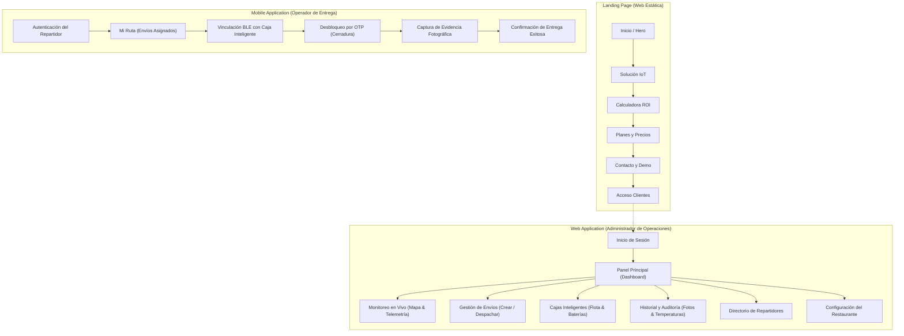
```mermaid
flowchart TD
    subgraph LandingPage ["Landing Page (Web Estática)"]
        LP_Hero["Inicio / Hero"] --> LP_Sol["Solución IoT"]
        LP_Sol --> LP_ROI["Calculadora ROI"]
        LP_ROI --> LP_Precios["Planes y Precios"]
        LP_Precios --> LP_Contacto["Contacto y Demo"]
        LP_Contacto --> LP_Login["Acceso Clientes"]
    end

    subgraph WebApp ["Web Application (Administrador de Operaciones)"]
        WA_Login["Inicio de Sesión"] --> WA_Dashboard["Panel Principal (Dashboard)"]
        WA_Dashboard --> WA_Live["Monitoreo en Vivo (Mapa & Telemetría)"]
        WA_Dashboard --> WA_Shipments["Gestión de Envíos (Crear / Despachar)"]
        WA_Dashboard --> WA_SmartBoxes["Cajas Inteligentes (Flota & Baterías)"]
        WA_Dashboard --> WA_Audit["Historial y Auditoría (Fotos & Temperaturas)"]
        WA_Dashboard --> WA_Drivers["Directorio de Repartidores"]
        WA_Dashboard --> WA_Settings["Configuración del Restaurante"]
    end

    subgraph MobileApp ["Mobile Application (Operador de Entrega)"]
        MA_Auth["Autenticación del Repartidor"] --> MA_Home["Mi Ruta (Envíos Asignados)"]
        MA_Home --> MA_BLE["Vinculación BLE con Caja Inteligente"]
        MA_BLE --> MA_Unlock["Desbloqueo por OTP (Cerradura)"]
        MA_Unlock --> MA_Photo["Captura de Evidencia Fotográfica"]
        MA_Photo --> MA_Finish["Confirmación de Entrega Exitosa"]
    end

    LP_Login -.-> WA_Login
```

1. **Navegación Global (Principal):**
   * *Landing Page:* Barra de navegación superior fija (*Sticky Navigation Bar*) con enlaces de ancla suaves a las secciones de la página, selector de idioma (EN/ES) y botón destacado de llamado a la acción *"Acceso a Clientes"*. En pantallas móviles, se colapsa en un menú hamburguesa accesible.
   * *Web Application:* Barra de navegación lateral persistente (*Collapsible Sidebar*) anclada a la izquierda. Muestra iconos descriptivos de Material Design con etiquetas textuales claras. Puede contraerse para maximizar el área de visualización de mapas y telemetría de pantalla completa.
   * *Mobile Application:* Barra de navegación inferior (*Bottom Navigation Bar*) con 3 destinos clave accesibles con el pulgar: *Mi Ruta*, *Caja IoT* y *Mi Perfil*.

2. **Navegación Local (Secundaria):**
   * *Web Application:* Pestañas horizontales (*Tabs*) dentro de la vista detallada de una SmartBox específica:
     * *Pestaña 1: Telemetría Actual* (Lecturas de temperatura en vivo, estado del Reed switch y nivel de batería).
     * *Pestaña 2: Historial Térmico* (Gráfica temporal de temperaturas registradas en el último trayecto).
     * *Pestaña 3: Registro de Seguridad* (Marcas de tiempo de desbloqueos por OTP y eventos de apertura).
     * *Pestaña 4: Diagnóstico de Hardware* (Firmware del ESP32, estado de sensores y calibración).

3. **Navegación Contextual (Cross-linking):**
   * Al recibir una notificación en la campana de alertas sobre una rotura térmica, hacer clic sobre la alerta redirige automáticamente a la vista de la orden afectada con el segmento anómalo de la gráfica resaltado.
   * En la tabla de auditoría de pedidos, cada fila incluye un botón directo *"Ver Reporte Probatorio"* que abre el visor de evidencias fotográficas tomadas por el operador en el domicilio del comensal.

4. **Navegación Suplementaria:**
   * **Migas de Pan (Breadcrumbs):** Implementadas en la parte superior del panel administrativo para indicar la jerarquía actual de navegación (ej. `Panel Principal > Cajas Inteligentes > SmartBox #SB-102 > Historial Térmico`).
   * **Pie de Página (Footer):** En el Landing Page, incluye mapa del sitio completo organizado en columnas temáticas (*Producto*, *Empresa*, *Seguridad & Legal*, *Contacto*), además de enlaces a términos de servicio conforme al código de ética profesional.

5. **Navegación de Cortesía y Mecanismos de Retorno:**
   * Botón explícito *"Volver"* en todas las vistas de detalle secundarias, preservando los filtros de búsqueda y la página seleccionada previamente.
   * Cuadros de diálogo modales con confirmación ante intentos de cancelar la creación de un nuevo envío para evitar pérdida accidental de datos ingresados.

## 5.3. Landing Page UI Design

### 5.3.1. Landing Page Wireframe

### 5.3.2. Landing Page Mock-up

## 5.4. Applications UX/UI Design

En esta sección presentamos cómo diseñamos la experiencia de las dos aplicaciones operativas de Cold2Hot: la **Delivery Admin Web App** (panel web para el administrador de operaciones) y la **Delivery Operator Mobile App** (app móvil para el repartidor). Las dos se conectan con la misma plataforma y con la SmartBox, así que las diseñamos juntas para que se sientan como un solo producto, con el mismo lenguaje visual que ya usamos en la Landing Page.

Para tomar las decisiones partimos de lo que ya trabajamos en los capítulos anteriores:

- **Los dos segmentos y sus User Personas**: el administrador, que necesita control y evidencia, y el repartidor, que necesita rapidez y respaldo ante penalizaciones injustas.
- **Las User Stories del Capítulo III**: cada pantalla existe porque responde a una historia concreta (US03 a US20).
- **La arquitectura del Capítulo IV**: el Container Diagram define qué hace cada app (la web consume el API Gateway; la móvil habla con la SmartBox por BLE y con el API cuando hay red).
- **La arquitectura de información y la guía de estilos** (secciones 5.1 y 5.2), de las que tomamos paleta, tipografía, etiquetas y navegación.

### Tecnología de cada aplicación
 
| Aplicación | Usuario | Tecnología | Sistema de diseño base |
| :--- | :--- | :--- | :--- |
| Delivery Admin Web App | Administrador de operaciones de delivery | Angular + TypeScript | Material Design con Angular Material |
| Delivery Operator Mobile App | Operador de entrega | Flutter + Dart | Material Design 3 (widgets de Flutter) |
 
Usar Material Design en ambas nos permite que el compañero que desarrolla la web y quien desarrolle la app móvil reutilicen componentes ya probados (botones, tablas, diálogos, campos de texto) y solo les cambien los tokens de color, tipografía y forma de Cold2Hot.

Un user goal es lo que el usuario quiere lograr, dicho con sus palabras y sin hablar de pantallas. Cada goal tiene su Wireflow y su User Flow.
 
**Delivery Admin Web App - Administrador de operaciones**
 
| ID | User goal | User Stories |
| :---: | :--- | :--- |
| WG1 | Crear mi cuenta e ingresar a la plataforma | US10, US11, US20 |
| WG2 | Despachar un pedido con el perfil térmico correcto y obtener su código OTP | US03 |
| WG3 | Vigilar mis envíos en ruta y reaccionar rápido ante una alerta | US04, US14, US16, US17 |
| WG4 | Revisar una entrega para resolver un reclamo con evidencia | US05 |
| WG5 | Registrar mis cajas y mis repartidores | US12, US13 |
| WG6 | Elegir y pagar un plan de suscripción | US15 |
| WG7 | Ver qué repartidores tienen más entregas perfectas | US19 |
 
**Delivery Operator Mobile App - Operador de entrega**
 
| ID | User goal | User Stories |
| :---: | :--- | :--- |
| MG1 | Ingresar a mi cuenta y ver mis pedidos asignados | US11, US20 |
| MG2 | Conectarme por Bluetooth a la caja de mi pedido | US06 |
| MG3 | Abrir la caja en el destino con el código OTP | US07 |
| MG4 | Dejar evidencia fotográfica y cerrar la entrega | US08 |
| MG5 | Corregir a tiempo una tapa mal cerrada durante el trayecto | Lean UX (seguridad de dos niveles) |

### 5.4.1. Applications Wireframes

En los wireframes decidimos qué información va en cada pantalla, en qué orden y dónde está cada acción. Se elaboraron con Figma.

#### 5.4.1.1. Delivery Operator Mobile App.

La app del repartidor se usa en movimiento, con poco tiempo y atención dividida. Por eso diseñamos cada pantalla con una sola pregunta en mente: ¿qué necesita hacer ahora?.
Tomamos tres decisiones de arquitectura de información que se ven en los wireframes:
 
1. **Navegación inferior de tres pestañas** (Pedidos, Historial, Perfil), a la altura del pulgar. Durante una entrega activa la navegación se oculta y la pantalla muestra solo el flujo de esa entrega, para no distraer.
2. **El estado de la caja manda.** En la pantalla de entrega en ruta, lo primero que se ve es el estado de la SmartBox (temperatura, cerrojo, batería y conexión). Es lo que el repartidor consulta con un vistazo.
3. **Flujo lineal para cerrar la entrega.** Desbloquear, tomar la foto, revisar y enviar son pasos consecutivos con un botón principal grande y un indicador de progreso, igual que el orden real de lo que pasa en la puerta del cliente.

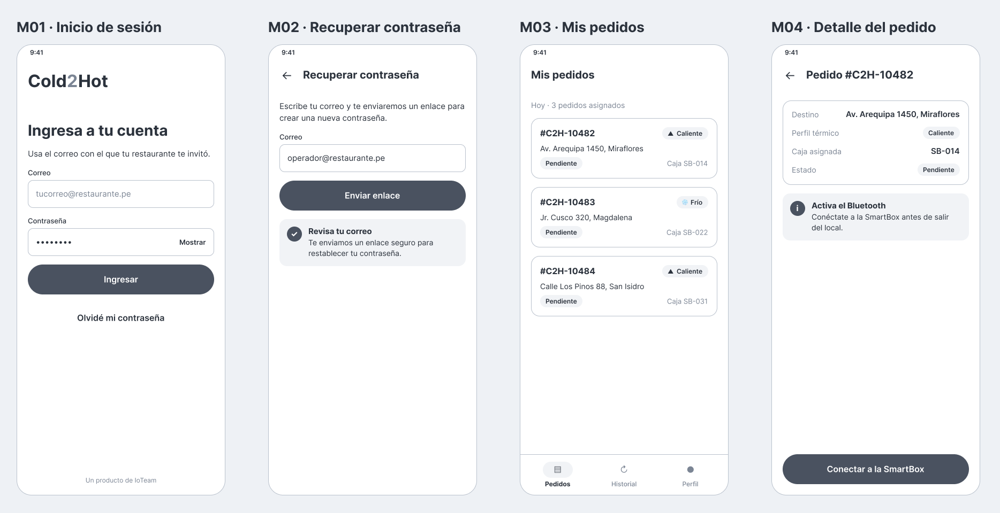
*Figura 5.4.1. Wireframes M01 a M04 de la Delivery Operator Mobile App.*

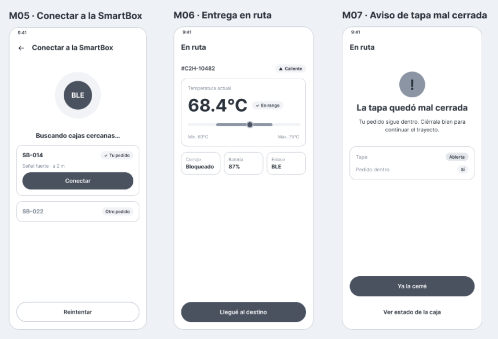
*Figura 5.4.2. Wireframes M05 a M07 de la Delivery Operator Mobile App.*

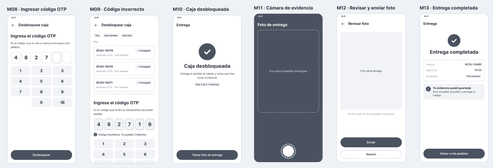
*Figura 5.4.3. Wireframes M08 a M13 de la Delivery Operator Mobile App.*

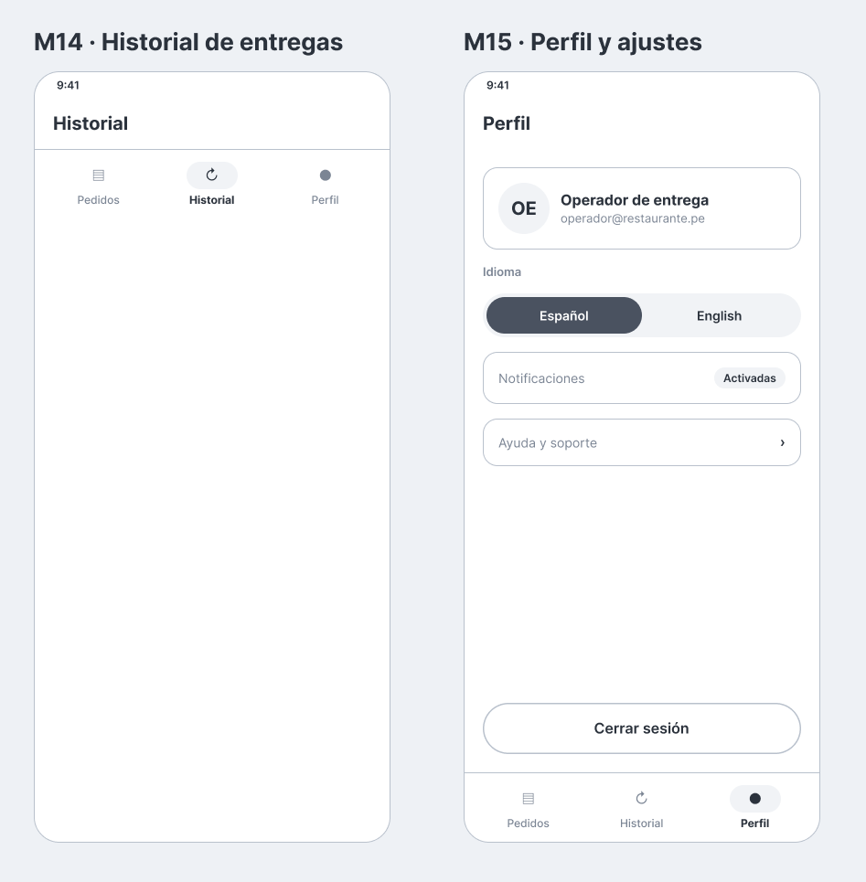
*Figura 5.4.4. Wireframes M14 y M15 de la Delivery Operator Mobile App.*

#### 5.4.1.2. Delivery Admin Web App.
 
El administrador trabaja con la pantalla grande, vigilando varias cajas a la vez y tomando decisiones. Lo que más le importa es ver todo de un vistazo y llegar a la evidencia rápido cuando hay un reclamo. Las decisiones de arquitectura de información son:

1. **Menú lateral agrupado por tareas**, con tres grupos: Operación (Monitoreo, Nuevo envío, Alertas), Auditoría (Historial, Analítica) y Administración (Operadores, Cajas, Plan y facturación, Configuración). Así el menú no se vuelve una lista larga y plana.
2. **El dashboard es la pantalla de inicio.** Lo primero que se ve al entrar es el estado de todas las cajas activas, con las alertas arriba.
3. **Del dato general al detalle.** Lista de cajas, detalle del envío y, al finalizar, el reporte de auditoría. El administrador siempre puede bajar un nivel o volver.

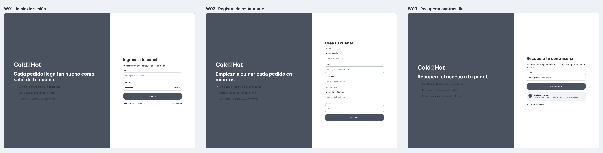
*Figura 5.4.5. Wireframes W01 a W03 de la Delivery Admin Web App (desktop).*
 
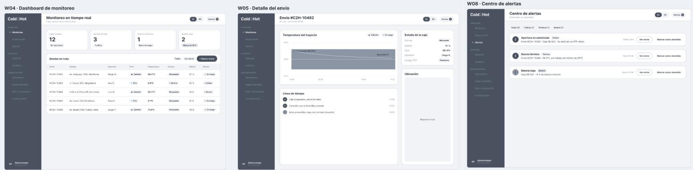
*Figura 5.4.6. Wireframes W04, W05 y W08 de la Delivery Admin Web App (desktop).*
 
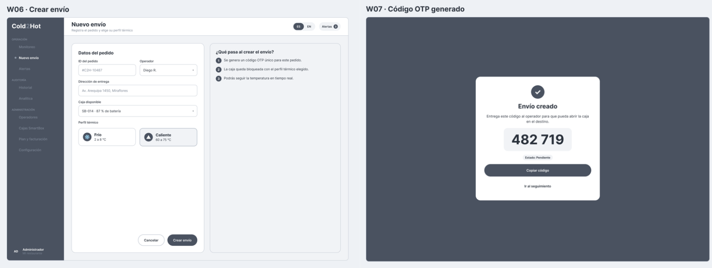
*Figura 5.4.7. Wireframes W06 y W07 de la Delivery Admin Web App (desktop).*
 
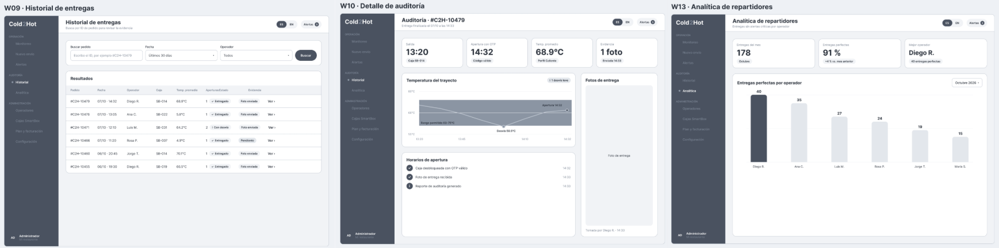
*Figura 5.4.8. Wireframes W09, W10 y W13 de la Delivery Admin Web App (desktop).*
 
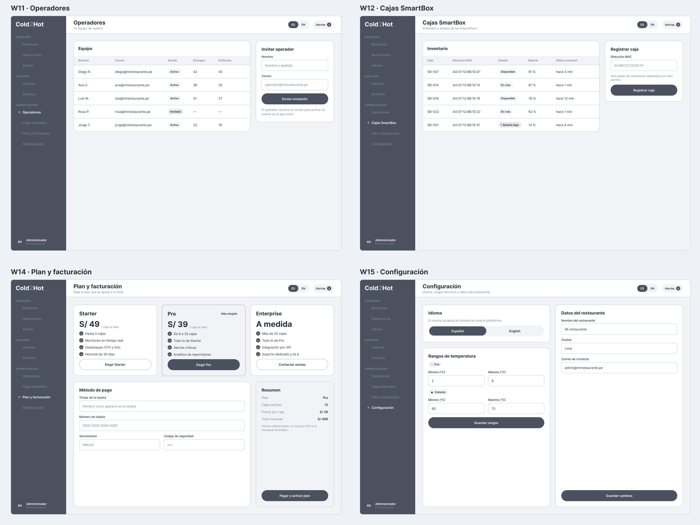
*Figura 5.4.9. Wireframes W11, W12, W14 y W15 de la Delivery Admin Web App (desktop).*

**Versión Mobile Web Browser**
El panel también tiene que poder consultarse desde el celular, por ejemplo cuando el administrador está fuera del local. Adaptamos las pantallas más usadas (W04, W05, W06 y W10) con estas reglas:
- El menú lateral se convierte en un menú tipo hamburguesa que abre un panel deslizable con los mismos tres grupos.
- Las tablas pasan a tarjetas apiladas: cada caja o envío es una tarjeta con su temperatura, batería y cerrojo.
- Los formularios van en una sola columna y el botón principal queda fijo en la parte inferior.
- Las gráficas ocupan todo el ancho y se pueden desplazar horizontalmente si el rango es largo.

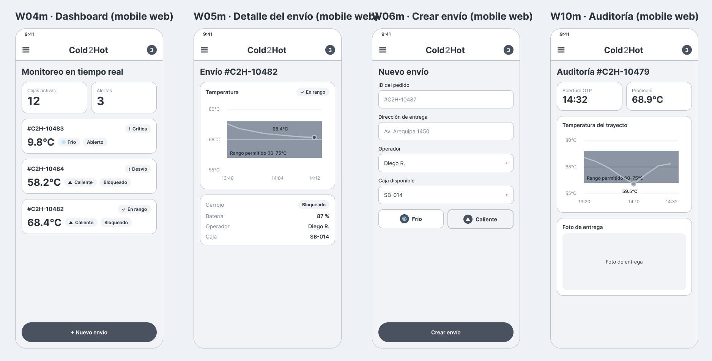
*Figura 5.4.10. Wireframes responsive (Mobile Web Browser) de W04, W05, W06 y W10.*


**Se aplicaron los principios, el diseño inclusivo y la arquitectura de información**
 
- **Patrón F de lectura.** En el dashboard, lo más importante resumen y alertas va arriba a la izquierda, donde empieza la lectura; el detalle se organiza en filas que se leen de izquierda a derecha.
- **Agrupación y proximidad.** Cada caja es una fila o tarjeta con sus datos juntos de temperatura, batería, cerrojo, separada de las demás por espacio, no por líneas pesadas.
- **Prevención de errores en formularios.** En W06 el perfil térmico se elige entre dos opciones visibles Frío y Caliente en vez de un campo libre, y solo se listan cajas disponibles. En W12 se valida el formato de la dirección MAC antes de enviar.
- **Evidencia al alcance.** Desde el historial (W09) a la evidencia (W10) hay un solo paso: buscar el ID y abrir el detalle, porque ese es el momento de mayor presión para el administrador.
- **Diseño inclusivo.** Todas las gráficas llevan etiquetas de texto y los estados llevan ícono y palabra, no solo color. El panel se puede navegar con teclado y los campos tienen etiqueta visible.
- **Etiquetado consistente con la app móvil.** Mismos términos y mismos nombres de estado en web y móvil.

---

### 5.4.2. Applications Wireflow Diagrams

#### 5.4.2.1. Delivery Admin Web App.
 
**WG1. Crear mi cuenta e ingresar a la plataforma**
 
- **Persona:** Administrador de operaciones 
- **User goal:** "Quiero crear la cuenta de mi restaurante y entrar a la plataforma para empezar a monitorear mis despachos."
- **Wireflow:** W01 → W02 → W04 (con checklist de primeros pasos)
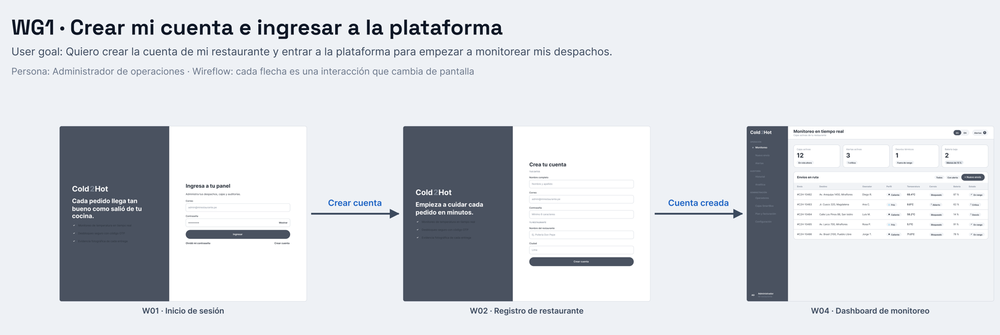
*Figura 5.4.11. Wireflow WG1: registro e ingreso.*
 
Explicación: El administrador llega a W01 desde el botón *Ingresar a la Web App* de la Landing Page. Si todavía no tiene cuenta, toca *Crear cuenta* y pasa a W02, un formulario dividido en dos bloques (sus datos y los del restaurante) para que no se sienta largo. Al terminar, el siguiente paso muestra W04 con un estado vacío que no deja al usuario perdido: una lista de primeros pasos (registrar una caja, invitar a un operador, elegir un plan) que lleva a W12, W11 y W14. Si ya tiene cuenta, ingresa directo a W04. El enlace *Olvidé mi contraseña* abre W03.

**WG2. Despachar un pedido con el perfil térmico correcto y obtener su código OTP**
 
- **Persona:** Administrador de operaciones
- **User goal:** "Quiero registrar un pedido, decir si va frío o caliente y obtener el código para que el repartidor abra la caja."
- **Wireflow:** W04 → W06 → W07 → W05
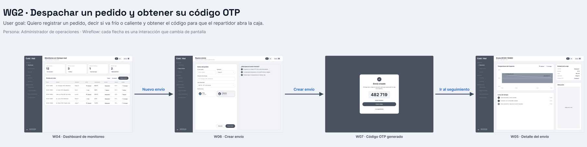
*Figura 5.4.12. Wireflow WG2: creación de un envío.*
 
Explicación: Desde el dashboard, el botón *Nuevo envío* abre W06. El formulario pide los datos del pedido, el operador y la caja solo aparecen las disponibles y, en un selector destacado, el perfil térmico. Al presionar Crear envío, el sistema responde con W07: un diálogo con el OTP en tamaño grande y el estado Pendiente, con el botón Copiar código para que el administrador se lo entregue al operador. Desde ahí pasa a W05 para seguir el envío. Mostramos el OTP en un diálogo y no en una pantalla aparte para que el administrador no pierda el contexto de lo que acaba de crear.
 
**WG3. Vigilar mis envíos en ruta y reaccionar rápido ante una alerta**
 
- **Persona:** Administrador de operaciones
- **User goal:** "Quiero saber en tiempo real cómo van mis cajas y enterarme enseguida si algo sale mal."
- **Wireflow:** W04 → W08 → W05
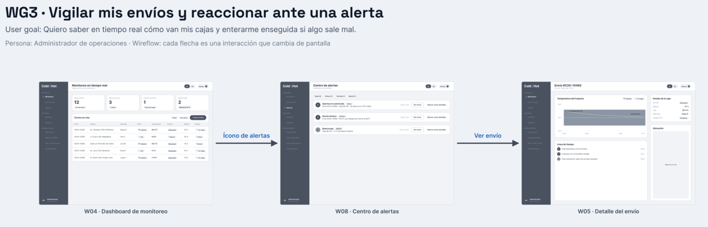
*Figura 5.4.13. Wireflow WG3: monitoreo y atención de alertas.*
 
Explicación: El dashboard (W04) muestra todas las cajas activas. Cuando llega una alerta aparece un contador en el ícono de alertas y la fila de la caja afectada cambia de estado. El administrador entra a W08, que ordena las alertas por gravedad primero las críticas por apertura no autorizada, luego las térmicas y por último las de batería baja, y desde ahí abre W05 para ver el detalle: la gráfica de temperatura contra el rango permitido y la línea de tiempo de eventos. Después puede marcar la alerta como atendida.
 
**WG4. Revisar una entrega para resolver un reclamo con evidencia**
 
- **Persona:** Administrador de operaciones
- **User goal:** "Cuando un cliente reclama, quiero encontrar la entrega y mostrar qué pasó, con datos y fotos."
- **Wireflow:** W09 → W10
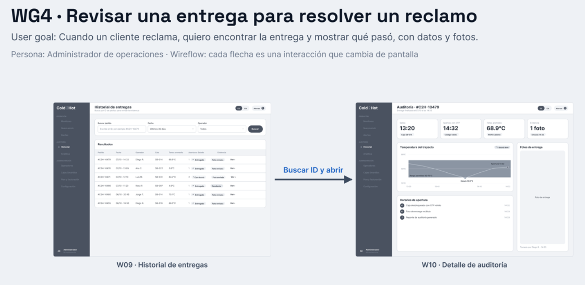
*Figura 5.4.14. Wireflow WG4: auditoría de una entrega.*
 
Explicación: En W09 el administrador escribe el ID del pedido en el buscador, que es el elemento más grande de la pantalla. El resultado cambia la tabla nuevo estado del wireframe y al abrirlo llega a W10, donde encuentra en una sola vista la gráfica térmica del trayecto, los horarios de apertura y las fotos de entrega. Esa vista reune lo que el administrador necesita para defenderse ante el cliente o la plataforma de delivery.
 
**WG5. Registrar mis cajas y mis repartidores**
 
- **Persona:** Administrador de operaciones
- **User goal:** "Quiero dar de alta mis cajas y a mi equipo de reparto para empezar a usarlos."
- **Wireflow:** W12 → diálogo de registro → W12 actualizada; W11 → diálogo de invitación → W11 actualizada
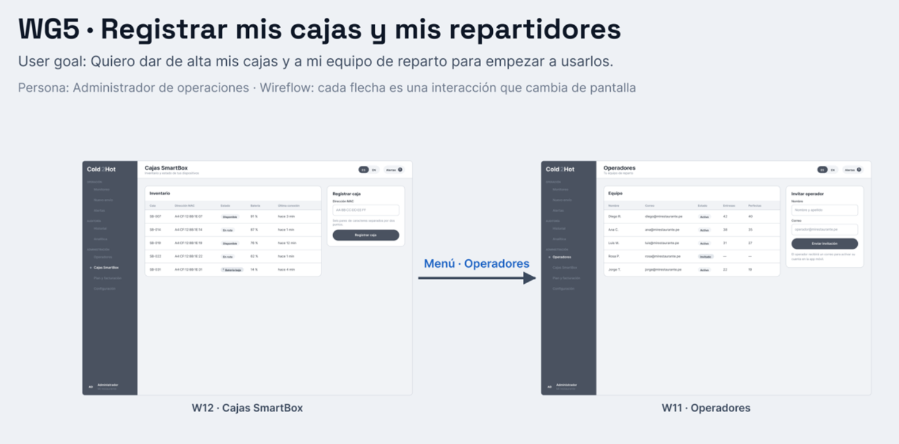
*Figura 5.4.15. Wireflow WG5: registro de cajas y operadores.*
 
Explicación: Ambas tareas siguen el mismo patrón para que se aprenda una vez: una tabla, un botón principal arriba a la derecha y un diálogo corto. En W12, Registrar caja pide la dirección MAC; al confirmar, la tabla se actualiza con la nueva caja y su batería. En W11, Invitar operador pide nombre y correo; al enviar, el operador aparece con estado Invitado hasta que active su cuenta.
 
**WG6. Elegir y pagar un plan de suscripción**
 
- **Persona:** Administrador de operaciones
- **User goal:** "Quiero escoger el plan que se ajusta a mi flota y pagarlo para seguir usando el servicio."
- **Wireflow:** W14 → formulario de pago → confirmación en W14
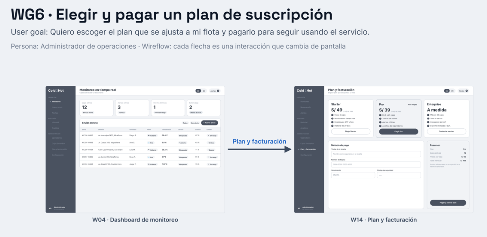
*Figura 5.4.16. Wireflow WG6: suscripción a un plan.*
 
Explicación: W14 repite los tres planes de la Landing Page (Starter, Pro y Enterprise) con la misma estructura y el plan Pro marcado como el más elegido, para que el administrador reconozca lo que ya vio antes de registrarse. Al elegir Starter o Pro, el paso siguiente muestra el formulario de método de pago y un resumen del monto; Enterprise lleva a contactar con ventas. Cuando el pago se aprueba, la pantalla vuelve a W14 con el plan actualizado.
 
**WG7. Ver qué repartidores tienen más entregas perfectas**
 
- **Persona:** Administrador de operaciones
- **User goal:** "Quiero comparar a mis repartidores para reconocer a los mejores y detectar a quién apoyar."
- **Wireflow:** W13 → W13 con mes seleccionado → W09 filtrado por operador
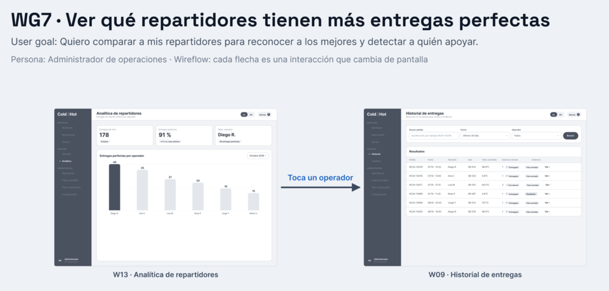
*Figura 5.4.17. Wireflow WG7: analítica de repartidores.*
 
Explicación: En W13 el administrador elige un mes y el gráfico se actualiza (nuevo estado del wireframe). Al tocar la barra de un operador, se abre el historial W09 ya filtrado por esa persona, para revisar sus entregas en detalle.
 
#### 5.4.2.2. Delivery Operator Mobile App.
 
**MG1. Ingresar a mi cuenta y ver mis pedidos asignados**
 
- **Persona:** Operador de entrega
- **User goal:** "Quiero entrar rápido a la app y ver qué pedidos tengo que entregar hoy."
- **Wireflow:** M01 → M03 (y M01 → M02 → M01 si olvidó su contraseña)
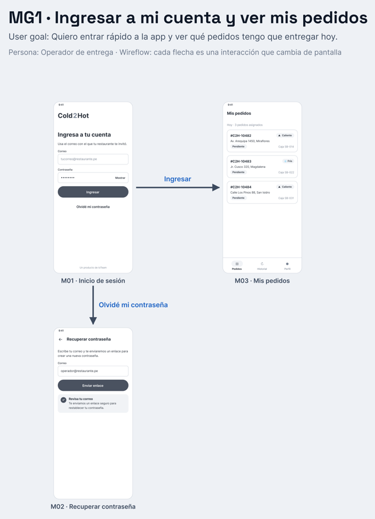
*Figura 5.4.18. Wireflow MG1: ingreso y pedidos asignados.*
 
Explicación: M01 tiene solo dos campos y un botón. Si la sesión ya está iniciada, la app salta directo a M03. Si el repartidor olvidó su contraseña, M02 le pide el correo y vuelve a M01 con un mensaje de confirmación. La cuenta del repartidor la crea el administrador (US12), por eso no incluimos un registro propio en la app.
 
**MG2. Conectarme por Bluetooth a la caja de mi pedido**
 
- **Persona:** Operador de entrega
- **User goal:** "Quiero vincular mi celular con la caja del pedido para poder abrirla en el destino."
- **Wireflow:** M03 → M04 → M05 → M06
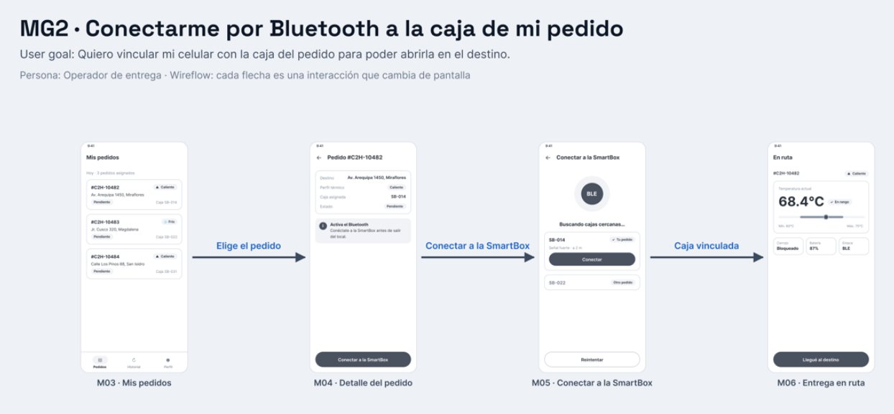
*Figura 5.4.19. Wireflow MG2: conexión con la SmartBox.*
 
Explicación: El repartidor elige su pedido en M03 y llega a M04, donde un recordatorio le pide activar el Bluetooth antes de salir. Conectar a la SmartBox abre M05, que muestra la búsqueda y la lista de cajas cercanas; la caja asignada al pedido aparece resaltada. Al vincularse, el LED de la caja confirma físicamente la conexión (US06) y la app muestra M06 con el estado de la caja. Que la confirmación sea doble (en el teléfono y en la caja) le da seguridad al repartidor de que está conectado a la caja correcta.
 
**MG3. Abrir la caja en el destino con el código OTP**
 
- **Persona:** Operador de entrega
- **User goal:** "Al llegar con el cliente, quiero abrir la caja rápido con el código que me dieron."
- **Wireflow:** M06 → M08 → M10 (y M08 → M09 → M08 si el código es incorrecto)
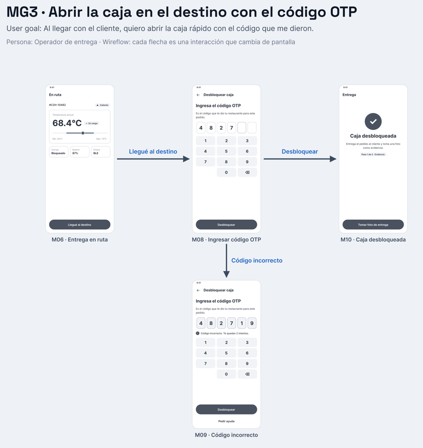
*Figura 5.4.20. Wireflow MG3: desbloqueo con OTP.*
 
Explicación: Desde M06, el botón Llegué al destino abre M08 con el teclado numérico ya desplegado. Al tocar Desbloquear se valida el código. Si es correcto, M10 confirma que el cerrojo se liberó. Si no lo es, el siguiente estado es M09, que mantiene las casillas a la vista, explica qué pasó y permite corregir sin volver a empezar.
 
**MG4. Dejar evidencia fotográfica y cerrar la entrega**
 
- **Persona:** Operador de entrega
- **User goal:** "Quiero dejar una foto que pruebe que entregué bien el pedido, para que nadie me penalice injustamente."
- **Wireflow:** M10 → M11 → M12 → M13
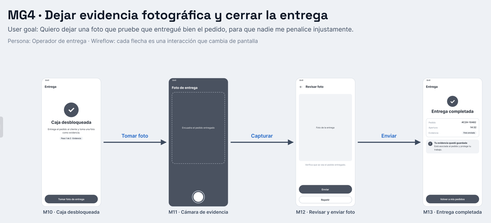
*Figura 5.4.21. Wireflow MG4: evidencia fotográfica y cierre.*
 
Explicación: M10 lleva directo a la cámara (M11). Tras la captura, M12 muestra la foto en grande con Repetir y Enviar. Al enviar, M13 cierra el ciclo con un resumen. En las entrevistas, los repartidores vieron la foto como un respaldo a su trabajo, así que M13 lo refuerza con un mensaje de que la evidencia ya quedó asociada al pedido.
 
**MG5. Corregir a tiempo una tapa mal cerrada durante el trayecto**
 
- **Persona:** Operador de entrega
- **User goal:** "Si la tapa quedó mal cerrada, quiero enterarme enseguida y arreglarlo sin que me tomen por sospechoso."
- **Wireflow:** M06 → M07 → M06
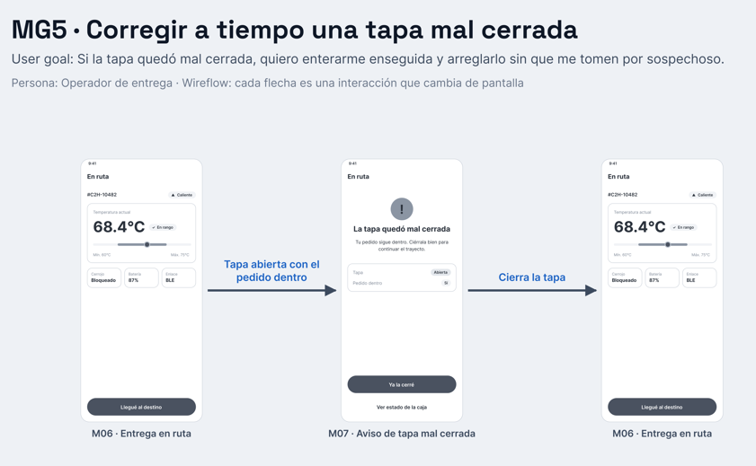
*Figura 5.4.22. Wireflow MG5: aviso preventivo por tapa mal cerrada.*
 
Explicación: Durante M06, si los sensores detectan la tapa abierta con el pedido todavía dentro, la app pasa a M07 con un aviso preventivo. El tono es de ayuda, no de acusación: le dice qué ocurrió y qué hacer. Al cerrar bien la tapa vuelve a M06 con el aviso resuelto. Esta diferencia entre aviso preventivo y alerta crítica es la que definimos en la seguridad de dos niveles.
 
---
### 5.4.3. Applications Mock-ups

Los mock-ups son los wireframes con la identidad visual de Cold2Hot: color, tipografía, íconos, formas y estados. Los elaboramos en Figma a partir de los tokens de la Landing Page para que el producto se vea como una sola familia: quien entra desde el sitio web a la app reconoce enseguida los mismos colores, la misma tipografía y el mismo estilo de botones.

#### Design System aplicado
 
**Colores**
 
Tomamos los colores de la Landing Page. Frío y caliente son los dos protagonistas de la marca, así que los usamos para representar los perfiles térmicos.
 
| Token | Valor | Uso en las aplicaciones |
| :--- | :--- | :--- |
| `--cold` | `#2F80ED` | Perfil Frío, gráficos, íconos y elementos decorativos |
| `--hot` | `#FF6B3D` | Perfil Caliente, gráficos y acentos |
| `--ok` | `#12A46B` | Estado correcto (en rango, cerrado, entregado) |
| `--warn` | `#F2A516` | Aviso preventivo |
| `--ink` | `#0E1726` | Texto principal y botones primarios |
| `--ink-2` | `#3C4A5E` | Texto secundario |
| `--muted` | `#6B778A` | Metadatos y ayudas |
| `--line` | `#E3E8ED` | Bordes y divisores |
| `--bg` / `--bg-alt` | `#FFFFFF` / `#F5F8FC` | Fondo de pantallas y de secciones |
| `--navy` | `#0B1422` | Barra lateral de la web y tema oscuro |

**Ajustes de accesibilidad.** En las aplicaciones usamos las variantes más oscuras cuando se trata de texto, y agregamos un color para alertas críticas que la landing no necesitaba.

| Combinación | Contraste | Decisión |
| :--- | :---: | :--- |
| `--ink` sobre blanco | 17.96:1 | Texto principal |
| `--ink-2` sobre blanco | 9.00:1 | Texto secundario |
| `--muted` sobre blanco | 4.53:1 | Solo metadatos de 14 sp o más |
| Blanco sobre `--cold` (`#2F80ED`) | 3.87:1 | **No** se usa para texto normal; se usa `#1D63C4` (5.78:1) para botones y enlaces |
| Blanco sobre `--hot` | 2.83:1 | **No** se usa; sobre `--hot` el texto es `--ink` (6.35:1) |
| `--ok` sobre su fondo suave | 2.88:1 | **No** se usa; para texto de estado correcto se usa `#0B7A50` sobre `#E4F7EE` (4.81:1) |
| Texto caliente `#C94A1F` sobre `#FFF0EA` | 4.22:1 | **No** se usa; se usa `#B03E16` (5.33:1) |
| Blanco sobre alerta crítica `#B3261E` | 6.54:1 | Nuevo token `--danger` para alertas críticas |
| `--ink` sobre `--warn` | 8.70:1 | Aviso preventivo |

**Semántica de estados.** Cada estado se comunica con **color + ícono + texto**, nunca solo con color:

| Estado | Color | Ícono | Texto de ejemplo |
| :--- | :--- | :--- | :--- |
| En rango / cerrado / entregado | Verde (`--ok-strong`) | Check | "En rango" |
| Aviso preventivo | Ámbar (`--warn`) | Triángulo de advertencia | "Tapa mal cerrada" |
| Desvío térmico | Naranja (`--hot-strong`) | Termómetro | "Fuera de rango" |
| Alerta crítica | Rojo (`--danger`) | Escudo con exclamación | "Apertura no autorizada" |
| Perfil Frío | Azul (`--cold-strong`) | Copo de nieve | "Frío" |
| Perfil Caliente | Naranja (`--hot-strong`) | Llama | "Caliente" |

**Tipografía.** *Space Grotesk* para títulos y cifras importantes (temperatura, OTP) y *Inter* para el resto, igual que la Landing Page.

| Nivel | Fuente | Tamaño móvil | Tamaño web |
| :--- | :--- | :---: | :---: |
| Título de pantalla | Space Grotesk Bold | 24 sp | 32 px |
| Título de sección | Space Grotesk SemiBold | 18 sp | 20 px |
| Cifra destacada (temperatura, OTP) | Space Grotesk Bold | 32 sp | 40 px |
| Cuerpo | Inter Regular | 16 sp | 16 px |
| Metadato | Inter Medium | 14 sp | 14 px |
 
**Forma, espaciado y elevación.** Esquinas de 16 px en tarjetas y de 10 px en campos; botones y etiquetas con forma de píldora, como en la landing. Cuadrícula de 8 px. Sombras suaves, sin bordes pesados.

**Componentes principales**
 
| Componente | Web (Angular Material) | Móvil (Flutter Material 3) |
| :--- | :--- | :--- |
| Navegación | `mat-sidenav` + `mat-toolbar` | `NavigationBar` de tres pestañas |
| Botón primario | `mat-flat-button`, fondo `--ink`, forma de píldora | `FilledButton`, 56 dp de alto |
| Campos | `mat-form-field` con etiqueta visible | `TextField` con etiqueta flotante |
| Estado | `mat-chip` con ícono y texto | `Chip` con ícono y texto |
| Datos | `mat-table` con paginación | `ListView` de tarjetas |
| Mensajes | `mat-dialog`, `mat-snack-bar` | `showModalBottomSheet`, `SnackBar` |
| Gráficas | Gráfico de línea (temperatura) y de barras (analítica) | Indicador de temperatura con rango |

#### 5.4.3.1. Delivery Operator Mobile App.
 
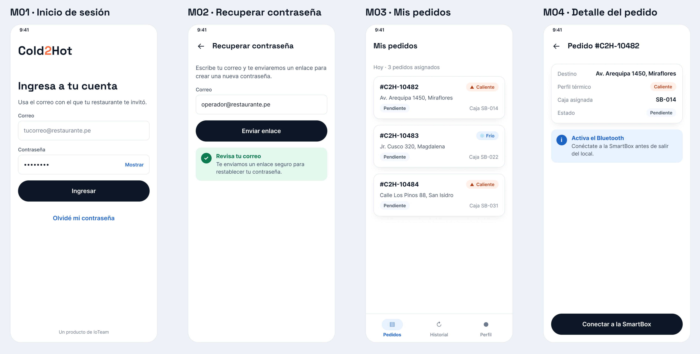
*Figura 5.4.23. Mock-ups M01 a M04.*
 
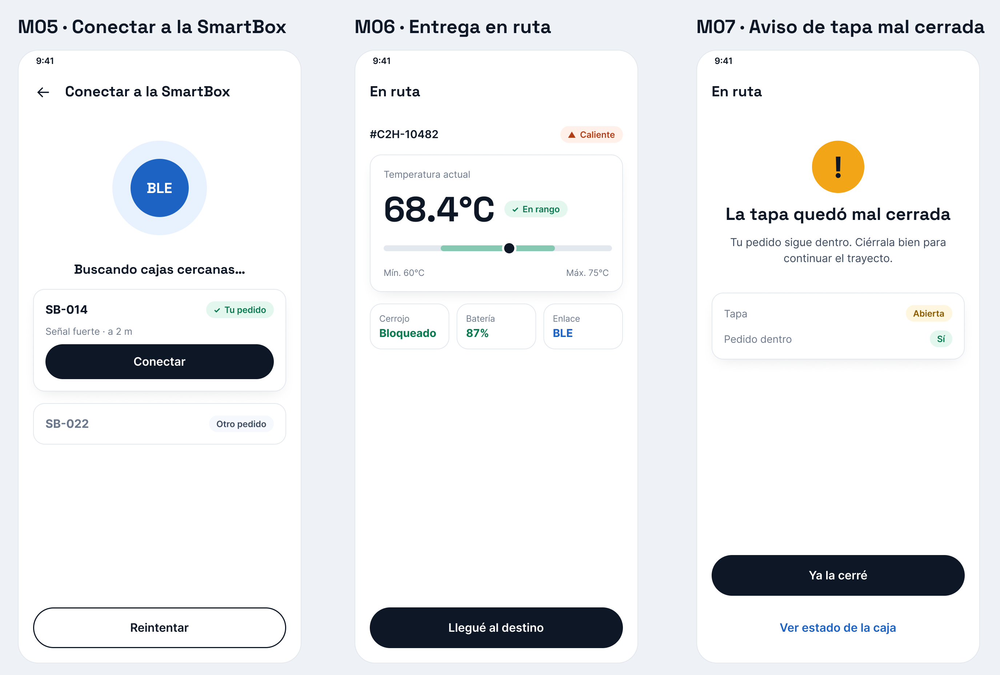
*Figura 5.4.24. Mock-ups M05 a M07.*
 
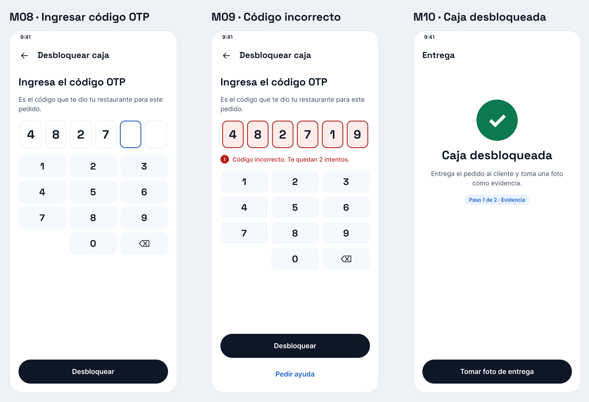
*Figura 5.4.25. Mock-ups M08 a M10.*
 
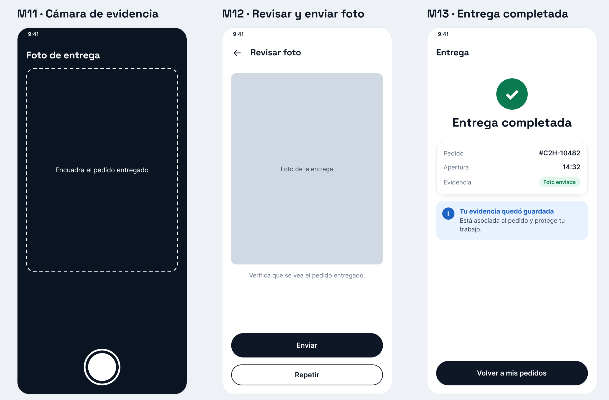
*Figura 5.4.26. Mock-ups M11 a M13.*
 
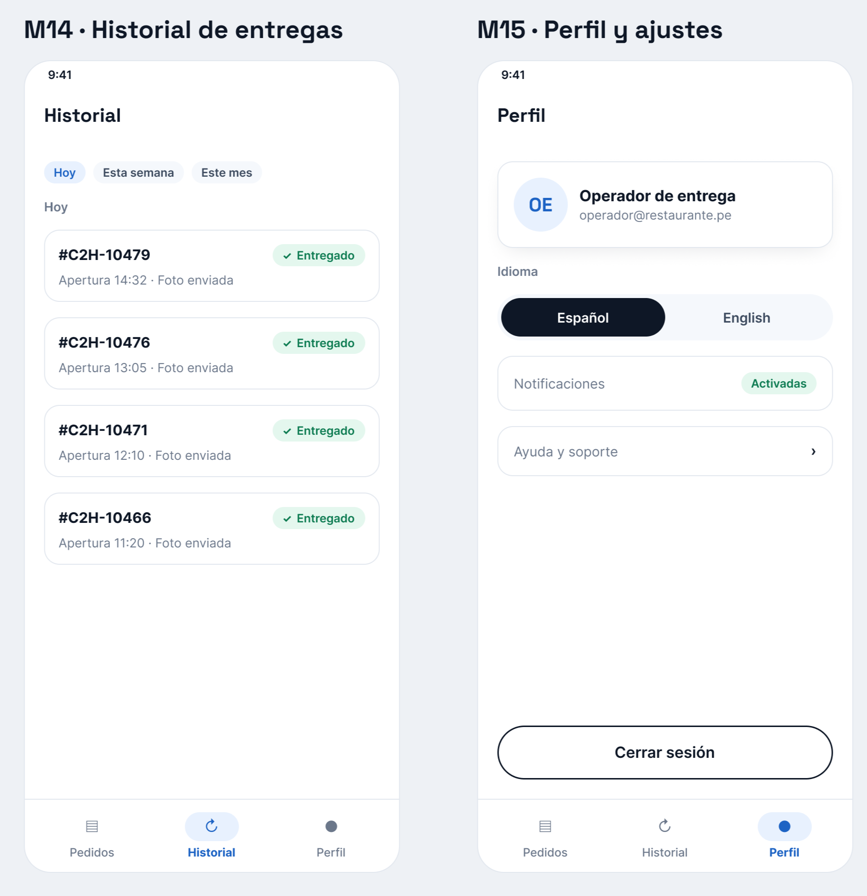
*Figura 5.4.27. Mock-ups M14 y M15.*

#### 5.4.3.2. Delivery Admin Web App.
 

*Figura 5.4.28. Mock-ups W01 a W03 (desktop).*
 
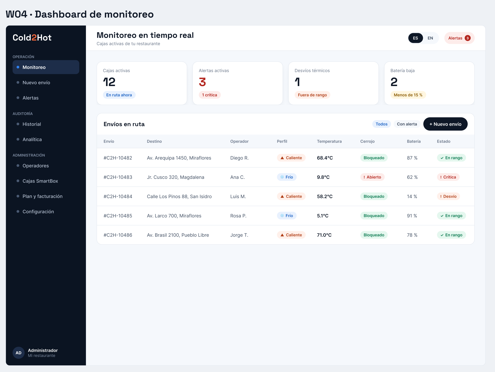
*Figura 5.4.29. Mock-up W04, dashboard de monitoreo (desktop).*
 
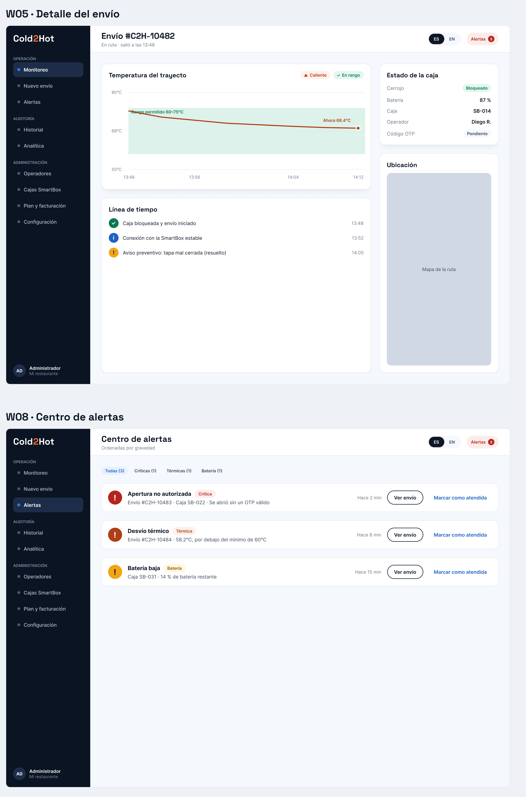
*Figura 5.4.30. Mock-ups W05 y W08 (desktop).*
 
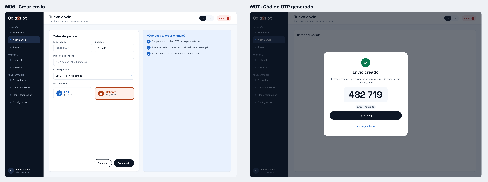
*Figura 5.4.31. Mock-ups W06 y W07 (desktop).*
 

*Figura 5.4.32. Mock-ups W09, W10 y W13 (desktop).*
 

*Figura 5.4.33. Mock-ups W11, W12, W14 y W15 (desktop).*
 
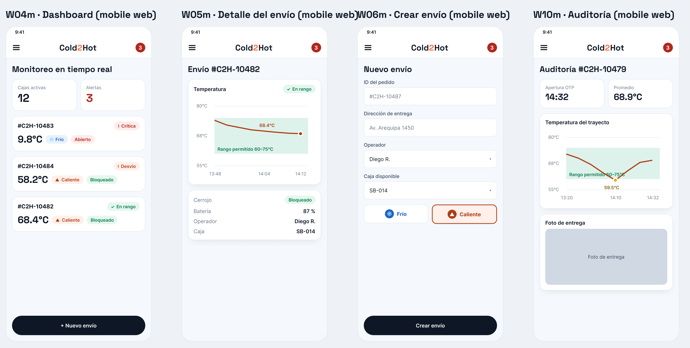
*Figura 5.4.34. Mock-ups responsive (Mobile Web Browser) de W04, W05, W06 y W10.*

---

### 5.4.4. Applications User Flow Diagrams

#### 5.4.4.1. Delivery Admin Web App.
 
**UF-WG1. Crear mi cuenta e ingresar a la plataforma**
 
- **User goal:** Crear la cuenta del restaurante e ingresar a la plataforma.
- **Happy path:** W01 → *Crear cuenta* → W02 → datos válidos → W04.
- **Unhappy paths:** datos inválidos o correo ya registrado en W02; credenciales incorrectas en W01; contraseña olvidada.
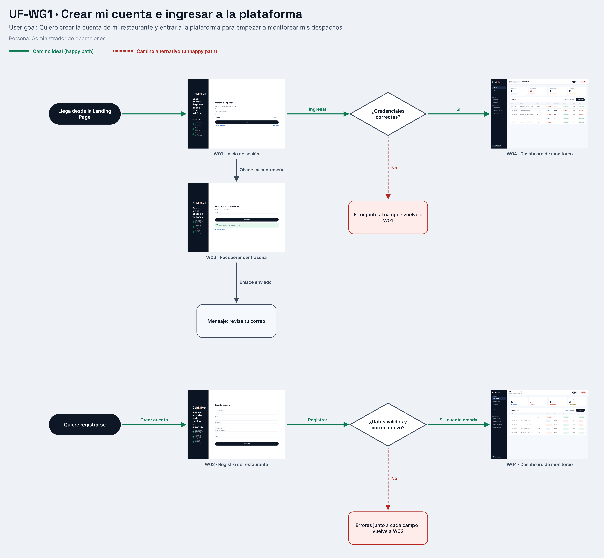
*Figura 5.4.35. User Flow WG1: crear mi cuenta e ingresar a la plataforma.*
 
Explicación: El flujo prioriza que el administrador no se quede bloqueado. Los errores se muestran junto al campo afectado y mantienen lo ya escrito. Al terminar el registro, W04 no aparece vacío sin más: muestra los primeros pasos para empezar a usar el producto.
 
**UF-WG2. Despachar un pedido y obtener su código OTP**
 
- **User goal:** Crear un envío con su perfil térmico y obtener el OTP.
- **Happy path:** W04 → W06 → datos válidos → W07 → W05.
- **Unhappy paths:** no hay cajas disponibles; datos incompletos o inválidos; falla al crear el envío.
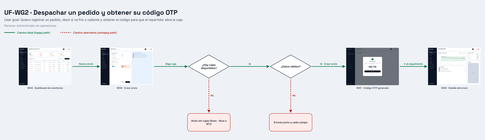
*Figura 5.4.36. User Flow WG2: despachar un pedido y obtener su código OTP.*
 
Explicación: Si no hay cajas disponibles, el flujo no deja al administrador sin salida: lo lleva a W12 para revisar o registrar cajas. El perfil térmico es obligatorio y no tiene valor por defecto, para que sea una decisión consciente en cada despacho.
 
**UF-WG3. Vigilar mis envíos y reaccionar ante una alerta**
 
- **User goal:** Monitorear las cajas en ruta y atender las alertas.
- **Happy path:** W04 → *se muestra una alerta* → W08 → W05 → alerta atendida.
- **Unhappy paths:** no hay envíos en ruta; se pierde la conexión con una caja; hay varias alertas simultáneas.
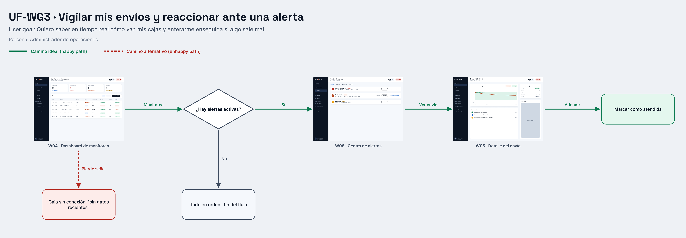
*Figura 5.4.37. User Flow WG3: vigilar mis envíos y reaccionar ante una alerta.*
 
Explicación: Las alertas se atienden por gravedad. Si una caja pierde la conexión, el panel no muestra el último dato como si fuera actual: indica "sin datos recientes" con la hora del último registro, para no dar una falsa tranquilidad.
 
**UF-WG4. Revisar una entrega para resolver un reclamo**
 
- **User goal:** Encontrar una entrega y revisar su evidencia.
- **Happy path:** W09 → buscar ID → W10 → ver gráfica, horarios y fotos.
- **Unhappy paths:** el ID no existe; la entrega no tiene foto aún.
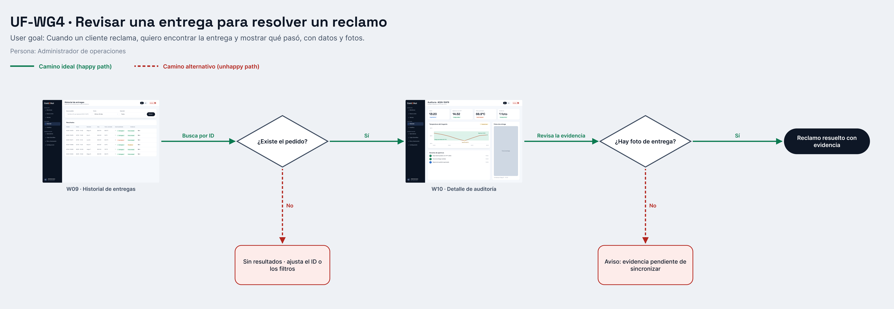
*Figura 5.4.38. User Flow WG4: revisar una entrega para resolver un reclamo.*
 
Explicación: Si la foto todavía no llegó (por ejemplo, por falta de señal del repartidor), el panel lo dice con claridad en vez de mostrar un espacio vacío, para que el administrador sepa que la evidencia puede aparecer más tarde.
 
**UF-WG5. Registrar mis cajas y mis repartidores**
 
- **User goal:** Dar de alta cajas y operadores.
- **Happy path:** W12 → *Registrar caja* → MAC válida → caja vinculada; W11 → *Invitar operador* → invitación enviada.
- **Unhappy paths:** MAC con formato inválido; caja ya registrada; correo inválido o repetido.
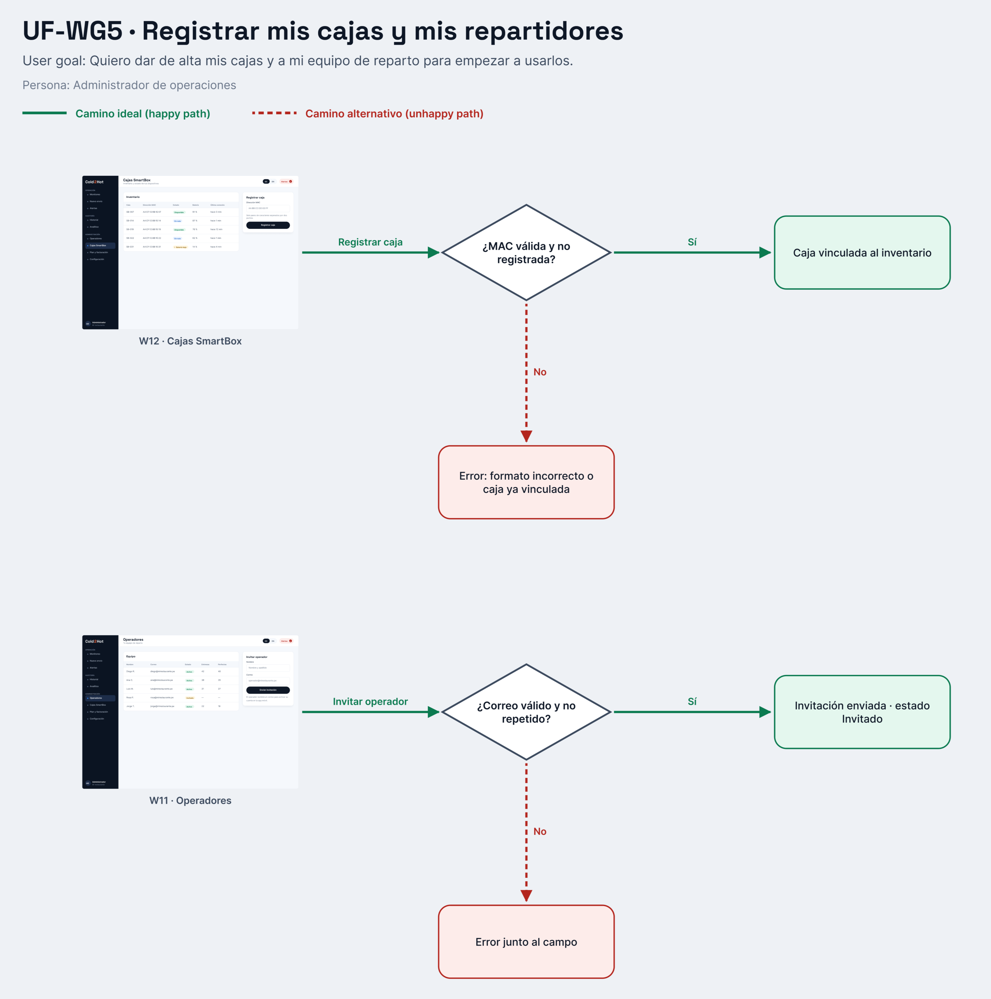
*Figura 5.4.39. User Flow WG5: registrar mis cajas y mis repartidores.*
 
Explicación: Las validaciones ocurren antes de enviar y el mensaje de error explica cómo corregirlo, por ejemplo mostrando el formato esperado de la dirección MAC.
 
**UF-WG6. Elegir y pagar un plan de suscripción**
 
- **User goal:** Seleccionar un plan y registrar el pago.
- **Happy path:** W14 → elegir Starter o Pro → pago → plan actualizado.
- **Unhappy paths:** pago rechazado; la flota supera el límite del plan; elección de Enterprise.
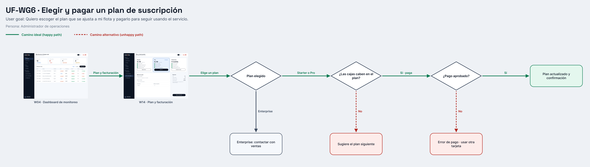
*Figura 5.4.40. User Flow WG6: elegir y pagar un plan de suscripción.*
 
Explicación: El flujo evita que el administrador contrate un plan que no cubre su flota (por ejemplo, más de 5 cajas en Starter) y le propone el plan siguiente antes de pedir el pago.
 
**UF-WG7. Ver el desempeño de los repartidores**
 
- **User goal:** Comparar entregas exitosas por operador.
- **Happy path:** W13 → elegir mes → ver gráfico → abrir las entregas de un operador en W09.
- **Unhappy paths:** el mes no tiene datos.
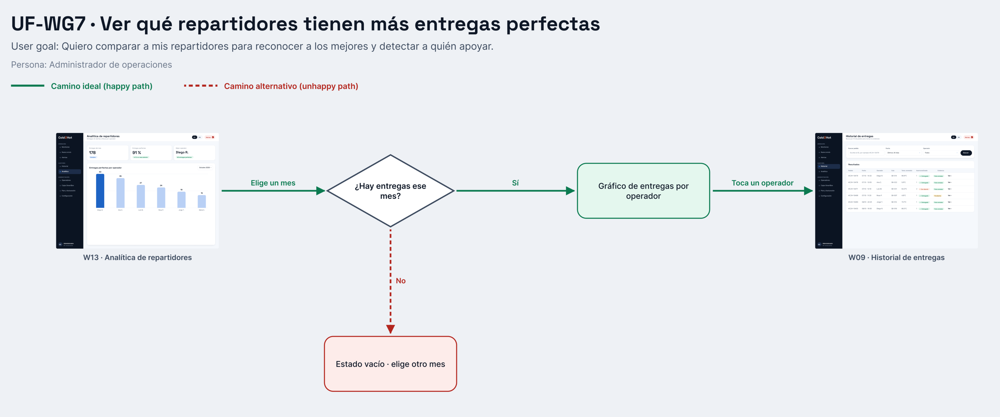
*Figura 5.4.41. User Flow WG7: ver el desempeño de los repartidores.*
 
Explicación: El gráfico no es un callejón sin salida: permite pasar de la cifra a las entregas que la componen.
 
#### 5.4.4.2. Delivery Operator Mobile App.
 
**UF-MG1. Ingresar y ver mis pedidos**
 
- **User goal:** Entrar a la app y ver los pedidos asignados.
- **Happy path:** M01 → credenciales correctas → M03.
- **Unhappy paths:** credenciales incorrectas; cuenta aún no activada; sin conexión; contraseña olvidada; sin pedidos asignados.
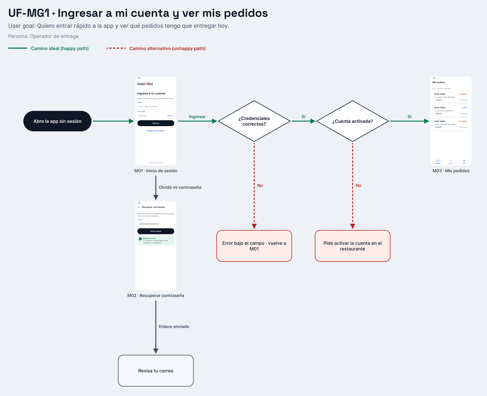
*Figura 5.4.42. User Flow MG1: ingresar y ver mis pedidos.*
 
Explicación: Mantener la sesión iniciada evita que el repartidor tenga que ingresar sus datos cada vez que arranca su turno. Los mensajes de error le dicen qué hacer, incluso cuando el problema está en el lado del restaurante.
 
**UF-MG2. Conectarme a la caja de mi pedido**
 
- **User goal:** Vincular el teléfono con la SmartBox asignada.
- **Happy path:** M03 → M04 → M05 → vinculación exitosa → M06.
- **Unhappy paths:** Bluetooth apagado; permisos negados; caja no encontrada; caja que no corresponde al pedido; falla de vinculación.
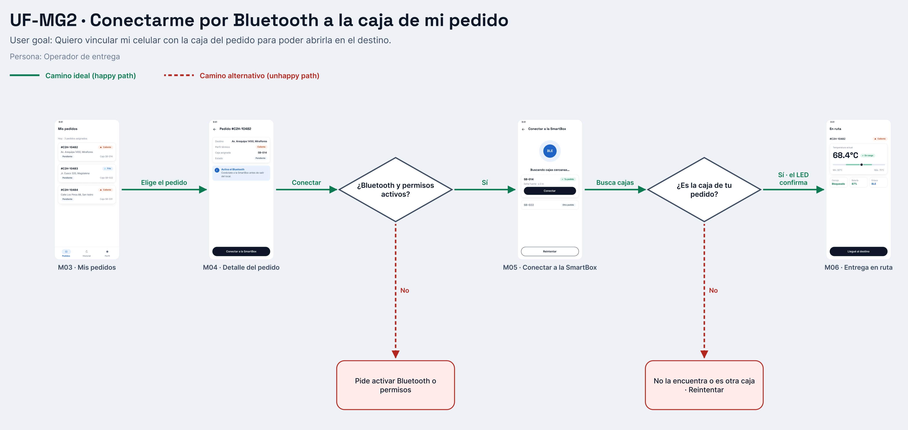
*Figura 5.4.43. User Flow MG2: conectarme a la caja de mi pedido.*
 
Explicación: Es el flujo con más posibles fallos, por eso cada rama explica qué pasó y ofrece la acción para continuar. El paso de verificar que la caja corresponde al pedido evita usar una SmartBox equivocada.
 
**UF-MG3. Abrir la caja con el OTP**
 
- **User goal:** Desbloquear la caja en el destino.
- **Happy path:** M06 → M08 → código correcto → M10.
- **Unhappy paths:** código incorrecto; código vencido; intentos agotados; Bluetooth desconectado; sin internet.
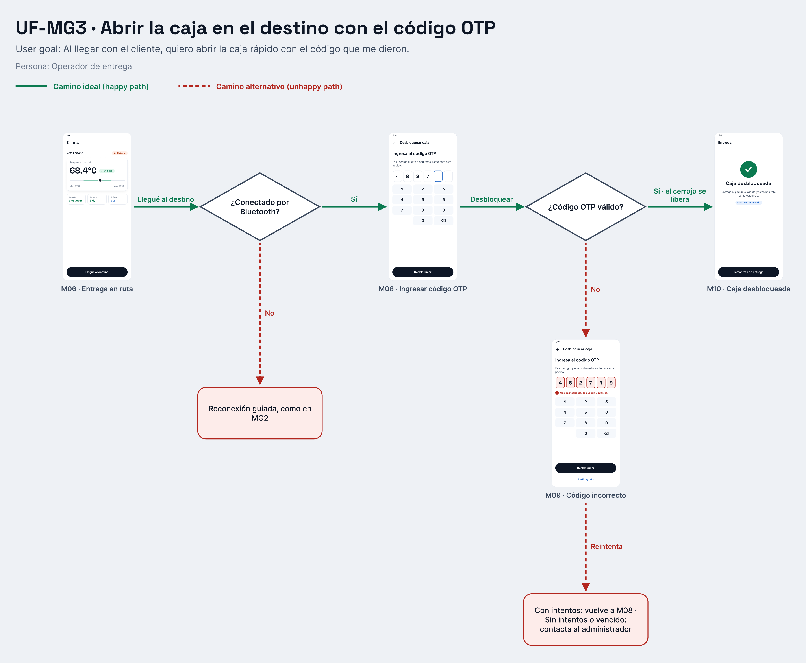
*Figura 5.4.44. User Flow MG3: abrir la caja con el OTP.*
 
Explicación: Si no hay internet, el desbloqueo sigue siendo posible porque la validación puede hacerse con la caja por Bluetooth, tal como lo definimos en la arquitectura del Capítulo IV; el evento se sincroniza después. Cuando el código falla, el mensaje no culpa al repartidor: indica si el código es incorrecto o está vencido y qué hacer.
 
**UF-MG4. Dejar evidencia y cerrar la entrega**
 
- **User goal:** Subir la foto de entrega y completar el pedido.
- **Happy path:** M10 → M11 → M12 → *Enviar* → M13.
- **Unhappy paths:** permiso de cámara negado; foto borrosa o mal encuadrada; sin internet; falla al subir.
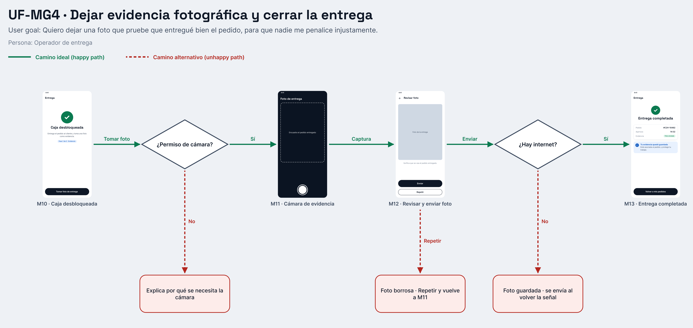
*Figura 5.4.45. User Flow MG4: dejar evidencia y cerrar la entrega.*
 
Explicación: Aunque no haya señal, el repartidor puede cerrar la entrega. La foto queda guardada y se envía cuando vuelve la conexión, con un estado visible en M13. Así la falta de internet no se convierte en un problema del repartidor.
 
**UF-MG5. Corregir una tapa mal cerrada**
 
- **User goal:** Resolver un aviso preventivo durante el trayecto.
- **Happy path:** M06 → M07 → cierra la tapa → M06 con el aviso resuelto.
- **Unhappy paths:** la tapa sigue abierta; se detecta que el pedido fue extraído.
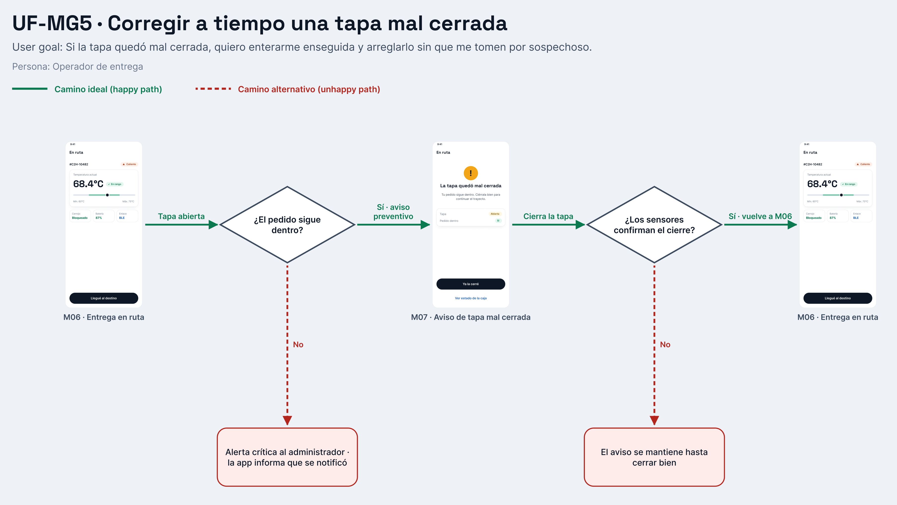
*Figura 5.4.46. User Flow MG5: corregir una tapa mal cerrada.*
 
Explicación: El flujo muestra la diferencia entre un descuido y una manipulación. Si el pedido sigue dentro, la app solo avisa al repartidor para que corrija. Si el pedido ya no está, se genera una alerta crítica para el administrador y el repartidor queda informado de que se notificó, sin sorpresas.

## 5.5. Applications Prototyping

## 5.6. IoT Device Design

# Conclusiones

## Conclusiones y recomendaciones.

### Conclusiones

- El problema abordado por Cold2Hot no se limita a la pérdida de temperatura de los alimentos durante el reparto: el trabajo de needfinding y las entrevistas evidenciaron que la falta de trazabilidad y de evidencia sobre la manipulación del pedido es igual de crítica para los administradores de operaciones de delivery, ya que es la que genera reclamos que hoy no pueden refutar.

- El análisis competitivo mostró que las soluciones existentes en el mercado atienden el control térmico o la seguridad del contenedor de forma aislada, pero no de manera integrada ni con telemetría en tiempo real. Esa brecha es la que sustenta la propuesta de valor de Cold2Hot.

- La aplicación de Domain-Driven Design permitió descomponer la solución en bounded contexts con responsabilidades claras (monitoreo térmico y telemetría, acceso y seguridad, gestión de contenedores y dispositivos, e identidad y acceso), lo que facilitó repartir el diseño entre los integrantes sin generar dependencias bloqueantes entre ellos.

- El uso de un microcontrolador ESP32 junto con el sensor DS18B20 y el esquema de seguridad de dos niveles (Reed Switch e infrarrojo TCRT5000) resulta viable para los objetivos planteados, y su definición temprana permitió alinear el diseño de software con las restricciones reales del hardware.

- La segmentación en dos perfiles de usuario con necesidades distintas —administradores de operaciones y repartidores— obligó a diseñar dos experiencias diferenciadas, una web de supervisión y una móvil de operación en ruta, en lugar de una única aplicación genérica.

- El trabajo colaborativo sobre un repositorio compartido, con ramas por capítulo y revisión mediante Pull Requests, permitió que siete integrantes avanzaran en paralelo sobre un mismo documento manteniendo la trazabilidad de cada aporte.

### Recomendaciones

- Validar con usuarios reales los umbrales de temperatura y los tiempos de alerta antes de la implementación, ya que los valores actuales provienen del análisis del problema y no de mediciones en ruta.

- Incorporar métricas de línea base en los establecimientos piloto antes del despliegue, de modo que los objetivos planteados (reducción del 35% en reclamos por temperatura y 90% de entregas sin alertas críticas de manipulación) puedan medirse contra un punto de partida verificable.

- Definir el comportamiento del dispositivo ante pérdida de conectividad durante el trayecto, contemplando el almacenamiento local de la telemetría y su sincronización posterior, para que no existan vacíos en la cadena de custodia.

- Considerar el consumo energético del dispositivo y la autonomía de la batería como requisito no funcional explícito, dado que el sistema debe operar durante toda la jornada de reparto sin acceso a una fuente de alimentación fija.

- Mantener actualizada la tabla de contenidos y verificar el documento antes de cada entrega, evitando el uso de formateadores automáticos de Markdown sobre el informe, ya que el documento contiene bloques HTML que dichas herramientas alteran.

# Video About-the-Team

El video institucional del equipo de trabajo presenta la visión de la startup **IoTeam**, la propuesta de valor del producto **Cold2Hot**, los roles y responsabilidades desempeñados por cada miembro del equipo y la argumentación colectiva que sustenta el cumplimiento del **Student Outcome ABET EAC 5** (capacidad de funcionar efectivamente en un equipo proporcionando liderazgo conjunto, creando un entorno colaborativo y cumpliendo objetivos).

* **Enlace al Video About-the-Team:** [Video About-the-Team - IoTeam (Cold2Hot)](https://upcedupe-my.sharepoint.com/:v:/g/personal/u202210790_upc_edu_pe/video-about-the-team-cold2hot-av1)
* **Duración:** 11 minutos y 45 segundos.
* **Participantes:**
  - Alvarado De La Cruz, Juan Carlos
  - Carhuancote Dominguez, Gonzalo Alonso
  - Diestra Zambrano, Adriana Maria
  - Duran Diaz, Antonio Rodrigo
  - Nakasone Gomes, Marco Antonio
  - Shimabukuro Uku, Carlos Joel
  - Teves Samaniego, Joan Fernando

# Bibliografía

1. **Adzic, G. (2012).** *Impact Mapping: Making a big impact with software products and projects*. Provoking Thoughts.
2. **Brown, S. (2018).** *The C4 model for visualising software architecture*. Recuperado de: [https://c4model.com/](https://c4model.com/)
3. **Espressif Systems. (2024).** *ESP32 Series Datasheet v4.2*. Espressif Documentation. Recuperado de: [https://www.espressif.com/en/products/socs/esp32](https://www.espressif.com/en/products/socs/esp32)
4. **Evans, E. (2003).** *Domain-Driven Design: Tackling Complexity in the Heart of Software*. Boston: Addison-Wesley.
5. **Fowler, M. (2018).** *Refactoring: Improving the Design of Existing Code* (2nd ed.). Boston: Addison-Wesley Professional.
6. **Gothelf, J., & Seiden, J. (2021).** *Lean UX: Designing Great Products with Agile Teams* (3rd ed.). Sebastopol, CA: O'Reilly Media.
7. **Maxim Integrated. (2019).** *DS18B20 Programmable Resolution 1-Wire Digital Thermometer*. San Jose, CA: Maxim Integrated Products.
8. **Object Management Group (OMG). (2015).** *Unified Modeling Language (OMG UML) Specification Version 2.5.1*. Recuperado de: [https://www.omg.org/spec/UML/](https://www.omg.org/spec/UML/)
9. **Spring Framework Team. (2024).** *Spring Boot Reference Documentation (v3.2.x)*. VMware Tanzu. Recuperado de: [https://docs.spring.io/spring-boot/docs/current/reference/html/](https://docs.spring.io/spring-boot/docs/current/reference/html/)
10. **Vernon, V. (2013).** *Implementing Domain-Driven Design*. Upper Saddle River, NJ: Addison-Wesley.

# Anexos

### Anexo A. Guía de Pautas para Entrevistas de Needfinding

La siguiente guía estructurada de preguntas fue aplicada durante las sesiones de entrevistas a los representantes de los dos segmentos objetivo del proyecto:

#### Segmento 1: Administradores de Operaciones de Delivery
* **Objetivo de la entrevista:** Identificar el impacto financiero de las quejas por temperatura y el costo de disputas por alimentos adulterados en la última milla.
* **Preguntas clave:**
  1. ¿Qué volumen de pedidos despachan diariamente a través de canales de delivery?
  2. ¿Con qué frecuencia reciben quejas por pedidos fríos, volcados o manipulados?
  3. ¿Cómo determinan actualmente la responsabilidad de una entrega defectuosa ante el reclamo del cliente?
  4. ¿Qué costo económico directo representan los reembolsos y reposiciones mensuales?
  5. ¿Qué nivel de utilidad tendría para su gestión contar con un reporte digital inmutable que certifique la temperatura y hora exacta de apertura con foto?

#### Segmento 2: Operadores de Entrega (Repartidores Urbanos)
* **Objetivo de la entrevista:** Comprender las fricciones cotidianas en ruta, la usabilidad de las mochilas convencionales y la percepción hacia mecanismos de bloqueo y evidencia fotográfica.
* **Preguntas clave:**
  1. ¿Qué tipo de mochila o contenedor térmico utilizas y qué inconvenientes mecánicos presenta (cierres, velcros)?
  2. ¿Has sido penalizado injustamente por alimentos que se enfriaron debido al tráfico o mal empaque de cocina?
  3. ¿Cómo te afecta cuando un cliente afirma falsamente no haber recibido el pedido completo?
  4. ¿Consideras que una caja con apertura por código OTP y foto obligatoria protegería tu trabajo frente al soporte de las apps?
  5. ¿Qué tan dispuesto estás a utilizar una app móvil conectada vía Bluetooth con la caja inteligente?

### Anexo B. Especificaciones Técnicas del Hardware IoT (SmartBox)

| Componente | Modelo / Referencia | Función en la SmartBox Cold2Hot | Protocolo / Interfaz |
| :--- | :--- | :--- | :--- |
| **Microcontrolador Principal** | ESP32 NodeMCU 30 pines | Procesamiento central de lecturas de sensores, control del cerrojo y enlace inalámbrico | Wi-Fi 802.11 b/g/n y Bluetooth Low Energy (BLE 4.2) |
| **Sensor de Temperatura** | Dallas DS18B20 sumergible | Medición continua de la temperatura del compartimento interno (-55°C a +125°C, precisión ±0.5°C) | 1-Wire Digital Bus (GPIO) |
| **Sensor de Cierre / Tapa** | Reed Switch magnético KY-025 | Detección de alineación física de la tapa de la caja para alertar desajustes preventivos | Entrada digital con interrupción por hardware |
| **Sensor de Intrusión / Extracción** | Sensor óptico infrarrojo TCRT5000 | Detección reflectiva de presencia física de paquetes en el compartimento para alertar extracciones en ruta | Entrada digital (comparador LM393) |
| **Actuador de Bloqueo** | Cerrojo solenoide 12V DC | Bloqueo físico mecánico que impide la apertura del contenedor hasta la validación del OTP | Control por relé de 5V conectado a GPIO del ESP32 |
| **Computador de Borde (Edge)** | Raspberry Pi Zero 2W / SoC Linux | Servidor local Flask + base de datos SQLite para resiliencia ante pérdida de cobertura celular | Conexión serie UART / GPIO con el ESP32 y Wi-Fi |
